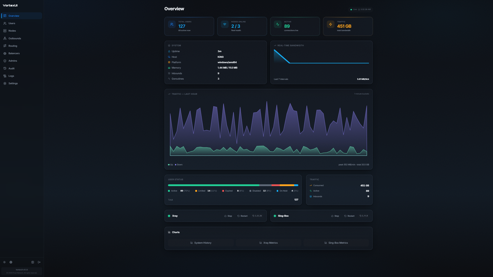
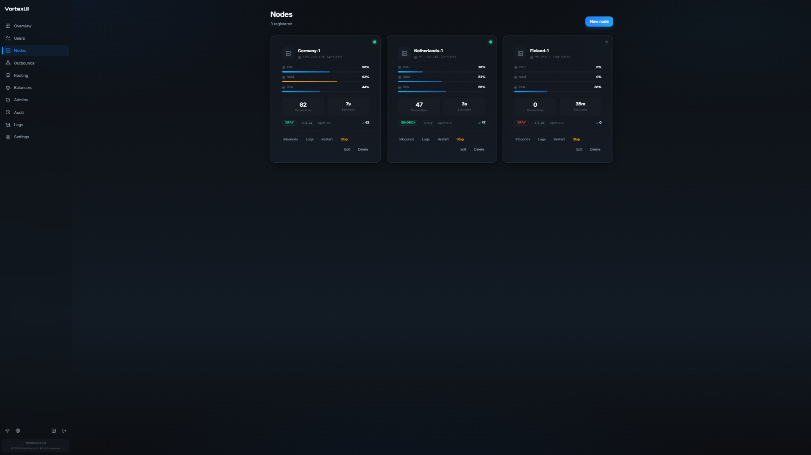
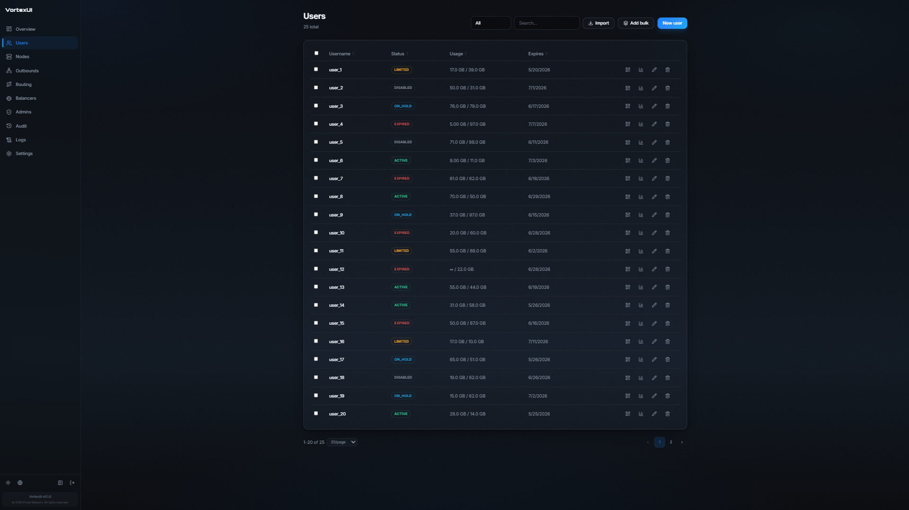
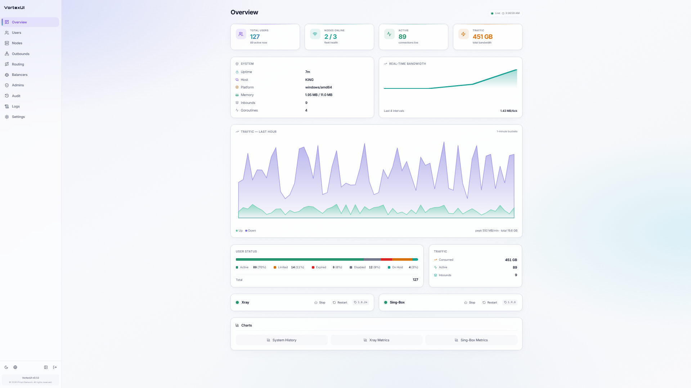
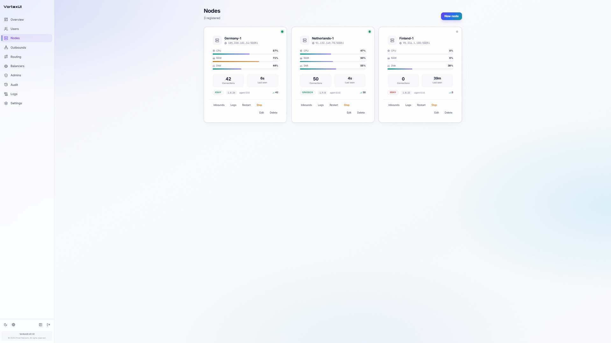
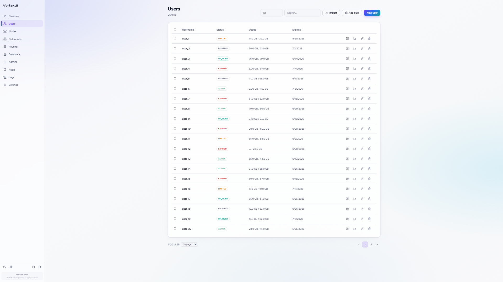

<div align="center">


**Next-generation, core-agnostic proxy management panel**

`Xray + sing-box` · User-centric · Real-time · Multi-node · Anti-censorship

[](https://github.com/iPmartNetwork/VortexUI/releases)
[](https://github.com/iPmartNetwork/VortexUI/stargazers)
[](LICENSE)
[](https://github.com/iPmartNetwork/VortexUI/actions)
[](https://github.com/iPmartNetwork/VortexUI/pkgs/container/vortexui-panel)
[](https://go.dev)
[](https://www.typescriptlang.org)
[](https://t.me/vortex_ui)

[](https://github.com/iPmartNetwork/VortexUI)

**English** · [فارسی](README.fa.md)

<sub>

[Features](#-features) · [What's New](#-whats-new-in-141) · [Screenshots](#-screenshots) · [Comparison](#-comparison) · [Quick Start](#-quick-start) · [Protocols](#-supported-protocols) · [Docs](#-documentation) · [Roadmap](#-roadmap) · [Contributing](#-contributing)

</sub>

</div>

---

## ✨ Features

<table>
<tr>
<td width="50%" valign="top">

### 🔧 Core Engine
- **Xray-core** & **sing-box** — choose per node
- In-process local node (no separate agent)
- Hot-reload config, runtime user add/remove
- REALITY key generation built-in
- **Reality Scanner** — auto-discover best SNIs

### 👥 User Management
- User-centric model (one identity → many protocols)
- Subscription: auto-detect Clash / sing-box / base64
- **Self-service portal** (login with sub token, view usage, buy plans, open tickets)
- **Subscription Hosts** — per-inbound CDN/SNI/host overrides
- **Family/group subscriptions** (shared data pool)
- **Smart Quota** — progressive speed reduction instead of hard-cut
- **Self-service shop** (per-reseller plans + card / crypto / ZarinPal)
- **Referral system** — invite codes with rewards
- Config templates (custom Clash / sing-box routing)
- QR codes + deep links (`vortex://` scheme)
- Traffic accounting: delta-based, restart-safe
- Quota enforcement + scheduled reset
- Device limit + HWID allowlist
- Bulk actions + import from 3x-ui / Marzban

### 🌐 Network & Routing
- Outbounds: freedom / blackhole / dns + proxy chaining
- **CDN/Relay chain builder** (multi-hop paths)
- **Smart routing rule packs** (per node or embedded in subscription)
- Routing rules: domain / IP / port / protocol matchers
- **Multi-domain SNI routing** + auto SSL
- Load balancers with health probing
- GeoIP/Geosite updater with Iran rules
- **Panel Federation** — sync users/nodes across panels

</td>
<td width="50%" valign="top">

### 🖥 Node Fleet
- mTLS connections (panel ↔ node)
- **Auto-migration** — move users from unhealthy nodes
- Live health monitoring (CPU / RAM / Disk)
- Remote restart / stop core
- Custom endpoint (tunnel / CDN / relay)
- Cloudflare DNS automation
- Per-node logs streaming

### 🛡 Security & Anti-Censorship
- **Auto-Protocol Switching** — self-healing failover between protocols
- **Smart Config Engine** — per-ISP anti-DPI (fragment/mux/ECH/padding) by severity + time
- **Dynamic SNI Rotation** — daily per-proxy rotation from ISP-specific domain pools
- **Multi-CDN Routing** — clean-IP fallback (CF/Arvan/Gcore) with correct ALPN
- **Smart Mux** — ISP-optimized (h2mux/yamux) with padding + XUDP
- **DNS Leak Prevention** — DoH + IR-direct + plain DNS block
- **TLS Tricks Manager** — ISP-specific profiles
- **Active probing protection** — detect & block GFW probes
- **Client fingerprint validator** — block curl / Go / Python
- **Decoy website** — serve fake site to probers
- **Evasion profiles** (fragment, mux, uTLS, ECH)
- **Clean-IP scanner** (Cloudflare) & **IP-limit enforcement**
- WARP+ integration
- **DNS-over-HTTPS** server (built-in, ad/malware blocking)
- IP whitelist/blacklist · Geo-blocking per inbound

### 🔐 Auth & Admin
- JWT + TOTP 2FA
- RBAC + **full reseller platform** (wallet, sub-resellers, whitelabel, webhooks)
- API tokens (PAT) · Login brute-force protection
- Account-sharing guard · Audit log
- **Support ticket system**

### 🎨 Frontend & UX
- React 18 + TypeScript + Tailwind + **framer-motion**
- **Veltrix UI** — glass cards, stat tiles, cyan/sky theme
- 8 languages with **639 translated keys** and full RTL
- Dark + Light themes · **Command palette** (Ctrl+K)
- **Customizable dashboard widgets** (drag & drop)
- **Onboarding tour** for new admins
- **Skeleton loading** · **Page transitions** · **Animated counters**
- **Stagger animations** · **Login particles** · **Shimmer states**
- **framer-motion AnimatePresence** modals + toasts
- Real-time charts + animated gauges + **World map**
- PWA (installable mobile app)

</td>
</tr>
</table>

---

## 🆕 What's New in 1.4.1

> **Enterprise-Grade: 14 Phases · User Templates · WireGuard Mesh · Advanced Security · CLI · PWA Portal**

| Feature | Description |
|---------|-------------|
| **User Templates & Bulk Ops** | Reusable blueprints, bulk create 1-1000 users, clone, 10 bulk operation types with preview |
| **HWID Device Management** | Per-user hardware ID tracking, device lock, device limit, bulk HWID reset |
| **Format Variables** | 20+ subscription template variables ({USERNAME}, {DAYS_LEFT}, {NODE_FLAG}...) |
| **Granular Notifications** | Scoped channels (global/admin/node), webhook with HMAC-SHA256, Telegram bot pro |
| **Dashboard Pro** | ISP heatmap 7×24, geographic map, revenue reports, anomaly detection, daily health check |
| **Client Templates** | User-Agent regex matching, per-app routing/DNS config, approval queue |
| **XRay Config Management** | Validation, versioning, diff, rollback, export/import, core auto-update |
| **WireGuard Full** | IP allocation, peer repair, QR code, per-peer MTU/DNS, site-to-site mesh |
| **Advanced Security** | IP whitelist/ban, session management, login audit, account lockout, scoped API tokens, AES-256 field encryption |
| **Performance** | Redis subscription cache, background job queue, cursor pagination, read replica routing, TimescaleDB |
| **API Playground** | Embedded Swagger UI, rate limit dashboard, webhook test endpoint, SDK generation |
| **CLI (cobra)** | `vortexui doctor\|migrate\|backup\|settings\|cleanup` subcommands |
| **Portal Pro (PWA)** | Speed test, push notifications, connection guides, setup wizard, i18n (5 languages), dark/light themes |
| **Install Script** | One-line Docker installer with auto-secrets, mTLS certs, health check |

---

## 🆕 What's New in 1.4.0

> **Auto-Protocol Switching · Smart Anti-Censorship · Self-Healing · Zero-Config Anti-DPI**

| Feature | Description |
|---------|-------------|
| **Auto-Protocol Switching** | Group inbounds as switching candidates; clients auto-failover between protocols via urltest/fallback |
| **ISP Auto-Detection** | Detects ISP from client IP (MaxMind + static ranges); no `?isp=` needed |
| **Smart Config Engine** | Per-ISP + time-of-day severity: MCI peak→aggressive fragment+mux+ECH; off-peak→light |
| **Dynamic SNI Rotation** | 10-13 high-traffic domains per ISP, daily rotation per proxy (anti-fingerprinting) |
| **Multi-CDN Routing** | CDN clean-IP fallback proxies (CF/Arvan/Gcore) with correct ALPN+SNI |
| **Smart Mux** | ISP-optimized: MCI→h2mux, Irancell→yamux, TCI→h2mux stealth + padding+XUDP |
| **Multi-Path** | ⚡ Parallel split-traffic across top 4 proxies simultaneously |
| **DNS Leak Prevention** | DoH remote+direct, IR→direct, block plain DNS port 53 |
| **Quality Score** | 0-100 per-proxy (protocol×transport×ISP); auto-sorted in subscription |
| **Adaptive Ordering** | Self-healing: promotes stable protocols, demotes frequently-failed ones |
| **Transport Obfuscation** | gRPC→`google.pubsub.v2.Publisher`, WS→`/api/v2/ws` (anti-detection) |
| **Emergency Fallback** | 🆘 Last-resort outbound when all proxies are dead |
| **Port Hopping** | `port_range` + `hop_interval` in share links + sing-box + Clash |
| **Client Switch Reporting** | `POST /sub/:token/switch` — clients report protocol changes |
| **Certificate Rotation** | Alternates LE ↔ ZeroSSL every 15 days (cert-authority fingerprint evasion) |

---

## 🆕 What's New in 1.3.9

> **Hysteria2 complete · Protocol expansion · AI Auto-Config · Monitoring infrastructure**

| Feature | Description |
|---------|-------------|
| **Hysteria2 Xray Renderer** | Works without sing-box — matches 3x-UI behavior exactly |
| **QUIC Transport** | sing-box + Clash Meta rendering for QUIC-based protocols |
| **IPv6 Dual-Stack** | `prefer_ipv4` with automatic IPv6 fallback |
| **AI Auto-Config** | Rule-based recommendation: protocol+transport+anti-DPI per ISP and time-of-day |
| **Smart Node Scoring** | Multi-factor quality score for intelligent load balancing |
| **Inbound Presets** | 5 one-click templates: CDN VLESS+WS, REALITY, Hysteria2, Trojan+WS, VMess+gRPC |
| **ISP Quality Heatmap** | 7×24 performance grid data model per ISP |
| **Anomaly Detection** | Z-score 3σ statistical outlier detection engine |
| **i18n Expansion** | 18 keys × 8 languages for inbound features |

---

## 🆕 What's New in 1.3.8

> **Anti-censorship · Inbound professional toolkit · Connection stability · Smart alerting · Rate limiting · Performance**

| Feature | Description |
|---------|-------------|
| **XHTTP/SplitHTTP** | Latest DPI-bypass transport rendered in Clash/sing-box subscription output |
| **ECH (Encrypted Client Hello)** | Hides SNI entirely from DPI; auto-applied via TLS Tricks profiles |
| **Auto ISP Detection** | `?isp=mci` on subscription URL auto-applies optimal anti-DPI settings per ISP |
| **DNS-over-HTTPS** | DoH servers injected into sing-box subscription preventing DNS leaks |
| **14 Inbound Features** | Clone, bulk actions, port conflict check, traffic stats, health badge, share link, cert status, notes, speed limit, port range, listen address, random port button |
| **Connection Stability** | 90s failover, fallback group, dial_timeout 5s, tcp_fast_open, mux idle_timeout, tolerance 150ms |
| **Smart Alerting** | Threshold alerts for CPU/memory/offline/quota/cert with cooldown dedup |
| **Rate Limiting** | Per-endpoint limits (login 5/min, bulk 5/min, subscription 60/min) |
| **Performance** | Gzip compression, subscription cache, bundle splitting (870→537KB) |
| **UI Polish** | Overview health indicators, gradient stats cards, wider inbound modal, avatar initials |

---

## 🆕 What's New in 1.3.7

> **Frontend UX overhaul · skeleton loading · page transitions · animated counters · stagger animations · login particles · improved modals/toasts · shimmer states · empty states · copy morph**

| Feature | Description |
|---------|-------------|
| **Skeleton loading** | `SkeletonPage` replaces plain text fallback; shimmer placeholders for cards, tables, charts across all pages |
| **Page transitions** | CSS-based fade+slide on every route change via `PageTransition` wrapper |
| **Animated counters** | Numbers count up from 0 using rAF with ease-out cubic easing, triggered on scroll via IntersectionObserver |
| **Stagger animations** | `StaggerContainer` — children animate in sequence with configurable delay for lists and grids |
| **Login particles** | Canvas-based floating particles with connection lines, adapting to dark/light theme |
| **Modal animations** | framer-motion `AnimatePresence` with spring scale+slide transitions |
| **Toast animations** | Spring-based enter/exit with AnimatePresence for smooth toast lifecycle |
| **Empty states** | Reusable `EmptyState` component with icons, descriptions, and CTAs across DataTable, Users, Nodes, Analytics, Tickets, Orders, Audit |
| **CopyField morph** | Animated icon swap (Copy → Check) with spring physics and ripple effect |
| **Settings tab transitions** | framer-motion `AnimatePresence mode="wait"` with fade+blur between settings tabs |
| **Shimmer loading** | Animated shimmer gradients on Nodes and Users loading states |

---

## 🆕 What's New in 1.3.6

> **Critical crash-loop fix · pg_dump version mismatch · Iranian server support · Docker fixes**

| Feature | Description |
|---------|-------------|
| **Panel crash-loop fix** | Missing `-- +goose Up` directive in migration `0042_multicore.sql` caused infinite restart cycles on every boot |
| **pg_dump version mismatch** | Server PostgreSQL 16 vs client pg_dump 14 error handled gracefully with clear install instructions |
| **Iranian server compatibility** | `VORTEXUI_GH_MIRROR` env var, Chinese Go mirrors (USTC/Tsinghua), Alibaba Docker mirror fallback |
| **Docker static binary fix** | Correct tarball extraction path for Docker static install; GH_MIRROR made globally available |
| **TypeScript cleanup** | Replaced `any[]` with proper `PerformanceAlert` and `RateLimitViolation` interfaces |
| **Stale comments removed** | Phase 1.2 audit service comments cleaned from `cmd/panel/main.go` |

---

## 🆕 What's New in 1.3.5

> **Systemd auto-start · graceful legacy backup restore**

| Feature | Description |
|---------|-------------|
| **Systemd auto-start** | Panel/node services now declare `Wants=network-online.target` and `StartLimitIntervalSec=0` for reliable post-reboot startup |
| **Legacy backup restore** | JSON backups exported before v1.3.4 (lacking admin credentials) no longer fail; random temp password generated with reset hint |
| **`vortexui update`** | Calls `systemctl daemon-reload` and re-enables the unit before restarting for immediate service-file changes |

---

## 🆕 What's New in 1.3.4

> **Backup v3 · full pg_dump · AES-256 encryption · reseller backup v2**

| Feature | Description |
|---------|-------------|
| **Backup v3 JSON** | Supplemental tables (wallet, billing, orders, sub hosts, panel settings, reseller payment config) with usage manifest |
| **Full database backup** | `pg_dump` archive (`.tar.gz`) via `GET /api/backup?format=full` for byte-for-byte server migration |
| **Restore modes** | JSON config restore (transactional) and full DB restore (`POST /api/backup/restore?mode=full`) |
| **AES-256-GCM encryption** | Optional passphrase via `X-Backup-Passphrase` header on export/import |
| **Reseller backup v2** | Users, bindings, wallet, orders, payment config, portal branding; restore via `POST /api/account/backup/users/restore` |
| **Settings UI** | Backup preview panel, JSON vs full DB export, restore mode selector, encryption passphrase, traffic time-series toggle |

---

## 🆕 What's New in 1.3.3

> **Multi-core Phase 1 · dual engine nodes · per-inbound core selection**

| Feature | Description |
|---------|-------------|
| **Dual-core nodes** | Run **Xray** and **sing-box** on the same node; `enabled_cores` on nodes with `CompositeDriver` for split config sync |
| **Per-inbound core override** | Each inbound can target xray or sing-box; empty inherits the node default |
| **Multi-core UI** | Enabled-core toggles on create/edit node; engine picker on inbound form; multi-core badges on fleet view |

---

## 🆕 What's New in 1.3.2

> **PHASE 3 · Performance monitoring · Security hardening · Compliance · Enhanced inbounds · UI overhaul**

| Feature | Description |
|---------|-------------|
| **Performance Monitoring** | `/performance` with real-time cache stats, query metrics, slow query tracking, performance alerts |
| **Security Hardening** | `/security` with threat monitoring, compliance status, security policies, threat statistics |
| **Compliance Dashboard** | `/compliance` with system compliance checklist, status tracking, policy enforcement |
| **Enhanced Inbounds** | `/inbounds` with search/filter, statistics cards, protocol distribution visualization |
| **Overview UI redesign** | Gradient backgrounds, improved charts, enhanced node fleet telemetry, user pool display |
| **Traffic Series Chart** | Gradient styling, enhanced header, summary stats cards (Upload/Download/Peak) |
| **Protocol Donut Chart** | Better visual hierarchy and professional appearance |

---

## 🆕 What's New in 1.3.1

> **Portal dashboard v2 · live stats · settings error i18n · UI fixes**

| Feature | Description |
|---------|-------------|
| **Portal dashboard v2** | QR subscription, live devices/connections, 30-day usage chart, quota alerts, quick actions |
| **Portal API** | `GET /api/portal/subscription`, `/usage`, `/online`, `/deeplink` for authenticated end-users |
| **Live connections** | OnlineStats on every health tick; accurate device IPs and connection counts in admin + portal |
| **Settings i18n** | Translated save errors across all Settings tabs (8 languages) |
| **UI fixes** | TLS Tricks ISP modal, toggle thumb position, backup tab error banner, API body parsing |

📖 Details: [CHANGELOG.md](CHANGELOG.md) · [Portal polish (v1.3.1)](docs/wiki/en/19-v131-portal-polish.md)

---

## 🆕 What's New in 1.3.0

> **Persisted settings · audit log UI · portal referral · ACME · federation sync**

| Feature | Description |
|---------|-------------|
| **Panel settings API** | `GET/PUT /api/settings` stores general, security, appearance, notifications, and backup options in PostgreSQL |
| **Audit Log page** | `/audit` restored with live table from `GET /api/audit` |
| **Portal referral** | `/portal/referral` for end-user codes and apply flow |
| **Portal branding** | Whitelabel title/logo from `GET /api/portal/branding?slug=` |
| **ACME Let's Encrypt** | DNS-01 via Cloudflare when credentials are configured |
| **Federation sync** | Periodic peer health checks and user/node count sync events |

📖 Details: [Backend integration (v1.3.0)](docs/wiki/en/18-v130-settings-integration.md)

<details>
<summary><strong>🔽 Previous Releases (1.2.9 → 1.2)</strong></summary>

### 🆕 What's New in 1.2.9

> **Command Tower UI · merged pages · Settings hub · reseller profiles · fleet telemetry**

| Feature | Description |
|---------|-------------|
| **Merged pages** | Routing & Balancers, Security Suite, and Reseller Platform each use one route with `?tab=` sub-navigation |
| **Settings hub** | Sidebar tabs for General, Security, Appearance, API, Backup, and Admins (sudo) |
| **Reseller profiles** | Click any reseller → wallet, quota bars, consumption, ledger, policies at `/settings/admins/:id` |
| **Admins sub-tabs** | Admins list, Roles, and Reseller access matrix inside Settings |
| **Command Tower Overview** | Live widgets with traffic ranges, top users + protocol, node geo/ping |
| **Inbounds page** | Dedicated `/inbounds` view separate from node fleet |
| **Node telemetry** | Region, country code, ping ms (migration 0030) |
| **Admin APIs** | `GET /api/admins/:id/quota` and `GET /api/admins/:id/wallet` |

### 🆕 What's New in 1.2.8

> **Veltrix UI · complete i18n · redesigned admin + portal shell**

| Feature | Description |
|---------|-------------|
| **Veltrix design system** | Glass cards, stat tiles, status badges, page-enter animations, cyan/sky palette |
| **New app shell** | Collapsible sidebar + header with mini mode, mobile drawer, theme/language switcher |
| **Command palette** | Fuzzy page search via Ctrl+K / ⌘K |
| **Live core pages** | Overview, Users, Nodes rebuilt with real-time API stat cards and fleet health |
| **Portal refresh** | Redesigned login, dashboard, desktop sidebar, mobile bottom navigation |
| **Full i18n** | 639 keys in 8 languages — billing, reseller payment, pending orders, shell, portal |

### 🆕 What's New in 1.2.7

> **Per-reseller commerce · owned plans · payment proof · self-service renewal**

| Feature | Description |
|---------|-------------|
| **Self-service renewal** | Users purchase plans from `/sub/:token/shop`; traffic + duration stack additively |
| **Per-reseller payment config** | Each reseller sets their own card number, crypto addresses, and ZarinPal merchant |
| **Per-reseller owned plans** | Resellers create plans with custom pricing; users only see their reseller's plans |
| **Payment proof upload** | Card-to-card requires receipt image; crypto accepts TX hash + screenshot |
| **Pending order review** | Admins see proof thumbnails, approve or reject manual payments |

### 🆕 What's New in 1.2.6

> **Node enrollment wizard · wallet billing · diagnostics · doctor CLI**

| Feature | Description |
|---------|-------------|
| **Node enrollment wizard** | Four-step UI: copy mTLS bundle → install → register → connectivity test |
| **Node health diagnostics** | Classify disconnects (mTLS failure / unreachable / core down); debug bundle |
| **`vortexui doctor`** | CLI checks certs, services, ports, and `/health` for panel/node/docker |
| **Reseller wallet billing** | Multi-currency packages, ZarinPal + NowPayments, card-to-card and crypto |
| **Wallet UI** | Top-up from Admins page, CSV ledger export, parent → sub-reseller top-up |

### 🆕 What's New in 1.2.5

> **Reseller platform · wallet & sub-resellers · whitelabel · webhooks · policy limits**

| Feature | Description |
|---------|-------------|
| **Allowlists** | Per-reseller plan, node, and inbound pickers |
| **Quota modes** | Allocated vs consumed traffic pool enforcement |
| **Reseller dashboard** | Accounts, traffic pool, top consumers, expiring users, CSV export |
| **Sub-resellers** | Hierarchical child resellers with role + quota |
| **Whitelabel** | Custom panel title, logo, accent, slug, footer |
| **Auto-suspend** | IP violation and quota overage suspension worker |
| **i18n** | All reseller pages in 8 languages |

See the [v1.2.5 features guide](docs/wiki/en/18-v125-features.md) for setup details.

### 🆕 What's New in 1.2.3

> **Subscription Hosts · routing packs · clean-IP scanner · IP-limit enforcement**

| Feature | Description |
|---------|-------------|
| **Subscription Hosts** | Marzban-style per-inbound host overrides projected into subscription links |
| **New output formats** | Raw Xray/V2Ray JSON, Outline `ss://`, plain V2rayN links |
| **Smart routing rule packs** | Reusable rulesets applicable per node or embedded in Clash/sing-box subscriptions |
| **Clean-IP scanner** | Scan & score CDN candidate IPs by latency + packet loss (SSRF-protected) |
| **IP-limit enforcement** | Warn / temp-disable / disconnect when user exceeds device limit |
| **New protocols** | SOCKS, HTTP, Naive, Dokodemo, Hysteria v1, ShadowTLS, AnyTLS, mKCP transport |

### 🆕 What's New in 1.2

> **17 new features + 24 UX improvements in a single release**

<table>
<tr><td>

**🚀 Major Features:**
Self-Service Portal · Reality Scanner · Smart Quota · CDN/Relay Chain Builder · Decoy Website · Advanced Analytics · Node Auto-Migration · Active Probing Protection · Family/Group Subscriptions · Referral System · DNS-over-HTTPS · Multi-Domain SNI + SSL · TLS Tricks Manager · Client Fingerprint Validator · Multi-Panel Federation · Deep Links + QR · Quota Notifications

</td></tr>
<tr><td>

**🎨 UX Improvements (24):**
Collapsible sidebar · Command palette · Skeleton loading · Data tables · Page transitions · Code splitting · Toast notifications · Notification center · Keyboard shortcuts · Error boundaries · Animated gauges · World map · Multi-step wizard · Help tooltips · Optimistic UI · PWA · Accessibility · Theme transition · Onboarding tour · Dashboard widgets · Mobile portal · Bottom sheets · Pull-to-refresh · Safe-area support

</td></tr>
</table>

</details>

📖 Full details: [CHANGELOG.md](CHANGELOG.md) · [Documentation](https://ipmartnetwork.github.io/VortexUI/)

---

## 📸 Screenshots

<table>
<tr>
<td align="center" colspan="3"><strong>🌙 Dark Mode</strong></td>
</tr>
<tr>
<td align="center"><strong>Dashboard</strong></td>
<td align="center"><strong>Nodes</strong></td>
<td align="center"><strong>Users</strong></td>
</tr>
<tr>
<td><a href="img/panel/overview_dark.png"></a></td>
<td><a href="img/panel/Node_dark.png"></a></td>
<td><a href="img/panel/User_dark.png"></a></td>
</tr>
<tr>
<td align="center" colspan="3"><strong>☀️ Light Mode</strong></td>
</tr>
<tr>
<td align="center"><strong>Dashboard</strong></td>
<td align="center"><strong>Nodes</strong></td>
<td align="center"><strong>Users</strong></td>
</tr>
<tr>
<td><a href="img/panel/overview_light.png"></a></td>
<td><a href="img/panel/Node_light.png"></a></td>
<td><a href="img/panel/User_light.png"></a></td>
</tr>
</table>

---

## ⚖️ Comparison

### How VortexUI stacks up against other panels

|  | VortexUI 1.3.8 | 3x-ui | Marzban | Hiddify |
|--|----------------|-------|---------|---------|
| **Proxy engines** | Xray + sing-box | Xray | Xray | Xray + sing-box |
| **Data model** | User-centric | Inbound-centric | User-centric | User-centric |
| **Traffic method** | Push delta | Polling | Polling | Polling |
| **Multi-node** | mTLS + auto-migration | ✅ | ✅ | ✅ |
| **Balancer** | ✅ 4 strategies | ❌ | ❌ | ❌ |
| **Outbound/Routing** | ✅ full CRUD | Partial | ❌ | ❌ |
| **Reality Scanner** | ✅ built-in | ❌ | ❌ | ❌ |
| **Anti-DPI profiles** | ✅ ISP-specific | ❌ | ❌ | ✅ |
| **Self-service portal** | ✅ | ❌ | ❌ | ✅ |
| **Family groups** | ✅ | ❌ | ❌ | ❌ |
| **Federation** | ✅ multi-panel sync | ❌ | ❌ | ❌ |
| **Referral system** | ✅ | ❌ | ❌ | ❌ |
| **Probing protection** | ✅ detect + block | ❌ | ❌ | ❌ |
| **Fingerprint validation** | ✅ JA3 | ❌ | ❌ | ❌ |
| **Decoy website** | ✅ | ❌ | ❌ | ❌ |
| **DNS-over-HTTPS** | ✅ built-in | ❌ | ❌ | ❌ |
| **Deep links** | ✅ custom scheme | ❌ | ❌ | ✅ |
| **Smart quota** | ✅ progressive | ❌ | ❌ | ❌ |
| **CDN/Relay chains** | ✅ visual builder | ❌ | ❌ | ❌ |
| **Analytics (geo)** | ✅ + CSV export | ❌ | ❌ | ❌ |
| **Reseller platform** | ✅ wallet, sub-resellers, whitelabel | Partial | ✅ | Partial |
| **Payment gateways** | ✅ ZarinPal + crypto + card-to-card | ❌ | ❌ | ❌ |
| **Self-service shop** | ✅ per-reseller | ❌ | ❌ | ✅ |
| **Notifications** | Webhook + TG + portal | TG | ✅ | TG |
| **Languages** | 8 | 13 | 3 | 5 |
| **Backend** | Go | Go | Python | Python |
| **Database** | PG + TimescaleDB | SQLite/PG | SQLite/Maria | SQLite |

---

## 📡 Supported Protocols

| Protocol | Inbound | Outbound | Transport |
|----------|---------|----------|-----------|
| **VLESS** | ✅ | ✅ | TCP, WS, gRPC, HTTPUpgrade, xHTTP, mKCP |
| **VMess** | ✅ | ✅ | TCP, WS, gRPC, HTTPUpgrade, mKCP |
| **Trojan** | ✅ | ✅ | TCP, WS, gRPC, mKCP |
| **Shadowsocks** | ✅ | ✅ | TCP (+ SS-2022 multi-user) |
| **SOCKS** | ✅ | ✅ | TCP |
| **HTTP** | ✅ | ✅ | TCP |
| **Naive** | ✅ (sing-box) | — | TCP/TLS |
| **Dokodemo** | ✅ (xray) | — | TCP/UDP |
| **Hysteria2** | ✅ (sing-box) | — | UDP |
| **Hysteria (v1)** | ✅ (sing-box) | — | UDP |
| **TUIC** | ✅ (sing-box) | — | UDP |
| **ShadowTLS** | ✅ (sing-box) | — | TCP |
| **AnyTLS** | ✅ (sing-box) | — | TCP |
| **WireGuard** | ✅ | — | UDP |

**Subscription output:** base64 · Clash/Clash.Meta · sing-box · Xray JSON · Outline · plain links (auto-detected by client).

**Security layers:** None, TLS, REALITY (with built-in scanner)

---

## 🚀 Quick Start

### One-line Install

```bash
bash <(curl -Ls https://raw.githubusercontent.com/iPmartNetwork/VortexUI/master/install.sh)
```

The installer asks:

1. **Method** — Docker Compose _(recommended)_ or Native (systemd)
2. **Access** — Domain + auto HTTPS (Let's Encrypt) or IP + HTTP

Then generates secrets, mTLS certs, starts the stack, creates your first admin, and installs the `vortexui` CLI.

> **💡 Non-interactive mode:**
> ```bash
> VORTEXUI_METHOD=docker VORTEXUI_NONINTERACTIVE=1 \
>   VORTEXUI_ADMIN_USER=admin VORTEXUI_ADMIN_PASS='s3cret' \
>   bash install.sh
> ```

### Management Console

After installation, type **`vortexui`** for the interactive menu:

```
$ vortexui

   1) Start            2) Stop
   3) Restart          4) Status
   5) Logs             6) Update
   7) Create admin     8) Change web port
   9) Domain / SSL    10) Settings / URL
  11) Uninstall        0) Exit
```

Or use sub-commands: `vortexui start|stop|restart|status|logs|update|admin|settings|uninstall`

### Docker

```bash
git clone https://github.com/iPmartNetwork/VortexUI && cd VortexUI
docker compose up -d
```

### Manual Build

```bash
cp .env.example .env    # edit secrets
make build              # compile Go binaries
make certs              # generate dev mTLS certs
make run-panel          # start panel
./bin/panel admin create --username admin --password 'your-pass' --sudo
```

---

## 🔒 Operations

| Feature | How |
|---------|-----|
| **Automatic HTTPS** | Caddy + Let's Encrypt — zero config renewal |
| **Live updates** | SSE push — no polling, instant UI refresh |
| **GeoIP/Geosite** | One-click Iran routing rules update per node |
| **Account-sharing guard** | Online IP enforcement + auto-limit option |
| **Auto-backup** | Scheduled exports to Telegram or S3 |
| **Prometheus metrics** | `/metrics` endpoint + Grafana dashboard |

---

## 📖 Documentation

| Topic | Link |
|-------|------|
| **Documentation site** | [ipmartnetwork.github.io/VortexUI](https://ipmartnetwork.github.io/VortexUI/) |
| **Telegram** | [@vortex\_ui](https://t.me/vortex_ui) |
| **Discussions** | [GitHub Q&A](https://github.com/iPmartNetwork/VortexUI/discussions) |
| **Wiki** | [EN](docs/wiki/en/README.md) · [FA](docs/wiki/fa/README.md) · [AR](docs/wiki/ar/README.md) · [TR](docs/wiki/tr/README.md) |
| **API (OpenAPI 3.0)** | [docs/openapi.yaml](docs/openapi.yaml) |
| **Protocols** | [docs/protocols.md](docs/protocols.md) |
| **Changelog** | [CHANGELOG.md](CHANGELOG.md) |
| **Contributing** | [CONTRIBUTING.md](CONTRIBUTING.md) |

---

## 🗺 Roadmap

<details>
<summary><strong>✅ Completed (v1.0 → v1.3.1)</strong></summary>

- Core-agnostic engine (Xray + sing-box)
- User-centric data model + push delta traffic
- Multi-node with mTLS + auto-failover
- Outbound/Routing/Balancer management
- REALITY key generation + scanner
- Webhook + Telegram notifications
- Interactive Telegram bot
- Backup/Restore + auto-backup (TG/S3)
- Audit log + API tokens
- Account-sharing guard
- Import from 3x-ui / Marzban
- 8-language frontend + RTL
- Real-time dashboard (SSE)
- Automatic HTTPS (Caddy)
- One-line installer + CLI
- Hysteria2 + TUIC + WireGuard
- Reseller platform (v1.2.5)
- Payment gateways (ZarinPal + crypto)
- Evasion profiles + WARP+
- Cluster mode (HA)
- Grafana/Prometheus metrics
- Self-service portal
- Reality Scanner
- Smart Quota (fair use)
- CDN/Relay chains
- Decoy website
- Advanced analytics (geo)
- Node auto-migration
- Active probing protection
- Family/group subscriptions
- Referral system
- DNS-over-HTTPS
- Multi-domain SNI + auto SSL
- TLS Tricks (ISP profiles)
- Client fingerprint validator
- Multi-panel federation
- Deep links + QR
- Quota notifications
- Command palette + keyboard shortcuts
- Dashboard widgets + onboarding tour
- Mobile-first portal
- Portal dashboard v2 + live stats API (v1.3.1)
- Persisted panel settings + audit log UI (v1.3.0)
- Portal referral + whitelabel branding (v1.3.0)
- ACME DNS-01 + federation sync worker (v1.3.0)
- Command Tower UI (v1.2.9)
- Veltrix UI redesign (v1.2.8)
- Complete 8-language i18n (v1.2.8)
- Per-reseller payment configuration (v1.2.7)
- Per-reseller owned plans (v1.2.7)
- Payment proof/receipt uploads (v1.2.7)
- Node enrollment wizard (v1.2.6)
- Reseller wallet billing (v1.2.6)

</details>

### 🔜 Coming Next

- 📱 Mobile app (React Native / Flutter)
- 🤖 AI-powered anomaly detection
- 📚 Multi-language docs expansion
- ⚡ Proxy-level rate limiting per user
- 🔌 Plugin system for custom extensions
- 🌊 WebSocket transport support for sing-box

---

## 💝 Support

If VortexUI is useful to you:

- ⭐ **Star** this repository
- 🍴 **Fork** and contribute
- 📢 **Share** with your community
- 💬 **Join** [@vortex\_ui](https://t.me/vortex_ui) on Telegram

| Network | Address |
|---------|---------|
| **USDT (TRC20)** | `TRLnjZ7YDSwjh3oay28qigEYNieGPMs6ew` |
| **BTC** | `bc1qszt4g7jdv7ev2t3pexctc07ults8nfflht3nj5` |
| **TON** | `UQAYSSSirtQ9_67ZHYUgLVLMx9Ir9vvh3vpcq2qbpit_8-Db` |

---

## 🤝 Contributing

1. Fork the repo
2. Create a feature branch (`git checkout -b feat/amazing`)
3. Commit (`git commit -m 'feat: add amazing feature'`)
4. Push (`git push origin feat/amazing`)
5. Open a Pull Request

See [CONTRIBUTING.md](CONTRIBUTING.md) for guidelines.

---

## 🌐 Internationalization

| 🇺🇸 English | 🇮🇷 فارسی | 🇹🇷 Türkçe | 🇸🇦 العربية |
|------------|----------|-----------|-----------|
| 🇷🇺 Русский | 🇨🇳 中文 | 🇯🇵 日本語 | 🇪🇸 Español |

Full RTL support for Persian and Arabic.

---

## 📄 License

GPL-3.0 — see [LICENSE](LICENSE).

---

<div align="center">

**Built with ❤️ by [iPmart Network](https://github.com/iPmartNetwork)**

<sub>If you find VortexUI useful, please consider giving it a ⭐</sub>

</div>
