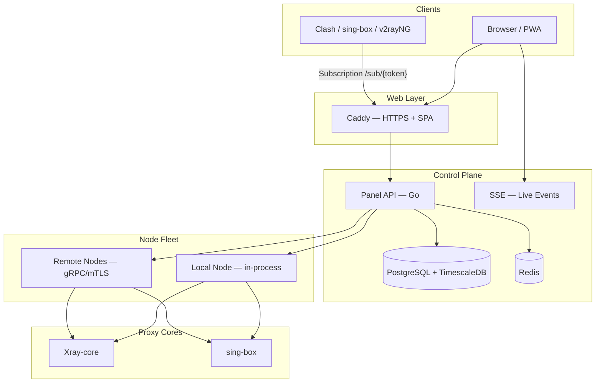

<div align="center">


# 📚 VortexUI Wiki

**Complete guide to installing, configuring, and operating the next-generation proxy management panel**

[](https://github.com/iPmartNetwork/VortexUI/releases)
[](../LICENSE)
[](https://ipmartnetwork.github.io/VortexUI/)

[English README](../README.md) · [README فارسی](../README.fa.md) · **[Documentation site](https://ipmartnetwork.github.io/VortexUI/)**

</div>

---

<div align="center">

| Overview | Nodes | Users |
|:--------:|:-----:|:-----:|
|  |  |  |

*Panel screenshots — light mode*

</div>

---

## 🌐 Language / زبان / اللغة / Dil

> [!TIP]
> **Live site:** [ipmartnetwork.github.io/VortexUI](https://ipmartnetwork.github.io/VortexUI/) — search, dark/light theme, sidebar.

| Language | Index |
|----------|-------|
| **فارسی (Persian)** | [wiki/fa/README.md](wiki/fa/README.md) |
| **English** | [wiki/en/README.md](wiki/en/README.md) |
| **العربية (Arabic)** | [wiki/ar/README.md](wiki/ar/README.md) |
| **Türkçe (Turkish)** | [wiki/tr/README.md](wiki/tr/README.md) |

---

## About VortexUI

**VortexUI** is an open-source proxy management panel with a Go backend, React/TypeScript frontend, and support for **Xray-core** and **sing-box**. This wiki covers installation, panel features, operations, API usage, and troubleshooting.

### Architecture



---

## 📖 Table of Contents

### Getting Started

| # | Topic | FA | EN | AR | TR |
|:-:|-------|----|----|----|----|
| 1 | Introduction & core concepts | [فارسی](wiki/fa/01-introduction.md) | [English](wiki/en/01-introduction.md) | [العربية](wiki/ar/01-introduction.md) | [Türkçe](wiki/tr/01-introduction.md) |
| 2 | Installation | [فارسی](wiki/fa/02-installation.md) | [English](wiki/en/02-installation.md) | [العربية](wiki/ar/02-installation.md) | [Türkçe](wiki/tr/02-installation.md) |
| 3 | First steps | [فارسی](wiki/fa/03-first-steps.md) | [English](wiki/en/03-first-steps.md) | [العربية](wiki/ar/03-first-steps.md) | [Türkçe](wiki/tr/03-first-steps.md) |

### Panel Guide

| # | Topic | FA | EN | AR | TR |
|:-:|-------|----|----|----|----|
| 4 | Dashboard | [فارسی](wiki/fa/04-dashboard.md) | [English](wiki/en/04-dashboard.md) | [العربية](wiki/ar/04-dashboard.md) | [Türkçe](wiki/tr/04-dashboard.md) |
| 5 | User management | [فارسی](wiki/fa/05-user-management.md) | [English](wiki/en/05-user-management.md) | [العربية](wiki/ar/05-user-management.md) | [Türkçe](wiki/tr/05-user-management.md) |
| 6 | Node management | [فارسی](wiki/fa/06-node-management.md) | [English](wiki/en/06-node-management.md) | [العربية](wiki/ar/06-node-management.md) | [Türkçe](wiki/tr/06-node-management.md) |
| 7 | Network policy | [فارسی](wiki/fa/07-network-policy.md) | [English](wiki/en/07-network-policy.md) | [العربية](wiki/ar/07-network-policy.md) | [Türkçe](wiki/tr/07-network-policy.md) |
| 8 | Security & administration | [فارسی](wiki/fa/08-security-administration.md) | [English](wiki/en/08-security-administration.md) | [العربية](wiki/ar/08-security-administration.md) | [Türkçe](wiki/tr/08-security-administration.md) |
| 9 | Plans & payments | [فارسی](wiki/fa/09-plans-payments.md) | [English](wiki/en/09-plans-payments.md) | [العربية](wiki/ar/09-plans-payments.md) | [Türkçe](wiki/tr/09-plans-payments.md) |
| 10 | Notifications | [فارسی](wiki/fa/10-notifications.md) | [English](wiki/en/10-notifications.md) | [العربية](wiki/ar/10-notifications.md) | [Türkçe](wiki/tr/10-notifications.md) |
| 11 | Settings & backup | [فارسی](wiki/fa/11-settings-backup.md) | [English](wiki/en/11-settings-backup.md) | [العربية](wiki/ar/11-settings-backup.md) | [Türkçe](wiki/tr/11-settings-backup.md) |

### Technical Reference

| # | Topic | FA | EN | AR | TR |
|:-:|-------|----|----|----|----|
| 12 | API reference | [فارسی](wiki/fa/12-api-reference.md) | [English](wiki/en/12-api-reference.md) | [العربية](wiki/ar/12-api-reference.md) | [Türkçe](wiki/tr/12-api-reference.md) |
| 13 | Protocols & configuration | [فارسی](wiki/fa/13-protocols-config.md) | [English](wiki/en/13-protocols-config.md) | [العربية](wiki/ar/13-protocols-config.md) | [Türkçe](wiki/tr/13-protocols-config.md) |
| 14 | Operations & maintenance | [فارسی](wiki/fa/14-operations-maintenance.md) | [English](wiki/en/14-operations-maintenance.md) | [العربية](wiki/ar/14-operations-maintenance.md) | [Türkçe](wiki/tr/14-operations-maintenance.md) |
| 15 | Troubleshooting & FAQ | [فارسی](wiki/fa/15-troubleshooting-faq.md) | [English](wiki/en/15-troubleshooting-faq.md) | [العربية](wiki/ar/15-troubleshooting-faq.md) | [Türkçe](wiki/tr/15-troubleshooting-faq.md) |

---

## ⚡ Quick Start

```bash
bash <(curl -Ls https://raw.githubusercontent.com/iPmartNetwork/VortexUI/master/install.sh)
```

---

## 📄 License

VortexUI is released under **GPL-3.0**. See [LICENSE](../LICENSE).
