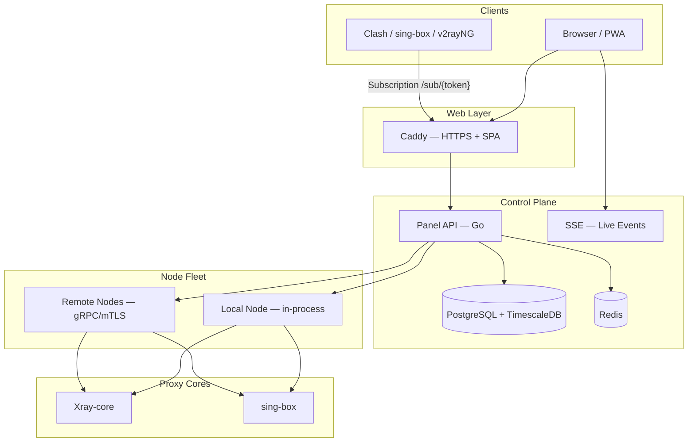

<div align="center">


# 📚 VortexUI Wiki

**Complete guide to installing, configuring, and operating the next-generation proxy management panel**

[](https://github.com/iPmartNetwork/VortexUI/releases)
[](../../LICENSE)
[](#-language--اللغة--dil)

[English README](../../README.md) · [README فارسی](../../README.fa.md)

</div>

---

<div align="center">

| Overview | Nodes | Users |
|:--------:|:-----:|:-----:|
|  |  |  |

*Panel screenshots — light mode*

</div>

---

## 🌐 Language / زبان / اللغة / Dil

> [!TIP]
> Each chapter includes a **logo header**, **language switcher**, and contextual **callouts** (TIP / NOTE / WARNING).

| Language | Index |
|----------|-------|
| **فارسی (Persian)** | [docs/wiki/fa/README.md](./fa/README.md) |
| **English** | [docs/wiki/en/README.md](./en/README.md) |
| **العربية (Arabic)** | [docs/wiki/ar/README.md](./ar/README.md) |
| **Türkçe (Turkish)** | [docs/wiki/tr/README.md](./tr/README.md) |

---

## About VortexUI

**VortexUI** is an open-source proxy management panel with a Go backend, React/TypeScript frontend, and support for **Xray-core** and **sing-box**. This wiki covers installation, panel features, operations, API usage, and troubleshooting.

### Architecture



---

## 📖 Table of Contents

### Getting Started

| # | Topic | FA | EN | AR | TR |
|:-:|-------|----|----|----|----|
| 1 | Introduction & core concepts | [فارسی](./fa/01-introduction.md) | [English](./en/01-introduction.md) | [العربية](./ar/01-introduction.md) | [Türkçe](./tr/01-introduction.md) |
| 2 | Installation | [فارسی](./fa/02-installation.md) | [English](./en/02-installation.md) | [العربية](./ar/02-installation.md) | [Türkçe](./tr/02-installation.md) |
| 3 | First steps | [فارسی](./fa/03-first-steps.md) | [English](./en/03-first-steps.md) | [العربية](./ar/03-first-steps.md) | [Türkçe](./tr/03-first-steps.md) |

### Panel Guide

| # | Topic | FA | EN | AR | TR |
|:-:|-------|----|----|----|----|
| 4 | Dashboard | [فارسی](./fa/04-dashboard.md) | [English](./en/04-dashboard.md) | [العربية](./ar/04-dashboard.md) | [Türkçe](./tr/04-dashboard.md) |
| 5 | User management | [فارسی](./fa/05-user-management.md) | [English](./en/05-user-management.md) | [العربية](./ar/05-user-management.md) | [Türkçe](./tr/05-user-management.md) |
| 6 | Node management | [فارسی](./fa/06-node-management.md) | [English](./en/06-node-management.md) | [العربية](./ar/06-node-management.md) | [Türkçe](./tr/06-node-management.md) |
| 7 | Network policy | [فارسی](./fa/07-network-policy.md) | [English](./en/07-network-policy.md) | [العربية](./ar/07-network-policy.md) | [Türkçe](./tr/07-network-policy.md) |
| 8 | Security & administration | [فارسی](./fa/08-security-administration.md) | [English](./en/08-security-administration.md) | [العربية](./ar/08-security-administration.md) | [Türkçe](./tr/08-security-administration.md) |
| 9 | Plans & payments | [فارسی](./fa/09-plans-payments.md) | [English](./en/09-plans-payments.md) | [العربية](./ar/09-plans-payments.md) | [Türkçe](./tr/09-plans-payments.md) |
| 10 | Notifications | [فارسی](./fa/10-notifications.md) | [English](./en/10-notifications.md) | [العربية](./ar/10-notifications.md) | [Türkçe](./tr/10-notifications.md) |
| 11 | Settings & backup | [فارسی](./fa/11-settings-backup.md) | [English](./en/11-settings-backup.md) | [العربية](./ar/11-settings-backup.md) | [Türkçe](./tr/11-settings-backup.md) |

### Technical Reference

| # | Topic | FA | EN | AR | TR |
|:-:|-------|----|----|----|----|
| 12 | API reference | [فارسی](./fa/12-api-reference.md) | [English](./en/12-api-reference.md) | [العربية](./ar/12-api-reference.md) | [Türkçe](./tr/12-api-reference.md) |
| 13 | Protocols & configuration | [فارسی](./fa/13-protocols-config.md) | [English](./en/13-protocols-config.md) | [العربية](./ar/13-protocols-config.md) | [Türkçe](./tr/13-protocols-config.md) |
| 14 | Operations & maintenance | [فارسی](./fa/14-operations-maintenance.md) | [English](./en/14-operations-maintenance.md) | [العربية](./ar/14-operations-maintenance.md) | [Türkçe](./tr/14-operations-maintenance.md) |
| 15 | Troubleshooting & FAQ | [فارسی](./fa/15-troubleshooting-faq.md) | [English](./en/15-troubleshooting-faq.md) | [العربية](./ar/15-troubleshooting-faq.md) | [Türkçe](./tr/15-troubleshooting-faq.md) |

---

## ⚡ Quick Start

### One-line install (recommended)

```bash
bash <(curl -Ls https://raw.githubusercontent.com/iPmartNetwork/VortexUI/master/install.sh)
```

### Management console

```bash
vortexui          # interactive menu
vortexui status   # service status
vortexui logs     # view logs
vortexui update   # update panel
```

### Useful links

| Resource | Path |
|----------|------|
| OpenAPI 3.0 | [`docs/openapi.yaml`](../openapi.yaml) |
| Protocol examples | [`docs/protocols.md`](../protocols.md) |
| Environment variables | [`.env.example`](../../.env.example) |
| Docker Compose | [`deploy/compose.yml`](../../deploy/compose.yml) |
| Changelog | [`CHANGELOG.md`](../../CHANGELOG.md) |
| Contributing | [`CONTRIBUTING.md`](../../CONTRIBUTING.md) |
| Security | [`SECURITY.md`](../../SECURITY.md) |

---

## 📄 License

VortexUI is released under **GPL-3.0**. See [LICENSE](../../LICENSE).
