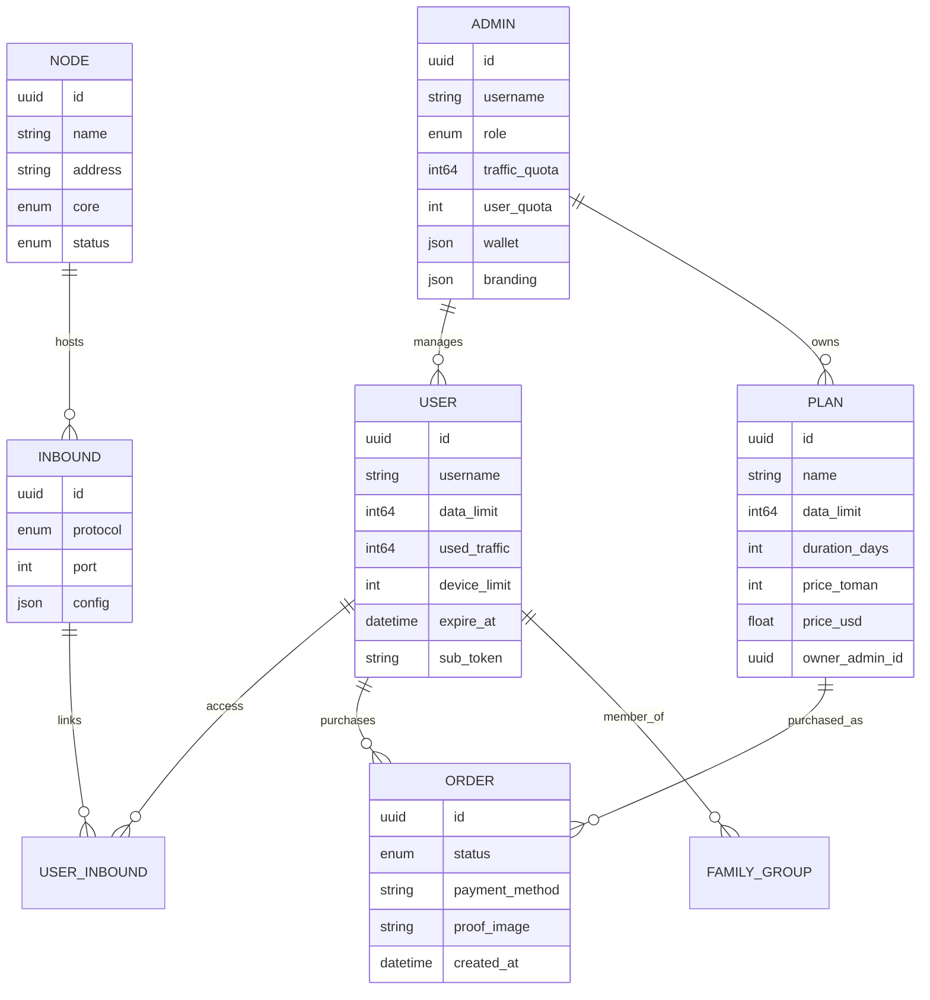

# المقدمة

!!! abstract "ملخص"
    VortexUI هي لوحة إدارة بروكسي **محورها المستخدم** و**مستقلة عن النواة**، تدعم
    Xray-core و sing-box. تُدير المستخدمين، العقد، حركة المرور، الاشتراكات، المدفوعات،
    الموزّعين، وأدوات مكافحة الرقابة من واجهة حديثة واحدة.

---

## ما هي VortexUI؟

**VortexUI** هي لوحة إدارة بروكسي من الجيل التالي مصمّمة للمشغّلين الذين يحتاجون إلى:

- **التوسّع** — إدارة آلاف المستخدمين عبر عشرات العقد
- **المرونة** — تجاوز الأعطال التلقائي، مراقبة السلامة، أسطول عقد ذاتي الإصلاح
- **مكافحة الرقابة** — حيل TLS خاصة بمزوّد الخدمة، حماية من الاستكشاف النشط، مواقع خادعة، WARP+
- **الخدمة الذاتية** — يدير المستخدمون حساباتهم بأنفسهم، يشترون الخطط، يفتحون التذاكر
- **الإيرادات** — خطط لكل موزّع، بوابات دفع متعددة، فوترة عبر المحفظة، برنامج إحالة
- **التفويض** — منصة موزّعين كاملة مع موزّعين فرعيين، علامة تجارية خاصة، حدود سياسات

على خلاف اللوحات المبنية حول الاتصال الوارد (3x-ui)، تستخدم VortexUI **نموذجاً محوره المستخدم**: هوية مستخدم واحدة تمنح وصولاً لجميع البروتوكولات المُعيَّنة عبر جميع العقد في وقت واحد.

---

## نظرة عامة على الميزات

### المحرك والبنية التحتية

| القدرة | التفاصيل |
|--------|----------|
| دعم نواتين | Xray-core و sing-box — الاختيار لكل عقدة |
| دفع حركة مرور تفاضلي (Push Delta) | آمن عند إعادة التشغيل، بدون حساب مزدوج، لا يفقد بيانات أبداً |
| أسطول عقد بـ mTLS | اتصالات مشفّرة، تجاوز أعطال تلقائي، ترحيل عكسي |
| معالج تسجيل العقد | أربع خطوات عبر الواجهة لإلحاق العقد البعيدة |
| ترحيل تلقائي | نقل المستخدمين من العقد غير السليمة تلقائياً |
| اتحاد (Federation) | مزامنة المستخدمين/العقد عبر عدة لوحات تحكم |
| عقدة محلية | نواة داخل العملية — لا حاجة لعميل منفصل |
| سلاسل CDN/التتابع | مسارات متعددة القفزات مع CDN وريلاي وعمّال |
| موازنات حمل | 4 استراتيجيات مع فحص السلامة |
| أتمتة DNS عبر Cloudflare | إدارة سجلات DNS تلقائياً للعقد |

### الأمان ومكافحة الرقابة

| القدرة | التفاصيل |
|--------|----------|
| ماسح Reality | اكتشاف أفضل SNI مع تقييم زمن الاستجابة |
| مدير حيل TLS | ملفات تعريف خاصة بمزوّد الخدمة (تجزئة، تعدد إرسال، حشو) |
| حماية من الاستكشاف النشط | كشف ومنع عمليات الفحص النشطة (GFW) |
| التحقق من البصمة | تصفية العملاء بناءً على JA3 |
| موقع خادع (Decoy) | عرض موقع وهمي للمستكشفين (وضع وكيل أو ثابت) |
| DNS-over-HTTPS | خادم DoH مدمج مع حظر الإعلانات/البرمجيات الخبيثة |
| ملفات التمويه | إعدادات مسبقة قابلة لإعادة الاستخدام لمكافحة DPI لكل دولة |
| تكامل WARP+ | اتصال صادر عبر Cloudflare لعنوان IP نظيف |
| ماسح Clean-IP | إيجاد أفضل عناوين CDN حسب زمن الاستجابة/الفقدان |
| فرض حدّ IP | سقف IP متزامن لكل مستخدم مع إجراءات قابلة للتكوين |
| حظر جغرافي | قيود دول لكل اتصال وارد |
| حارس مشاركة الحساب | كشف والتصرف عند مشاركة بيانات الدخول |

### إدارة المستخدمين والتجارة

| القدرة | التفاصيل |
|--------|----------|
| بوابة الخدمة الذاتية | تسجيل الدخول بتوكن الاشتراك، عرض الاستهلاك، التذاكر |
| متجر الخدمة الذاتية | خطط لكل موزّع مع دفع بالبطاقة/العملات الرقمية/ZarinPal |
| الحصة الذكية (Smart Quota) | تقليل تدريجي للسرعة (مستويات الاستخدام العادل) |
| مجموعات عائلية | حصص بيانات مشتركة لعدة مستخدمين |
| نظام الإحالة | رموز دعوة مع مكافآت بيانات/أيام |
| خطط لكل موزّع | كل موزّع ينشئ خططه وأسعاره الخاصة |
| بوابات الدفع | ZarinPal (أونلاين)، تحويل بطاقة (رفع إيصال)، عملات رقمية (هاش المعاملة) |
| فوترة عبر المحفظة | نظام رصيد الموزّع مع طابور شحن |
| مضيفات الاشتراك | تجاوزات CDN/عنوان لكل اتصال وارد مع متغيرات القالب |
| روابط عميقة + QR | استيراد الاشتراك بلمسة واحدة |
| قوالب الإعدادات | توجيه Clash/sing-box مخصص لكل مستخدم |
| أدوات الاستيراد | الترحيل من 3x-ui أو Marzban |

### الإدارة ومنصة الموزّعين

| القدرة | التفاصيل |
|--------|----------|
| RBAC + الأدوار | صلاحيات دقيقة لكل مسؤول |
| منصة موزّعين كاملة | محفظة، موزّعون فرعيون، علامة تجارية خاصة، ويب هوكس، حدود سياسات |
| قوائم سماح مخصصة | قيود خطط/عقد/اتصالات واردة لكل موزّع |
| تعليق تلقائي | تعليق الموزّع تلقائياً عند المخالفات |
| سجل تدقيق | تتبع كل إجراء مسؤول مع الفروقات |
| إشعارات الحصة | عتبات قابلة للتكوين لتنبيهات الموزّعين |
| نسخ احتياطي تلقائي | تصدير مجدول إلى تيليجرام أو S3 |
| مقاييس Grafana | نقطة نهاية Prometheus + لوحة معلومات جاهزة |

### الواجهة وتجربة المستخدم

| القدرة | التفاصيل |
|--------|----------|
| لوحة الأوامر | Ctrl+K بحث ضبابي عبر كل شيء |
| أدوات لوحة المعلومات | سحب وإفلات، تغيير الحجم، تخصيص التخطيط |
| خريطة العالم | تصوّر جغرافي لحركة المرور |
| مقاييس حيّة | مؤشرات متحركة لوحدة المعالجة/الذاكرة/النطاق |
| صفحة المراقبة | جدول اتصالات حيّة (مستخدم، عقدة، IP، بروتوكول، المدة) |
| التحليلات | تحليل جغرافي، أعلى المستخدمين، ساعات الذروة، تصدير CSV |
| جولة تعريفية | إرشاد للمسؤول عند أول استخدام |
| 8 لغات | EN/FA/TR/AR/RU/ZH/JA/ES مع دعم RTL كامل |
| داكن + فاتح | انتقال سلس متحرك بين السمات |
| بوابة الهاتف | شريط تنقل سفلي، سحب للتحديث، أوراق سفلية |

---

## البنية المعمارية

```
┌──────────────────────────────────────────────────────────────┐
│  Caddy (Web Layer)     — HTTPS, SPA, reverse proxy, DoH     │
├──────────────────────────────────────────────────────────────┤
│  Panel (Go 1.26)       — REST API, SSE, gRPC hub, scheduler │
│  ├─ Auth               — JWT + TOTP + portal tokens          │
│  ├─ Services           — user, node, plan, order, analytics  │
│  ├─ Hub                — node fleet management + failover    │
│  ├─ Scanner            — Reality SNI prober + Clean-IP       │
│  ├─ Migration          — health-based user redistribution    │
│  ├─ Reseller           — wallet, plans, branding, webhooks   │
│  └─ Federation         — cross-panel sync                    │
├──────────────────────────────────────────────────────────────┤
│  PostgreSQL + TimescaleDB — data + time-series traffic       │
│  Redis                    — cache, sessions, device tracker  │
├──────────────────────────────────────────────────────────────┤
│  Node Agent (gRPC)     — remote core execution + health      │
│  Local Node            — in-process on panel host            │
└──────────────────────────────────────────────────────────────┘
```



---

## المقارنة مع اللوحات الأخرى

| الميزة | VortexUI 1.3.1 | 3x-ui | Marzban | Hiddify |
|--------|:--:|:--:|:--:|:--:|
| نواة مزدوجة (Xray + sing-box) | ✅ | ❌ | ❌ | ✅ |
| نموذج محوره المستخدم | ✅ | ❌ | ✅ | ✅ |
| دفع حركة مرور تفاضلي | ✅ | polling | polling | polling |
| ترحيل عقد تلقائي | ✅ | ❌ | ❌ | ❌ |
| موازن حمل (4 استراتيجيات) | ✅ | ❌ | ❌ | ❌ |
| ماسح Reality | ✅ | ❌ | ❌ | ❌ |
| حيل TLS (ملفات مزوّد الخدمة) | ✅ | ❌ | ❌ | جزئي |
| حماية من الاستكشاف النشط | ✅ | ❌ | ❌ | ❌ |
| بصمة العميل (JA3) | ✅ | ❌ | ❌ | ❌ |
| موقع خادع | ✅ | ❌ | ❌ | ❌ |
| DNS-over-HTTPS | ✅ | ❌ | ❌ | ❌ |
| بوابة خدمة ذاتية | ✅ | ❌ | ❌ | ✅ |
| متجر لكل موزّع | ✅ | ❌ | ❌ | ❌ |
| بوابات دفع (متعددة الطرق) | ✅ | ❌ | ❌ | جزئي |
| خطط وأسعار لكل موزّع | ✅ | ❌ | ❌ | ❌ |
| مضيفات اشتراك (تجاوزات) | ✅ | ❌ | ✅ | ❌ |
| مجموعات عائلية | ✅ | ❌ | ❌ | ❌ |
| نظام إحالة | ✅ | ❌ | ❌ | ❌ |
| اتحاد (Federation) | ✅ | ❌ | ❌ | ❌ |
| الحصة الذكية | ✅ | ❌ | ❌ | ❌ |
| سلاسل CDN/التتابع | ✅ | ❌ | ❌ | ❌ |
| فوترة محفظة الموزّع | ✅ | ❌ | ❌ | ❌ |
| روابط عميقة | ✅ | ❌ | ❌ | ✅ |
| تحليلات (جغرافية + تصدير) | ✅ | ❌ | ❌ | ❌ |
| أدوات لوحة المعلومات (سحب وإفلات) | ✅ | ❌ | ❌ | ❌ |
| لوحة الأوامر (Ctrl+K) | ✅ | ❌ | ❌ | ❌ |
| الخلفية | Go | Go | Python | Python |
| قاعدة البيانات | PG + TimescaleDB | SQLite | SQLite | SQLite |

---

## البروتوكولات المدعومة

| البروتوكول | النواة | وارد | صادر | النقل | الأمان |
|-----------|--------|:----:|:----:|-------|--------|
| VLESS | كلاهما | ✅ | ✅ | TCP, WS, gRPC, HTTPUpgrade, xHTTP, mKCP | None, TLS, REALITY |
| VMess | كلاهما | ✅ | ✅ | TCP, WS, gRPC, HTTPUpgrade, mKCP | None, TLS |
| Trojan | كلاهما | ✅ | ✅ | TCP, WS, gRPC, mKCP | TLS, REALITY |
| Shadowsocks | كلاهما | ✅ | ✅ | TCP (+ SS-2022 متعدد المستخدمين) | None |
| Hysteria2 | sing-box | ✅ | ✅ | UDP (QUIC) | TLS |
| TUIC | sing-box | ✅ | ✅ | UDP (QUIC) | TLS |
| WireGuard | sing-box | ✅ | ✅ | UDP | Native |
| Hysteria (v1) | sing-box | ✅ | — | UDP | TLS |
| ShadowTLS | sing-box | ✅ | ✅ | TCP | TLS |
| AnyTLS | sing-box | ✅ | — | TCP | TLS |
| Naive | sing-box | ✅ | — | — | TLS (إلزامي) |
| SOCKS | كلاهما | ✅ | ✅ | TCP (بدون نقل) | نص صريح |
| HTTP | كلاهما | ✅ | ✅ | TCP (بدون نقل) | نص صريح |
| Dokodemo | Xray | ✅ | — | — | نص صريح |

**صيغ إخراج الاشتراك:** `base64`، `clash`، `singbox`، `xray`، `outline`، `links`
(يُكتشف تلقائياً من User-Agent العميل، أو يُفرض بـ `?format=`).

---

## المصطلحات الرئيسية

| المصطلح | المعنى |
|---------|--------|
| **لوحة التحكم (Panel)** | خادم التحكم — API، الواجهة، قاعدة البيانات، المجدولات |
| **عقدة (Node)** | خادم يشغّل نواة بروكسي (Xray أو sing-box) |
| **عقدة محلية (Local Node)** | نواة داخل العملية على نفس جهاز لوحة التحكم |
| **اتصال وارد (Inbound)** | نقطة دخول للعميل (بروتوكول + منفذ + إعدادات) |
| **اتصال صادر (Outbound)** | مسار الخروج (freedom، سلسلة بروكسي، WARP، ثقب أسود) |
| **اشتراك (Subscription)** | `/sub/{token}` — إعدادات مكتشفة تلقائياً لأي تطبيق عميل |
| **مضيف الاشتراك (Subscription Host)** | تجاوزات عنوان/SNI لكل اتصال وارد لواجهة CDN |
| **البوابة (Portal)** | واجهة ويب الخدمة الذاتية للمستخدم |
| **المتجر (Shop)** | صفحة شراء خطط لكل موزّع (`/sub/{token}/shop`) |
| **المركز (Hub)** | مكوّن داخلي يدير جميع اتصالات العقد |
| **الاتحاد (Federation)** | عدة لوحات تحكم متصلة لمزامنة المستخدمين/العقد |
| **سلسلة التتابع (Relay Chain)** | مسار متعدد القفزات: عميل → CDN → ريلاي → عقدة |
| **الحصة الذكية (Smart Quota)** | سياسة استخدام عادل مع مستويات سرعة تدريجية |
| **حزمة التوجيه (Routing Pack)** | مجموعة مسمّاة قابلة لإعادة الاستخدام من قواعد التوجيه |
| **ملف التمويه (Evasion Profile)** | إعداد مسبق لمكافحة DPI (تجزئة + بصمة + تعدد إرسال) |
| **SSE** | أحداث مرسلة من الخادم — تحديثات واجهة فورية |
| **موزّع (Reseller)** | مسؤول بوصول محدد، محفظة، خطط/مستخدمون خاصون |
| **علامة تجارية خاصة (Whitelabel)** | علامة تجارية لكل موزّع (شعار، ألوان، عنوان) |

---

## الخطوات التالية

1. **[التثبيت](02-installation.md)** — تشغيل VortexUI خلال 5 دقائق
2. **[الخطوات الأولى](03-first-steps.md)** — تسجيل الدخول، إضافة عقدة، إنشاء أول مستخدم
3. **[لوحة المعلومات](04-dashboard.md)** — استكشاف النظرة العامة في الوقت الفعلي
