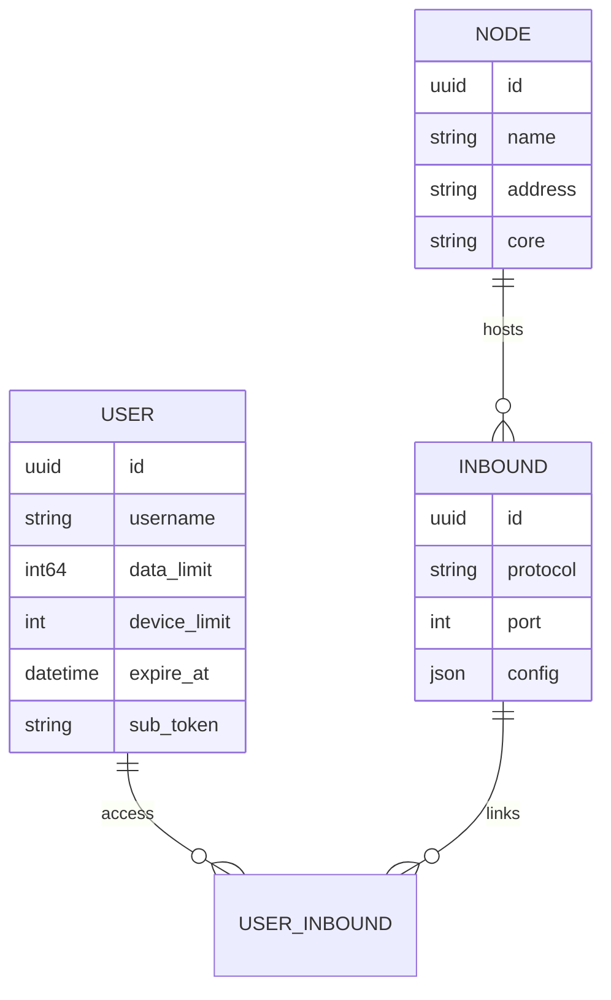

<div align="center" dir="rtl">


**VortexUI Wiki**

[Wiki](./README.md) · [FA](../fa/01-introduction.md) · [EN](../en/01-introduction.md) · [TR](../tr/01-introduction.md)

</div>

<div dir="rtl">

# ١. المقدمة والمفاهيم الأساسية

[← العودة إلى الفهرس](./README.md) · [التالي: التثبيت →](./02-installation.md)

> [!NOTE]
> VortexUI **يركز على المستخدم** — اشتراك واحد يغطي جميع inbounds المعيّنة.

---

## ما هو VortexUI؟

**VortexUI** هي لوحة إدارة بروكسي من الجيل القادم مصممة لإدارة المستخدمين والعقد و inbound/outbound والتوجيه وبيع الاشتراكات. على عكس اللوحات المرتكزة على inbound (مثل 3x-ui)، تستخدم VortexUI **نموذجاً يركز على المستخدم**: لكل مستخدم هوية واحدة ويحصل على الوصول إلى بروتوكولات/inbound متعددة.

### الميزات الرئيسية

| المجال | القدرة |
|------|--------|
| **النواة** | Xray-core و sing-box — قابل للاختيار لكل عقدة |
| **الحركة** | محاسبة **دلتا push** (آمنة عند إعادة التشغيل) |
| **متعدد العقد** | اتصالات mTLS، failover تلقائي، migrate-back |
| **الشبكة** | Outbound، التوجيه، الموازن، Observatory |
| **الأمان** | JWT + TOTP 2FA، RBAC، سجل التدقيق، مكافحة مشاركة الحساب |
| **المبيعات** | الخطط، ZarinPal، NowPayments (كريبتو) |
| **الواجهة** | React 18، 8 لغات، مظهر داكن/فاتح، SSE مباشر، PWA |

---

## المعمارية

### المكونات الرئيسية

```
┌─────────────────────────────────────────────────────────┐
│  Caddy (web)          — HTTPS, SPA, reverse proxy       │
├─────────────────────────────────────────────────────────┤
│  Panel (cmd/panel)    — API, SSE, management, DB        │
├─────────────────────────────────────────────────────────┤
│  PostgreSQL/TimescaleDB — persistent data + traffic TS  │
│  Redis                  — cache and sessions            │
├─────────────────────────────────────────────────────────┤
│  Node Agent (cmd/node) — gRPC server, core execution    │
│  Local Node            — in-process core on same server │
└─────────────────────────────────────────────────────────┘
```

### نموذج البيانات: يركز على المستخدم



يمكن لـ **User** الاتصال بعدة **Inbounds** عبر عدة **Nodes**. رابط الاشتراك (`/sub/{token}`) يُرجع جميع التكوينات في ملف Clash/sing-box/base64 واحد.

---

## المقارنة مع اللوحات الأخرى

| الميزة | VortexUI | 3x-ui | Marzban | Hiddify |
|--------|:--------:|:-----:|:-------:|:-------:|
| نواة Xray + sing-box | ✅ | Xray | Xray | ✅ |
| نموذج يركز على المستخدم | ✅ | ❌ | ✅ | ✅ |
| حركة push/delta | ✅ | polling | polling | polling |
| Balancer + routing | ✅ | ❌ | ❌ | ❌ |
| Outbound CRUD | ✅ | partial | ❌ | ❌ |
| API token + audit | ✅ | ❌ | ❌ | ❌ |
| مكافحة مشاركة الحساب | ✅ | partial | ❌ | ❌ |
| HTTPS تلقائي | ✅ Caddy | ❌ | ❌ | ✅ |
| Iran Geo | ✅ | ❌ | ❌ | partial |
| قاعدة البيانات | PG+Timescale | SQLite/PG | SQLite | SQLite |

---

## البروتوكولات المدعومة

| البروتوكول | Inbound | Outbound | النقل |
|--------|:-------:|:--------:|-----------|
| VLESS | ✅ | ✅ | TCP, WS, gRPC, HTTPUpgrade |
| VMess | ✅ | ✅ | TCP, WS, gRPC |
| Trojan | ✅ | ✅ | TCP, WS, gRPC |
| Shadowsocks | ✅ | ✅ | TCP |
| SOCKS / HTTP | — | ✅ | TCP |
| Hysteria2 | ✅ (sing-box) | — | UDP |
| TUIC | ✅ (sing-box) | — | UDP |
| WireGuard | ✅ | — | UDP |

**طبقة الأمان:** None, TLS, REALITY

---

## مفاهيم مهمة

| المصطلح | المعنى |
|------|---------|
| **Panel** | خادم التحكم — API، UI، DB |
| **Node** | خادم يشغّل نواة البروكسي |
| **Local Node** | عقدة in-process على نفس جهاز اللوحة |
| **Inbound** | نقطة دخول العميل (VLESS على المنفذ 443، إلخ) |
| **Outbound** | مسار الخروج (freedom، سلسلة proxy، WARP) |
| **Subscription** | رابط `/sub/{token}` لاستيراد العميل |
| **Failover** | ترحيل تلقائي للمستخدمين إلى عقدة سليمة |
| **SSE** | تحديثات واجهة مباشرة دون polling |

---

## خارطة الطريق (ملخص)

معظم ميزات خارطة الطريق مُنفّذة: وضع cluster، Grafana/Prometheus، نسخ احتياطي تلقائي، بوت Telegram للمستخدم، WireGuard، حظر جغرافي، العلامة التجارية، PWA، والمزيد.

عناصر قيد التطوير النشط:
- تطبيق React Native للجوال
- توثيق متعدد اللغات (هذا الويكي هو الخطوة الأولى)
- تحديد معدل لكل مستخدم على البروكسي

</div>
