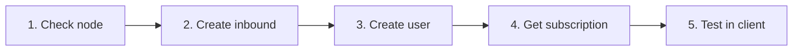

# ٣. الخطوات الأولى

!!! tip "نصيحة"
    أكمل هذا المسار في **5 دقائق**: عقدة → inbound → مستخدم → اشتراك → اختبار.

---

## تسجيل الدخول

1. افتح عنوان URL للتثبيت في المتصفح (مثل `https://panel.example.com`)
2. سجّل الدخول باسم المستخدم وكلمة مرور المسؤول المُنشأة أثناء التثبيت
3. إذا كان 2FA مفعّلاً، أدخل رمز المصادقة المكون من 6 أرقام

### إنشاء مسؤول جديد (CLI)

```bash
# Docker
docker compose -f deploy/compose.yml exec panel \
  /usr/local/bin/panel admin create --username admin2 --password 'pass' --sudo

# Native
./bin/panel admin create --username admin2 --password 'pass' --sudo

# Or via vortexui
vortexui admin
```

---

## سير العمل الأولي (5 دقائق)



### الخطوة 1: التحقق من العقدة

- القائمة → **Nodes**
- يجب أن تكون عقدة `local` (أو العقدة المضافة) **خضراء** مع Core Running
- راجع CPU/RAM/Disk وعدد الاتصالات

### الخطوة 2: إنشاء inbound

1. على العقدة → **Inbounds**
2. **Add Inbound**
3. مثال سريع VLESS + REALITY:

| الحقل | القيمة |
|-------|-------|
| Protocol | `vless` |
| Port | `443` |
| Network | `tcp` |
| Security | `reality` |
| Flow | `xtls-rprx-vision` |
| SNI | `www.microsoft.com` |

4. في قسم REALITY انقر **Generate** (زوج مفتاح خاص/عام)
5. احفظ — النواة تعيد تحميل التكوين دون إيقاف

> تفاصيل البروتوكول: [الفصل 13 — البروتوكولات](./13-protocols-config.md)

### الخطوة 3: إنشاء مستخدم

1. القائمة → **Users** → **New User**
2. الحقول المقترحة:

| الحقل | مثال |
|-------|---------|
| Username | `testuser` |
| Data limit | `50 GB` |
| Expire | 30 days |
| Device limit | `3` |
| Inbounds | اختر inbound الذي أنشأته |

3. **Save**

### الخطوة 4: الحصول على الاشتراك

1. في قائمة المستخدمين → أيقونة **Subscription** (أو QR)
2. انسخ الروابط أدناه:

| التنسيق | حالة الاستخدام |
|--------|----------|
| Base64 | v2rayNG, Nekoray |
| Clash | Clash Meta / Mihomo |
| sing-box | sing-box client |
| QR Code | مسح من الجوال |

3. صفحة المستخدم العامة: `https://panel.example.com/sub/info/{token}` — رسم بياني للحركة و QR

### الخطوة 5: الاختبار

1. استورد الرابط في عميلك
2. اتصل
3. في اللوحة → **Users** → Usage — يجب أن تزداد الحركة (SSE مباشر)

---

## الإعدادات الأولية الموصى بها

| الإعداد | المسار | السبب |
|---------|------|-----|
| تغيير كلمة المرور | Settings → Password | الأمان |
| تفعيل 2FA | Settings → 2FA | حماية الحساب |
| Iran Geo | Nodes → Update Geo | توجيه IR |
| Webhook/TG | env + restart | إشعارات الأحداث |
| Backup | Settings → Backup | التعافي من الكوارث |

---

## استيراد المستخدمين من لوحة أخرى

**Users → Import** — المصادر المدعومة:
- **3x-ui** (JSON export)
- **Marzban** (JSON export)

يُرحّل المستخدمون مع UUID والحصة؛ يجب ربط inbounds بشكل منفصل.

---

## اختصارات الواجهة

| الإجراء | المسار |
|--------|------|
| مظهر داكن/فاتح | الشريط الجانبي → أيقونة القمر/الشمس |
| اللغة | Settings → Language |
| البحث عن المستخدمين | Users → مربع البحث |
| سجلات العقدة | Nodes → Logs |
| الأحداث المباشرة | تلقائي — toast في الزاوية |
