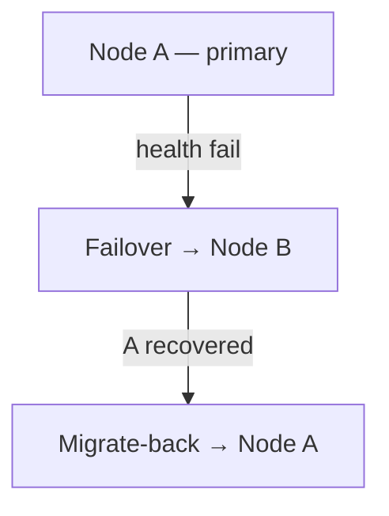

# ٦. إدارة العقد

!!! tip "نصيحة"
    لقواعد التوجيه الإيرانية استخدم **Nodes → Update Geo**.

---

## أنواع العقد

| النوع | الوصف | حالة الاستخدام |
|------|-------------|----------|
| **Local Node** | نواة in-process على خادم اللوحة | إعداد خادم واحد |
| **Remote Node** | Agent منفصل مع gRPC/mTLS | أسطول متعدد الخوادم |

---

## إضافة عقدة بعيدة

1. **Nodes → Add Node**
2. الحقول:

| الحقل | مثال |
|-------|---------|
| Name | `de-fra-01` |
| Address | `203.0.113.10:50051` |
| Core | `xray` or `singbox` |
| Endpoint | عنوان عام للاشتراك (CDN/tunnel) |

3. انسخ شهادات mTLS من `deploy/certs/` إلى الـ agent
4. شغّل الـ agent — الحالة تصبح خضراء

---

## مراقبة الصحة

كل بطاقة عقدة تعرض:

| المقياس | عتبة تحذير الواجهة |
|--------|----------------------|
| CPU % | >60% أصفر، >85% أحمر |
| RAM % | نفسها |
| Disk % | نفسها |
| Connections | العدد النشط |
| Last seen | آخر heartbeat |

---

## إجراءات العقدة

| الزر | الإجراء |
|--------|--------|
| **Inbounds** | CRUD inbounds على هذه العقدة |
| **Logs** | تدفق سجل النواة المباشر |
| **Restart Core** | إعادة تحميل دون توقف طويل |
| **Stop Core** | إيقاف مؤقت |
| **Update Geo** | تنزيل Iran geoip/geosite |
| **Edit / Delete** | تحرير البيانات الوصفية / إزالة |

---

## Inbounds

**Nodes → Inbounds → Add**

- البروتوكول، المنفذ، الشبكة، الأمان
- REALITY: Generate keypair
- محرر JSON متقدم
- استيراد share link
- **Bandwidth limit** لكل inbound
- **Geo-blocking** لكل inbound
- رابط **Evasion profile**

---

## Failover و Migrate-Back



- المستخدمون يُرحّلون إلى عقدة سليمة
- بعد التعافي، عودة تلقائية (قابلة للتكوين)

---

## Custom Endpoint

عندما يختلف IP الخادم الحقيقي عما يراه العملاء (CDN، نفق عكسي):

```
Endpoint: cdn.example.com
```

الاشتراك يُعلِن هذا المضيف بدلاً من `address` الداخلي.

---

## أتمتة DNS Cloudflare

مع التكوين:

```env
VORTEX_CF_API_TOKEN=...
VORTEX_CF_ZONE_ID=...
```

يمكن إنشاء سجلات A للعقد تلقائياً.

---

## GeoIP / Geosite (Iran)

**Update Geo** يُنزّل من [Iran-v2ray-rules](https://github.com/chocolate4u/Iran-v2ray-rules):

- `geoip:ir`, `geosite:ir`, `category-ir`
- فئات الإعلانات/البرمجيات الخبيثة

ثم النواة تعيد التحميل. URL مخصص: `POST /api/nodes/:id/geo-update`

---

## Hot-Switch Core

كل عقدة يمكنها التبديل بين **xray** و **sing-box** (Hysteria2/TUIC فقط على sing-box).

---

## gRPC Keepalive

اتصالات panel↔node الخاملة تُبقى حية بـ keepalive — لا تنقطع.
