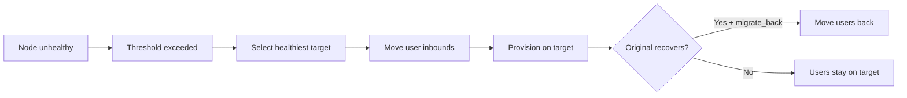

# إدارة العقد

!!! abstract "أسطول العقد"
    تدير VortexUI أسطولاً من عقد البروكسي عبر gRPC + mTLS. كل عقدة تشغّل إما
    Xray-core أو sing-box وتُبلّغ عن السلامة والحركة وبيانات الاتصال إلى لوحة التحكم.

---

## نظرة عامة على أسطول العقد

صفحة **العقد** تعرض جميع العقد مع:

| العمود | الوصف |
|--------|-------|
| الاسم | اسم العقدة المعروض |
| العنوان | IP أو نطاق |
| النواة | Xray-core أو sing-box |
| الحالة | متصلة / غير متصلة / غير سليمة |
| المستخدمون | عدد المستخدمين النشطين على هذه العقدة |
| المعالج / الذاكرة / القرص | استخدام الموارد الحيّة |
| وقت التشغيل | المدة منذ آخر إعادة تشغيل |

---

## معالج التسجيل

الطريقة الموصى بها لإضافة العقد البعيدة. تدفق من أربع خطوات عبر الواجهة:

### الخطوة 1: تفاصيل العقدة

- الاسم، العنوان، المنفذ
- اختيار النواة (Xray أو sing-box)
- اختياري: نقطة نهاية مخصصة للوصول عبر نفق/CDN

### الخطوة 2: إنشاء الأمر

تُنشئ لوحة التحكم أمر تثبيت بسطر واحد يحتوي:

- توكن تسجيل العقدة (استخدام لمرة واحدة)
- عنوان لوحة التحكم لإعادة الاتصال
- رابط تنزيل النواة

### الخطوة 3: التنفيذ على الخادم البعيد

ادخل عبر SSH إلى الخادم البعيد والصق الأمر. يقوم العميل بـ:

1. تنزيل وتثبيت ملف العقدة التنفيذي
2. تبادل شهادات mTLS مع لوحة التحكم
3. تنزيل وتشغيل نواة البروكسي المختارة
4. التسجيل كخدمة systemd

### الخطوة 4: التحقق من الاتصال

تؤكد لوحة التحكم أن العقدة متصلة وتعرض بيانات السلامة الأولية.

!!! tip
    ينتهي صلاحية توكن التسجيل بعد 10 دقائق. إذا انتهت المهلة، أنشئ توكناً جديداً من المعالج.

---

## تشخيصات سلامة العقدة

تُراقَب كل عقدة باستمرار. تكتشف لوحة التحكم ثلاث حالات فشل:

| الحالة | المعنى | الإجراء التلقائي |
|--------|--------|-----------------|
| **فشل mTLS** | خطأ في الشهادة أو الشبكة غير قابلة للوصول | تنبيه + إعادة محاولة |
| **غير قابلة للوصول** | لا استجابة gRPC ضمن المهلة | تنبيه → ترحيل تلقائي إذا مفعّل |
| **النواة متوقفة** | العميل يعمل لكن نواة البروكسي تعطلت | إعادة تشغيل تلقائية للنواة |

عرض التشخيصات: **العقد → انقر العقدة → تبويب السلامة**.

---

## اتصالات mTLS

جميع الاتصالات بين لوحة التحكم والعقد تستخدم TLS المتبادل:

- تُنشأ الشهادات تلقائياً أثناء التسجيل
- تُدوَّر حسب جدول قابل للتكوين
- لا حاجة لإدارة الشهادات يدوياً
- إذا انتهت صلاحية شهادة، تُنبّه لوحة التحكم ويمكنها إعادة الإصدار تلقائياً

---

## الترحيل التلقائي

نقل المستخدمين تلقائياً من العقد غير السليمة إلى عقد سليمة.

### إعدادات السياسة

| الإعداد | الوصف | الافتراضي |
|---------|-------|-----------|
| مفعّل | تشغيل/إيقاف الترحيل التلقائي | معطّل |
| فاصل فحص السلامة | ثوانٍ بين الفحوصات | 30 |
| عتبة عدم السلامة | فشل متتالٍ قبل التفعيل | 3 |
| عتبة المعالج | الترحيل إذا تجاوز المعالج % | 90 |
| عتبة الذاكرة | الترحيل إذا تجاوزت الذاكرة % | 90 |
| أقصى فقدان حزم | الترحيل إذا تجاوز الفقدان % | 10 |
| الترحيل العكسي | إعادة المستخدمين عند تعافي العقدة الأصلية | نعم |

### كيف يعمل



### أحداث الترحيل

عرض السجل في **العقد → الترحيل التلقائي → الأحداث**: الطابع الزمني، السبب، عقدة المصدر/الهدف، الحالة (مكتمل/فاشل).

---

## المراقبة الحيّة

**العقد → انقر العقدة → تبويب المراقبة**:

- **المعالج** — رسم بياني للاستخدام في الوقت الفعلي
- **الذاكرة** — المستخدمة/الإجمالية مع خط الاتجاه
- **القرص** — الاستخدام ومعدل النمو
- **النطاق** — الإنتاجية الحالية لكل اتجاه
- **الاتصالات** — عدد الأنفاق النشطة عبر الزمن

تُدفع البيانات عبر gRPC كل 3 ثوانٍ من عميل العقدة.

---

## إعادة التشغيل/الإيقاف عن بعد

من صفحة تفاصيل العقدة:

| الإجراء | الوصف |
|---------|-------|
| **إعادة تشغيل النواة** | إعادة تشغيل نواة البروكسي (Xray/sing-box) بدون لمس العميل |
| **إعادة تشغيل العميل** | إعادة تشغيل كاملة للعميل (انقطاع اتصال قصير) |
| **إيقاف النواة** | إيقاف نواة البروكسي — لا اتصالات جديدة |
| **تحديث النواة** | سحب أحدث ملف نواة تنفيذي وإعادة التشغيل |

!!! warning
    إيقاف النواة يقطع اتصال جميع المستخدمين النشطين على تلك العقدة. استخدم الترحيل التلقائي أولاً إذا أردت وقت توقف صفري.

---

## نقطة نهاية مخصصة (نفق/CDN/ريلاي)

تجاوز العنوان المُعلَن في الاشتراكات لهذه العقدة:

| الحقل | الوصف |
|-------|-------|
| عنوان نقطة النهاية | النطاق/IP الذي يتصل به المستخدمون |
| منفذ نقطة النهاية | المنفذ الذي يتصل به المستخدمون |
| ملاحظات | الوصف (مثل "خلف CDN Cloudflare") |

استخدم هذا عندما تكون العقدة خلف نفق أو CDN أو ريلاي — عنوان IP الحقيقي للعقدة يختلف عن العنوان الذي يواجهه المستخدم.

---

## أتمتة DNS عبر Cloudflare

إدارة سجلات DNS تلقائياً لعقدك في Cloudflare:

1. **الإعدادات → Cloudflare** — أضف توكن API ومعرّف المنطقة
2. **العقد → العقدة → DNS** — فعّل أتمتة DNS
3. تُنشئ/تُحدّث لوحة التحكم سجلات A/AAAA عند تغيّر عناوين IP للعقد
4. اختيارياً: التوكيل عبر Cloudflare (السحابة البرتقالية)

مفيد للعقد ذات IP ديناميكي أو عند تدوير عناوين الخوادم.

---

## بث السجلات لكل عقدة

**العقد → العقدة → تبويب السجلات**:

- بث سجلات حيّة من عميل العقدة ونواة البروكسي
- تصفية حسب المستوى: debug، info، warn، error
- البحث داخل السجلات
- تنزيل ملف السجل لنطاق زمني

---

## حدّ السرعة والحظر الجغرافي لكل عقدة

إعدادات لكل عقدة:

| الإعداد | الوصف |
|---------|-------|
| حدّ السرعة | سقف تنزيل لكل مستخدم بالبايت/ثانية (`0` = غير محدود) |
| الحظر الجغرافي | رموز دول مفصولة بفواصل (ISO 3166-1 alpha-2) |

الحظر الجغرافي يقيّد الدول التي يمكنها الاتصال بهذه العقدة تحديداً. فارغ = الكل مسموح.

---

## أمر `vortexui doctor` في CLI

تشغيل التشخيصات من سطر الأوامر:

```bash
vortexui doctor
```

يفحص:

- ✅ اتصال PostgreSQL والترحيلات
- ✅ اتصال Redis وزمن الاستجابة
- ✅ اتصال gRPC لكل عقدة
- ✅ صلاحية الشهادات وانتهائها
- ✅ توفر المنافذ
- ✅ تحليل DNS
- ✅ مساحة القرص
- ✅ إصدارات ملفات النواة التنفيذية

يتضمن المخرج الحالة وزمن الاستجابة واقتراحات عملية لأي إخفاقات.
