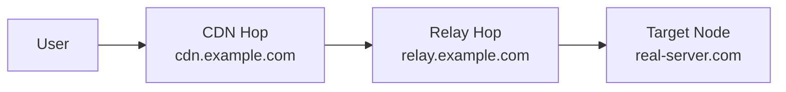

# سياسة الشبكة

!!! abstract "التوجيه والاتصالات الصادرة"
    تحكّم في كيفية خروج الحركة من عقدك — مباشرة، محظورة، مسلسلة عبر بروكسيات أخرى،
    أو مُرسلة عبر Cloudflare WARP. ابنِ حزم توجيه قابلة لإعادة الاستخدام وسلاسل تتابع متعددة القفزات.

---

## الاتصالات الصادرة

**الشبكة → الاتصالات الصادرة**

يحدّد الاتصال الصادر إلى أين تذهب الحركة بعد دخولها اتصال وارد للعقدة.

| النوع | الوصف |
|-------|-------|
| **Freedom** | وصول مباشر للإنترنت (افتراضي) |
| **Blackhole** | إسقاط الحركة بصمت |
| **DNS** | التحليل عبر خادم DNS محدد |
| **سلسلة بروكسي** | التوجيه إلى بروكسي آخر (SOCKS/HTTP/Trojan/VMess/VLESS) |
| **WARP+** | التوجيه عبر Cloudflare WARP لعنوان IP نظيف |

### تكامل WARP+

1. اذهب إلى **الشبكة → الاتصالات الصادرة → إضافة → WARP+**
2. أدخل مفتاح ترخيص WARP (أو استخدم الطبقة المجانية)
3. تُعدّ لوحة التحكم WireGuard إلى حافة Cloudflare
4. عيّن هذا الاتصال الصادر لقواعد التوجيه لنطاقات/عناوين محددة

!!! tip
    WARP+ مفيد عندما يكون IP عقدتك محظوراً من خدمات مثل Google أو ChatGPT أو مواقع البث. وجّه تلك النطاقات عبر WARP لعنوان IP نظيف.

---

## قواعد التوجيه

**الشبكة → التوجيه**

تحدّد القواعد أي اتصال صادر يتولى كل اتصال بناءً على المطابقات:

| المطابق | الوصف |
|---------|-------|
| النطاق | نطاق كامل، نطاق فرعي، كلمة مفتاحية، أو تعبير نمطي |
| IP | نطاق CIDR أو دولة GeoIP |
| المنفذ | منفذ الوجهة أو نطاق |
| البروتوكول | HTTP، TLS، BitTorrent، إلخ |
| وسم الوارد | مطابقة اتصال وارد محدد |
| IP المصدر | عنوان IP/CIDR المصدر للعميل |
| المستخدم | مطابقة اسم مستخدم محدد |

تُقيَّم القواعد بترتيب الأولوية. أول مطابقة تفوز.

---

## حزم قواعد التوجيه الذكية

**الشبكة → حزم التوجيه**

**حزمة التوجيه** هي مجموعة مسمّاة قابلة لإعادة الاستخدام من قواعد التوجيه. ابنِ مرة واحدة، طبّق في أي مكان.

### الإجراءات

| الإجراء | الوصف |
|---------|-------|
| إنشاء/تعديل | بناء حزمة من قواعد توجيه مرتبة |
| تطبيق على عقدة | استبدال توجيه العقدة بالحزمة وإعادة المزامنة |
| تعيين كافتراضي عام | حزمة واحدة تُطبق على الأسطول كله ما لم تُتجاوز |
| تعيين لكل مستخدم | تضمين حزمة محددة في اشتراك المستخدم |

### الحزم المضمّنة

تأتي VortexUI مع حزم شائعة:

- **حظر الإعلانات** — حظر نطاقات الإعلان
- **إيران مباشر** — توجيه نطاقات/عناوين إيران مباشرة
- **بث مباشر** — تجاوز البروكسي لخدمات البث المحلية
- **حظر التورنت** — حظر بروتوكول BitTorrent

### إنشاء حزمة مخصصة

1. انقر **حزمة جديدة** → أدخل اسماً
2. أضف القواعد بترتيب الأولوية (نفس حقول توجيه العقدة)
3. احفظ، ثم:
    - **تطبيق** على عقدة لدفعها مباشرة
    - وضع علامة **افتراضي** للأسطول
    - **تعيين** لمستخدم من صفحة تفاصيله

!!! note
    التعيين لكل مستخدم يتقدم على الافتراضي العام. المستخدم بدون تعيين يعود للحزمة الافتراضية.

---

## منشئ سلاسل CDN/التتابع

**الشبكة → سلاسل CDN/التتابع**

أخفِ عنوان IP الحقيقي لخادمك بتوجيه الحركة عبر قفزات وسيطة.

### أنواع القفزات

| النوع | الوصف | الأفضل لـ |
|-------|-------|----------|
| **CDN** | حركة عبر Cloudflare/CDN | إخفاء IP مجاني، يتطلب نقل WS |
| **ريلاي** | حركة عبر VPS وسيط | عندما يكون CDN محظوراً أو تحتاج TCP |
| **Worker** | Cloudflare Workers كريلاي | بدون خادم، فعّال التكلفة |

### إنشاء سلسلة

1. انقر **سلسلة جديدة**
2. سمِّها واختر العقدة المستهدفة
3. أضف القفزات بالترتيب (المستخدم → قفزة 1 → قفزة 2 → العقدة)
4. اضبط كل قفزة:
    - النوع (CDN / ريلاي / Worker)
    - العنوان والمنفذ
    - البروتوكول (WebSocket / gRPC / TCP)
    - SNI والمسار (للنقل بـ TLS)



!!! example "سلسلة Cloudflare CDN"
    ```
    Hop 1: CDN — cdn.example.com:443 — WebSocket — SNI: cdn.example.com — Path: /ws
    Target: Your actual node
    ```
    المستخدمون يتصلون بـ Cloudflare → Cloudflare يوجّه لعقدتك. IP الحقيقي مخفي.

---

## موازنات الحمل

**الشبكة → موازنات الحمل**

توزيع الحركة عبر عدة اتصالات صادرة مع فحص السلامة.

### الاستراتيجيات

| الاستراتيجية | السلوك |
|-------------|--------|
| **Round-robin** | توزيع متساوٍ عبر الأهداف السليمة |
| **عشوائي** | اختيار عشوائي لكل اتصال |
| **أقل اتصالات** | التوجيه للهدف ذي أقل اتصالات نشطة |
| **أقل زمن استجابة** | التوجيه للهدف ذي أقل زمن استجابة مقاس |

### فحص السلامة

| الإعداد | الوصف |
|---------|-------|
| الفاصل | ثوانٍ بين فحوصات السلامة |
| المهلة | أقصى انتظار لاستجابة الفحص |
| غير سليم بعد | فشل متتالٍ لوضع علامة تعطّل |
| سليم بعد | نجاح متتالٍ لوضع علامة تعافي |

تُزال الأهداف غير السليمة تلقائياً من الدورة وتُعاد عند تعافيها.

---

## توجيه SNI متعدد النطاقات + SSL تلقائي

**الشبكة → توجيه SNI**

استضافة عدة نطاقات على منفذ واحد مع توجيه وSSL تلقائي:

1. **إضافة نطاق** — أدخل النطاق والاتصال الوارد المستهدف
2. فعّل **توفير SSL تلقائي** لشهادات Let's Encrypt تلقائية
3. تُوجَّه الحركة بناءً على حقل SNI في TLS

المميزات:

- شهادات البدل (`*.domain.com`)
- تجديد تلقائي قبل الانتهاء
- عدة نطاقات لكل عقدة
- مزج REALITY + TLS على نفس المنفذ عبر تمييز SNI

---

## محدّث GeoIP/Geosite

**الشبكة → GeoIP/Geosite**

إدارة قواعد بيانات الموقع الجغرافي المستخدمة بواسطة قواعد التوجيه:

- **تحديث تلقائي** — التحقق من إصدارات جديدة حسب جدول
- **تحديث يدوي** — تنزيل الأحدث فوراً
- **مصادر مخصصة** — الإشارة لملفات dat/db خاصة بك
- يدعم كلاً من `geoip.dat`/`geosite.dat` (V2Ray) و `geoip.db`/`geosite.db` (sing-box)

---

## اتحاد اللوحات (Federation)

**الشبكة → الاتحاد**

ربط عدة لوحات VortexUI للإدارة الموزّعة.

### حالات الاستخدام

- نشرات كبيرة بلوحات في مناطق مختلفة
- إعدادات الموزّعين حيث لكل موزّع لوحته الخاصة
- توفر عالي — إذا تعطلت لوحة، تستمر الأخرى

### الإعدادات

| الإعداد | الوصف |
|---------|-------|
| مفعّل | تفعيل الاتحاد |
| اسم العنقود | معرّف لهذا العنقود |
| فاصل المزامنة | عدد المرات للمزامنة (ثوانٍ) |
| SSO | تفعيل تسجيل الدخول الموحّد عبر اللوحات |

### إضافة نظير

1. انقر **إضافة نظير**
2. أدخل رابط لوحة النظير
3. أدخل مفتاح API (يُنشأ على لوحة النظير)
4. اختر نطاق المزامنة: المستخدمون، العقد، أو كلاهما
5. اختبر الاتصال → احفظ

### أحداث المزامنة

عرض سجل المزامنة بين الأنظار — الطوابع الزمنية، الاتجاه، العناصر المُزامنة، وأي تعارضات.
