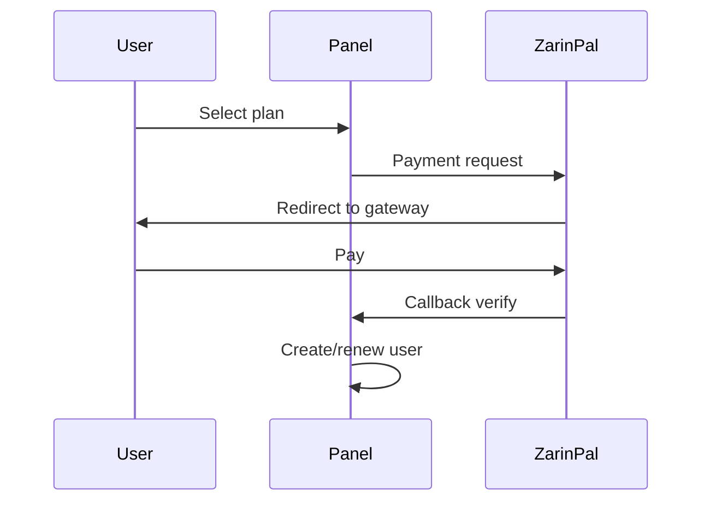

<div align="center" dir="rtl">


**VortexUI Wiki**

[Wiki](../README.md) · [FA](../fa/09-plans-payments.md) · [EN](../en/09-plans-payments.md) · [TR](../tr/09-plans-payments.md)

</div>

<div dir="rtl">

# ٩. الخطط والمدفوعات

[← الأمان](./08-security-administration.md) · [الفهرس](./README.md) · [التالي: الإشعارات →](./10-notifications.md)

> [!NOTE]
> بعد الدفع الناجح يُنشأ/يُجدّد المستخدم تلقائياً بمعاملات الخطة.

---

## نظام الخطط

**Plans → New Plan**

| الحقل | الوصف |
|-------|-------------|
| Name | اسم الخطة (مثل "Monthly 50GB") |
| Data limit | حد الحركة |
| Duration days | فترة الاشتراك |
| Device limit | عدد الأجهزة |
| Reset strategy | monthly / … |
| Price (Toman) | سعر بالريال |
| Price (USD) | سعر بالدولار/كريبتو |
| Max users | حد المبيعات (0 = غير محدود) |
| Enabled | نشط/غير نشط |

---

## الطلبات

**Orders** — قائمة الطلبات:

| الحالة | المعنى |
|--------|---------|
| `pending` | في انتظار الدفع |
| `paid` | مدفوع — المستخدم أُنشئ/جدّد |
| `failed` | فشل |
| `expired` | انتهت المهلة |

---

## بوابة ZarinPal (Rial)

### التكوين

اضبط متغيرات env المتعلقة بـ ZarinPal في `deploy/.env` (Merchant ID و callback URL).

### تدفق الدفع



---

## بوابة NowPayments (Crypto)

### IPN Webhook

```
POST /api/payment/ipn/nowpayments
```

- توقيع HMAC-SHA512 مع `NowPaymentsIPNSecret`
- بعد التحقق → تفعيل تلقائي

---

## المبيعات الآلية

1. أنشئ خطة نشطة
2. رابط مبيعات عام (في UI/API)
3. بعد الدفع الناجح → مستخدم بمعاملات الخطة

---

## الموزّع + الخطط

يمكن للموزّع بيع خطط ضمن حصته — المستخدمون مسجلون تحت `admin_id` الخاص به.

</div>
