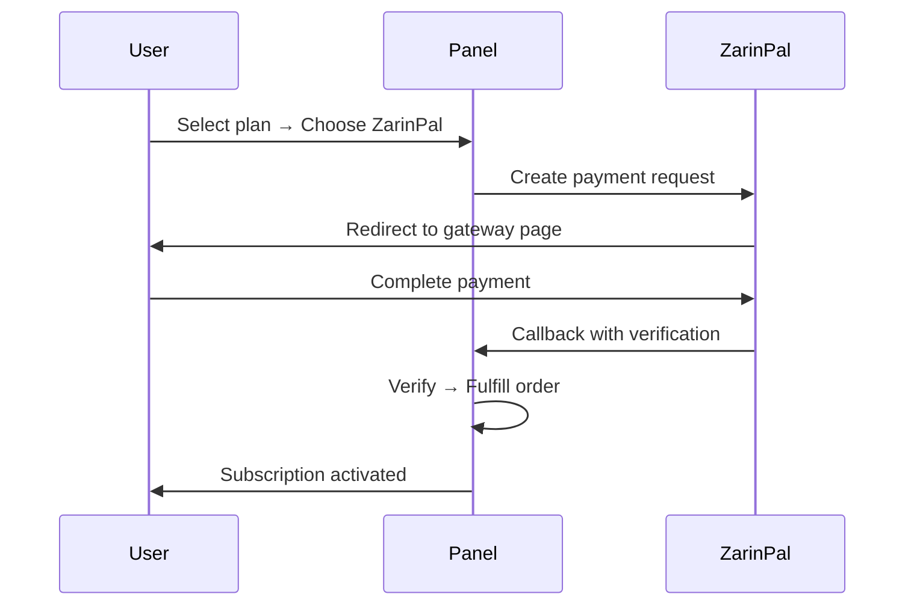
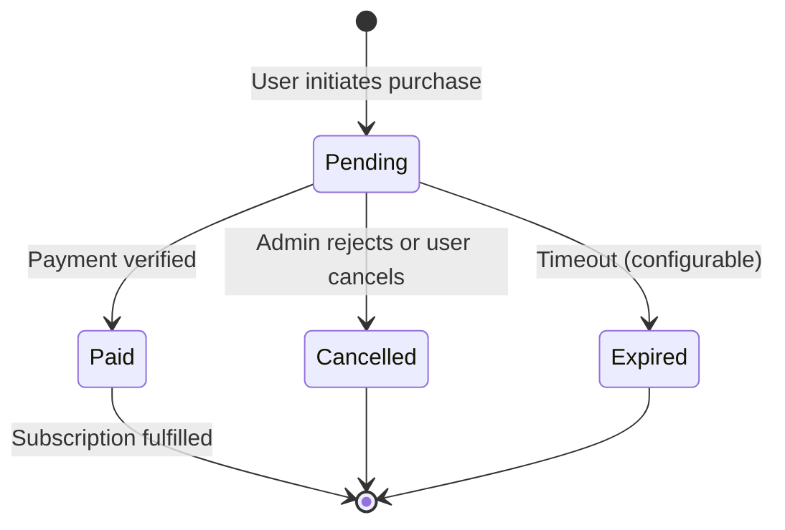

# الخطط والمدفوعات

!!! abstract "تجارة لكل موزّع"
    كل مسؤول/موزّع ينشئ خططه الخاصة، يُعدّ طرق الدفع الخاصة به،
    ويدير طلباته. المستخدمون يشترون عبر متجر خدمة ذاتية خاص بموزّعهم.

---

## نظام الخطط

الخطط **مملوكة للمسؤول الذي أنشأها**. كل موزّع يدير كتالوجه بشكل مستقل.

### إنشاء خطة

**الخطط → خطة جديدة**

| الحقل | الوصف |
|-------|-------|
| الاسم | اسم العرض (مثل "شهري 50GB") |
| حدّ البيانات | سقف الحركة بالبايت |
| المدة (أيام) | فترة الاشتراك |
| حدّ الأجهزة | أقصى أجهزة متزامنة |
| استراتيجية إعادة التعيين | `none` / `daily` / `weekly` / `monthly` |
| السعر (تومان) | سعر IRR لمدفوعات ZarinPal/البطاقة |
| السعر (دولار) | سعر بالدولار لمدفوعات العملات الرقمية |
| أقصى مستخدمين | سقف المبيعات (`0` = غير محدود) |
| مفعّلة | مفتاح تنشيط/تعطيل |

### رؤية الخطط

| نوع المسؤول | يرى |
|------------|------|
| مسؤول Sudo | جميع الخطط من جميع المسؤولين |
| موزّع | خططه فقط |
| المستخدم (في المتجر) | خطط موزّعه المفعّلة فقط |

### ملكية الخطط

- **مسؤول Sudo** ينشئ خططاً عامة (مرئية لجميع المستخدمين بدون موزّع)
- **الموزّع** ينشئ خططاً لمستخدميه فقط
- المستخدم الذي يزور المتجر يرى خطط المسؤول الذي يدير حسابه

---

## إعداد الدفع

كل مسؤول/موزّع يُعدّ طرق الدفع الخاصة به بشكل مستقل.

**الإعدادات → إعداد الدفع** (أو **حساب الموزّع → الدفع**)

### الطرق المتاحة

| الطريقة | النوع | الإعداد |
|---------|-------|---------|
| **ZarinPal** | بوابة أونلاين | معرّف التاجر |
| **تحويل بطاقة** | إثبات يدوي | رقم البطاقة + اسم الحامل |
| **عملات رقمية** | إثبات يدوي | عناوين المحافظ (BTC، USDT، ETH، إلخ) |

### إعداد الدفع لكل موزّع

كل موزّع يُعدّ تفاصيل الدفع الخاصة به:

```
الموزّع أ → ZarinPal merchant: xxxx + بطاقة: 6219-xxxx-xxxx-1234
الموزّع ب → عملات رقمية فقط: عنوان USDT TRC20
الموزّع ج → تحويل بطاقة: 6037-xxxx-xxxx-5678
```

المستخدمون في متجر كل موزّع يرون فقط خيارات الدفع المُعدّة لذلك الموزّع.

---

## طرق الدفع

### ZarinPal (بوابة أونلاين)

تدفق آلي — لا حاجة لتدخل المسؤول:



الإعداد: عيّن `VORTEX_ZARINPAL_MERCHANT` (أو معرّف التاجر لكل موزّع في إعداد الدفع).

### تحويل بطاقة (رفع إيصال)

تدفق تحقق يدوي:

1. المستخدم يختار الخطة → يختار "تحويل بطاقة"
2. لوحة التحكم تعرض رقم بطاقة الموزّع واسم الحامل
3. المستخدم يحوّل المبلغ عبر تطبيق البنك
4. المستخدم يرفع **صورة الإيصال** + **رقم مرجعي** اختياري
5. حالة الطلب: `pending`
6. المسؤول/الموزّع يراجع صورة الإيصال → **موافقة** أو **رفض**
7. عند الموافقة → تفعيل الاشتراك

!!! info
    صور الإيصالات تُخزَّن بأمان ولا يمكن الوصول إليها إلا من المسؤول المُدير.

### العملات الرقمية (هاش المعاملة + لقطة شاشة)

تدفق تحقق يدوي:

1. المستخدم يختار الخطة → يختار "عملات رقمية"
2. لوحة التحكم تعرض عناوين محفظة الموزّع
3. المستخدم يرسل العملة ويقدّم:
    - **هاش المعاملة** (مطلوب)
    - **لقطة شاشة** للمعاملة (اختياري)
4. حالة الطلب: `pending`
5. المسؤول/الموزّع يتحقق من هاش المعاملة على السلسلة → **موافقة** أو **رفض**
6. عند الموافقة → تفعيل الاشتراك

---

## متجر الخدمة الذاتية

**الرابط:** `/sub/{token}/shop`

المتجر جزء من بوابة المستخدم، يُصل إليه عبر توكن الاشتراك.

### تجربة المستخدم

1. المستخدم يسجّل الدخول في البوابة بتوكن الاشتراك
2. ينتقل إلى تبويب **الخطط**
3. يرى الخطط المنشأة من مسؤوله/موزّعه
4. يختار خطة → يختار طريقة الدفع
5. يُكمل الدفع (أو يرفع الإيصال)
6. ينتظر التنفيذ

### تدفق الشراء في بوابة React (PortalPlans)

تعرض البوابة:

- بطاقات الخطط بالاسم، حدّ البيانات، المدة، السعر
- محدد طريقة الدفع (فقط الطرق التي عدّها الموزّع)
- نموذج رفع (لإيصال تحويل البطاقة / العملات الرقمية)
- متتبع حالة الطلب

---

## دورة حياة الطلب



| الحالة | المعنى |
|--------|--------|
| `pending` | في انتظار الدفع أو مراجعة الإيصال |
| `paid` | تم تأكيد الدفع — الاشتراك مُفعّل |
| `cancelled` | مرفوض من المسؤول أو ملغى من المستخدم |
| `expired` | تجاوز مهلة الدفع |

---

## مراجعة الطلبات المعلّقة

**الطلبات → المعلّقة** (عرض المسؤول/الموزّع)

لطلبات تحويل البطاقة والعملات الرقمية:

1. عرض تفاصيل الطلب: المستخدم، الخطة، المبلغ، الطابع الزمني
2. عرض **صورة الإيصال** المرفوعة (إيصال/لقطة شاشة)
3. عرض **الرقم المرجعي** أو **هاش المعاملة**
4. الإجراءات:
    - **موافقة** → تنفيذ الطلب، تفعيل الاشتراك
    - **رفض** → إلغاء الطلب، إبلاغ المستخدم بالسبب

!!! tip
    فعّل إشعارات تيليجرام للطلبات المعلّقة الجديدة حتى لا تفوّت رفع الإيصالات.

---

## فوترة محفظة الموزّع

للموزّعين الذين لا يبيعون مباشرة للمستخدمين بل يدفعون للمسؤول مقابل السعة.

### كيف تعمل

| نوع الرصيد | يُخصم عندما |
|------------|-------------|
| رصيد الحركة (GB) | المستخدمون يستهلكون البيانات (وضع الاستهلاك) أو الموزّع يعيّن حدوداً (وضع التخصيص) |
| رصيد المستخدمين (عدد) | الموزّع ينشئ مستخدمين جدد |

### عمليات المحفظة

| الإجراء | من | الوصف |
|---------|-----|-------|
| عرض الرصيد | الموزّع | رؤية رصيد الحركة + المستخدمين المتبقي |
| عرض دفتر الحسابات | الموزّع | سجل كامل لجميع التغييرات |
| طلب شحن | الموزّع | تقديم طلب شحن لمسؤول sudo |
| موافقة على الشحن | Sudo | مراجعة وموافقة على الإيداع |
| تعديل سريع | Sudo | أزرار +50 حساب / +10 GB / +50 GB |

### طابور موافقة الإيداعات

**المسؤولون → إيداعات المحفظة** (عرض sudo)

1. الموزّع يقدّم طلب شحن (المبلغ + إيصال الدفع)
2. يظهر الطلب في طابور الموافقة
3. مسؤول Sudo يراجع → **موافقة** (يُضاف الرصيد) أو **رفض**

---

## منطق التنفيذ

عندما يُعلَّم طلب كـ `paid`:

1. **إذا كان المستخدم موجوداً** — تمديد الاشتراك:
    - الحركة: المتبقي الحالي + حدّ بيانات الخطة (تراكمي)
    - المدة: انتهاء الصلاحية الحالي + أيام مدة الخطة (تراكمي)
    - حدّ الأجهزة: يُحدَّث لقيمة الخطة
    - لا إعادة تعيين للحركة — البيانات المتبقية الحالية تُحفظ

2. **إذا كان المستخدم جديداً** — إنشاء حساب بمعاملات الخطة

!!! info "التراكم الجمعي"
    عمليات الشراء المتعددة تتراكم بشكل جمعي. شراء خطة 50GB مرتين يعطي 100GB إجمالي.
    المدة تتراكم أيضاً — شراء خطتين بـ 30 يوماً يمدد 60 يوماً من الانتهاء الحالي.

---

## ملخص أوضاع الحصة

| الوضع | الحصة تنقص عندما | الأفضل لـ |
|-------|-------------------|----------|
| **مخصص (Allocated)** | الموزّع يعيّن حدود بيانات للمستخدمين | حزم ثابتة مباعة مسبقاً |
| **مستهلك (Consumed)** | المستخدمون يستهلكون الحركة فعلياً | فوترة الدفع حسب الاستخدام |

يُعدّ لكل موزّع في **المسؤولون → تعديل المسؤول → وضع حصة الحركة**.
