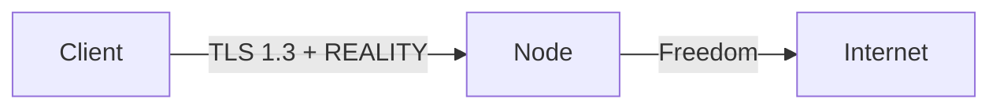

# البروتوكولات والإعدادات

!!! info "مصفوفة القدرات"
    تكشف لوحة التحكم مصفوفة قدرات حيّة لكل بروتوكول (`GET /api/capabilities`)
    كمصدر وحيد للحقيقة. محرر الاتصال الوارد يعرض فقط التركيبات التي تدعمها نواة العقدة المحددة فعلياً.

---

## نظرة عامة على البروتوكولات

| البروتوكول | النواة | وارد | صادر | النقل | الأمان |
|-----------|--------|:----:|:----:|-------|--------|
| VLESS | كلاهما | ✅ | ✅ | TCP, WS, gRPC, HTTPUpgrade, xHTTP, mKCP | None, TLS, REALITY |
| VMess | كلاهما | ✅ | ✅ | TCP, WS, gRPC, HTTPUpgrade, mKCP | None, TLS |
| Trojan | كلاهما | ✅ | ✅ | TCP, WS, gRPC, mKCP | TLS, REALITY |
| Shadowsocks | كلاهما | ✅ | ✅ | TCP (+ SS-2022 متعدد المستخدمين) | None |
| Hysteria2 | sing-box | ✅ | ✅ | UDP (QUIC) | TLS |
| TUIC | sing-box | ✅ | ✅ | UDP (QUIC) | TLS |
| WireGuard | sing-box | ✅ | ✅ | UDP | Native |
| Hysteria (v1) | sing-box | ✅ | — | UDP | TLS |
| ShadowTLS | sing-box | ✅ | ✅ | TCP | TLS |
| AnyTLS | sing-box | ✅ | — | TCP | TLS |
| Naive | sing-box | ✅ | — | — | TLS (إلزامي) |
| SOCKS | كلاهما | ✅ | ✅ | — (TCP خام) | نص صريح |
| HTTP | كلاهما | ✅ | ✅ | — (TCP خام) | نص صريح |
| Dokodemo | Xray | ✅ | — | — (TCP/UDP خام) | نص صريح |

---

## إعداد كل بروتوكول

### VLESS + REALITY (موصى به)

المعيار الذهبي لمقاومة الرقابة. REALITY يلغي الحاجة لشهادة TLS.

**إعداد الاتصال الوارد:**

| الحقل | مثال |
|-------|------|
| البروتوكول | `vless` |
| المنفذ | `443` |
| النقل | `tcp` |
| الأمان | `reality` |
| الوجهة (الهدف) | `www.google.com:443` |
| أسماء الخادم | `www.google.com` |
| المفتاح الخاص | يُنشأ تلقائياً |
| المعرّفات القصيرة | تُنشأ تلقائياً (حتى 8) |
| التدفق (Flow) | `xtls-rprx-vision` (لـ TCP) |

!!! tip
    استخدم **ماسح Reality** لإيجاد أفضل نطاقات SNI لموقع خادمك.

### VMess + WebSocket + TLS

إعداد كلاسيكي متوافق مع واجهة CDN (Cloudflare):

| الحقل | مثال |
|-------|------|
| البروتوكول | `vmess` |
| المنفذ | `443` |
| النقل | `ws` |
| المسار | `/vmws` |
| الأمان | `tls` |
| SNI | `cdn.example.com` |

يعمل خلف Cloudflare مع تفعيل WebSocket على النطاق.

### Trojan + gRPC + TLS

خيار عالي الأداء مع تعدد الإرسال:

| الحقل | مثال |
|-------|------|
| البروتوكول | `trojan` |
| المنفذ | `443` |
| النقل | `grpc` |
| اسم الخدمة | `trojangrpc` |
| الأمان | `tls` |
| SNI | `your-domain.com` |

### Shadowsocks 2022 (متعدد المستخدمين)

Shadowsocks حديث بمفاتيح لكل مستخدم:

| الحقل | مثال |
|-------|------|
| البروتوكول | `shadowsocks` |
| المنفذ | `8388` |
| الطريقة | `2022-blake3-aes-128-gcm` |
| مفتاح الخادم | يُنشأ تلقائياً |
| الأمان | `none` (SS يتولى تشفيره الخاص) |

كل مستخدم يحصل على مفتاح مشتق — لا كلمة مرور مشتركة.

### Hysteria2

بروتوكول مبني على QUIC مع تحكم مدمج بالازدحام. ممتاز للشبكات عالية الفقدان:

| الحقل | مثال |
|-------|------|
| البروتوكول | `hysteria2` |
| المنفذ | `4443` |
| الأمان | `tls` (إلزامي) |
| نطاق الرفع/التنزيل | يُبلغ عنه العميل للتحكم بالازدحام |
| نوع التمويه | `salamander` (اختياري) |
| كلمة مرور التمويه | سر مشترك |

!!! note
    Hysteria2 يتطلب نواة sing-box. غير متاح على عقد Xray.

### TUIC

ريلاي UDP مبني على QUIC بدون RTT:

| الحقل | مثال |
|-------|------|
| البروتوكول | `tuic` |
| المنفذ | `4444` |
| الأمان | `tls` (إلزامي) |
| الازدحام | `bbr` أو `cubic` |
| UUID | مصادقة لكل مستخدم |

### WireGuard

نفق WireGuard أصلي عبر sing-box:

| الحقل | مثال |
|-------|------|
| البروتوكول | `wireguard` |
| المنفذ | `51820` |
| المفتاح الخاص | مفتاح خاص للخادم |
| المفاتيح العامة للأقران | مفاتيح عامة لكل مستخدم |
| العناوين المسموحة | `0.0.0.0/0, ::/0` |
| MTU | `1280` |

### Naive (NaiveProxy)

بروكسي HTTP/2 أو HTTP/3 متنكر كحركة HTTPS عادية:

| الحقل | مثال |
|-------|------|
| البروتوكول | `naive` |
| المنفذ | `443` |
| الأمان | `tls` (إلزامي) |
| اسم المستخدم/كلمة المرور | بيانات لكل مستخدم |

!!! warning
    Naive يتطلب نواة sing-box و**يفرض TLS**. لا يمكن تشغيله بدون شهادة صالحة.

### ShadowTLS

تمويه TLS — يجعل الحركة تبدو كاتصال TLS عادي بموقع شهير:

| الحقل | مثال |
|-------|------|
| البروتوكول | `shadowtls` |
| المنفذ | `443` |
| الإصدار | `3` (موصى به) |
| خادم المصافحة | `www.microsoft.com:443` |
| كلمة المرور | سر مشترك |

---

## مصفوفة القدرات (Xray مقابل sing-box)

### Xray-core

| الفئة | المدعوم |
|-------|---------|
| البروتوكولات | vless, vmess, trojan, shadowsocks, socks, http, dokodemo |
| أنماط النقل | tcp, ws, grpc, httpupgrade, http/h2, xhttp, mkcp |
| الأمان | none, tls, reality |
| خاص | تدفق xtls-rprx-vision, محدد وضع xhttp, ترويسات mKCP |

### sing-box

| الفئة | المدعوم |
|-------|---------|
| البروتوكولات | vless, vmess, trojan, shadowsocks, hysteria2, tuic, wireguard, hysteria, shadowtls, anytls, naive, socks, http |
| أنماط النقل | tcp, ws, grpc, httpupgrade, http/h2, quic |
| الأمان | none, tls, reality (محدود) |
| خاص | بروتوكولات مبنية على QUIC, تعدد إرسال, ازدحام brutal |

### بروتوكولات بدون نقل تيار

| البروتوكول | النواة | النقل | الأمان |
|-----------|--------|-------|--------|
| SOCKS | كلاهما | TCP خام | نص صريح |
| HTTP | كلاهما | TCP خام | نص صريح |
| Naive | sing-box | — | TLS (إلزامي) |
| Dokodemo | Xray | TCP/UDP خام | نص صريح |
| WireGuard | sing-box | UDP | أصلي |
| Hysteria2 | sing-box | UDP (QUIC) | TLS |
| TUIC | sing-box | UDP (QUIC) | TLS |

!!! warning
    اتصالات SOCKS و HTTP الواردة هي **نص صريح** — لا تكشفها إلا على شبكات موثوقة أو خلف ريلاي محلي.

---

## تفاصيل النقل

### TCP

النقل الافتراضي. يدعم ترويسة تمويه HTTP اختيارية (Xray).

### WebSocket (WS)

ترقية HTTP إلى WebSocket. متوافق مع CDN (Cloudflare، إلخ).

| الإعداد | الوصف |
|---------|-------|
| المسار | مسار URL (مثل `/ws`) |
| المضيف | ترويسة HTTP Host |
| أقصى بيانات مبكرة | بايتات في أول إطار WS (0-RTT) |

### gRPC

مبني على HTTP/2. أداء عالي مع تعدد إرسال.

| الإعداد | الوصف |
|---------|-------|
| اسم الخدمة | مسار خدمة gRPC |
| الوضع المتعدد | تفعيل وضع التيارات المتعددة |

### HTTPUpgrade

ترقية HTTP/1.1 (مثل WS لكن أبسط). مدعوم من كلا النواتين.

| الإعداد | الوصف |
|---------|-------|
| المسار | مسار URL |
| المضيف | ترويسة HTTP Host |

### xHTTP (Xray فقط)

نقل HTTP متقدم بعدة أوضاع:

| الوضع | الوصف |
|-------|-------|
| `auto` | اكتشاف تلقائي لأفضل وضع |
| `packet-up` | تأطير حزم للرفع |
| `stream-up` | رفع متدفق |

### mKCP (Xray فقط)

نقل مبني على UDP مع FEC (تصحيح أخطاء أمامي). جيد للشبكات عالية الفقدان.

| الإعداد | الوصف |
|---------|-------|
| نوع الترويسة | `none`, `srtp`, `utp`, `wechat-video`, `dtls`, `wireguard` |
| البذرة | بذرة التمويه |
| MTU | وحدة الإرسال القصوى |

### QUIC (sing-box فقط)

نقل QUIC أصلي لبروتوكولات Hysteria/TUIC.

---

## طبقات الأمان

### None

لا تشفير على طبقة النقل. البروتوكول يتولى تشفيره الخاص (مثل VMess، Shadowsocks).

### TLS

TLS 1.2/1.3 قياسي. يتطلب شهادة صالحة (تُوفَّر تلقائياً عبر Caddy، أو تُعدّ يدوياً).

| الإعداد | الوصف |
|---------|-------|
| SNI | إشارة اسم الخادم |
| ALPN | بروتوكول طبقة التطبيق (`h2`, `http/1.1`) |
| الشهادة | تلقائي (ACME) أو يدوي (مسار ملف) |
| أدنى إصدار | `1.2` أو `1.3` |
| البصمة | تقليد uTLS |

### REALITY

تقليد TLS 1.3 بدون الحاجة لشهادة حقيقية. الخادم ينتحل هوية موقع شرعي.

| الإعداد | الوصف |
|---------|-------|
| الوجهة | الخادم المستهدف لانتحاله |
| أسماء الخادم | قيم SNI المسموحة |
| المفتاح الخاص | مفتاح خادم X25519 |
| المعرّفات القصيرة | معرّفات مصادقة العميل |
| Spider X | مسار للتهرب من الاستكشاف النشط |

---

## صيغ إخراج الاشتراك

| الصيغة | Content-Type | الوصف |
|--------|-------------|-------|
| `base64` | `text/plain` | روابط مشاركة base64 متوافقة مع V2Ray |
| `clash` | `text/yaml` | إعداد Clash Meta بصيغة YAML |
| `singbox` | `application/json` | JSON عميل sing-box |
| `xray` | `application/json` | JSON خام Xray/V2Ray |
| `outline` | `text/plain` | روابط `ss://` لـ Outline |
| `links` | `text/plain` | رابط مشاركة واحد لكل سطر |

الاكتشاف التلقائي من User-Agent:

| العميل | الصيغة المكتشفة |
|--------|----------------|
| Clash / ClashX / Clash Meta | `clash` |
| sing-box | `singbox` |
| Outline | `outline` |
| v2rayNG / V2RayN | `base64` |
| غير ذلك | `base64` |
