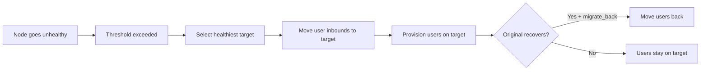

# 16. VortexUI v1.2.0 — دليل الميزات الجديدة

!!! info "Version 1.2.0"
    تستعرض هذه الصفحة جميع الميزات المُقدَّمة في VortexUI v1.2.0. يشرح كل قسم وظيفة الميزة وكيفية إعدادها وحالات الاستخدام الشائعة.

---

## المراقبة المباشرة

**الموقع:** لوحة التحكم → المراقبة المباشرة

عرض فوري لجميع الاتصالات النشطة عبر أسطول العُقد الخاص بك.

### ما تراه

| Metric | الوصف |
|--------|-------------|
| Users Online | عدد المستخدمين المتميّزين الذين لديهم اتصال نشط واحد على الأقل |
| Connections | إجمالي الأنفاق النشطة عبر جميع العُقد |
| Unique IPs | عناوين IP الفريدة للعملاء |
| Nodes Active | العُقد التي لديها اتصال نشط واحد على الأقل |

### جدول الاتصالات

يعرض كل صف:

- **User** — اسم المستخدم
- **Node** — الخادم المتصل به
- **IP** — عنوان IP المصدر للعميل
- **Protocol** — VLESS، VMess، Trojan، إلخ.
- **Duration** — مدة بقاء الاتصال نشطًا

!!! tip
    يقوم المراقب بالاستعلام كل 3 ثوانٍ. إذا ظهرت رسالة "No active connections"، فهذا يعني عدم وجود مستخدمين يوجّهون حركة مرور حاليًا — وهذا طبيعي في التثبيت الجديد.

---

## التحليلات

**الموقع:** لوحة التحكم → التحليلات

رؤى حركة المرور مُجمَّعة حسب الدولة والمستخدم والوقت من اليوم.

### النطاقات الزمنية

اختر **Last 24h** أو **Last 7 days** أو **Last 30 days** من القائمة المنسدلة.

### الأقسام

| Section | ما يعرضه |
|---------|-------|
| Summary cards | إجمالي الرفع، إجمالي التنزيل، عدد الدول |
| Traffic by Country | تفصيل جغرافي — الدولة، الاتصالات، بايتات الرفع/التنزيل |
| Top Users | مرتّبون حسب إجمالي حركة المرور المُستهلكة |
| Peak Hours | رسم بياني شريطي لحجم حركة المرور بالساعة |

### التصدير

انقر على **Export CSV** لتنزيل جدول بيانات للبيانات الجغرافية + المستخدمين للنطاق المحدد.

!!! note
    تأتي بيانات التحليلات من جدول `traffic_geo` الذي تملؤه وكلاء العُقد. إذا كان الجدول فارغًا، تأكد من أن عُقدك ترسل البيانات الجغرافية.

---

## سلاسل CDN/Relay

**الموقع:** الشبكة والعُقد → سلاسل CDN/Relay

أخفِ عنوان IP الحقيقي لخادمك عبر توجيه حركة مرور المستخدمين عبر خوادم وسيطة قبل وصولها إلى العُقدة.

### أنواع القفزات

| Type | الوصف | الأفضل لـ |
|------|-------------|----------|
| **CDN** | تمر حركة المرور عبر CDN مثل Cloudflare | إخفاء IP مجاني، يتطلب نقل WebSocket |
| **Relay** | تُوجَّه حركة المرور عبر خادم VPS وسيط | عندما يكون CDN محظورًا أو تحتاج TCP |
| **Worker** | يستخدم Cloudflare Workers كوسيط | بدون خادم، اقتصادي، لا يحتاج VPS مخصص |

### إنشاء سلسلة

1. انقر على **New Chain**
2. أدخل اسمًا واختر العُقدة الهدف
3. أضف القفزات بالترتيب (تدفق حركة المرور: المستخدم → القفزة 1 → القفزة 2 → … → العُقدة)
4. لكل قفزة، اضبط:
   - **Type** (CDN / Relay / Worker)
   - **Address** و **Port**
   - **Protocol** (WebSocket / gRPC / TCP)
   - **SNI** و **Path** (للنقل المعتمد على TLS)

!!! example "مثال: CDN Cloudflare كوسيط"
    ```
    Hop 1: CDN — cdn.example.com:443 — WebSocket — SNI: cdn.example.com — Path: /ws
    Target: Your actual node
    ```
    يتصل المستخدمون بـ Cloudflare التي تُحوّل إلى عُقدتك. يبقى عنوان IP الحقيقي مخفيًا.

---

## الترحيل التلقائي

**الموقع:** الشبكة والعُقد → الترحيل التلقائي

نقل المستخدمين تلقائيًا من العُقد غير السليمة إلى العُقد السليمة.

### إعدادات السياسة

| Setting | الوصف | الافتراضي |
|---------|-------------|---------|
| Enabled | تشغيل/إيقاف الترحيل التلقائي | Off |
| Health check interval | الثواني بين فحوصات الصحة | 30 |
| Unhealthy threshold | الإخفاقات المتتالية قبل التفعيل | 3 |
| CPU threshold | الترحيل إذا تجاوز المعالج هذه النسبة % | 90 |
| Memory threshold | الترحيل إذا تجاوزت الذاكرة هذه النسبة % | 90 |
| Packet loss max | الترحيل إذا تجاوز فقدان الحزم هذه النسبة % | 10 |
| Migrate back | إعادة المستخدمين عند تعافي العُقدة الأصلية | Yes |

### كيف يعمل



### أحداث الترحيل

يعرض جدول **Events** كل عملية ترحيل: الطابع الزمني، السبب، الحالة (مكتملة/فاشلة)، وأسماء العُقد المصدر/الهدف.

---

## ملفات تعريف التمويه (تجاوز DPI)

**الموقع:** الأمان → ملفات تعريف التمويه

تقنيات مُعدَّة مسبقًا لمكافحة DPI. عيّن ملف تعريف للمنافذ الواردة لتجاوز الرقابة بنقرة واحدة.

### التقنيات

| Technique | كيف يعمل | فعّال ضد |
|-----------|-------------|-------------------|
| **Fragment** | يقسم TLS ClientHello إلى حزم صغيرة | DPI إيران، TSPU روسيا |
| **Mux** | يدمج عدة اتصالات في تدفق واحد | تحليل حركة المرور |
| **Fingerprint** | يحاكي TLS متصفح حقيقي (Chrome/Firefox/Safari) | الحظر المبني على البصمة |

### إنشاء ملف تعريف

1. انقر على **New Profile**
2. أدخل اسمًا (مثال: "Iran — Fragment + Chrome")
3. اضبط:
   - **Fingerprint**: Chrome، Firefox، Safari، Random، Randomized
   - **Fragment**: تفعيل + تعيين نطاق الطول (مثال: `10-30`)
   - **Mux**: تفعيل + اختيار البروتوكول (smux، yamux، h2mux)
4. حفظ → تعيين للمنافذ الواردة عبر إعدادات Inbound

!!! tip "إعدادات مسبقة حسب الدولة"
    - **إيران**: Fragment `10-30` + بصمة Chrome
    - **الصين**: Mux h2mux + بصمة Randomized
    - **روسيا**: Fragment `1-3` + بصمة Firefox

---

## الحماية من الاستكشاف

**الموقع:** الأمان → الحماية من الاستكشاف

اكتشاف وحظر محاولات الاستكشاف النشط من أنظمة الرقابة (مثل GFW الصيني).

### ما هو الاستكشاف النشط؟

تكتشف أنظمة الرقابة البروكسيات بإرسال حزم "استكشاف". إذا استجاب خادمك كبروكسي، يتم حظره. هذه الميزة تلتقط تلك المحاولات.

### الإجراءات

| Action | السلوك |
|--------|----------|
| **Block** | إسقاط الاتصال وحظر عنوان IP للمدة المحددة |
| **Honeypot** | إرجاع موقع مزيف (مثل صفحة nginx الافتراضية) لخداع المستكشف |
| **Log only** | تسجيل الاستكشاف دون اتخاذ إجراء (وضع المراقبة) |

### الإعداد

1. فعّل الحماية
2. عيّن **Action** (يُوصى بـ Block)
3. عيّن **Block duration** (الافتراضي: 3600 ثانية = ساعة واحدة)
4. عيّن **Max probes/min** (حد التفعيل — الافتراضي: 5)
5. أضف عناوين IP الموثوقة إلى **Whitelist** (المراقبة، CI، إلخ.)
6. فعّل **Telegram notification** لتلقي التنبيهات

### عناوين IP المحظورة

عرض عناوين IP المحظورة حاليًا وإلغاء الحظر يدويًا عند الحاجة.

---

## التحقق من بصمة العميل

**الموقع:** الأمان → Fingerprint

حظر الاتصالات بناءً على بصمة TLS ClientHello.

### كيف يعمل

كل عميل TLS (متصفح، تطبيق، أداة فحص) ينتج بصمة فريدة في حزمة ClientHello الخاصة به. أدوات الفحص المعروفة (curl، Go HTTP، Python requests) لها بصمات مميزة تختلف عن المتصفحات الحقيقية.

### السياسة

| Setting | الوصف |
|---------|-------------|
| Enabled | تفعيل فحص البصمة |
| Default action | ما يجب فعله مع البصمات غير المعروفة: Allow / Block / Log |
| Log unknown | تسجيل الاتصالات من بصمات غير معروفة |

### القواعد

أنشئ قواعد للسماح/الحظر صراحةً لبصمات محددة:

| Field | الوصف |
|-------|-------------|
| Name | تسمية مقروءة (مثال: "Allow Chrome") |
| Fingerprint | اسم المتصفح/الأداة (chrome، firefox، safari، curl، go، python) |
| Action | Allow / Block / Log |
| JA3 Hash | اختياري — تجزئة JA3 دقيقة للمطابقة الدقيقة |

!!! example
    حظر جميع بصمات `curl` و `python` (أدوات فحص شائعة):
    
    - Rule 1: fingerprint=curl, action=block
    - Rule 2: fingerprint=python, action=block

---

## DNS-over-HTTPS (DoH)

**الموقع:** الأمان → DNS-over-HTTPS

خادم DoH مدمج يمنع تسرب DNS لمستخدميك.

### ما يقوم به

- يوفر نقطة نهاية DNS مشفرة (`/dns-query`)
- يحظر الإعلانات والبرامج الضارة على مستوى DNS
- يخزّن الاستجابات مؤقتًا لتسريع الحل
- يسجّل الاستعلامات لأغراض التصحيح (اختياري)

### الإعداد

| Setting | الوصف | الافتراضي |
|---------|-------------|---------|
| Enabled | تشغيل/إيقاف خادم DoH | Off |
| Listen address | عنوان IP:المنفذ للربط | `:8053` |
| Upstream DNS | خوادم الحل للتحويل إليها | `1.1.1.1`، `8.8.8.8` |
| Block ads | تصفية نطاقات الإعلانات | Off |
| Block malware | تصفية نطاقات البرامج الضارة | On |
| Custom blocklist | نطاقاتك المحظورة الخاصة | Empty |
| Log queries | تسجيل جميع استعلامات DNS | Off |
| Cache TTL | ثواني تخزين الاستجابات مؤقتًا | 300 |

### الإحصائيات

تعرض لوحة التحكم:
- إجمالي الاستعلامات المُعالجة
- عدد الاستعلامات المحظورة
- نسبة إصابة التخزين المؤقت
- متوسط زمن الحل

---

## توجيه SNI و SSL

**الموقع:** الأمان → SNI & SSL

إدارة نطاقات متعددة على خادمك مع توفير شهادات SSL تلقائيًا.

### النطاقات

سجّل النطاقات التي تشير إلى خادمك:

1. انقر على **Add Domain**
2. أدخل معرّف المنفذ الوارد واسم النطاق
3. فعّل **Auto-provision SSL** للحصول على شهادة Let's Encrypt تلقائية

### الشهادات

إدارة شهادات SSL يدويًا:

- **Issue Certificate** — طلب شهادة جديدة (Let's Encrypt / ZeroSSL)
- **Wildcard** — إصدار `*.domain.com`
- **Auto-renew** — التجديد التلقائي قبل انتهاء الصلاحية
- **Renew** — تشغيل التجديد يدويًا

---

## اتحاد اللوحات

**الموقع:** الشبكة والعُقد → Federation

ربط عدة لوحات VortexUI معًا للإدارة الموزَّعة.

### حالات الاستخدام

- عمليات نشر كبيرة مع لوحات في مناطق مختلفة
- إعدادات الموزّعين حيث يمتلك كل موزّع لوحته الخاصة
- التوافر العالي — إذا تعطلت لوحة واحدة، تستمر البقية

### الإعداد

| Setting | الوصف |
|---------|-------------|
| Enabled | تفعيل الاتحاد |
| Cluster name | معرّف هذا التجمع |
| Sync interval | كم مرة يتم المزامنة (بالثواني) |
| SSO | تفعيل تسجيل الدخول الموحد عبر اللوحات |

### إضافة نظير

1. انقر على **Add Peer**
2. أدخل رابط لوحة النظير (مثال: `https://panel2.example.com`)
3. أدخل مفتاح API (المُنشأ على لوحة النظير)
4. اختر ما تريد مزامنته: المستخدمون، العُقد، أو كلاهما

### أحداث المزامنة

عرض سجل عمليات المزامنة بين الأنظار.

---

## المجموعات العائلية

**الموقع:** المستخدمون والفوترة → المجموعات العائلية

السماح للمستخدمين بمشاركة حصة بيانات بين أفراد العائلة.

### كيف يعمل

1. ينشئ المسؤول **مجموعة عائلية** بحد بيانات مشترك
2. تُضاف الأعضاء (مستخدمون حاليون)
3. حركة مرور كل عضو تُسحب من الحصة المشتركة
4. يمكن تعيين حصص فردية للأعضاء (اختياري)

### الحقول

| Field | الوصف |
|-------|-------------|
| Name | اسم المجموعة |
| Owner | حساب المستخدم الرئيسي |
| Data limit | إجمالي حصة البيانات المشتركة |
| Max members | كم يمكن أن ينضم (الافتراضي: 5) |
| Member quota | الحد الأقصى لكل عضو ضمن الحصة المشتركة |

---

## نظام الإحالة

**الموقع:** المستخدمون والفوترة → الإحالات

مكافأة المستخدمين على جلب عملاء جدد.

### إعداد المسؤول

| Setting | الوصف | الافتراضي |
|---------|-------------|---------|
| Enabled | تشغيل/إيقاف الإحالات | Off |
| Reward type | `data` (حركة مرور إضافية) أو `days` (وقت إضافي) | data |
| Reward amount | مقدار المكافأة لكل إحالة | 1 GB |
| Max referrals | الحد لكل مستخدم (0 = غير محدود) | 0 |
| Require paid | المكافأة فقط للإحالات المدفوعة | Off |

### كيف يستخدمها المستخدمون

1. يحصل المستخدم على رمز إحالة فريد (عبر البوابة)
2. يشارك الرمز مع الأصدقاء
3. يسجّل الصديق باستخدام الرمز
4. كلاهما يحصل على مكافأة (قابلة للإعداد)

---

## الحصة الذكية

**الموقع:** المستخدمون والفوترة → الحصة الذكية

سياسات حركة مرور عادلة مع مستويات سرعة/سلوك متدرجة.

### مثال على المستويات

```json
[
  { "threshold_pct": 80, "action": "warn", "speed_limit": 0 },
  { "threshold_pct": 95, "action": "throttle", "speed_limit": 524288 },
  { "threshold_pct": 100, "action": "disable" }
]
```

عند 80% استخدام → تحذير. عند 95% → تقييد السرعة إلى 512KB/s. عند 100% → تعطيل.

---

## حد سرعة العُقدة وحظر جغرافي

**الموقع:** العُقد → تعديل العُقدة

### حد السرعة

تعيين حد أقصى لسرعة التنزيل لكل مستخدم (بايت/ثانية):

- `0` = غير محدود
- `1048576` = 1 MB/s
- `5242880` = 5 MB/s

### الحظر الجغرافي

تقييد الدول التي يمكنها الاتصال بهذه العُقدة:

- فارغ = جميع الدول مسموحة
- `IR,TR,AE` = إيران، تركيا، الإمارات فقط مسموحة
- يستخدم رموز ISO 3166-1 alpha-2 للدول

---

## الروابط المباشرة ورموز QR

**الموقع:** النظام → الروابط المباشرة

إنشاء روابط مباشرة للاشتراك ورموز QR لإعداد تطبيق العميل بسهولة.

### الإعداد

| Setting | الوصف |
|---------|-------------|
| Base URL | رابط اللوحة العام |
| App scheme | مخطط URL للتطبيقات الأصلية (مثال: `vortex://`) |
| Include name | إضافة اسم الخادم إلى الرابط |
| QR logo | شعار مخصص في مركز رمز QR |

---

## بوابة الخدمة الذاتية

**الموقع:** `/portal/login` (واجهة المستخدم النهائي)

واجهة منفصلة للمستخدمين النهائيين لإدارة اشتراكاتهم.

### ميزات البوابة

| Feature | الوصف |
|---------|-------------|
| Dashboard | إحصائيات الاستخدام، البيانات/الوقت المتبقي |
| Plans | تصفح وشراء خطط الاشتراك |
| Tickets | فتح تذاكر دعم، الرد على المسؤول |
| Referral | عرض/مشاركة رمز الإحالة |

### إدارة التذاكر للمسؤول

يمكن للمسؤولين عرض جميع التذاكر في **المستخدمون والفوترة → التذاكر**، والرد عليها وإغلاقها.

---

## إشعارات الحصة

**الموقع:** المستخدمون والفوترة → تنبيهات الحصة

تنبيه المستخدمين عند اقترابهم من حد البيانات.

### الإعداد

| Setting | الوصف |
|---------|-------------|
| Enabled | تفعيل الإشعارات |
| Threshold % | متى يتم التفعيل (مثال: 80%) |
| Telegram | الإرسال عبر بوت Telegram |
| Email | الإرسال عبر البريد الإلكتروني (إذا تم إعداده) |
| Message template | نص إشعار مخصص |

---

## موقع التمويه

**الموقع:** الأمان → موقع التمويه

عرض موقع مزيف عندما يزور شخص ما عنوان IP لخادمك مباشرةً (بدون اتصال بروكسي صالح).

### الأوضاع

| Mode | السلوك |
|------|----------|
| **Proxy** | بروكسي عكسي لموقع موجود (يعكسه) |
| **Static** | تقديم HTML مخصص |

هذا يجعل خادمك يبدو كموقع عادي لأنظمة الرقابة والزوار العاديين.

---

## ماسح Reality

**الموقع:** الأمان → Reality Scanner

إيجاد أفضل نطاقات SNI لبروتوكول REALITY عبر الفحص وتقييم المرشحين.

### كيفية الاستخدام

1. اختر عُقدة
2. انقر على **Scan** — يختبر النطاقات الشائعة لتوافق TLS 1.3 وزمن الاستجابة
3. تُظهر النتائج: SNI، زمن الاستجابة (مللي ثانية)، النقاط، الصلاحية
4. اختر النطاق الأعلى نقاطًا لمنفذ REALITY الوارد الخاص بك

!!! tip
    نطاقات REALITY الجيدة عادةً ما تتميز بـ: زمن استجابة منخفض (<200ms)، دعم TLS 1.3، واتصالات مستقرة.
