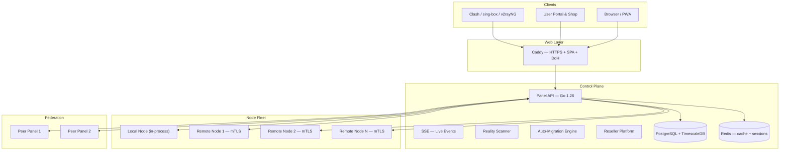

# توثيق VortexUI

<div style="text-align: center; margin: 2rem 0;">
  <strong style="font-size: 1.4rem;">VortexUI الإصدار 1.2.7</strong><br/>
  <em style="font-size: 1.1rem;">لوحة إدارة بروكسي من الجيل التالي — مستقلة عن النواة، محورها المستخدم، تعمل بالوقت الفعلي، مضادة للرقابة</em>
</div>

---

<div class="grid cards" markdown>

- :material-account-group: **بوابة الخدمة الذاتية والمتجر**

    يسجّل المستخدمون الدخول بتوكن الاشتراك، ويعرضون استهلاكهم، ويشترون الخطط من متجر الموزّع الخاص بهم، ويفتحون تذاكر الدعم.

- :material-cash-register: **خطط ومدفوعات لكل موزّع**

    يحدّد كل موزّع خططه الخاصة وأسعاره وطرق الدفع — تحويل بطاقة، عملات رقمية، أو بوابة ZarinPal.

- :material-shield-lock: **حزمة مكافحة الرقابة**

    حيل TLS، حماية من الاستكشاف النشط، التحقق من البصمة، مواقع خادعة، DoH، WARP+، ملفات التمويه.

- :material-server-network: **أسطول عقد ذكي**

    معالج تسجيل العقد، الترحيل التلقائي، تشخيصات السلامة، mTLS، المراقبة الحية، أتمتة DNS عبر Cloudflare.

- :material-chart-areaspline: **تحليلات متقدمة**

    تحليل جغرافي (Geo-IP)، أعلى المستخدمين، ساعات الذروة، خريطة حرارية عالمية، تصدير CSV، مقاييس آنية.

- :material-sitemap: **منصة الموزّعين**

    فوترة عبر المحفظة، موزّعون فرعيون، علامة تجارية خاصة (Whitelabel)، ويب هوكس، حدود سياسات، تعليق تلقائي، قوائم سماح مخصصة.

</div>

---

!!! tip "تثبيت سريع"
    ```bash
    bash <(curl -Ls https://raw.githubusercontent.com/iPmartNetwork/VortexUI/master/install.sh)
    ```
    أمر واحد. إعداد تفاعلي. HTTPS مضمّن.

---

## خريطة التوثيق

| القسم | ماذا ستتعلم |
|-------|-------------|
| [المقدمة](01-introduction.md) | البنية المعمارية، نظرة عامة على الميزات، المقارنة، البروتوكولات المدعومة |
| [التثبيت](02-installation.md) | تثبيت بأمر واحد، Docker، بناء محلي، إعداد عميل العقدة |
| [الخطوات الأولى](03-first-steps.md) | تسجيل الدخول، إضافة عقدة، إنشاء اتصال وارد، إضافة مستخدم، التحقق |
| [لوحة المعلومات](04-dashboard.md) | الأدوات المصغرة، التحليلات، المراقبة، لوحة الأوامر |
| [المستخدمون](05-user-management.md) | العمليات الأساسية، الحصص، الاشتراكات، البوابة، المتجر، المجموعات العائلية، الإحالات |
| [العقد](06-node-management.md) | تسجيل العقد، السلامة، الترحيل التلقائي، المراقبة، أتمتة DNS |
| [الشبكة](07-network-policy.md) | الاتصالات الصادرة، حزم التوجيه، سلاسل CDN، موازنات الحمل، الاتحاد |
| [الأمان](08-security-administration.md) | RBAC، منصة الموزّعين، حيل TLS، حماية الاستكشاف، حدّ IP |
| [الخطط والمدفوعات](09-plans-payments.md) | خطط لكل موزّع، إعداد الدفع، المتجر، فوترة المحفظة، الطلبات |
| [الإشعارات](10-notifications.md) | ويب هوكس، تيليجرام، تنبيهات الحصة، أحداث SSE |
| [الإعدادات](11-settings-backup.md) | العلامة التجارية، Whitelabel، النسخ الاحتياطي، الروابط العميقة، التحديثات |
| [مرجع الـ API](12-api-reference.md) | المصادقة، نقاط النهاية، مواصفات OpenAPI |
| [البروتوكولات](13-protocols-config.md) | 14 بروتوكولاً، أنماط النقل، طبقات الأمان، مصفوفة القدرات |
| [العمليات](14-operations-maintenance.md) | HTTPS، Prometheus، التوسّع، قاعدة البيانات، الأداء |
| [استكشاف الأخطاء](15-troubleshooting-faq.md) | مشاكل شائعة، نصائح التصحيح، الأسئلة المتكررة |

---

## البنية المعمارية



---

## المكدّس التقني

| الطبقة | التقنية |
|--------|---------|
| الخلفية (Backend) | Go 1.26, Echo, gRPC, sqlc, pgx |
| الواجهة (Frontend) | React 18, TypeScript 5.6, Tailwind CSS, TanStack Query |
| قاعدة البيانات | PostgreSQL 16 + TimescaleDB |
| التخزين المؤقت | Redis 7 |
| نوى البروكسي | Xray-core, sing-box |
| خادم الويب | Caddy (HTTPS تلقائي) |
| النقل | gRPC + mTLS (لوحة التحكم ↔ العقد) |
| الإشعارات | Webhook (HMAC-SHA256), Telegram Bot API |
| المراقبة | Prometheus metrics + Grafana |

---

## روابط سريعة

| المورد | الرابط |
|--------|--------|
| مستودع GitHub | [github.com/iPmartNetwork/VortexUI](https://github.com/iPmartNetwork/VortexUI) |
| قناة تيليجرام | [@vortex_ui](https://t.me/vortex_ui) |
| مواصفات OpenAPI | [openapi.yaml](https://github.com/iPmartNetwork/VortexUI/blob/master/docs/openapi.yaml) |
| سجل التغييرات | [CHANGELOG.md](https://github.com/iPmartNetwork/VortexUI/blob/master/CHANGELOG.md) |
| الإبلاغ عن خلل | [GitHub Issues](https://github.com/iPmartNetwork/VortexUI/issues) |
| النقاشات | [GitHub Discussions](https://github.com/iPmartNetwork/VortexUI/discussions) |

---

!!! info "اللغات"
    هذا التوثيق متوفر بـ **English**، **فارسی**، **العربية**، و **Türkçe**.
    استخدم محدّد اللغة في الرأس للتبديل.
