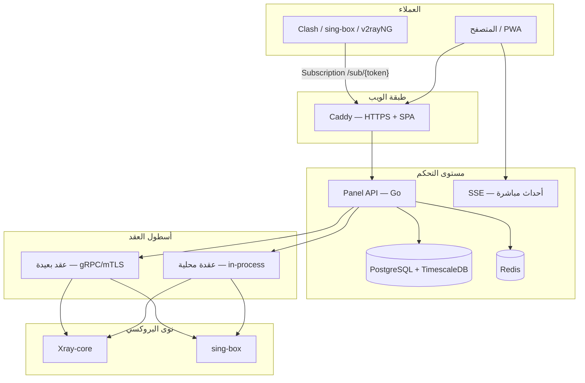

<div align="center" dir="rtl" class="wiki-hero">


# 📚 ويكي VortexUI

**دليل شامل لتثبيت وتكوين وتشغيل لوحة إدارة البروكسي من الجيل القادم**

[](https://github.com/iPmartNetwork/VortexUI/releases)
[](../../../LICENSE)

[← ويكي متعدد اللغات](../README.md) · [English](../en/README.md) · [فارسی](../fa/README.md) · [Türkçe](../tr/README.md) · [English README](../../../README.md) · [README فارسی](../../../README.fa.md)

</div>

---

<div dir="rtl">

## حول هذا الويكي

هذا الويكي هو المرجع الكامل لـ **VortexUI** — لوحة إدارة بروكسي مفتوحة المصدر مع خادم خلفي Go، وواجهة React/TypeScript، ودعم **Xray-core** و **sing-box**. مكتوب لمديري الخوادم، وبائعي خدمات VPN، والمطورين الذين يتكاملون عبر API.

### نظرة عامة على المعمارية



---

## 📖 جدول المحتويات

### البدء

| # | الموضوع | الوصف |
|:-:|-------|-------|
| 1 | [المقدمة والمفاهيم الأساسية](./01-introduction.md) | ما هو VortexUI، المعمارية، المقارنة مع اللوحات الأخرى |
| 2 | [التثبيت](./02-installation.md) | تثبيت بسطر واحد، Docker، Native، المتطلبات |
| 3 | [الخطوات الأولى](./03-first-steps.md) | تسجيل الدخول، إنشاء المسؤول، أول inbound ومستخدم |

### دليل اللوحة

| # | الموضوع | الوصف |
|:-:|-------|-------|
| 4 | [لوحة المعلومات](./04-dashboard.md) | إحصائيات مباشرة، رسوم بيانية، SSE |
| 5 | [إدارة المستخدمين](./05-user-management.md) | إنشاء المستخدمين، الحصص، الاشتراكات، الاستيراد |
| 6 | [إدارة العقد](./06-node-management.md) | عقد محلية/بعيدة، inbound، Geo، failover |
| 7 | [سياسة الشبكة](./07-network-policy.md) | Outbounds، التوجيه، الموازنات |
| 8 | [الأمان والإدارة](./08-security-administration.md) | RBAC، 2FA، رموز API، التدقيق |
| 9 | [الخطط والمدفوعات](./09-plans-payments.md) | بيع الاشتراكات، ZarinPal، NowPayments |
| 10 | [الإشعارات](./10-notifications.md) | Webhooks، Telegram، الأحداث |
| 11 | [الإعدادات والنسخ الاحتياطي](./11-settings-backup.md) | النسخ الاحتياطي، العلامة التجارية، IP Guard |

### مرجع تقني

| # | الموضوع | الوصف |
|:-:|-------|-------|
| 12 | [مرجع API](./12-api-reference.md) | المصادقة، نقاط النهاية، OpenAPI |
| 13 | [البروتوكولات والتكوين](./13-protocols-config.md) | VLESS، REALITY، Hysteria2، أمثلة |
| 14 | [العمليات والصيانة](./14-operations-maintenance.md) | `vortexui`، SSL، التحديثات، المقاييس |
| 15 | [استكشاف الأخطاء والأسئلة الشائعة](./15-troubleshooting-faq.md) | المشاكل الشائعة والإجابات |

---

## ⚡ وصول سريع

### تثبيت بسطر واحد (موصى به)

```bash
bash <(curl -Ls https://raw.githubusercontent.com/iPmartNetwork/VortexUI/master/install.sh)
```

### وحدة التحكم

```bash
vortexui          # قائمة تفاعلية
vortexui status   # حالة الخدمة
vortexui logs     # عرض السجلات
vortexui update   # تحديث اللوحة
```

### روابط مفيدة

| المورد | المسار |
|--------|------|
| OpenAPI 3.0 | [`docs/openapi.yaml`](../../openapi.yaml) |
| أمثلة البروتوكولات (EN) | [`docs/protocols.md`](../../protocols.md) |
| متغيرات البيئة | [`.env.example`](../../../.env.example) |
| Docker Compose | [`deploy/compose.yml`](../../../deploy/compose.yml) |
| Changelog | [`CHANGELOG.md`](../../../CHANGELOG.md) |

---

## 🌐 لغات واجهة اللوحة

تدعم اللوحة **8 لغات**: English، فارسی، Türkçe، العربية، Русский، 中文، 日本語، Español — مع دعم كامل **RTL** للفارسية والعربية.

تغيير اللغة: **Settings → Language** أو من القائمة الجانبية.

---

## 📄 الترخيص

VortexUI مرخص تحت **GPL-3.0**. راجع [LICENSE](../../../LICENSE).

</div>
