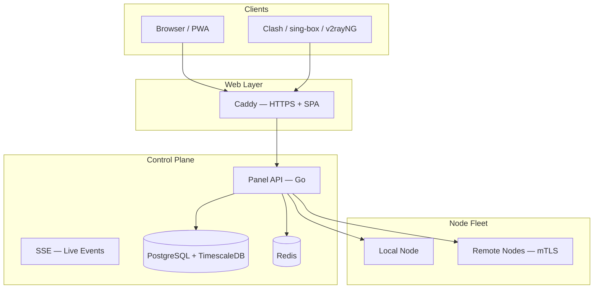

# وثائق VortexUI

مرحباً بكم في دليل VortexUI الرسمي.

ثبّت وأدر لوحة البروكسي (Xray + sing-box). استخدم **مبدّل اللغة** في الشريط العلوي للتنقل بين اللغات الأربع.

!!! tip "تثبيت سريع"
    ```bash
    bash <(curl -Ls https://raw.githubusercontent.com/iPmartNetwork/VortexUI/master/install.sh)
    ```

## خريطة الوثائق

| القسم | الفصول |
|---------|----------|
| البدء | [المقدمة](01-introduction.md) · [التثبيت](02-installation.md) · [الخطوات الأولى](03-first-steps.md) |
| دليل اللوحة | [لوحة المعلومات](04-dashboard.md) · [المستخدمون](05-user-management.md) · [العقد](06-node-management.md) · [الشبكة](07-network-policy.md) |
| الإدارة | [الأمان](08-security-administration.md) · [الخطط](09-plans-payments.md) · [الإشعارات](10-notifications.md) · [الإعدادات](11-settings-backup.md) |
| مرجع تقني | [API](12-api-reference.md) · [البروتوكولات](13-protocols-config.md) · [العمليات](14-operations-maintenance.md) · [FAQ](15-troubleshooting-faq.md) |
| جديد الإصدار | [ميزات v1.2.0](16-v120-features.md) · [ميزات v1.2.3](17-v123-features.md) |

## البنية



## روابط مفيدة

| المورد | الرابط |
|----------|------|
| OpenAPI | [openapi.yaml on GitHub](https://github.com/iPmartNetwork/VortexUI/blob/master/docs/openapi.yaml) |
| Protocol examples | [protocols.md](https://github.com/iPmartNetwork/VortexUI/blob/master/docs/protocols.md) |
| Repository | [github.com/iPmartNetwork/VortexUI](https://github.com/iPmartNetwork/VortexUI) |
| Telegram | [@vortex_ui](https://t.me/vortex_ui) |
