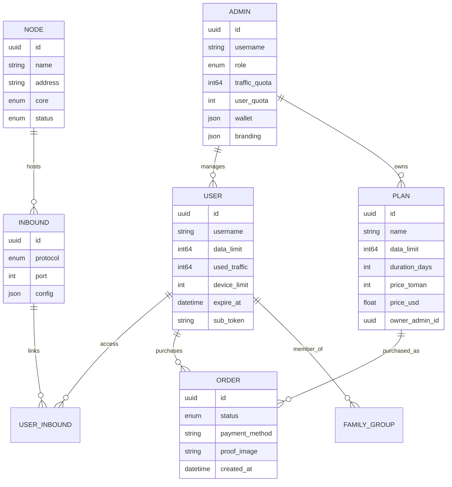

# Introduction

!!! abstract "TL;DR"
    VortexUI is a **user-centric**, **core-agnostic** proxy management panel supporting
    Xray-core and sing-box. It manages users, nodes, traffic, subscriptions, payments,
    resellers, and anti-censorship tools from a single modern interface.

---

## What is VortexUI?

**VortexUI** is a next-generation proxy management panel built for operators who need:

- **Scale** — manage thousands of users across dozens of nodes
- **Resilience** — automatic failover, health monitoring, self-healing node fleet
- **Anti-censorship** — ISP-specific TLS tricks, probing protection, decoy sites, WARP+
- **Self-service** — end-users manage their own accounts, purchase plans, open tickets
- **Revenue** — per-reseller plans, multiple payment gateways, wallet billing, referral program
- **Delegation** — full reseller platform with sub-resellers, whitelabel, policy limits

Unlike inbound-centric panels (3x-ui), VortexUI uses a **user-centric model**: one user
identity provides access to all assigned protocols across all nodes simultaneously.

---

## Feature Overview

### Engine & Infrastructure

| Capability | Details |
|-----------|---------|
| Dual-core support | Xray-core and sing-box — choose per node |
| Push delta traffic | Restart-safe, no double-counting, never loses data |
| mTLS node fleet | Encrypted connections, auto-failover, migrate-back |
| Node enrollment wizard | Four-step UI for onboarding remote nodes |
| Auto-migration | Move users from unhealthy nodes automatically |
| Federation | Sync users/nodes across multiple panels |
| Local node | In-process core — no separate agent needed |
| CDN/Relay chains | Multi-hop paths with CDN, relay, and worker hops |
| Load balancers | 4 strategies with health probing |
| Cloudflare DNS automation | Auto-manage DNS records for nodes |

### Security & Anti-Censorship

| Capability | Details |
|-----------|---------|
| Reality Scanner | Discover optimal SNIs with latency scoring |
| TLS Tricks Manager | ISP-specific profiles (fragment, mux, padding) |
| Probing protection | Detect and block active GFW probes |
| Fingerprint validation | JA3-based client filtering |
| Decoy website | Serve fake site to probers (proxy or static mode) |
| DNS-over-HTTPS | Built-in DoH with ad/malware blocking |
| Evasion profiles | Reusable anti-DPI presets per country |
| WARP+ integration | Cloudflare outbound for clean IP |
| Clean-IP scanner | Find best CDN edge IPs by latency/loss scoring |
| IP-limit enforcement | Per-user concurrent IP caps with configurable actions |
| Geo-blocking | Per-inbound country restrictions |
| Account-sharing guard | Detect and act on credential sharing |

### User Management & Commerce

| Capability | Details |
|-----------|---------|
| Self-service portal | Login with sub token, view usage, tickets |
| Self-service shop | Per-reseller plans with card/crypto/ZarinPal payment |
| Smart Quota | Progressive speed reduction (fair use tiers) |
| Family groups | Shared data pools for multiple users |
| Referral system | Invite codes with data/days rewards |
| Per-reseller plans | Each reseller creates their own plans and pricing |
| Payment gateways | ZarinPal (online), card-to-card (proof upload), crypto (TX hash) |
| Wallet billing | Reseller credit system with top-up queue |
| Subscription hosts | Per-inbound CDN/address overrides with template variables |
| Deep links + QR | One-tap subscription import |
| Config templates | Custom Clash/sing-box routing per user |
| Import tools | Migrate from 3x-ui or Marzban |

### Administration & Reseller Platform

| Capability | Details |
|-----------|---------|
| RBAC + roles | Granular permissions per admin |
| Full reseller platform | Wallet, sub-resellers, whitelabel, webhooks, policy limits |
| Scoped allowlists | Per-reseller plan/node/inbound restrictions |
| Auto-suspend | Automatic reseller suspension on violations |
| Audit log | Every admin action tracked with diff |
| Quota notifications | Configurable thresholds for reseller alerts |
| Auto-backup | Scheduled exports to Telegram or S3 |
| Grafana metrics | Prometheus endpoint + ready dashboard |

### Frontend & UX

| Capability | Details |
|-----------|---------|
| Command palette | Ctrl+K fuzzy search across everything |
| Dashboard widgets | Drag & drop, resize, customize layout |
| World map | Geographic traffic visualization |
| Real-time gauges | Animated CPU/RAM/bandwidth indicators |
| Monitor page | Live connection table (user, node, IP, protocol, duration) |
| Analytics | Geo breakdown, top users, peak hours, CSV export |
| Onboarding tour | First-time admin walkthrough |
| 8 languages | EN/FA/TR/AR/RU/ZH/JA/ES with full RTL support |
| Dark + Light | Smooth animated theme transition |
| Mobile portal | Bottom nav, pull-to-refresh, bottom sheets |

---

## Architecture

```
┌──────────────────────────────────────────────────────────────┐
│  Caddy (Web Layer)     — HTTPS, SPA, reverse proxy, DoH     │
├──────────────────────────────────────────────────────────────┤
│  Panel (Go 1.26)       — REST API, SSE, gRPC hub, scheduler │
│  ├─ Auth               — JWT + TOTP + portal tokens          │
│  ├─ Services           — user, node, plan, order, analytics  │
│  ├─ Hub                — node fleet management + failover    │
│  ├─ Scanner            — Reality SNI prober + Clean-IP       │
│  ├─ Migration          — health-based user redistribution    │
│  ├─ Reseller           — wallet, plans, branding, webhooks   │
│  └─ Federation         — cross-panel sync                    │
├──────────────────────────────────────────────────────────────┤
│  PostgreSQL + TimescaleDB — data + time-series traffic       │
│  Redis                    — cache, sessions, device tracker  │
├──────────────────────────────────────────────────────────────┤
│  Node Agent (gRPC)     — remote core execution + health      │
│  Local Node            — in-process on panel host            │
└──────────────────────────────────────────────────────────────┘
```



---

## Comparison with Other Panels

| Feature | VortexUI 1.2.8 | 3x-ui | Marzban | Hiddify |
|---------|:--:|:--:|:--:|:--:|
| Dual core (Xray + sing-box) | ✅ | ❌ | ❌ | ✅ |
| User-centric model | ✅ | ❌ | ✅ | ✅ |
| Push delta traffic | ✅ | polling | polling | polling |
| Node auto-migration | ✅ | ❌ | ❌ | ❌ |
| Load balancer (4 strategies) | ✅ | ❌ | ❌ | ❌ |
| Reality Scanner | ✅ | ❌ | ❌ | ❌ |
| TLS Tricks (ISP profiles) | ✅ | ❌ | ❌ | partial |
| Probing protection | ✅ | ❌ | ❌ | ❌ |
| Client fingerprint (JA3) | ✅ | ❌ | ❌ | ❌ |
| Decoy website | ✅ | ❌ | ❌ | ❌ |
| DNS-over-HTTPS | ✅ | ❌ | ❌ | ❌ |
| Self-service portal | ✅ | ❌ | ❌ | ✅ |
| Per-reseller shop | ✅ | ❌ | ❌ | ❌ |
| Payment gateways (multi-method) | ✅ | ❌ | ❌ | partial |
| Per-reseller plans & pricing | ✅ | ❌ | ❌ | ❌ |
| Subscription hosts (overrides) | ✅ | ❌ | ✅ | ❌ |
| Family groups | ✅ | ❌ | ❌ | ❌ |
| Referral system | ✅ | ❌ | ❌ | ❌ |
| Federation | ✅ | ❌ | ❌ | ❌ |
| Smart Quota | ✅ | ❌ | ❌ | ❌ |
| CDN/Relay chains | ✅ | ❌ | ❌ | ❌ |
| Reseller wallet billing | ✅ | ❌ | ❌ | ❌ |
| Deep links | ✅ | ❌ | ❌ | ✅ |
| Analytics (geo + export) | ✅ | ❌ | ❌ | ❌ |
| Dashboard widgets (drag & drop) | ✅ | ❌ | ❌ | ❌ |
| Command palette (Ctrl+K) | ✅ | ❌ | ❌ | ❌ |
| Backend | Go | Go | Python | Python |
| Database | PG + TimescaleDB | SQLite | SQLite | SQLite |

---

## Supported Protocols

| Protocol | Core | Inbound | Outbound | Transport | Security |
|----------|------|:-------:|:--------:|-----------|----------|
| VLESS | Both | ✅ | ✅ | TCP, WS, gRPC, HTTPUpgrade, xHTTP, mKCP | None, TLS, REALITY |
| VMess | Both | ✅ | ✅ | TCP, WS, gRPC, HTTPUpgrade, mKCP | None, TLS |
| Trojan | Both | ✅ | ✅ | TCP, WS, gRPC, mKCP | TLS, REALITY |
| Shadowsocks | Both | ✅ | ✅ | TCP (+ SS-2022 multi-user) | None |
| Hysteria2 | sing-box | ✅ | ✅ | UDP (QUIC) | TLS |
| TUIC | sing-box | ✅ | ✅ | UDP (QUIC) | TLS |
| WireGuard | sing-box | ✅ | ✅ | UDP | Native |
| Hysteria (v1) | sing-box | ✅ | — | UDP | TLS |
| ShadowTLS | sing-box | ✅ | ✅ | TCP | TLS |
| AnyTLS | sing-box | ✅ | — | TCP | TLS |
| Naive | sing-box | ✅ | — | — | TLS (mandatory) |
| SOCKS | Both | ✅ | ✅ | TCP (no transport) | plaintext |
| HTTP | Both | ✅ | ✅ | TCP (no transport) | plaintext |
| Dokodemo | Xray | ✅ | — | — | plaintext |

**Subscription output formats:** `base64`, `clash`, `singbox`, `xray`, `outline`, `links`
(auto-detected from client User-Agent, or forced with `?format=`).

---

## Key Terminology

| Term | Meaning |
|------|---------|
| **Panel** | The control server — API, UI, database, schedulers |
| **Node** | A server running a proxy core (Xray or sing-box) |
| **Local Node** | In-process core on the same machine as the panel |
| **Inbound** | Client-facing entry point (protocol + port + config) |
| **Outbound** | Egress path (freedom, proxy chain, WARP, blackhole) |
| **Subscription** | `/sub/{token}` — auto-detected config for any client app |
| **Subscription Host** | Per-inbound address/SNI overrides for CDN fronting |
| **Portal** | End-user self-service web interface |
| **Shop** | Per-reseller plan purchase page (`/sub/{token}/shop`) |
| **Hub** | Internal component managing all node connections |
| **Federation** | Multiple panels connected for user/node sync |
| **Relay Chain** | Multi-hop path: Client → CDN → Relay → Node |
| **Smart Quota** | Fair-use policy with progressive speed tiers |
| **Routing Pack** | Reusable named collection of routing rules |
| **Evasion Profile** | Anti-DPI preset (fragment + fingerprint + mux) |
| **SSE** | Server-Sent Events — push-based live UI updates |
| **Reseller** | Admin with scoped access, wallet, own plans/users |
| **Whitelabel** | Per-reseller branding (logo, colors, title) |

---

## Next Steps

1. **[Installation](02-installation.md)** — get VortexUI running in 5 minutes
2. **[First Steps](03-first-steps.md)** — login, add node, create first user
3. **[Dashboard](04-dashboard.md)** — explore the real-time overview
