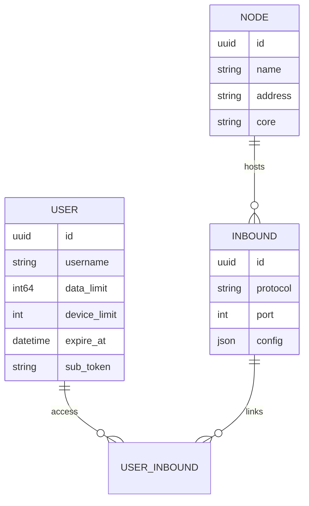

<div align="center">


**VortexUI Wiki**

[Wiki](../README.md) · [FA](../fa/01-introduction.md) · [AR](../ar/01-introduction.md) · [TR](../tr/01-introduction.md)

</div>

<div>

# 1. Introduction & Core Concepts

[← Back to index](./README.md) · [Next: Installation →](./02-installation.md)

> [!NOTE]
> VortexUI is **user-centric** — one subscription covers all assigned inbounds.

---

## What is VortexUI?

**VortexUI** is a next-generation proxy management panel designed to manage users, nodes, inbounds/outbounds, routing, and subscription sales. Unlike inbound-centric panels (such as 3x-ui), VortexUI uses a **user-centric model**: each user has a single identity and gains access to multiple protocols/inbounds.

### Key Features

| Area | Capability |
|------|------------|
| **Core** | Xray-core and sing-box — selectable per node |
| **Traffic** | **Push delta** accounting (restart-safe) |
| **Multi-node** | mTLS connections, automatic failover, migrate-back |
| **Network** | Outbound, routing, balancer, observatory |
| **Security** | JWT + TOTP 2FA, RBAC, audit log, anti account-sharing |
| **Sales** | Plans, ZarinPal, NowPayments (crypto) |
| **UI** | React 18, 8 languages, dark/light theme, live SSE, PWA |

---

## Architecture

### Main Components

```
┌─────────────────────────────────────────────────────────┐
│  Caddy (web)          — HTTPS, SPA, reverse proxy       │
├─────────────────────────────────────────────────────────┤
│  Panel (cmd/panel)    — API, SSE, management, DB        │
├─────────────────────────────────────────────────────────┤
│  PostgreSQL/TimescaleDB — persistent data + traffic TS  │
│  Redis                  — cache and sessions            │
├─────────────────────────────────────────────────────────┤
│  Node Agent (cmd/node) — gRPC server, core execution    │
│  Local Node            — in-process core on same server │
└─────────────────────────────────────────────────────────┘
```

### Data Model: User-Centric



A **User** can connect to multiple **Inbounds** across multiple **Nodes**. The subscription link (`/sub/{token}`) returns all configs in a single Clash/sing-box/base64 file.

---

## Comparison with Other Panels

| Feature | VortexUI | 3x-ui | Marzban | Hiddify |
|--------|:--------:|:-----:|:-------:|:-------:|
| Xray + sing-box cores | ✅ | Xray | Xray | ✅ |
| User-centric model | ✅ | ❌ | ✅ | ✅ |
| Push/delta traffic | ✅ | polling | polling | polling |
| Balancer + routing | ✅ | ❌ | ❌ | ❌ |
| Outbound CRUD | ✅ | partial | ❌ | ❌ |
| API token + audit | ✅ | ❌ | ❌ | ❌ |
| Anti account-sharing | ✅ | partial | ❌ | ❌ |
| Automatic HTTPS | ✅ Caddy | ❌ | ❌ | ✅ |
| Iran Geo | ✅ | ❌ | ❌ | partial |
| Database | PG+Timescale | SQLite/PG | SQLite | SQLite |

---

## Supported Protocols

| Protocol | Inbound | Outbound | Transport |
|--------|:-------:|:--------:|-----------|
| VLESS | ✅ | ✅ | TCP, WS, gRPC, HTTPUpgrade |
| VMess | ✅ | ✅ | TCP, WS, gRPC |
| Trojan | ✅ | ✅ | TCP, WS, gRPC |
| Shadowsocks | ✅ | ✅ | TCP |
| SOCKS / HTTP | — | ✅ | TCP |
| Hysteria2 | ✅ (sing-box) | — | UDP |
| TUIC | ✅ (sing-box) | — | UDP |
| WireGuard | ✅ | — | UDP |

**Security layer:** None, TLS, REALITY

---

## Important Concepts

| Term | Meaning |
|------|---------|
| **Panel** | Control server — API, UI, DB |
| **Node** | Server running the proxy core |
| **Local Node** | In-process node on the same machine as the panel |
| **Inbound** | Client entry point (VLESS on port 443, etc.) |
| **Outbound** | Egress path (freedom, proxy chain, WARP) |
| **Subscription** | `/sub/{token}` link for client import |
| **Failover** | Automatic migration of users to a healthy node |
| **SSE** | Live UI updates without polling |

---

## Roadmap (Summary)

Most roadmap features are implemented: cluster mode, Grafana/Prometheus, auto-backup, Telegram user bot, WireGuard, geo-blocking, branding, PWA, and more.

Items in active development:
- React Native mobile app
- Multilingual documentation (this wiki is the first step)
- Per-user rate limiting on the proxy

</div>
