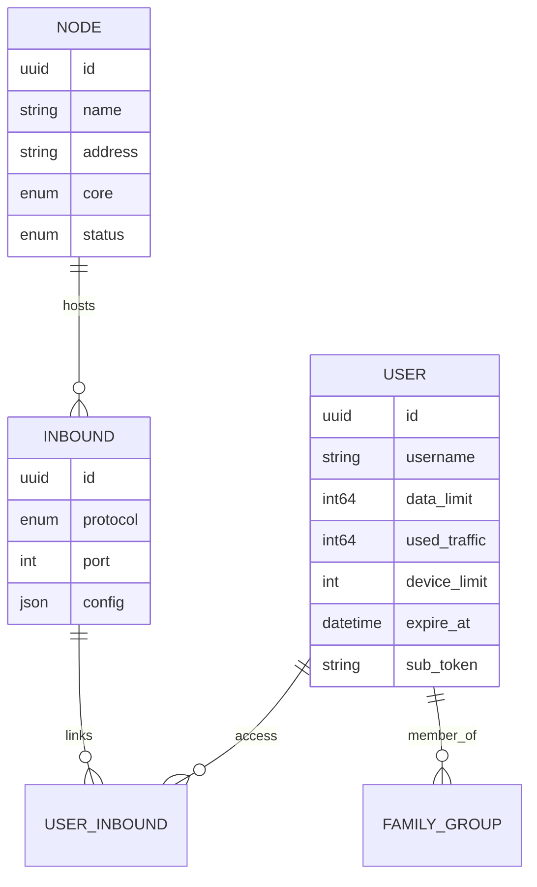

# Introduction

!!! abstract "TL;DR"
    VortexUI is a **user-centric**, **core-agnostic** proxy management panel supporting
    Xray-core and sing-box. It manages users, nodes, traffic, subscriptions, payments,
    and anti-censorship tools from a single modern interface.

---

## What is VortexUI?

**VortexUI** is a next-generation proxy management panel built for operators who need:

- **Scale** — manage hundreds of users across dozens of nodes
- **Resilience** — automatic failover, health monitoring, self-healing
- **Anti-censorship** — ISP-specific TLS tricks, probing protection, decoy sites
- **Self-service** — end-users manage their own accounts without admin intervention
- **Revenue** — built-in plan system, payment gateways, referral program

Unlike inbound-centric panels (3x-ui), VortexUI uses a **user-centric model**: one user
identity provides access to all assigned protocols across all nodes simultaneously.

---

## Core Capabilities (v1.2.0)

### Engine & Infrastructure

| Capability | Details |
|-----------|---------|
| Dual-core support | Xray-core and sing-box — choose per node |
| Push delta traffic | Restart-safe, no double-counting, never loses data |
| mTLS node fleet | Encrypted connections, auto-failover, migrate-back |
| Auto-migration | Move users from unhealthy nodes automatically |
| Federation | Sync users/nodes across multiple panels |
| Local node | In-process core — no separate agent needed |
| CDN/Relay chains | Multi-hop paths for censorship bypass |

### Security & Anti-Censorship

| Capability | Details |
|-----------|---------|
| Reality Scanner | Discover optimal SNIs with latency scoring |
| TLS Tricks | ISP-specific profiles (fragment, mux, padding, ECH) |
| Probing protection | Detect and block active GFW probes |
| Fingerprint validation | JA3-based client filtering |
| Decoy website | Serve fake site to probers |
| DNS-over-HTTPS | Built-in DoH with ad/malware blocking |
| Evasion profiles | Reusable anti-DPI presets |
| WARP+ integration | Cloudflare outbound for clean IP |

### User Management & Commerce

| Capability | Details |
|-----------|---------|
| Self-service portal | Login with sub token, view usage, buy plans, tickets |
| Smart Quota | Progressive speed reduction (fair use) |
| Family groups | Shared data pools for multiple devices |
| Referral system | Invite codes with rewards |
| Payment gateways | ZarinPal (IRR) + NowPayments (crypto) |
| Deep links + QR | One-tap subscription import |
| Config templates | Custom Clash/sing-box routing |

### Administration

| Capability | Details |
|-----------|---------|
| RBAC + resellers | Granular permissions, scoped admin views |
| Audit log | Every admin action tracked |
| Account-sharing guard | Online IP enforcement |
| Quota notifications | Telegram/webhook at configurable thresholds |
| Auto-backup | Scheduled exports to Telegram or S3 |
| Grafana metrics | Prometheus endpoint + ready dashboard |

### Frontend & UX

| Capability | Details |
|-----------|---------|
| Command palette | Ctrl+K fuzzy search across everything |
| Dashboard widgets | Drag & drop, resize, customize layout |
| World map | Geographic traffic visualization |
| Real-time gauges | Animated CPU/RAM/bandwidth indicators |
| Onboarding tour | First-time admin walkthrough |
| 8 languages | EN/FA/TR/AR/RU/ZH/JA/ES with full RTL |
| Dark + Light | Smooth animated theme transition |
| Mobile portal | Bottom nav, pull-to-refresh, bottom sheets |

---

## Architecture Overview

```
┌──────────────────────────────────────────────────────────────┐
│  Caddy (Web Layer)     — HTTPS, SPA, reverse proxy, DoH     │
├──────────────────────────────────────────────────────────────┤
│  Panel (Go)            — REST API, SSE, gRPC hub, scheduler  │
│  ├─ Auth               — JWT + TOTP + portal tokens          │
│  ├─ Services           — user, node, plan, analytics, ...    │
│  ├─ Hub                — node fleet management + failover    │
│  ├─ Scanner            — Reality SNI prober                  │
│  ├─ Migration          — health-based user redistribution    │
│  └─ Federation         — cross-panel sync                    │
├──────────────────────────────────────────────────────────────┤
│  PostgreSQL + TimescaleDB — data + time-series traffic       │
│  Redis                    — cache, sessions, device tracker  │
├──────────────────────────────────────────────────────────────┤
│  Node Agent (gRPC)     — remote core execution + health      │
│  Local Node            — in-process on panel host            │
└──────────────────────────────────────────────────────────────┘
```

### Data Flow

1. **Client** connects to a node's inbound (VLESS/VMess/Trojan/etc.)
2. **Node agent** reports traffic deltas to the panel via gRPC
3. **Panel** aggregates, enforces quotas, updates DB
4. **SSE** pushes live events to the admin dashboard
5. **Portal** lets end-users self-manage via their sub token

---

## User-Centric Model



A single **User** can connect through multiple **Inbounds** on multiple **Nodes**.
The subscription link (`/sub/{token}`) returns all configs in one file, auto-detected
as Clash, sing-box, or base64.

---

## Comparison with Other Panels

| Feature | VortexUI 1.2 | 3x-ui | Marzban | Hiddify |
|---------|:--:|:--:|:--:|:--:|
| Dual core (Xray + sing-box) | ✅ | ❌ | ❌ | ✅ |
| User-centric model | ✅ | ❌ | ✅ | ✅ |
| Push delta traffic | ✅ | polling | polling | polling |
| Node auto-migration | ✅ | ❌ | ❌ | ❌ |
| Load balancer | ✅ 4 strategies | ❌ | ❌ | ❌ |
| Reality Scanner | ✅ | ❌ | ❌ | ❌ |
| TLS Tricks (ISP) | ✅ | ❌ | ❌ | partial |
| Probing protection | ✅ | ❌ | ❌ | ❌ |
| Client fingerprint | ✅ JA3 | ❌ | ❌ | ❌ |
| Decoy website | ✅ | ❌ | ❌ | ❌ |
| DNS-over-HTTPS | ✅ | ❌ | ❌ | ❌ |
| Self-service portal | ✅ | ❌ | ❌ | ✅ |
| Family groups | ✅ | ❌ | ❌ | ❌ |
| Referral system | ✅ | ❌ | ❌ | ❌ |
| Federation | ✅ | ❌ | ❌ | ❌ |
| Smart Quota | ✅ | ❌ | ❌ | ❌ |
| CDN/Relay chains | ✅ | ❌ | ❌ | ❌ |
| Deep links | ✅ | ❌ | ❌ | ✅ |
| Analytics (geo) | ✅ + export | ❌ | ❌ | ❌ |
| Dashboard widgets | ✅ drag & drop | ❌ | ❌ | ❌ |
| Command palette | ✅ | ❌ | ❌ | ❌ |
| Backend | Go | Go | Python | Python |
| Database | PG + TimescaleDB | SQLite | SQLite | SQLite |

---

## Supported Protocols

| Protocol | Inbound | Outbound | Transport | Security |
|----------|:-------:|:--------:|-----------|----------|
| VLESS | ✅ | ✅ | TCP, WS, gRPC, HTTPUpgrade, xHTTP | None, TLS, REALITY |
| VMess | ✅ | ✅ | TCP, WS, gRPC | None, TLS |
| Trojan | ✅ | ✅ | TCP, WS, gRPC | TLS, REALITY |
| Shadowsocks | ✅ | ✅ | TCP | None |
| SOCKS / HTTP | — | ✅ | TCP | — |
| Hysteria2 | ✅ (sing-box) | — | UDP | TLS |
| TUIC | ✅ (sing-box) | — | UDP | TLS |
| WireGuard | ✅ | — | UDP | Native |

---

## Key Terminology

| Term | Meaning |
|------|---------|
| **Panel** | The control server — API, UI, database, schedulers |
| **Node** | A server running a proxy core (Xray or sing-box) |
| **Local Node** | In-process core on the same machine as the panel |
| **Inbound** | Client-facing entry point (protocol + port + config) |
| **Outbound** | Egress path (freedom, proxy chain, WARP, blackhole) |
| **Subscription** | `/sub/{token}` — auto-detected config for any client |
| **Portal** | End-user self-service web interface |
| **Hub** | Internal component managing all node connections |
| **Federation** | Multiple panels connected for user/node sync |
| **Relay Chain** | Multi-hop path: Client → CDN → Relay → Node |
| **Smart Quota** | Fair-use policy with progressive speed tiers |
| **SSE** | Server-Sent Events — push-based live UI updates |

---

## Next Steps

Ready to get started?

1. **[Installation](02-installation.md)** — get VortexUI running in 5 minutes
2. **[First Steps](03-first-steps.md)** — create admin, add node, add first user
3. **[Dashboard](04-dashboard.md)** — explore the real-time overview
