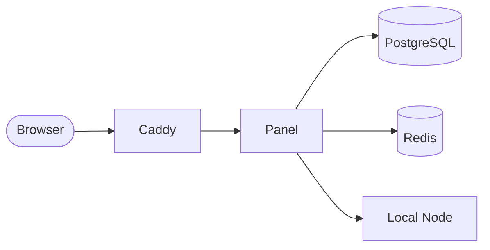

# Installation

!!! success "v1.2.0"
    This guide covers VortexUI **v1.2.0**. The installer handles everything —
    secrets, mTLS certificates, database, and initial admin creation.

---

## Prerequisites

| Requirement | Docker (recommended) | Native |
|-------------|:--------------------:|:------:|
| OS | Ubuntu 22.04+ / Debian 12+ | Linux |
| RAM | 2 GB minimum | 2 GB+ |
| CPU | 1 vCPU | 1+ vCPU |
| Disk | 10 GB free | 10 GB free |
| Docker + Compose v2 | ✅ required | DB/Redis only |
| Go 1.22+ | — | ✅ |
| Ports | 80 + 443 (HTTPS) or custom | same |

!!! warning "Firewall"
    Ensure ports **80** and **443** are open if you want automatic HTTPS.
    Also open any inbound ports you plan to use (e.g., 2053 for VLESS).

---

## Method 1: One-Line Install (Recommended)

```bash
bash <(curl -Ls https://raw.githubusercontent.com/iPmartNetwork/VortexUI/master/install.sh)
```

### What the installer does

1. **Asks installation method** — Docker Compose or Native
2. **Asks access method** — Domain + HTTPS or IP + HTTP
3. **Generates secrets** — JWT key, DB password, Redis password
4. **Creates mTLS certificates** — for panel ↔ node communication
5. **Starts the stack** — all containers or systemd services
6. **Creates first admin** — prints credentials to terminal
7. **Installs `vortexui` CLI** — management commands

### Non-interactive (CI/scripting)

```bash
VORTEXUI_METHOD=docker \
VORTEXUI_NONINTERACTIVE=1 \
VORTEXUI_ADMIN_USER=admin \
VORTEXUI_ADMIN_PASS='your-strong-password' \
VORTEXUI_DOMAIN=panel.example.com \
VORTEXUI_ACME_EMAIL=admin@example.com \
bash install.sh
```

### After install

```bash
vortexui status       # check all services are running
vortexui              # open interactive menu
```

---

## Method 2: Docker Compose (Manual)

```bash
# Clone
git clone https://github.com/iPmartNetwork/VortexUI && cd VortexUI

# Generate secrets
cat <<EOF > deploy/.env
JWT_SECRET=$(openssl rand -hex 32)
DB_PASSWORD=$(openssl rand -hex 16)
SITE_ADDRESS=panel.example.com
ACME_EMAIL=admin@example.com
EOF

# Generate mTLS certificates
make certs

# Start stack
docker compose --env-file deploy/.env -f deploy/compose.yml up -d --build

# Create admin
docker compose -f deploy/compose.yml exec panel \
  /usr/local/bin/panel admin create --username admin --password 'change-me' --sudo
```

### Stack Architecture



| Container | Port | Purpose |
|-----------|------|---------|
| `web` (Caddy) | 80, 443 | HTTPS termination + SPA |
| `panel` | 8080 (internal) | API + local node + gRPC hub |
| `db` | 5432 (internal) | PostgreSQL 16 + TimescaleDB |
| `redis` | 6379 (internal) | Sessions, cache, device tracking |

---

## Method 3: Native (Advanced / Development)

```bash
git clone https://github.com/iPmartNetwork/VortexUI && cd VortexUI

# Start DB and Redis
docker compose up -d db redis

# Configure
cp .env.example .env
# Edit .env — set VORTEX_DATABASE_URL and VORTEX_JWT_SECRET

# Build
make build

# Generate dev certificates
make certs

# Run panel (includes local node)
make run-panel

# Create admin
./bin/panel admin create --username admin --password 'your-pass' --sudo
```

Frontend development:
```bash
cd web && npm install && npm run dev
```

---

## Node Agent (Multi-Server Fleet)

For each remote server in your fleet:

### 1. Copy certificates

Transfer `ca.crt`, `node.crt`, and `node.key` from the panel server.

### 2. Install core

```bash
# Xray
bash -c "$(curl -L https://github.com/XTLS/Xray-install/raw/main/install-release.sh)" @ install

# OR sing-box
bash -c "$(curl -L https://raw.githubusercontent.com/SagerNet/sing-box-install/main/install.sh)" @ install
```

### 3. Start agent

```bash
VORTEX_NODE_LISTEN=:50051 \
VORTEX_CORE=xray \
VORTEX_CORE_BIN=/usr/local/bin/xray \
VORTEX_CORE_CONFIG=/etc/vortex/core.json \
VORTEX_TLS_CERT=/etc/vortex/node.crt \
VORTEX_TLS_KEY=/etc/vortex/node.key \
VORTEX_TLS_CA=/etc/vortex/ca.crt \
./bin/node
```

### 4. Register in panel

Go to **Nodes → Add Node** — enter `ip:50051` and the node connects via mTLS.

---

## Local Node (Single-Server)

For a single-server setup, no separate agent is needed:

```env
VORTEX_LOCAL_NODE=true
VORTEX_LOCAL_NODE_NAME=local
VORTEX_LOCAL_NODE_HOST=your-public-ip
VORTEX_CORE=xray
VORTEX_CORE_BIN=/usr/local/bin/xray
```

The panel manages the core process in-process. In Docker Compose this is the default.

---

## Environment Variables

### Required

| Variable | Description |
|----------|-------------|
| `VORTEX_DATABASE_URL` | PostgreSQL connection string |
| `VORTEX_JWT_SECRET` | Minimum 32 bytes — `openssl rand -hex 32` |

### Networking

| Variable | Default | Description |
|----------|---------|-------------|
| `VORTEX_HTTP_ADDR` | `:8080` | Panel API listen address |
| `VORTEX_GRPC_ADDR` | `:50051` | Hub gRPC listen address |
| `VORTEX_REDIS_URL` | `redis://localhost:6379/0` | Redis URL |

### Node

| Variable | Default | Description |
|----------|---------|-------------|
| `VORTEX_LOCAL_NODE` | `false` | Enable in-process node |
| `VORTEX_LOCAL_NODE_HOST` | `127.0.0.1` | Public IP for subscriptions |
| `VORTEX_CORE` | `xray` | `xray` or `singbox` |
| `VORTEX_CORE_BIN` | — | Path to core binary |

### Security

| Variable | Default | Description |
|----------|---------|-------------|
| `VORTEX_SHARE_AUTOLIMIT` | `false` | Auto-limit on account sharing |
| `VORTEX_TLS_CERT` | — | mTLS certificate path |
| `VORTEX_TLS_KEY` | — | mTLS key path |
| `VORTEX_TLS_CA` | — | mTLS CA path |

### Integrations

| Variable | Description |
|----------|-------------|
| `VORTEX_WEBHOOK_URL` | Notification webhook endpoint |
| `VORTEX_WEBHOOK_SECRET` | HMAC-SHA256 signing key |
| `VORTEX_TELEGRAM_TOKEN` | Telegram bot token |
| `VORTEX_TELEGRAM_CHAT_ID` | Admin notification chat |
| `VORTEX_CF_API_TOKEN` | Cloudflare DNS automation |
| `VORTEX_CF_ZONE_ID` | Cloudflare zone ID |

Full list: [`.env.example`](https://github.com/iPmartNetwork/VortexUI/blob/master/.env.example)

---

## Management CLI (`vortexui`)

After installation, the `vortexui` command provides an interactive menu:

```
$ vortexui

╭──────────────────────────────────╮
│       VortexUI Management        │
╰──────────────────────────────────╯

   1) Start            2) Stop
   3) Restart          4) Status
   5) Logs             6) Update
   7) Create admin     8) Change web port
   9) Domain / SSL    10) Settings / URL
  11) Uninstall        0) Exit
```

Or use subcommands directly:

```bash
vortexui start
vortexui stop
vortexui restart
vortexui status
vortexui logs
vortexui update
vortexui admin create --username admin --password pass --sudo
vortexui settings
vortexui uninstall
```

---

## Updating

### Automatic (recommended)

```bash
vortexui update
```

### Manual

```bash
cd /opt/vortexui
git fetch origin master
git reset --hard origin/master
docker compose -f deploy/compose.yml up -d --build
```

!!! info "Safe update"
    Re-running the installer or `vortexui update` is **non-destructive** —
    secrets, database, and configuration are preserved.

---

## Post-Install Verification

```bash
# Check services
vortexui status

# API health
curl -s https://panel.example.com/api/health
# → {"status":"ok"}

# Admin login
curl -s https://panel.example.com/api/login \
  -H 'Content-Type: application/json' \
  -d '{"username":"admin","password":"your-pass"}'
# → {"token":"eyJ..."}
```

---

## Next Steps

1. **[First Steps](03-first-steps.md)** — add your first node and user
2. **[Dashboard](04-dashboard.md)** — explore the real-time overview
3. **[Security](08-security-administration.md)** — configure TLS tricks and probing protection
