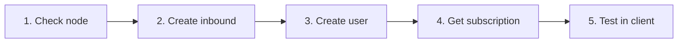

<div align="center">


**VortexUI Wiki**

[Wiki](./README.md) · [FA](../fa/03-first-steps.md) · [AR](../ar/03-first-steps.md) · [TR](../tr/03-first-steps.md)

</div>

<div>

# 3. First Steps

[← Installation](./02-installation.md) · [Index](./README.md) · [Next: Dashboard →](./04-dashboard.md)

> [!TIP]
> Complete this workflow in **5 minutes**: node → inbound → user → subscription → test.

<div align="center">

| Light | Dark |
|:-----:|:----:|
|  |  |

*Panel overview — light mode*

</div>

---

## Logging In

1. Open the install URL in your browser (e.g. `https://panel.example.com`)
2. Sign in with the admin username and password created during installation
3. If 2FA is enabled, enter the 6-digit authenticator code

### Create a new admin (CLI)

```bash
# Docker
docker compose -f deploy/compose.yml exec panel \
  /usr/local/bin/panel admin create --username admin2 --password 'pass' --sudo

# Native
./bin/panel admin create --username admin2 --password 'pass' --sudo

# Or via vortexui
vortexui admin
```

---

## Initial Workflow (5 Minutes)



### Step 1: Check the node

- Menu → **Nodes**
- The `local` node (or added node) should be **green** with Core Running
- Review CPU/RAM/Disk and connection count

### Step 2: Create an inbound

1. On the node → **Inbounds**
2. **Add Inbound**
3. Quick VLESS + REALITY example:

| Field | Value |
|-------|-------|
| Protocol | `vless` |
| Port | `443` |
| Network | `tcp` |
| Security | `reality` |
| Flow | `xtls-rprx-vision` |
| SNI | `www.microsoft.com` |

4. In the REALITY section click **Generate** (private/public key pair)
5. Save — the core hot-reloads the config

> Protocol details: [Chapter 13 — Protocols](./13-protocols-config.md)

### Step 3: Create a user

1. Menu → **Users** → **New User**
2. Suggested fields:

| Field | Example |
|-------|---------|
| Username | `testuser` |
| Data limit | `50 GB` |
| Expire | 30 days |
| Device limit | `3` |
| Inbounds | Select the inbound you created |

3. **Save**

### Step 4: Get subscription

1. In the user list → **Subscription** icon (or QR)
2. Copy the links below:

| Format | Use case |
|--------|----------|
| Base64 | v2rayNG, Nekoray |
| Clash | Clash Meta / Mihomo |
| sing-box | sing-box client |
| QR Code | Mobile scan |

3. Public user page: `https://panel.example.com/sub/info/{token}` — traffic chart and QR

### Step 5: Test

1. Import the link in your client
2. Connect
3. In the panel → **Users** → Usage — traffic should increase (live SSE)

---

## Recommended Initial Settings

| Setting | Path | Why |
|---------|------|-----|
| Change password | Settings → Password | Security |
| Enable 2FA | Settings → 2FA | Account protection |
| Iran Geo | Nodes → Update Geo | IR routing |
| Webhook/TG | env + restart | Event notifications |
| Backup | Settings → Backup | Disaster recovery |

---

## Import Users from Another Panel

**Users → Import** — supported sources:
- **3x-ui** (JSON export)
- **Marzban** (JSON export)

Users are migrated with UUID and quota; inbounds must be mapped separately.

---

## UI Shortcuts

| Action | Path |
|--------|------|
| Dark/light theme | Sidebar → moon/sun icon |
| Language | Settings → Language |
| Search users | Users → search box |
| Node logs | Nodes → Logs |
| Live events | Automatic — toast in corner |

</div>
