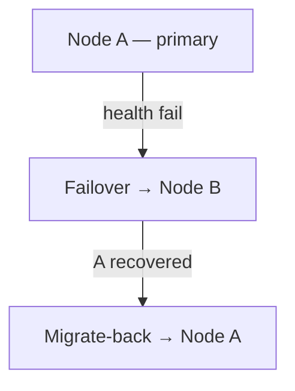

<div align="center">


**VortexUI Wiki**

[Wiki](./README.md) · [FA](../fa/06-node-management.md) · [AR](../ar/06-node-management.md) · [TR](../tr/06-node-management.md)

</div>

<div>

# 6. Node Management

[← Users](./05-user-management.md) · [Index](./README.md) · [Next: Network policy →](./07-network-policy.md)

> [!TIP]
> For Iran routing rules, use **Nodes → Update Geo**.

<div align="center">

| Light | Dark |
|:-----:|:----:|
|  |  |

*Nodes page — CPU/RAM monitoring and node actions*

</div>

---

## Node Types

| Type | Description | Use case |
|------|-------------|----------|
| **Local Node** | In-process core on the panel server | Single-server setup |
| **Remote Node** | Separate agent with gRPC/mTLS | Multi-server fleet |

---

## Adding a Remote Node

1. **Nodes → Add Node**
2. Fields:

| Field | Example |
|-------|---------|
| Name | `de-fra-01` |
| Address | `203.0.113.10:50051` |
| Core | `xray` or `singbox` |
| Endpoint | Public address for subscription (CDN/tunnel) |

3. Copy mTLS certs from `deploy/certs/` to the agent
4. Start the agent — status turns green

---

## Health Monitoring

Each node card displays:

| Metric | UI warning threshold |
|--------|----------------------|
| CPU % | >60% yellow, >85% red |
| RAM % | same |
| Disk % | same |
| Connections | Active count |
| Last seen | Last heartbeat |

---

## Node Actions

| Button | Action |
|--------|--------|
| **Inbounds** | CRUD inbounds on this node |
| **Logs** | Live core log stream |
| **Restart Core** | Reload without long downtime |
| **Stop Core** | Temporary stop |
| **Update Geo** | Download Iran geoip/geosite |
| **Edit / Delete** | Edit metadata / remove |

---

## Inbounds

**Nodes → Inbounds → Add**

- Protocol, port, network, security
- REALITY: Generate keypair
- Advanced JSON editor
- Share link import
- **Bandwidth limit** per inbound
- **Geo-blocking** per inbound
- **Evasion profile** link

---

## Failover & Migrate-Back



- Users migrate to a healthy node
- After recovery, automatic return (configurable)

---

## Custom Endpoint

When the server's real IP differs from what clients see (CDN, reverse tunnel):

```
Endpoint: cdn.example.com
```

The subscription advertises this host instead of the internal `address`.

---

## Cloudflare DNS Automation

With configuration:

```env
VORTEX_CF_API_TOKEN=...
VORTEX_CF_ZONE_ID=...
```

A records for nodes can be created automatically.

---

## GeoIP / Geosite (Iran)

**Update Geo** downloads from [Iran-v2ray-rules](https://github.com/chocolate4u/Iran-v2ray-rules):

- `geoip:ir`, `geosite:ir`, `category-ir`
- Ad/malware categories

Then the core reloads. Custom URL: `POST /api/nodes/:id/geo-update`

---

## Hot-Switch Core

Each node can switch between **xray** and **sing-box** (Hysteria2/TUIC only on sing-box).

---

## gRPC Keepalive

Idle panel↔node connections are kept alive with keepalive — they do not drop.

</div>
