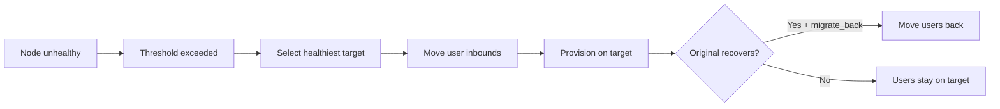

# Node Management

!!! abstract "Node Fleet"
    VortexUI manages a fleet of proxy nodes via gRPC + mTLS. Each node runs either
    Xray-core or sing-box and reports health, traffic, and connection data to the panel.

---

## Node Fleet Overview

**Nodes** page shows all nodes with:

| Column | Description |
|--------|-------------|
| Name | Node display name |
| Address | IP or domain |
| Core | Xray-core or sing-box |
| Status | Online / Offline / Unhealthy |
| Users | Active user count on this node |
| CPU / RAM / Disk | Live resource utilization |
| Uptime | Time since last restart |

---

## Enrollment Wizard

The recommended way to add remote nodes. A four-step UI flow:

### Step 1: Node Details

- Name, address, port
- Select core (Xray or sing-box)
- Optional: custom endpoint for tunnel/CDN access

### Step 2: Generate Command

The panel generates a one-line install command containing:

- Node enrollment token (one-time use)
- Panel address for callback
- Core download URL

### Step 3: Execute on Remote Server

SSH into the remote server and paste the command. The agent:

1. Downloads and installs the node binary
2. Exchanges mTLS certificates with the panel
3. Downloads and starts the chosen proxy core
4. Registers as a systemd service

### Step 4: Verify Connection

The panel confirms the node is online and shows initial health data.

!!! tip
    The enrollment token expires after 10 minutes. If it times out, generate a new one from the wizard.

---

## Node Health Diagnostics

Each node is continuously monitored. The panel detects three failure states:

| State | Meaning | Auto-action |
|-------|---------|-------------|
| **mTLS failure** | Certificate error or network unreachable | Alert + retry |
| **Unreachable** | No gRPC response within timeout | Alert → auto-migrate if enabled |
| **Core down** | Agent running but proxy core crashed | Auto-restart core |

View diagnostics: **Nodes → click node → Health** tab.

---

## mTLS Connections

All panel-to-node communication uses mutual TLS:

- Certificates are auto-generated during enrollment
- Rotated on a configurable schedule
- No manual certificate management needed
- If a certificate expires, the panel alerts and can auto-reissue

---

## Auto-Migration

Automatically move users from unhealthy nodes to healthy ones.

### Policy Settings

| Setting | Description | Default |
|---------|-------------|---------|
| Enabled | Turn auto-migration on/off | Off |
| Health check interval | Seconds between checks | 30 |
| Unhealthy threshold | Consecutive failures before trigger | 3 |
| CPU threshold | Migrate if CPU exceeds % | 90 |
| Memory threshold | Migrate if RAM exceeds % | 90 |
| Packet loss max | Migrate if loss exceeds % | 10 |
| Migrate back | Return users when original recovers | Yes |

### How It Works



### Migration Events

View history at **Nodes → Auto-Migration → Events**: timestamp, reason, source/target nodes, status (completed/failed).

---

## Live Monitoring

**Nodes → click node → Monitor** tab:

- **CPU** — real-time utilization graph
- **RAM** — used/total with trend line
- **Disk** — usage and growth rate
- **Bandwidth** — current throughput per direction
- **Connections** — active tunnel count over time

Data is pushed via gRPC every 3 seconds from the node agent.

---

## Remote Restart/Stop

From the node detail page:

| Action | Description |
|--------|-------------|
| **Restart Core** | Restart the proxy core (Xray/sing-box) without touching the agent |
| **Restart Agent** | Full agent restart (brief connectivity loss) |
| **Stop Core** | Halt the proxy core — no new connections |
| **Update Core** | Pull latest core binary and restart |

!!! warning
    Stopping a core disconnects all active users on that node. Use auto-migration first if you want zero downtime.

---

## Custom Endpoint (Tunnel/CDN/Relay)

Override the address advertised in subscriptions for this node:

| Field | Description |
|-------|-------------|
| Endpoint address | Domain/IP users connect to |
| Endpoint port | Port users connect to |
| Notes | Description (e.g. "Behind Cloudflare CDN") |

Use this when the node is behind a tunnel, CDN, or relay — the real node IP differs from the user-facing address.

---

## Cloudflare DNS Automation

Automatically manage DNS records for your nodes in Cloudflare:

1. **Settings → Cloudflare** — add your API token and zone ID
2. **Nodes → node → DNS** — enable DNS automation
3. The panel creates/updates A/AAAA records when node IPs change
4. Optionally proxy through Cloudflare (orange cloud)

Useful for dynamic IP nodes or when you rotate server addresses.

---

## Per-Node Logs Streaming

**Nodes → node → Logs** tab:

- Live log stream from the node agent and proxy core
- Filter by level: debug, info, warn, error
- Search within logs
- Download log file for a time range

---

## Node Speed Limit & Geo-Blocking

Per-node settings:

| Setting | Description |
|---------|-------------|
| Speed limit | Per-user download cap in bytes/sec (`0` = unlimited) |
| Geo-blocking | Comma-separated country codes (ISO 3166-1 alpha-2) |

Geo-blocking restricts which countries can connect to this specific node. Empty = all allowed.

---

## `vortexui doctor` CLI

Run diagnostics from the command line:

```bash
vortexui doctor
```

Checks:

- ✅ PostgreSQL connection and migrations
- ✅ Redis connection and latency
- ✅ Each node's gRPC connectivity
- ✅ Certificate validity and expiration
- ✅ Port availability
- ✅ DNS resolution
- ✅ Disk space
- ✅ Core binary versions

Output includes status, latency, and actionable suggestions for any failures.
