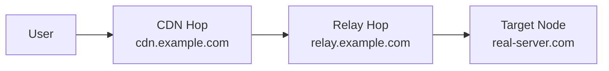

# Network Policy

!!! abstract "Routing & Outbounds"
    Control how traffic exits your nodes — direct, blocked, chained through other proxies,
    or sent through Cloudflare WARP. Build reusable routing packs and multi-hop relay chains.

---

## Outbounds

**Network → Outbounds**

An outbound defines where traffic goes after entering a node's inbound.

| Type | Description |
|------|-------------|
| **Freedom** | Direct internet access (default) |
| **Blackhole** | Drop traffic silently |
| **DNS** | Resolve via specified DNS server |
| **Proxy chain** | Forward to another proxy (SOCKS/HTTP/Trojan/VMess/VLESS) |
| **WARP+** | Route through Cloudflare WARP for clean IP |

### WARP+ Integration

1. Go to **Network → Outbounds → Add → WARP+**
2. Enter your WARP license key (or use free tier)
3. The panel configures WireGuard to Cloudflare's edge
4. Assign this outbound to routing rules for specific domains/IPs

!!! tip
    WARP+ is useful when your node's IP is flagged by services like Google, ChatGPT, or streaming sites. Route those domains through WARP for a clean IP.

---

## Routing Rules

**Network → Routing**

Rules determine which outbound handles each connection based on matchers:

| Matcher | Description |
|---------|-------------|
| Domain | Full domain, subdomain, keyword, or regex |
| IP | CIDR range or GeoIP country |
| Port | Destination port or range |
| Protocol | HTTP, TLS, BitTorrent, etc. |
| Inbound tag | Match specific inbound |
| Source IP | Client source IP/CIDR |
| User | Match specific username |

Rules are evaluated in priority order. First match wins.

---

## Smart Routing Rule Packs

**Network → Routing Packs**

A **routing pack** is a reusable, named collection of routing rules. Build once, apply anywhere.

### Actions

| Action | Description |
|--------|-------------|
| Create/edit | Build a pack from ordered routing rules |
| Apply to node | Replace a node's routing with the pack and resync |
| Set global default | One pack applies fleet-wide unless overridden |
| Assign per user | Embed a specific pack in a user's subscription |

### Built-in Packs

VortexUI ships with common packs:

- **Block Ads** — block advertising domains
- **Iran Direct** — route Iranian domains/IPs directly
- **Streaming Direct** — bypass proxy for local streaming services
- **Block Torrents** — block BitTorrent protocol

### Creating a Custom Pack

1. Click **New Pack** → enter a name
2. Add rules in priority order (same fields as node routing)
3. Save, then:
    - **Apply** to a node to push live
    - Mark as **Default** for the fleet
    - **Assign** to a user from their detail page

!!! note
    Per-user assignment takes precedence over the global default. A user with no assignment falls back to the default pack.

---

## CDN/Relay Chain Builder

**Network → CDN/Relay Chains**

Hide your real server IP by routing traffic through intermediate hops.

### Hop Types

| Type | Description | Best for |
|------|-------------|----------|
| **CDN** | Traffic through Cloudflare/CDN | Free IP hiding, requires WS transport |
| **Relay** | Traffic through a VPS relay | When CDN is blocked or need TCP |
| **Worker** | Cloudflare Workers as relay | Serverless, cost-effective |

### Creating a Chain

1. Click **New Chain**
2. Name and select the target node
3. Add hops in order (User → Hop 1 → Hop 2 → Node)
4. Configure each hop:
    - Type (CDN / Relay / Worker)
    - Address and port
    - Protocol (WebSocket / gRPC / TCP)
    - SNI and path (for TLS transports)



!!! example "Cloudflare CDN Chain"
    ```
    Hop 1: CDN — cdn.example.com:443 — WebSocket — SNI: cdn.example.com — Path: /ws
    Target: Your actual node
    ```
    Users connect to Cloudflare → Cloudflare forwards to your node. Real IP hidden.

---

## Load Balancers

**Network → Load Balancers**

Distribute traffic across multiple outbounds with health checking.

### Strategies

| Strategy | Behavior |
|----------|----------|
| **Round-robin** | Equal distribution across healthy targets |
| **Random** | Random selection per connection |
| **Least connections** | Route to the target with fewest active connections |
| **Least latency** | Route to the target with lowest measured latency |

### Health Probing

| Setting | Description |
|---------|-------------|
| Interval | Seconds between health checks |
| Timeout | Max wait for probe response |
| Unhealthy after | Consecutive failures to mark as down |
| Healthy after | Consecutive successes to mark as up |

Unhealthy targets are automatically removed from the rotation and restored when they recover.

---

## Multi-Domain SNI Routing + Auto SSL

**Network → SNI Routing**

Host multiple domains on a single port with automatic routing and SSL:

1. **Add Domain** — enter domain and target inbound
2. Enable **Auto-provision SSL** for automatic Let's Encrypt certificates
3. Traffic is routed based on the TLS SNI field

Features:

- Wildcard certificates (`*.domain.com`)
- Auto-renewal before expiry
- Multiple domains per node
- Mixed REALITY + TLS on the same port via SNI discrimination

---

## GeoIP/Geosite Updater

**Network → GeoIP/Geosite**

Manage the geolocation databases used by routing rules:

- **Auto-update** — check for new releases on a schedule
- **Manual update** — download latest immediately
- **Custom sources** — point to your own dat/db files
- Supports both `geoip.dat`/`geosite.dat` (V2Ray) and `geoip.db`/`geosite.db` (sing-box)

---

## Panel Federation

**Network → Federation**

Connect multiple VortexUI panels for distributed management.

### Use Cases

- Large deployments with panels in different regions
- Reseller setups where each reseller has their own panel
- High availability — if one panel goes down, others continue

### Configuration

| Setting | Description |
|---------|-------------|
| Enabled | Activate federation |
| Cluster name | Identifier for this cluster |
| Sync interval | How often to sync (seconds) |
| SSO | Enable single sign-on across panels |

### Adding a Peer

1. Click **Add Peer**
2. Enter peer panel URL
3. Enter the API key (generated on the peer panel)
4. Select sync scope: Users, Nodes, or both
5. Test connection → Save

### Sync Events

View synchronization history between peers — timestamps, direction, items synced, and any conflicts.
