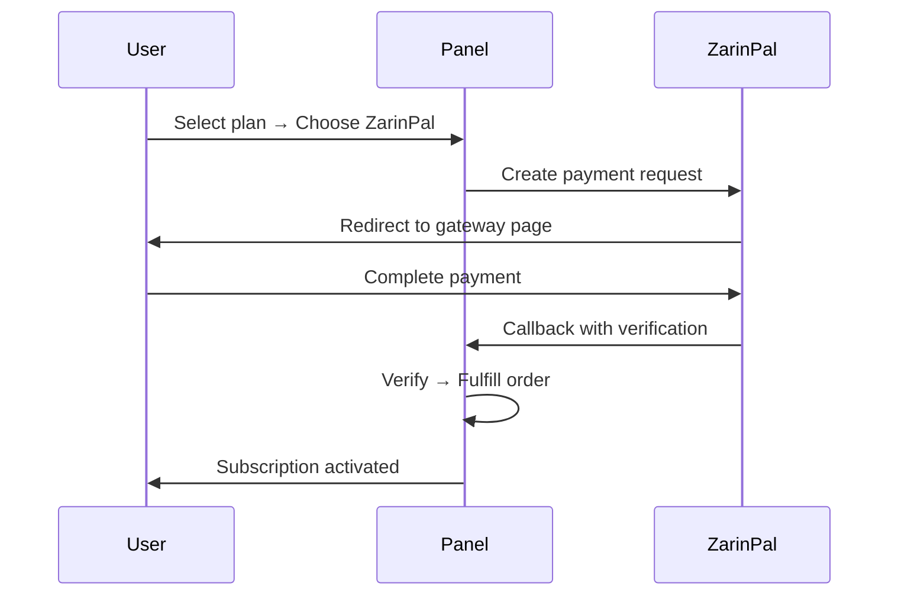
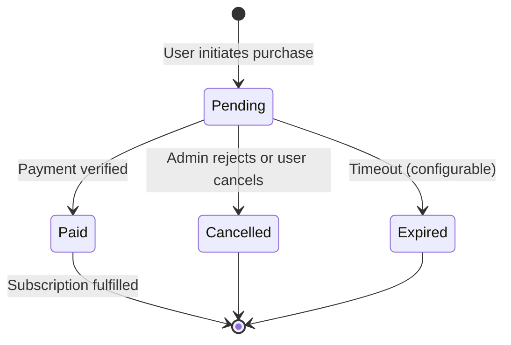

# Plans & Payments

!!! abstract "Per-Reseller Commerce"
    Each admin/reseller creates their own plans, configures their own payment methods,
    and manages their own orders. End-users purchase through a self-service shop unique
    to their reseller.

---

## Plan System

Plans are **owned by the admin who creates them**. Each reseller manages their own catalog independently.

### Creating a Plan

**Plans → New Plan**

| Field | Description |
|-------|-------------|
| Name | Display name (e.g. "Monthly 50GB") |
| Data limit | Traffic cap in bytes |
| Duration (days) | Subscription period |
| Device limit | Max concurrent devices |
| Reset strategy | `none` / `daily` / `weekly` / `monthly` |
| Price (Toman) | IRR price for ZarinPal/card payments |
| Price (USD) | Dollar price for crypto payments |
| Max users | Sales cap (`0` = unlimited) |
| Enabled | Active/inactive toggle |

### Plan Visibility

| Admin Type | Sees |
|-----------|------|
| Sudo admin | All plans from all admins |
| Reseller | Only their own plans |
| End user (in shop) | Only their reseller's enabled plans |

### Plan Ownership

- **Sudo admin** creates global plans (visible to all users without a reseller)
- **Reseller** creates plans for their own users only
- A user visiting the shop sees plans from whichever admin manages their account

---

## Payment Configuration

Each admin/reseller configures their own payment methods independently.

**Settings → Payment Configuration** (or **Reseller Account → Payment**)

### Available Methods

| Method | Type | Configuration |
|--------|------|--------------|
| **ZarinPal** | Online gateway | Merchant ID |
| **Card-to-Card** | Manual proof | Card number + holder name |
| **Crypto** | Manual proof | Wallet addresses (BTC, USDT, ETH, etc.) |

### Per-Reseller Payment Config

Each reseller sets up their own payment details:

```
Reseller A → ZarinPal merchant: xxxx + Card: 6219-xxxx-xxxx-1234
Reseller B → Crypto only: USDT TRC20 address
Reseller C → Card-to-card: 6037-xxxx-xxxx-5678
```

Users in each reseller's shop see only that reseller's configured payment options.

---

## Payment Methods

### ZarinPal (Online Gateway)

Automated flow — no admin intervention needed:



Configuration: set `VORTEX_ZARINPAL_MERCHANT` (or per-reseller merchant ID in payment config).

### Card-to-Card (Receipt Upload)

Manual verification flow:

1. User selects plan → chooses "Card-to-Card"
2. Panel shows the reseller's card number and holder name
3. User transfers money via their banking app
4. User uploads **receipt image** + optional **reference number**
5. Order status: `pending`
6. Admin/reseller reviews the proof image → **Approve** or **Reject**
7. On approval → subscription activated

!!! info
    Receipt images are stored securely and accessible only to the managing admin.

### Crypto (TX Hash + Screenshot)

Manual verification flow:

1. User selects plan → chooses "Crypto"
2. Panel shows the reseller's wallet address(es)
3. User sends crypto and provides:
    - **Transaction hash** (required)
    - **Screenshot** of transaction (optional)
4. Order status: `pending`
5. Admin/reseller verifies the TX hash on-chain → **Approve** or **Reject**
6. On approval → subscription activated

---

## Self-Service Shop

**URL:** `/sub/{token}/shop`

The shop is part of the user portal, accessible via the subscription token.

### User Experience

1. User logs into portal with their sub token
2. Navigates to **Plans** tab
3. Sees plans created by their managing admin/reseller
4. Selects a plan → chooses payment method
5. Completes payment (or uploads proof)
6. Waits for fulfillment

### React Portal Purchase Flow (PortalPlans)

The portal renders:

- Plan cards with name, data limit, duration, price
- Payment method selector (only methods the reseller configured)
- Upload form (for card-to-card / crypto proof)
- Order status tracker

---

## Order Lifecycle



| Status | Meaning |
|--------|---------|
| `pending` | Awaiting payment or proof review |
| `paid` | Payment confirmed — subscription activated |
| `cancelled` | Rejected by admin or cancelled by user |
| `expired` | Payment timeout exceeded |

---

## Pending Order Review

**Orders → Pending** (admin/reseller view)

For card-to-card and crypto orders:

1. View the order details: user, plan, amount, timestamp
2. View uploaded **proof image** (receipt/screenshot)
3. View **reference number** or **TX hash**
4. Actions:
    - **Approve** → fulfills the order, activates subscription
    - **Reject** → cancels the order, notifies user with reason

!!! tip
    Enable Telegram notifications for new pending orders so you don't miss proof uploads.

---

## Reseller Wallet Billing

For resellers who don't sell directly to users but instead pay the admin for capacity.

### How It Works

| Credit Type | Deducted When |
|-------------|---------------|
| Traffic credits (GB) | Users consume data (consumed mode) or reseller assigns limits (allocated mode) |
| User credits (count) | Reseller creates new users |

### Wallet Operations

| Action | Who | Description |
|--------|-----|-------------|
| View balance | Reseller | See remaining traffic + user credits |
| View ledger | Reseller | Full history of all changes |
| Request top-up | Reseller | Submit top-up request to sudo admin |
| Approve top-up | Sudo | Review and approve deposit |
| Quick adjust | Sudo | +50 accounts / +10 GB / +50 GB buttons |

### Wallet Deposit Approval Queue

**Admins → Wallet Deposits** (sudo view)

1. Reseller submits a top-up request (amount + payment proof)
2. Request appears in the approval queue
3. Sudo admin reviews → **Approve** (credits added) or **Reject**

---

## Fulfillment Logic

When an order is marked as `paid`:

1. **If user exists** — extend subscription:
    - Traffic: current remaining + plan's data limit (additive)
    - Duration: current expiry + plan's duration days (additive)
    - Device limit: updated to plan's value
    - No traffic reset — existing remaining data is preserved

2. **If user is new** — create account with plan parameters

!!! info "Additive Stacking"
    Multiple purchases stack additively. Buying a 50GB plan twice gives 100GB total.
    Duration also stacks — buying two 30-day plans extends by 60 days from current expiry.

---

## Quota Mode Summary

| Mode | Pool decreases when | Best for |
|------|-------------------|----------|
| **Allocated** | Reseller assigns data limits to users | Pre-sold fixed packages |
| **Consumed** | Users actually use traffic | Pay-per-use billing |

Configure per reseller at **Admins → Edit admin → Traffic quota mode**.
