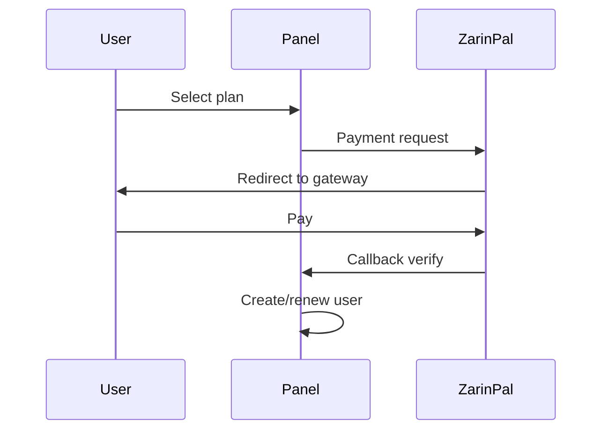

<div align="center">


**VortexUI Wiki**

[Wiki](./README.md) · [FA](../fa/09-plans-payments.md) · [AR](../ar/09-plans-payments.md) · [TR](../tr/09-plans-payments.md)

</div>

<div>

# 9. Plans & Payments

[← Security](./08-security-administration.md) · [Index](./README.md) · [Next: Notifications →](./10-notifications.md)

> [!NOTE]
> After successful payment, a user is auto-created/renewed with the plan parameters.

---

## Plan System

**Plans → New Plan**

| Field | Description |
|-------|-------------|
| Name | Plan name (e.g. "Monthly 50GB") |
| Data limit | Traffic cap |
| Duration days | Subscription period |
| Device limit | Device count |
| Reset strategy | monthly / … |
| Price (Toman) | Rial price |
| Price (USD) | Dollar/crypto price |
| Max users | Sales cap (0 = unlimited) |
| Enabled | Active/inactive |

---

## Orders

**Orders** — order list:

| Status | Meaning |
|--------|---------|
| `pending` | Awaiting payment |
| `paid` | Paid — user created/renewed |
| `failed` | Failed |
| `expired` | Timeout |

---

## ZarinPal Gateway (Rial)

### Configuration

Set ZarinPal-related env variables in `deploy/.env` (Merchant ID and callback URL).

### Payment flow



---

## NowPayments Gateway (Crypto)

### IPN Webhook

```
POST /api/payment/ipn/nowpayments
```

- HMAC-SHA512 signature with `NowPaymentsIPNSecret`
- After verification → automatic activation

---

## Automated Sales

1. Create an active plan
2. Public sales link (in UI/API)
3. After successful payment → user with plan parameters

---

## Reseller + Plans

A reseller can sell plans within their quota — users are recorded under their `admin_id`.

</div>
