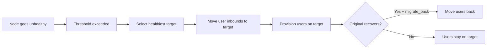

# 16. VortexUI v1.2.0 — New Features Guide

!!! info "Version 1.2.0"
    This page documents all features introduced in VortexUI v1.2.0. Each section explains what the feature does, how to configure it, and common use cases.

---

## Live Monitor

**Location:** Dashboard → Live Monitor

Real-time view of all active connections across your node fleet.

### What you see

| Metric | Description |
|--------|-------------|
| Users Online | Distinct users with at least one active connection |
| Connections | Total active tunnels across all nodes |
| Unique IPs | Distinct client IP addresses |
| Nodes Active | Nodes with at least one connection |

### Connection table

Each row shows:

- **User** — username
- **Node** — which server they're connected to
- **IP** — client source IP
- **Protocol** — VLESS, VMess, Trojan, etc.
- **Duration** — how long the connection has been active

!!! tip
    The monitor polls every 3 seconds. If you see "No active connections", it means no users are currently tunneling traffic — this is normal for a fresh install.

---

## Analytics

**Location:** Dashboard → Analytics

Traffic insights aggregated by country, user, and time of day.

### Time ranges

Select **Last 24h**, **Last 7 days**, or **Last 30 days** from the dropdown.

### Sections

| Section | Shows |
|---------|-------|
| Summary cards | Total upload, total download, number of countries |
| Traffic by Country | Geo breakdown — country, connections, up/down bytes |
| Top Users | Ranked by total traffic consumed |
| Peak Hours | Bar chart of hourly traffic volume |

### Export

Click **Export CSV** to download a spreadsheet of geo + user data for the selected range.

!!! note
    Analytics data comes from the `traffic_geo` table, populated by the node agents. If the table is empty, ensure your nodes are reporting geo data.

---

## CDN/Relay Chains

**Location:** Network & Nodes → CDN/Relay Chains

Hide your real server IP by routing user traffic through intermediate servers before it reaches the node.

### Hop types

| Type | Description | Best for |
|------|-------------|----------|
| **CDN** | Traffic goes through a CDN like Cloudflare | Free IP hiding, requires WebSocket transport |
| **Relay** | Traffic routes through a VPS relay server | When CDN is blocked or you need TCP |
| **Worker** | Uses Cloudflare Workers as relay | Serverless, cost-effective, no dedicated VPS |

### Creating a chain

1. Click **New Chain**
2. Enter a name and select the target node
3. Add hops in order (traffic flows: User → Hop 1 → Hop 2 → … → Node)
4. For each hop, configure:
   - **Type** (CDN / Relay / Worker)
   - **Address** and **Port**
   - **Protocol** (WebSocket / gRPC / TCP)
   - **SNI** and **Path** (for TLS-based transports)

!!! example "Example: Cloudflare CDN relay"
    ```
    Hop 1: CDN — cdn.example.com:443 — WebSocket — SNI: cdn.example.com — Path: /ws
    Target: Your actual node
    ```
    Users connect to Cloudflare, which forwards to your node. Your real IP stays hidden.

---

## Auto-Migration

**Location:** Network & Nodes → Auto-Migration

Automatically move users from unhealthy nodes to healthy ones.

### Policy settings

| Setting | Description | Default |
|---------|-------------|---------|
| Enabled | Turn auto-migration on/off | Off |
| Health check interval | Seconds between health checks | 30 |
| Unhealthy threshold | Consecutive failures before triggering | 3 |
| CPU threshold | Migrate if CPU exceeds this % | 90 |
| Memory threshold | Migrate if RAM exceeds this % | 90 |
| Packet loss max | Migrate if loss exceeds this % | 10 |
| Migrate back | Return users when original node recovers | Yes |

### How it works



### Migration events

The **Events** table shows each migration: timestamp, reason, status (completed/failed), and source/target node names.

---

## Evasion Profiles (DPI Bypass)

**Location:** Security → Evasion Profiles

Pre-configured anti-DPI techniques. Assign a profile to inbounds for one-click censorship evasion.

### Techniques

| Technique | How it works | Effective against |
|-----------|-------------|-------------------|
| **Fragment** | Splits TLS ClientHello into tiny packets | Iran DPI, Russia TSPU |
| **Mux** | Multiplexes connections into one stream | Traffic analysis |
| **Fingerprint** | Mimics real browser TLS (Chrome/Firefox/Safari) | Fingerprint-based blocking |

### Creating a profile

1. Click **New Profile**
2. Enter a name (e.g. "Iran — Fragment + Chrome")
3. Configure:
   - **Fingerprint**: Chrome, Firefox, Safari, Random, Randomized
   - **Fragment**: Enable + set length range (e.g. `10-30`)
   - **Mux**: Enable + select protocol (smux, yamux, h2mux)
4. Save → Assign to inbounds via Inbound settings

!!! tip "Country presets"
    - **Iran**: Fragment `10-30` + Chrome fingerprint
    - **China**: Mux h2mux + Randomized fingerprint
    - **Russia**: Fragment `1-3` + Firefox fingerprint

---

## Probing Protection

**Location:** Security → Probing Protection

Detect and block active probing attempts from censors (like China's GFW).

### What is active probing?

Censors discover proxies by sending "probe" packets. If your server responds like a proxy, it gets blocked. This feature catches those probes.

### Actions

| Action | Behavior |
|--------|----------|
| **Block** | Drop the connection and ban the IP for the configured duration |
| **Honeypot** | Return a fake website (e.g. nginx default page) to fool the prober |
| **Log only** | Record the probe without taking action (monitoring mode) |

### Configuration

1. Enable the protection
2. Set **Action** (Block recommended)
3. Set **Block duration** (default: 3600s = 1 hour)
4. Set **Max probes/min** (trigger threshold — default: 5)
5. Add trusted IPs to the **Whitelist** (your monitoring, CI, etc.)
6. Enable **Telegram notification** to get alerts

### Blocked IPs

View currently blocked IPs and manually unblock if needed.

---

## Client Fingerprint Validation

**Location:** Security → Fingerprint

Block connections based on their TLS ClientHello fingerprint.

### How it works

Every TLS client (browser, app, scanner tool) produces a unique fingerprint in its ClientHello packet. Known scanner tools (curl, Go HTTP, Python requests) have distinctive fingerprints that differ from real browsers.

### Policy

| Setting | Description |
|---------|-------------|
| Enabled | Activate fingerprint checking |
| Default action | What to do with unknown fingerprints: Allow / Block / Log |
| Log unknown | Record connections from unrecognized fingerprints |

### Rules

Create rules to explicitly allow/block specific fingerprints:

| Field | Description |
|-------|-------------|
| Name | Human-readable label (e.g. "Allow Chrome") |
| Fingerprint | Browser/tool name (chrome, firefox, safari, curl, go, python) |
| Action | Allow / Block / Log |
| JA3 Hash | Optional — exact JA3 hash for precision matching |

!!! example
    Block all `curl` and `python` fingerprints (common scanner tools):
    
    - Rule 1: fingerprint=curl, action=block
    - Rule 2: fingerprint=python, action=block

---

## DNS-over-HTTPS (DoH)

**Location:** Security → DNS-over-HTTPS

Built-in DoH server that prevents DNS leaks for your users.

### What it does

- Provides an encrypted DNS endpoint (`/dns-query`)
- Blocks ads and malware at the DNS level
- Caches responses for faster resolution
- Logs queries for debugging (optional)

### Configuration

| Setting | Description | Default |
|---------|-------------|---------|
| Enabled | Turn DoH server on/off | Off |
| Listen address | IP:port to bind | `:8053` |
| Upstream DNS | Resolvers to forward to | `1.1.1.1`, `8.8.8.8` |
| Block ads | Filter ad domains | Off |
| Block malware | Filter malware domains | On |
| Custom blocklist | Your own blocked domains | Empty |
| Log queries | Record all DNS queries | Off |
| Cache TTL | Seconds to cache responses | 300 |

### Stats

The dashboard shows:
- Total queries processed
- Blocked queries count
- Cache hit ratio
- Average resolution latency

---

## SNI Routing & SSL

**Location:** Security → SNI & SSL

Manage multiple domains on your server with automatic SSL certificate provisioning.

### Domains

Register domains that point to your server:

1. Click **Add Domain**
2. Enter the inbound ID and domain name
3. Enable **Auto-provision SSL** for automatic Let's Encrypt certificate

### Certificates

Manually manage SSL certificates:

- **Issue Certificate** — request a new cert (Let's Encrypt / ZeroSSL)
- **Wildcard** — issue `*.domain.com`
- **Auto-renew** — automatically renew before expiry
- **Renew** — manually trigger renewal

---

## Panel Federation

**Location:** Network & Nodes → Federation

Connect multiple VortexUI panels together for distributed management.

### Use cases

- Large deployments with panels in different regions
- Reseller setups where each reseller has their own panel
- High availability — if one panel goes down, others continue

### Configuration

| Setting | Description |
|---------|-------------|
| Enabled | Activate federation |
| Cluster name | Identifier for this cluster |
| Sync interval | How often to sync (seconds) |
| SSO | Enable single sign-on across panels |

### Adding a peer

1. Click **Add Peer**
2. Enter the peer panel's URL (e.g. `https://panel2.example.com`)
3. Enter the API key (generated on the peer panel)
4. Select what to sync: Users, Nodes, or both

### Sync events

View the history of synchronization operations between peers.

---

## Family Groups

**Location:** Users & Billing → Family Groups

Let users share a data pool among family members.

### How it works

1. Admin creates a **Family Group** with a shared data limit
2. Members are added (existing users)
3. Each member's traffic draws from the shared pool
4. Individual member quotas can be set (optional)

### Fields

| Field | Description |
|-------|-------------|
| Name | Group name |
| Owner | The primary user account |
| Data limit | Total shared data pool |
| Max members | How many can join (default: 5) |
| Member quota | Per-member cap within the shared pool |

---

## Referral System

**Location:** Users & Billing → Referrals

Reward users for bringing new customers.

### Admin configuration

| Setting | Description | Default |
|---------|-------------|---------|
| Enabled | Turn referrals on/off | Off |
| Reward type | `data` (extra traffic) or `days` (extra time) | data |
| Reward amount | How much reward per referral | 1 GB |
| Max referrals | Limit per user (0 = unlimited) | 0 |
| Require paid | Only reward for paying referrals | Off |

### How users use it

1. User gets a unique referral code (via Portal)
2. Shares code with friends
3. Friend signs up using the code
4. Both get rewarded (configurable)

---

## Smart Quota

**Location:** Users & Billing → Smart Quota

Fair-use traffic policies with tiered speed/behavior.

### Example tiers

```json
[
  { "threshold_pct": 80, "action": "warn", "speed_limit": 0 },
  { "threshold_pct": 95, "action": "throttle", "speed_limit": 524288 },
  { "threshold_pct": 100, "action": "disable" }
]
```

At 80% usage → warn. At 95% → throttle to 512KB/s. At 100% → disable.

---

## Node Speed Limit & Geo-Blocking

**Location:** Nodes → Edit Node

### Speed limit

Set a per-user download speed cap (bytes/sec):

- `0` = unlimited
- `1048576` = 1 MB/s
- `5242880` = 5 MB/s

### Geo-blocking

Restrict which countries can connect to this node:

- Empty = all countries allowed
- `IR,TR,AE` = only Iran, Turkey, UAE allowed
- Uses ISO 3166-1 alpha-2 country codes

---

## Deep Links & QR Codes

**Location:** System → Deep Links

Generate subscription deep links and QR codes for easy client app setup.

### Configuration

| Setting | Description |
|---------|-------------|
| Base URL | Panel's public URL |
| App scheme | URL scheme for native apps (e.g. `vortex://`) |
| Include name | Add server name to the link |
| QR logo | Custom logo in QR center |

---

## Self-Service Portal

**Location:** `/portal/login` (end-user facing)

A separate interface for end-users to manage their subscription.

### Portal features

| Feature | Description |
|---------|-------------|
| Dashboard | Usage stats, remaining data/time |
| Plans | Browse and purchase subscription plans |
| Tickets | Open support tickets, reply to admin |
| Referral | View/share referral code |

### Admin ticket management

Admins can view all tickets at **Users & Billing → Tickets**, reply, and close them.

---

## Quota Notifications

**Location:** Users & Billing → Quota Alerts

Alert users when they approach their data limit.

### Configuration

| Setting | Description |
|---------|-------------|
| Enabled | Activate notifications |
| Threshold % | When to trigger (e.g. 80%) |
| Telegram | Send via Telegram bot |
| Email | Send via email (if configured) |
| Message template | Custom notification text |

---

## Decoy Website

**Location:** Security → Decoy Website

Show a fake website when someone visits your server's IP directly (without a valid proxy connection).

### Modes

| Mode | Behavior |
|------|----------|
| **Proxy** | Reverse-proxy an existing website (mirrors it) |
| **Static** | Serve custom HTML |

This makes your server look like a normal website to censors and casual visitors.

---

## Reality Scanner

**Location:** Security → Reality Scanner

Find the best SNI domains for REALITY protocol by scanning and scoring candidates.

### How to use

1. Select a node
2. Click **Scan** — tests common domains for TLS 1.3 compatibility and latency
3. Results show: SNI, latency (ms), score, validity
4. Pick the highest-scoring domain for your REALITY inbound

!!! tip
    Good REALITY SNIs typically have: low latency (<200ms), TLS 1.3 support, and stable connections.
