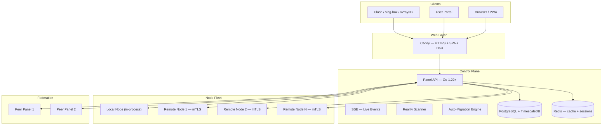

# VortexUI Documentation

<div style="text-align: center; margin: 2rem 0;">
  <strong style="font-size: 1.2rem;">Next-generation proxy management panel</strong><br/>
  <em>Core-agnostic · User-centric · Real-time · Anti-censorship</em>
</div>

---

Welcome to the official VortexUI documentation. This site covers everything from
installation to advanced operations for **VortexUI v1.2.0** — the most feature-rich
release yet, with **17 major features** and **24 UX improvements**.

!!! tip "Quick Install"
    ```bash
    bash <(curl -Ls https://raw.githubusercontent.com/iPmartNetwork/VortexUI/master/install.sh)
    ```
    One command. Interactive setup. HTTPS included.

---

## What's in v1.2.0

<div class="grid cards" markdown>

- :material-account-group: **Self-Service Portal**

    End-users login with their sub token, view usage, purchase renewals, and open support tickets.

- :material-radar: **Reality Scanner**

    Built-in TLS probe — discover optimal SNIs for REALITY with latency scoring.

- :material-speedometer: **Smart Quota**

    Progressive speed reduction instead of hard-cut. Configurable tiers per ISP.

- :material-shield-lock: **Anti-Censorship Suite**

    TLS Tricks (ISP profiles), probing protection, fingerprint validation, decoy websites, DoH.

- :material-sitemap: **Federation**

    Connect multiple panels. Sync users and nodes. Single sign-on across your fleet.

- :material-chart-areaspline: **Advanced Analytics**

    Geo-IP breakdown, top users, peak hours, world map heatmap, CSV export.

</div>

---

## Documentation Map

| Section | What you'll learn |
|---------|-------------------|
| [Introduction](01-introduction.md) | Architecture, core concepts, comparison with other panels |
| [Installation](02-installation.md) | One-line install, Docker, native, node agent setup |
| [First Steps](03-first-steps.md) | Create first admin, add node, add users, verify |
| [Dashboard](04-dashboard.md) | Overview page, real-time charts, system gauges, widgets |
| [Users](05-user-management.md) | CRUD, quotas, families, referrals, portal, subscriptions |
| [Nodes](06-node-management.md) | Fleet management, auto-migration, health monitoring |
| [Network](07-network-policy.md) | Outbounds, routing, balancers, relay chains, SNI routing |
| [Security](08-security-administration.md) | TLS tricks, probing protection, fingerprint, decoy, DoH |
| [Plans & Payments](09-plans-payments.md) | Plan system, gateways, orders, self-service purchase |
| [Notifications](10-notifications.md) | Webhooks, Telegram, quota alerts, notification center |
| [Settings](11-settings-backup.md) | Branding, backup, federation, deep links, updates |
| [API Reference](12-api-reference.md) | OpenAPI 3.0, authentication, endpoints |
| [Protocols](13-protocols-config.md) | VLESS, VMess, Trojan, SS, Hysteria2, TUIC, WireGuard |
| [Operations](14-operations-maintenance.md) | HTTPS, SSE, GeoIP, monitoring, scaling |
| [Troubleshooting](15-troubleshooting-faq.md) | Common issues, FAQ, debug tips |

---

## Architecture



---

## Tech Stack

| Layer | Technology |
|-------|-----------|
| Backend | Go 1.22+, Echo, gRPC, sqlc, pgx |
| Frontend | React 18, TypeScript 5.6, Tailwind CSS, TanStack Query |
| Database | PostgreSQL 16 + TimescaleDB |
| Cache | Redis 7 |
| Proxy Cores | Xray-core, sing-box |
| Web Server | Caddy (auto HTTPS) |
| Transport | gRPC + mTLS (panel ↔ nodes) |
| Notifications | Webhook (HMAC), Telegram Bot API |
| Monitoring | Prometheus metrics + Grafana |

---

## Quick Links

| Resource | Link |
|----------|------|
| GitHub Repository | [github.com/iPmartNetwork/VortexUI](https://github.com/iPmartNetwork/VortexUI) |
| Telegram Channel | [@vortex_ui](https://t.me/vortex_ui) |
| OpenAPI Spec | [openapi.yaml](https://github.com/iPmartNetwork/VortexUI/blob/master/docs/openapi.yaml) |
| Changelog | [CHANGELOG.md](https://github.com/iPmartNetwork/VortexUI/blob/master/CHANGELOG.md) |
| Container Registry | [ghcr.io/ipmartnetwork/vortexui-panel](https://github.com/iPmartNetwork/VortexUI/pkgs/container/vortexui-panel) |
| Bug Reports | [GitHub Issues](https://github.com/iPmartNetwork/VortexUI/issues) |
| Discussions | [GitHub Discussions](https://github.com/iPmartNetwork/VortexUI/discussions) |

---

!!! info "Languages"
    This documentation is available in **English**, **فارسی**, **العربية**, and **Türkçe**.
    Use the language selector in the header to switch.
