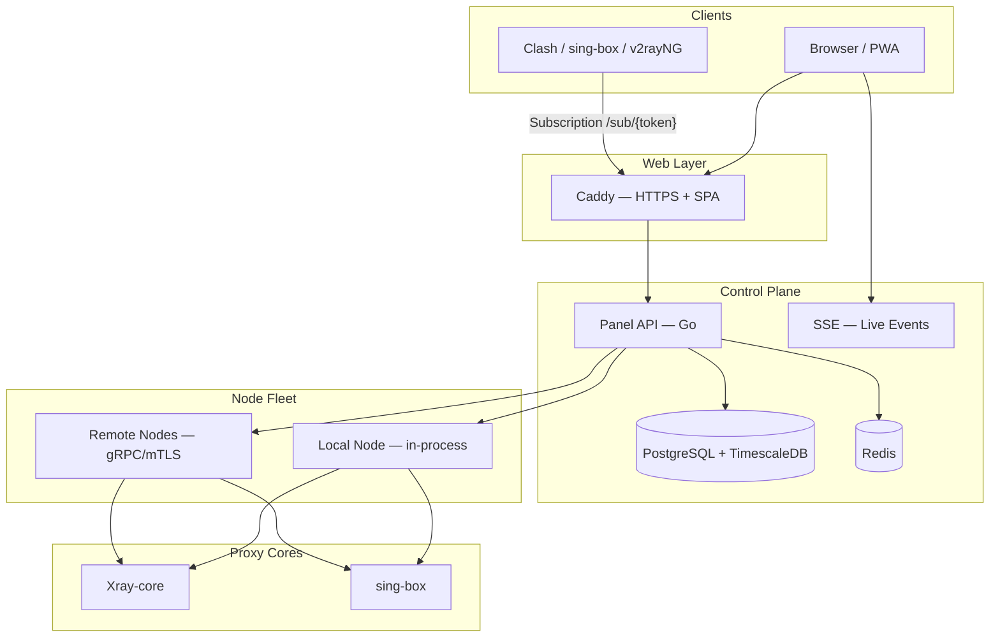

<div align="center" class="wiki-hero">


# 📚 VortexUI Wiki

**Complete guide to installing, configuring, and operating the next-generation proxy management panel**

[](https://github.com/iPmartNetwork/VortexUI/releases)
[](../../../LICENSE)

[← Wiki (4 languages)](./README.md) · [فارسی](../fa/README.md) · [العربية](../ar/README.md) · [Türkçe](../tr/README.md) · [English README](../../../README.md) · [README فارسی](../../../README.fa.md)

</div>

---

## About This Wiki

This wiki is the complete reference for **VortexUI** — an open-source proxy management panel with a Go backend, React/TypeScript frontend, and support for **Xray-core** and **sing-box**. Available in **four languages** (English, فارسی, العربية, Türkçe). It is written for server administrators, VPN service resellers, and developers integrating via the API.

### Architecture Overview



---

## 📖 Table of Contents

### Getting Started

| # | Topic | Description |
|:-:|-------|-------------|
| 1 | [Introduction & core concepts](./01-introduction.md) | What VortexUI is, architecture, comparison with other panels |
| 2 | [Installation](./02-installation.md) | One-line install, Docker, native, prerequisites |
| 3 | [First steps](./03-first-steps.md) | Login, create admin, first inbound and user |

### Panel Guide

| # | Topic | Description |
|:-:|-------|-------------|
| 4 | [Dashboard](./04-dashboard.md) | Live stats, charts, SSE |
| 5 | [User management](./05-user-management.md) | Create users, quotas, subscriptions, import |
| 6 | [Node management](./06-node-management.md) | Local/remote nodes, inbounds, Geo, failover |
| 7 | [Network policy](./07-network-policy.md) | Outbounds, routing, balancers |
| 8 | [Security & administration](./08-security-administration.md) | RBAC, 2FA, API tokens, audit |
| 9 | [Plans & payments](./09-plans-payments.md) | Subscription sales, ZarinPal, NowPayments |
| 10 | [Notifications](./10-notifications.md) | Webhooks, Telegram, events |
| 11 | [Settings & backup](./11-settings-backup.md) | Backup, branding, IP guard |

### Technical Reference

| # | Topic | Description |
|:-:|-------|-------------|
| 12 | [API reference](./12-api-reference.md) | Authentication, endpoints, OpenAPI |
| 13 | [Protocols & configuration](./13-protocols-config.md) | VLESS, REALITY, Hysteria2, examples |
| 14 | [Operations & maintenance](./14-operations-maintenance.md) | `vortexui`, SSL, updates, metrics |
| 15 | [Troubleshooting & FAQ](./15-troubleshooting-faq.md) | Common issues and answers |

---

## ⚡ Quick Access

### One-line install (recommended)

```bash
bash <(curl -Ls https://raw.githubusercontent.com/iPmartNetwork/VortexUI/master/install.sh)
```

### Management console

```bash
vortexui          # interactive menu
vortexui status   # service status
vortexui logs     # view logs
vortexui update   # update panel
```

### Useful links

| Resource | Path |
|----------|------|
| OpenAPI 3.0 | [`docs/openapi.yaml`](../../openapi.yaml) |
| Protocol examples | [`docs/protocols.md`](../../protocols.md) |
| Environment variables | [`.env.example`](../../../.env.example) |
| Docker Compose | [`deploy/compose.yml`](../../../deploy/compose.yml) |
| Changelog | [`CHANGELOG.md`](../../../CHANGELOG.md) |

---

## 🌐 Panel UI Languages

The panel supports **8 languages**: English, فارسی, Türkçe, العربية, Русский, 中文, 日本語, Español — with full **RTL** support for Persian and Arabic.

Change language: **Settings → Language** or from the sidebar menu.

---

## 📄 License

VortexUI is released under **GPL-3.0**. See [LICENSE](../../../LICENSE).
