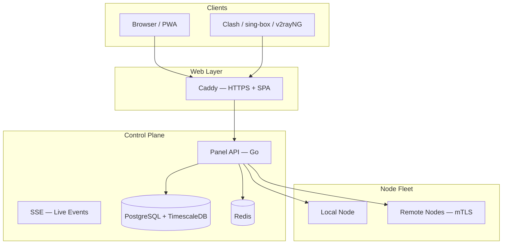

# VortexUI Documentation

Welcome to the official VortexUI guide.

Install, configure, and operate the next-generation proxy panel (Xray + sing-box). Use the **language selector** in the header to switch between English, Persian, Arabic, and Turkish.

!!! tip "Quick install"
    ```bash
    bash <(curl -Ls https://raw.githubusercontent.com/iPmartNetwork/VortexUI/master/install.sh)
    ```

## Architecture



## Useful links

| Resource | Link |
|----------|------|
| OpenAPI | [openapi.yaml on GitHub](https://github.com/iPmartNetwork/VortexUI/blob/master/docs/openapi.yaml) |
| Protocol examples | [protocols.md](https://github.com/iPmartNetwork/VortexUI/blob/master/docs/protocols.md) |
| Repository | [github.com/iPmartNetwork/VortexUI](https://github.com/iPmartNetwork/VortexUI) |
