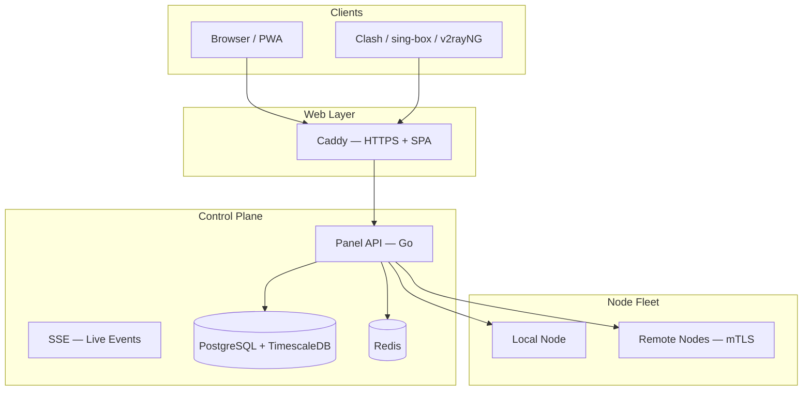

# VortexUI Documentation

Welcome to the official VortexUI guide.

Install, configure, and operate the next-generation proxy panel (Xray + sing-box). Use the **language selector** in the header to switch between English, Persian, Arabic, and Turkish.

!!! tip "Quick install"
    ```bash
    bash <(curl -Ls https://raw.githubusercontent.com/iPmartNetwork/VortexUI/master/install.sh)
    ```

## Documentation map

| Section | Chapters |
|---------|----------|
| Getting started | [Introduction](01-introduction.md) · [Installation](02-installation.md) · [First steps](03-first-steps.md) |
| Panel guide | [Dashboard](04-dashboard.md) · [Users](05-user-management.md) · [Nodes](06-node-management.md) · [Network](07-network-policy.md) |
| Administration | [Security](08-security-administration.md) · [Plans](09-plans-payments.md) · [Notifications](10-notifications.md) · [Settings](11-settings-backup.md) |
| Technical reference | [API](12-api-reference.md) · [Protocols](13-protocols-config.md) · [Operations](14-operations-maintenance.md) · [FAQ](15-troubleshooting-faq.md) |

## Architecture



## Useful links

| Resource | Link |
|----------|------|
| OpenAPI | [openapi.yaml on GitHub](https://github.com/iPmartNetwork/VortexUI/blob/master/docs/openapi.yaml) |
| Protocol examples | [protocols.md](https://github.com/iPmartNetwork/VortexUI/blob/master/docs/protocols.md) |
| Repository | [github.com/iPmartNetwork/VortexUI](https://github.com/iPmartNetwork/VortexUI) |
| Telegram | [@vortex_ui](https://t.me/vortex_ui) |
