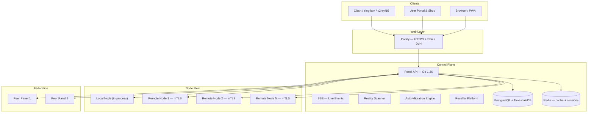

# VortexUI Documentation

<div style="text-align: center; margin: 2rem 0;">
  <strong style="font-size: 1.4rem;">VortexUI v1.2.7</strong><br/>
  <em style="font-size: 1.1rem;">Next-generation proxy management panel — core-agnostic, user-centric, real-time, anti-censorship</em>
</div>

---

<div class="grid cards" markdown>

- :material-account-group: **Self-Service Portal & Shop**

    End-users login with their sub token, view usage, purchase plans from their reseller's shop, and open support tickets.

- :material-cash-register: **Per-Reseller Plans & Payments**

    Each reseller defines their own plans, pricing, and payment methods — card-to-card, crypto, or ZarinPal gateway.

- :material-shield-lock: **Anti-Censorship Suite**

    TLS Tricks, probing protection, fingerprint validation, decoy websites, DoH, WARP+, evasion profiles.

- :material-server-network: **Intelligent Node Fleet**

    Enrollment wizard, auto-migration, health diagnostics, mTLS, live monitoring, Cloudflare DNS automation.

- :material-chart-areaspline: **Advanced Analytics**

    Geo-IP breakdown, top users, peak hours, world map heatmap, CSV export, real-time gauges.

- :material-sitemap: **Reseller Platform**

    Wallet billing, sub-resellers, whitelabel branding, webhooks, policy limits, auto-suspend, scoped allowlists.

</div>

---

!!! tip "Quick Install"
    ```bash
    bash <(curl -Ls https://raw.githubusercontent.com/iPmartNetwork/VortexUI/master/install.sh)
    ```
    One command. Interactive setup. HTTPS included.

---

## Documentation Map

| Section | What you'll learn |
|---------|-------------------|
| [Introduction](01-introduction.md) | Architecture, feature overview, comparison, supported protocols |
| [Installation](02-installation.md) | One-line install, Docker, native build, node agent setup |
| [First Steps](03-first-steps.md) | Login, add node, create inbound, add user, verify |
| [Dashboard](04-dashboard.md) | Widgets, analytics, monitor, command palette |
| [Users](05-user-management.md) | CRUD, quotas, subscriptions, portal, shop, families, referrals |
| [Nodes](06-node-management.md) | Enrollment, health, auto-migration, monitoring, DNS automation |
| [Network](07-network-policy.md) | Outbounds, routing packs, CDN chains, load balancers, federation |
| [Security](08-security-administration.md) | RBAC, reseller platform, TLS tricks, probing protection, IP-limit |
| [Plans & Payments](09-plans-payments.md) | Per-reseller plans, payment config, shop, wallet billing, orders |
| [Notifications](10-notifications.md) | Webhooks, Telegram, quota alerts, SSE events |
| [Settings](11-settings-backup.md) | Branding, whitelabel, backup, deep links, updates |
| [API Reference](12-api-reference.md) | Authentication, endpoints, OpenAPI spec |
| [Protocols](13-protocols-config.md) | 14 protocols, transports, security layers, capability matrix |
| [Operations](14-operations-maintenance.md) | HTTPS, Prometheus, scaling, database, performance |
| [Troubleshooting](15-troubleshooting-faq.md) | Common issues, debug tips, FAQ |

---

## Architecture



---

## Tech Stack

| Layer | Technology |
|-------|-----------|
| Backend | Go 1.26, Echo, gRPC, sqlc, pgx |
| Frontend | React 18, TypeScript 5.6, Tailwind CSS, TanStack Query |
| Database | PostgreSQL 16 + TimescaleDB |
| Cache | Redis 7 |
| Proxy Cores | Xray-core, sing-box |
| Web Server | Caddy (auto HTTPS) |
| Transport | gRPC + mTLS (panel ↔ nodes) |
| Notifications | Webhook (HMAC-SHA256), Telegram Bot API |
| Monitoring | Prometheus metrics + Grafana |

---

## Quick Links

| Resource | Link |
|----------|------|
| GitHub Repository | [github.com/iPmartNetwork/VortexUI](https://github.com/iPmartNetwork/VortexUI) |
| Telegram Channel | [@vortex_ui](https://t.me/vortex_ui) |
| OpenAPI Spec | [openapi.yaml](https://github.com/iPmartNetwork/VortexUI/blob/master/docs/openapi.yaml) |
| Changelog | [CHANGELOG.md](https://github.com/iPmartNetwork/VortexUI/blob/master/CHANGELOG.md) |
| Bug Reports | [GitHub Issues](https://github.com/iPmartNetwork/VortexUI/issues) |
| Discussions | [GitHub Discussions](https://github.com/iPmartNetwork/VortexUI/discussions) |

---

!!! info "Languages"
    This documentation is available in **English**, **فارسی**, **العربية**, and **Türkçe**.
    Use the language selector in the header to switch.
