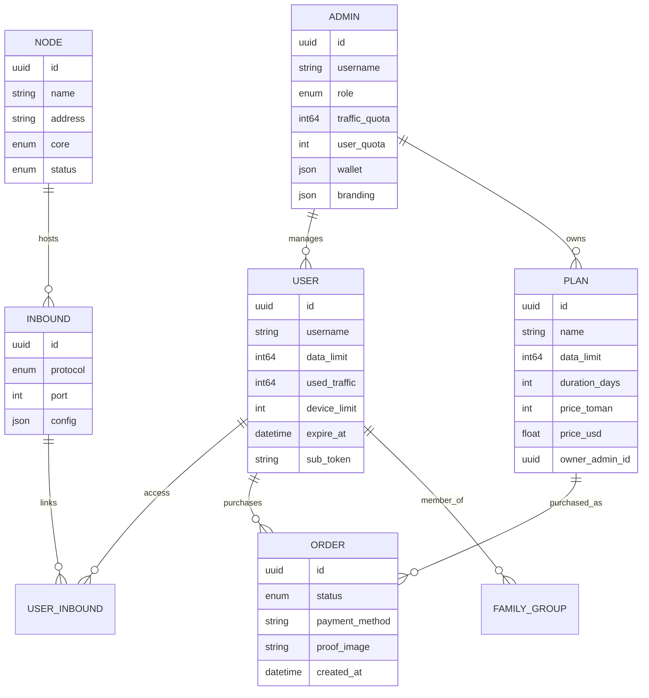

# معرفی

!!! abstract "خلاصه"
    VortexUI یک پنل مدیریت پروکسی **کاربرمحور** و **مستقل از هسته** است که از
    Xray-core و sing-box پشتیبانی می‌کند. مدیریت کاربران، نودها، ترافیک، اشتراک‌ها، پرداخت‌ها،
    نمایندگی‌ها و ابزارهای ضد سانسور همگی از یک رابط مدرن قابل انجام است.

---

## VortexUI چیست؟

**VortexUI** یک پنل مدیریت پروکسی نسل جدید است که برای اپراتورهایی ساخته شده که نیاز دارند به:

- **مقیاس‌پذیری** — مدیریت هزاران کاربر در ده‌ها نود
- **تاب‌آوری** — فیل‌اور خودکار، مانیتورینگ سلامت، ناوگان خودترمیم نود
- **ضد سانسور** — ترفندهای TLS مختص ISP، حفاظت پروب، سایت فریبنده، +WARP
- **سلف‌سرویس** — کاربران نهایی اکانت خود را مدیریت کرده، پلن خریداری و تیکت ارسال می‌کنند
- **درآمدزایی** — پلن‌های اختصاصی ریسلر، درگاه‌های پرداخت متعدد، کیف پول، برنامه رفرال
- **تفویض اختیار** — پلتفرم کامل نمایندگی با زیرنمایندگی، وایت‌لیبل، محدودیت‌های سیاستی

بر خلاف پنل‌های اینباندمحور (مثل 3x-ui)، VortexUI از مدل **کاربرمحور** استفاده می‌کند: یک هویت کاربری
دسترسی به تمام پروتکل‌های اختصاص‌داده‌شده در همه نودها را به‌صورت همزمان فراهم می‌کند.

---

## نمای کلی ویژگی‌ها

### موتور و زیرساخت

| قابلیت | جزئیات |
|--------|--------|
| پشتیبانی از دو هسته | Xray-core و sing-box — انتخاب به ازای هر نود |
| ارسال دلتای ترافیک | مقاوم در برابر ریستارت، بدون شمارش مضاعف، هرگز داده از دست نمی‌دهد |
| ناوگان نود با mTLS | اتصالات رمزنگاری‌شده، فیل‌اور خودکار، بازگشت مهاجرت |
| ویزارد ثبت‌نام نود | فرآیند چهار مرحله‌ای UI برای اضافه‌کردن نودهای ریموت |
| مهاجرت خودکار | انتقال خودکار کاربران از نودهای ناسالم |
| فدراسیون | همگام‌سازی کاربران/نودها بین چندین پنل |
| نود محلی | هسته درون‌پروسسی — نیازی به ایجنت جداگانه نیست |
| زنجیره‌های CDN/Relay | مسیرهای چند هاپ با CDN، ریلی و ورکر |
| بالانسرها | ۴ استراتژی با بررسی سلامت |
| اتوماسیون DNS کلادفلر | مدیریت خودکار رکوردهای DNS برای نودها |

### امنیت و ضد سانسور

| قابلیت | جزئیات |
|--------|--------|
| اسکنر Reality | کشف SNI‌های بهینه با امتیازدهی تأخیر |
| مدیریت ترفندهای TLS | پروفایل‌های مختص ISP (فرگمنت، مالتی‌پلکس، پدینگ) |
| حفاظت پروب | شناسایی و مسدود کردن پروب‌های فعال GFW |
| اعتبارسنجی فینگرپرینت | فیلتر کلاینت بر اساس JA3 |
| وب‌سایت فریبنده | نمایش سایت جعلی به کاوشگرها (حالت پروکسی یا ایستا) |
| DNS-over-HTTPS | سرور DoH داخلی با مسدودسازی تبلیغات/بدافزار |
| پروفایل‌های دورزنی | پیش‌تنظیم‌های ضد DPI قابل استفاده مجدد برای هر کشور |
| یکپارچگی +WARP | اوتباند کلادفلر برای IP تمیز |
| اسکنر Clean-IP | یافتن بهترین IP‌های لبه CDN با امتیازدهی تأخیر/افت |
| محدودیت IP | سقف IP همزمان هر کاربر با عملیات قابل تنظیم |
| مسدودسازی جغرافیایی | محدودیت کشور به ازای هر اینباند |
| محافظ اشتراک‌گذاری اکانت | شناسایی و اقدام در برابر اشتراک‌گذاری اعتبارنامه |

### مدیریت کاربران و تجارت

| قابلیت | جزئیات |
|--------|--------|
| پورتال سلف‌سرویس | ورود با توکن اشتراک، مشاهده مصرف، تیکت |
| فروشگاه سلف‌سرویس | پلن‌های اختصاصی ریسلر با پرداخت کارت/رمزارز/زرین‌پال |
| سهمیه هوشمند | کاهش تدریجی سرعت (سطوح مصرف منصفانه) |
| گروه خانواده | استخر داده مشترک برای چندین کاربر |
| سیستم رفرال | کد دعوت با پاداش حجم/روز |
| پلن‌های اختصاصی ریسلر | هر ریسلر پلن‌ها و قیمت‌گذاری خود را ایجاد می‌کند |
| درگاه‌های پرداخت | زرین‌پال (آنلاین)، کارت‌به‌کارت (آپلود فیش)، رمزارز (هش TX) |
| کیف پول | سیستم اعتبار ریسلر با صف شارژ |
| هاست سابسکریپشن | بازنویسی آدرس/CDN به ازای هر اینباند با متغیرهای قالب |
| دیپ‌لینک + QR | وارد‌کردن اشتراک با یک لمس |
| قالب‌های کانفیگ | مسیریابی سفارشی Clash/sing-box به ازای هر کاربر |
| ابزارهای ایمپورت | مهاجرت از 3x-ui یا Marzban |

### مدیریت و پلتفرم نمایندگی

| قابلیت | جزئیات |
|--------|--------|
| RBAC + نقش‌ها | دسترسی‌های دقیق به ازای هر ادمین |
| پلتفرم کامل نمایندگی | کیف پول، زیرنمایندگی، وایت‌لیبل، وب‌هوک، محدودیت سیاستی |
| لیست‌سفید محدوده‌ای | محدودیت پلن/نود/اینباند به ازای هر ریسلر |
| تعلیق خودکار | تعلیق خودکار ریسلر در صورت تخلف |
| لاگ حسابرسی | ردیابی تمام اقدامات ادمین با diff |
| اعلان سهمیه | آستانه‌های قابل تنظیم برای هشدار ریسلرها |
| بکاپ خودکار | صدور زمان‌بندی‌شده به تلگرام یا S3 |
| متریک‌های Grafana | اندپوینت Prometheus + داشبورد آماده |

### فرانتند و تجربه کاربری

| قابلیت | جزئیات |
|--------|--------|
| پالت دستور | Ctrl+K جستجوی فازی در همه جا |
| ویجت‌های داشبورد | درگ و دراپ، تغییر اندازه، سفارشی‌سازی چیدمان |
| نقشه جهان | تصویرسازی جغرافیایی ترافیک |
| نمودارهای بلادرنگ | نمایشگرهای متحرک CPU/RAM/پهنای‌باند |
| صفحه مانیتور | جدول اتصالات زنده (کاربر، نود، IP، پروتکل، مدت) |
| تحلیل‌ها | تفکیک جغرافیایی، کاربران برتر، ساعات اوج، خروجی CSV |
| تور آشنایی | راهنمای اولین بار برای ادمین |
| ۸ زبان | EN/FA/TR/AR/RU/ZH/JA/ES با پشتیبانی کامل RTL |
| تم تاریک + روشن | انتقال صاف و متحرک تم |
| پورتال موبایل | ناوبری پایین، بالاکشیدن برای رفرش، شیت‌های پایین |

---

## معماری

```
┌──────────────────────────────────────────────────────────────┐
│  Caddy (لایه وب)      — HTTPS, SPA, پروکسی معکوس, DoH      │
├──────────────────────────────────────────────────────────────┤
│  Panel (Go 1.26)       — REST API, SSE, gRPC hub, زمان‌بند  │
│  ├─ Auth               — JWT + TOTP + توکن‌های پورتال       │
│  ├─ Services           — کاربر، نود، پلن، سفارش، تحلیل     │
│  ├─ Hub                — مدیریت ناوگان نود + فیل‌اور        │
│  ├─ Scanner            — Reality SNI prober + Clean-IP       │
│  ├─ Migration          — توزیع مجدد کاربران بر اساس سلامت  │
│  ├─ Reseller           — کیف پول، پلن، برندسازی، وب‌هوک    │
│  └─ Federation         — همگام‌سازی بین‌پنلی                │
├──────────────────────────────────────────────────────────────┤
│  PostgreSQL + TimescaleDB — داده + سری‌زمانی ترافیک         │
│  Redis                    — کش، جلسات، ردیاب دستگاه         │
├──────────────────────────────────────────────────────────────┤
│  Node Agent (gRPC)     — اجرای ریموت هسته + سلامت           │
│  Local Node            — درون‌پروسسی روی هاست پنل           │
└──────────────────────────────────────────────────────────────┘
```



---

## مقایسه با سایر پنل‌ها

| ویژگی | VortexUI 1.2.7 | 3x-ui | Marzban | Hiddify |
|--------|:--:|:--:|:--:|:--:|
| دو هسته (Xray + sing-box) | ✅ | ❌ | ❌ | ✅ |
| مدل کاربرمحور | ✅ | ❌ | ✅ | ✅ |
| ارسال دلتای ترافیک | ✅ | polling | polling | polling |
| مهاجرت خودکار نود | ✅ | ❌ | ❌ | ❌ |
| بالانسر (۴ استراتژی) | ✅ | ❌ | ❌ | ❌ |
| اسکنر Reality | ✅ | ❌ | ❌ | ❌ |
| ترفندهای TLS (پروفایل ISP) | ✅ | ❌ | ❌ | جزئی |
| حفاظت پروب | ✅ | ❌ | ❌ | ❌ |
| فینگرپرینت کلاینت (JA3) | ✅ | ❌ | ❌ | ❌ |
| وب‌سایت فریبنده | ✅ | ❌ | ❌ | ❌ |
| DNS-over-HTTPS | ✅ | ❌ | ❌ | ❌ |
| پورتال سلف‌سرویس | ✅ | ❌ | ❌ | ✅ |
| فروشگاه اختصاصی ریسلر | ✅ | ❌ | ❌ | ❌ |
| درگاه‌های پرداخت (چند روش) | ✅ | ❌ | ❌ | جزئی |
| پلن و قیمت‌گذاری اختصاصی ریسلر | ✅ | ❌ | ❌ | ❌ |
| هاست‌های سابسکریپشن (بازنویسی) | ✅ | ❌ | ✅ | ❌ |
| گروه خانواده | ✅ | ❌ | ❌ | ❌ |
| سیستم رفرال | ✅ | ❌ | ❌ | ❌ |
| فدراسیون | ✅ | ❌ | ❌ | ❌ |
| سهمیه هوشمند | ✅ | ❌ | ❌ | ❌ |
| زنجیره‌های CDN/Relay | ✅ | ❌ | ❌ | ❌ |
| کیف پول ریسلر | ✅ | ❌ | ❌ | ❌ |
| دیپ‌لینک | ✅ | ❌ | ❌ | ✅ |
| تحلیل‌ها (جغرافیایی + خروجی) | ✅ | ❌ | ❌ | ❌ |
| ویجت‌های داشبورد (درگ و دراپ) | ✅ | ❌ | ❌ | ❌ |
| پالت دستور (Ctrl+K) | ✅ | ❌ | ❌ | ❌ |
| بکند | Go | Go | Python | Python |
| دیتابیس | PG + TimescaleDB | SQLite | SQLite | SQLite |

---

## پروتکل‌های پشتیبانی‌شده

| پروتکل | هسته | اینباند | اوتباند | ترنسپورت | امنیت |
|---------|------|:-------:|:-------:|-----------|-------|
| VLESS | هر دو | ✅ | ✅ | TCP, WS, gRPC, HTTPUpgrade, xHTTP, mKCP | None, TLS, REALITY |
| VMess | هر دو | ✅ | ✅ | TCP, WS, gRPC, HTTPUpgrade, mKCP | None, TLS |
| Trojan | هر دو | ✅ | ✅ | TCP, WS, gRPC, mKCP | TLS, REALITY |
| Shadowsocks | هر دو | ✅ | ✅ | TCP (+ SS-2022 چند کاربره) | None |
| Hysteria2 | sing-box | ✅ | ✅ | UDP (QUIC) | TLS |
| TUIC | sing-box | ✅ | ✅ | UDP (QUIC) | TLS |
| WireGuard | sing-box | ✅ | ✅ | UDP | Native |
| Hysteria (v1) | sing-box | ✅ | — | UDP | TLS |
| ShadowTLS | sing-box | ✅ | ✅ | TCP | TLS |
| AnyTLS | sing-box | ✅ | — | TCP | TLS |
| Naive | sing-box | ✅ | — | — | TLS (اجباری) |
| SOCKS | هر دو | ✅ | ✅ | TCP (بدون ترنسپورت) | plaintext |
| HTTP | هر دو | ✅ | ✅ | TCP (بدون ترنسپورت) | plaintext |
| Dokodemo | Xray | ✅ | — | — | plaintext |

**فرمت‌های خروجی سابسکریپشن:** `base64`، `clash`، `singbox`، `xray`، `outline`، `links`
(تشخیص خودکار از User-Agent کلاینت، یا اجبار با `?format=`).

---

## اصطلاحات کلیدی

| اصطلاح | معنی |
|--------|------|
| **پنل** | سرور کنترل — API، رابط کاربری، دیتابیس، زمان‌بندها |
| **نود** | سروری که هسته پروکسی (Xray یا sing-box) اجرا می‌کند |
| **نود محلی** | هسته درون‌پروسسی روی همان ماشین پنل |
| **اینباند** | نقطه ورود کلاینت (پروتکل + پورت + تنظیمات) |
| **اوتباند** | مسیر خروجی (freedom، زنجیره پروکسی، WARP، blackhole) |
| **سابسکریپشن** | `/sub/{token}` — کانفیگ تشخیص‌خودکار برای هر اپ کلاینت |
| **هاست سابسکریپشن** | بازنویسی آدرس/SNI به ازای هر اینباند برای CDN fronting |
| **پورتال** | رابط وب سلف‌سرویس کاربر نهایی |
| **فروشگاه** | صفحه خرید پلن اختصاصی ریسلر (`/sub/{token}/shop`) |
| **هاب** | کامپوننت داخلی مدیریت اتصالات نودها |
| **فدراسیون** | اتصال چندین پنل برای همگام‌سازی کاربر/نود |
| **زنجیره ریلی** | مسیر چند هاپ: کلاینت → CDN → ریلی → نود |
| **سهمیه هوشمند** | سیاست مصرف منصفانه با سطوح تدریجی سرعت |
| **بسته مسیریابی** | مجموعه نام‌گذاری‌شده و قابل استفاده مجدد از قوانین مسیریابی |
| **پروفایل دورزنی** | پیش‌تنظیم ضد DPI (فرگمنت + فینگرپرینت + مالتی‌پلکس) |
| **SSE** | Server-Sent Events — بروزرسانی بلادرنگ UI بر پایه push |
| **ریسلر** | ادمین با دسترسی محدود، کیف پول، پلن/کاربران اختصاصی |
| **وایت‌لیبل** | برندسازی اختصاصی ریسلر (لوگو، رنگ‌ها، عنوان) |

---

## قدم‌های بعدی

1. **[نصب](02-installation.md)** — VortexUI را در ۵ دقیقه راه‌اندازی کنید
2. **[شروع سریع](03-first-steps.md)** — ورود، افزودن نود، ایجاد اولین کاربر
3. **[داشبورد](04-dashboard.md)** — بررسی نمای کلی بلادرنگ
