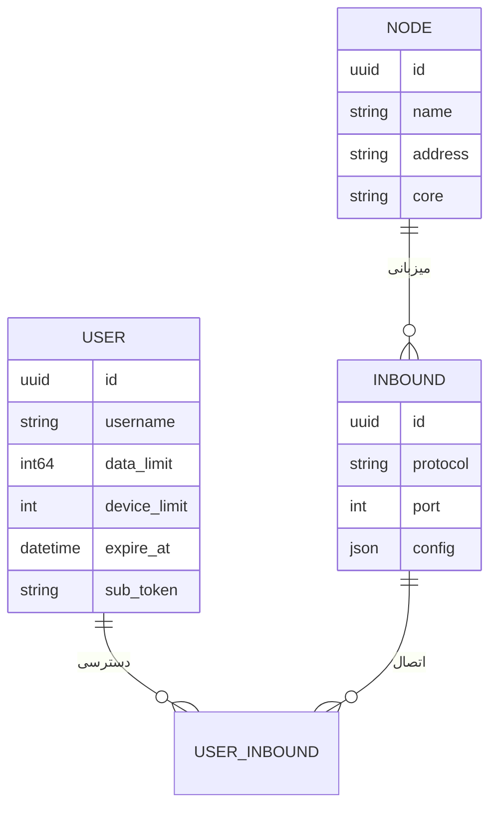

<div align="center" dir="rtl">


**VortexUI Wiki**

[Wiki](./README.md) · [EN](../en/01-introduction.md) · [AR](../ar/01-introduction.md) · [TR](../tr/01-introduction.md)

</div>

<div dir="rtl">

# ۱. معرفی و مفاهیم پایه

[← بازگشت به فهرست](./README.md) · [بعدی: نصب →](./02-installation.md)

> [!NOTE]
> VortexUI مدل **کاربر‌محور** دارد — یک subscription برای همه inboundها.

---

## VortexUI چیست؟

**VortexUI** یک پنل مدیریت پروکسی نسل جدید است که برای مدیریت کاربران، نودها، inbound/outbound، مسیریابی و فروش اشتراک طراحی شده. برخلاف پنل‌های inbound‌محور (مثل 3x-ui)، VortexUI از **مدل کاربر‌محور** استفاده می‌کند: هر کاربر یک هویت واحد دارد و به چند پروتکل/inbound دسترسی می‌گیرد.

### ویژگی‌های کلیدی

| حوزه | قابلیت |
|------|--------|
| **هسته** | Xray-core و sing-box — انتخاب جداگانه برای هر نود |
| **ترافیک** | حساب‌داری مبتنی بر **دلتای push** (مقاوم در برابر restart) |
| **چند‌نودی** | اتصال mTLS، failover خودکار، migrate-back |
| **شبکه** | Outbound، Routing، Balancer، Observatory |
| **امنیت** | JWT + TOTP 2FA، RBAC، Audit Log، ضد اشتراک‌گذاری |
| **فروش** | پلن، ZarinPal، NowPayments (کریپتو) |
| **UI** | React 18، ۸ زبان، تم تیره/روشن، SSE زنده، PWA |

---

## معماری

### اجزای اصلی

```
┌─────────────────────────────────────────────────────────┐
│  Caddy (web)          — HTTPS، SPA، reverse proxy       │
├─────────────────────────────────────────────────────────┤
│  Panel (cmd/panel)    — API، SSE، مدیریت، DB           │
├─────────────────────────────────────────────────────────┤
│  PostgreSQL/TimescaleDB — داده پایدار + سری زمانی ترافیک│
│  Redis                  — کش و session                  │
├─────────────────────────────────────────────────────────┤
│  Node Agent (cmd/node) — gRPC server، اجرای هسته        │
│  Local Node            — هسته in-process روی همان سرور  │
└─────────────────────────────────────────────────────────┘
```

### مدل داده: کاربر‌محور



یک **User** می‌تواند به چند **Inbound** روی چند **Node** متصل شود. لینک اشتراک (`/sub/{token}`) همه کانفیگ‌ها را در یک فایل Clash/sing-box/base64 برمی‌گرداند.

---

## مقایسه با پنل‌های دیگر

| قابلیت | VortexUI | 3x-ui | Marzban | Hiddify |
|--------|:--------:|:-----:|:-------:|:-------:|
| هسته Xray + sing-box | ✅ | Xray | Xray | ✅ |
| مدل کاربر‌محور | ✅ | ❌ | ✅ | ✅ |
| ترافیک push/delta | ✅ | polling | polling | polling |
| Balancer + Routing | ✅ | ❌ | ❌ | ❌ |
| Outbound CRUD | ✅ | جزئی | ❌ | ❌ |
| API Token + Audit | ✅ | ❌ | ❌ | ❌ |
| ضد اشتراک‌گذاری | ✅ | جزئی | ❌ | ❌ |
| HTTPS خودکار | ✅ Caddy | ❌ | ❌ | ✅ |
| Geo ایران | ✅ | ❌ | ❌ | جزئی |
| پایگاه‌داده | PG+Timescale | SQLite/PG | SQLite | SQLite |

---

## پروتکل‌های پشتیبانی‌شده

| پروتکل | Inbound | Outbound | ترنسپورت |
|--------|:-------:|:--------:|----------|
| VLESS | ✅ | ✅ | TCP, WS, gRPC, HTTPUpgrade |
| VMess | ✅ | ✅ | TCP, WS, gRPC |
| Trojan | ✅ | ✅ | TCP, WS, gRPC |
| Shadowsocks | ✅ | ✅ | TCP |
| SOCKS / HTTP | — | ✅ | TCP |
| Hysteria2 | ✅ (sing-box) | — | UDP |
| TUIC | ✅ (sing-box) | — | UDP |
| WireGuard | ✅ | — | UDP |

**لایه امنیت:** None، TLS، REALITY

---

## مفاهیم مهم

| اصطلاح | معنی |
|--------|------|
| **Panel** | سرور کنترل — API، UI، DB |
| **Node** | سروری که هسته پروکسی را اجرا می‌کند |
| **Local Node** | نود in-process روی همان ماشین پنل |
| **Inbound** | نقطه ورود کلاینت (VLESS روی پورت 443 و …) |
| **Outbound** | مسیر خروج ترافیک (freedom، proxy chain، WARP) |
| **Subscription** | لینک `/sub/{token}` برای import در کلاینت |
| **Failover** | انتقال خودکار کاربران به نود سالم |
| **SSE** | به‌روزرسانی زنده UI بدون polling |

---

## نقشه راه (خلاصه)

بیشتر قابلیت‌های roadmap پیاده‌سازی شده‌اند: Cluster mode، Grafana/Prometheus، Auto-backup، Telegram bot کاربر، WireGuard، Geo-blocking، Branding، PWA و غیره.

موارد در دست توسعه:
- اپ موبایل React Native
- مستندات چندزبانه (این ویکی گام اول است)
- Rate limiting per user روی proxy

</div>
