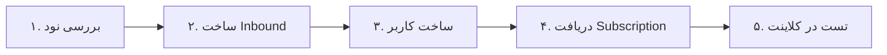

<div align="center" dir="rtl">


**VortexUI Wiki**

[Wiki](./README.md) · [EN](../en/03-first-steps.md) · [AR](../ar/03-first-steps.md) · [TR](../tr/03-first-steps.md)

</div>

<div dir="rtl">

# ۳. اولین قدم‌ها

[← نصب](./02-installation.md) · [فهرست](./README.md) · [بعدی: داشبورد →](./04-dashboard.md)

> [!TIP]
> کل این گردش کار را در **۵ دقیقه** انجام دهید: نود → inbound → user → subscription → تست.

<div align="center">

| Light | Dark |
|:-----:|:----:|
|  |  |

*نمای کلی پنل — حالت روشن*

</div>

---

## ورود به پنل

1. URL نصب را در مرورگر باز کنید (مثلاً `https://panel.example.com`)
2. با نام کاربری و رمز ادمینی که در نصب ساخته شد وارد شوید
3. در صورت فعال بودن 2FA، کد ۶ رقمی authenticator را وارد کنید

### ساخت ادمین جدید (CLI)

```bash
# Docker
docker compose -f deploy/compose.yml exec panel \
  /usr/local/bin/panel admin create --username admin2 --password 'pass' --sudo

# Native
./bin/panel admin create --username admin2 --password 'pass' --sudo

# یا از vortexui
vortexui admin
```

---

## گردش کار اولیه (۵ دقیقه)



### گام ۱: بررسی نود

- منو → **Nodes (نودها)**
- نود `local` (یا نود اضافه‌شده) باید **سبز** و Core Running باشد
- CPU/RAM/Disk و تعداد اتصالات را ببینید

### گام ۲: ساخت Inbound

1. روی نود → **Inbounds**
2. **Add Inbound**
3. مثال سریع VLESS + REALITY:

| فیلد | مقدار |
|------|-------|
| Protocol | `vless` |
| Port | `443` |
| Network | `tcp` |
| Security | `reality` |
| Flow | `xtls-rprx-vision` |
| SNI | `www.microsoft.com` |

4. در بخش REALITY روی **Generate** کلیک کنید (کلید خصوصی/عمومی)
5. ذخیره — هسته به‌صورت hot-reload کانفیگ را می‌گیرد

> جزئیات پروتکل‌ها: [فصل ۱۳ — پروتکل‌ها](./13-protocols-config.md)

### گام ۳: ساخت کاربر

1. منو → **Users (کاربران)** → **New User**
2. فیلدهای پیشنهادی:

| فیلد | مثال |
|------|------|
| Username | `testuser` |
| Data limit | `50 GB` |
| Expire | ۳۰ روز |
| Device limit | `3` |
| Inbounds | inbound ساخته‌شده را انتخاب کنید |

3. **Save**

### گام ۴: دریافت Subscription

1. در لیست کاربران → آیکون **Subscription** (یا QR)
2. لینک‌های زیر را کپی کنید:

| فرمت | کاربرد |
|------|--------|
| Base64 | v2rayNG، Nekoray |
| Clash | Clash Meta / Mihomo |
| sing-box | sing-box client |
| QR Code | اسکن موبایل |

3. صفحه عمومی کاربر: `https://panel.example.com/sub/info/{token}` — نمودار ترافیک و QR

### گام ۵: تست

1. لینک را در کلاینت import کنید
2. اتصال برقرار کنید
3. در پنل → **Users** → Usage — ترافیک باید افزایش یابد (SSE زنده)

---

## تنظیمات اولیه پیشنهادی

| تنظیم | مسیر | چرا |
|-------|------|-----|
| تغییر رمز | Settings → Password | امنیت |
| فعال 2FA | Settings → 2FA | محافظت اکانت |
| Geo ایران | Nodes → Update Geo | مسیریابی IR |
| Webhook/TG | env + restart | اعلان رویدادها |
| Backup | Settings → Backup | بازیابی فاجعه |

---

## import کاربران از پنل دیگر

**Users → Import** — پشتیبانی از:
- **3x-ui** (JSON export)
- **Marzban** (JSON export)

کاربران با UUID و سهمیه منتقل می‌شوند؛ inboundها باید جداگانه map شوند.

---

## میانبرهای UI

| عمل | مسیر |
|-----|------|
| تم تیره/روشن | نوار کناری → آیکون ماه/خورشید |
| زبان | Settings → Language |
| جستجوی کاربر | Users → search box |
| لاگ نود | Nodes → Logs |
| رویدادهای زنده | خودکار — toast در گوشه |

</div>
