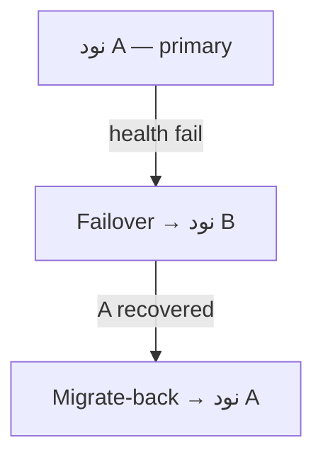

<div align="center" dir="rtl">


**VortexUI Wiki**

[Wiki](../README.md) · [EN](../en/06-node-management.md) · [AR](../ar/06-node-management.md) · [TR](../tr/06-node-management.md)

</div>

<div dir="rtl">

# ۶. مدیریت نودها

[← کاربران](./05-user-management.md) · [فهرست](./README.md) · [بعدی: سیاست شبکه →](./07-network-policy.md)

> [!TIP]
> برای مسیریابی ایران از **Nodes → Update Geo** استفاده کنید.

<div align="center">

| Light | Dark |
|:-----:|:----:|
|  |  |

*صفحه Nodes — مانیتورینگ CPU/RAM و عملیات نود*

</div>

---

## انواع نود

| نوع | توضیح | کاربرد |
|-----|-------|--------|
| **Local Node** | هسته in-process روی سرور پنل | سرور تک‌نودی |
| **Remote Node** | Agent جدا با gRPC/mTLS | fleet چند سرور |

---

## افزودن نود راه‌دور

1. **Nodes → Add Node**
2. فیلدها:

| فیلد | مثال |
|------|------|
| Name | `de-fra-01` |
| Address | `203.0.113.10:50051` |
| Core | `xray` یا `singbox` |
| Endpoint | آدرس عمومی برای subscription (CDN/tunnel) |

3. گواهی mTLS از `deploy/certs/` را روی agent کپی کنید
4. Agent را start کنید — status سبز می‌شود

---

## مانیتورینگ سلامت

هر کارت نود نمایش می‌دهد:

| متریک | آستانه هشدار UI |
|-------|-----------------|
| CPU % | >60% زرد، >85% قرمز |
| RAM % | همان |
| Disk % | همان |
| Connections | تعداد فعال |
| Last seen | آخرین heartbeat |

---

## عملیات نود

| دکمه | عمل |
|------|-----|
| **Inbounds** | CRUD inbound این نود |
| **Logs** | استریم زنده لاگ هسته |
| **Restart Core** | reload بدون down طولانی |
| **Stop Core** | توقف موقت |
| **Update Geo** | دانلود geoip/geosite ایران |
| **Edit / Delete** | ویرایش metadata / حذف |

---

## Inbound

**Nodes → Inbounds → Add**

- پروتکل، پورت، network، security
- REALITY: Generate keypair
- JSON editor پیشرفته
- Share link import
- **Bandwidth limit** per inbound
- **Geo-blocking** per inbound
- **Evasion profile** link

---

## Failover و Migrate-back



- کاربران به نود سالم منتقل می‌شوند
- پس از بازیابی، بازگشت خودکار (قابل تنظیم)

---

## Custom Endpoint

وقتی IP واقعی سرور با آدرسی که کلاینت می‌بیند فرق دارد (CDN، reverse tunnel):

```
Endpoint: cdn.example.com
```

subscription این host را advertise می‌کند نه `address` داخلی.

---

## Cloudflare DNS Automation

با تنظیم:

```env
VORTEX_CF_API_TOKEN=...
VORTEX_CF_ZONE_ID=...
```

رکورد A نودها می‌تواند خودکار ساخته شود.

---

## GeoIP / Geosite (ایران)

**Update Geo** دانلود می‌کند از [Iran-v2ray-rules](https://github.com/chocolate4u/Iran-v2ray-rules):

- `geoip:ir`, `geosite:ir`, `category-ir`
- دسته‌های ad/malware

سپس core reload می‌شود. URL سفارشی: `POST /api/nodes/:id/geo-update`

---

## Hot-switch Core

هر نود می‌تواند بین **xray** و **sing-box** switch شود (Hysteria2/TUIC فقط sing-box).

---

## gRPC Keepalive

اتصال idle panel↔node با keepalive زنده نگه داشته می‌شود — drop نمی‌شود.

</div>
