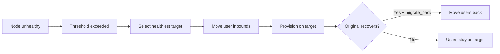
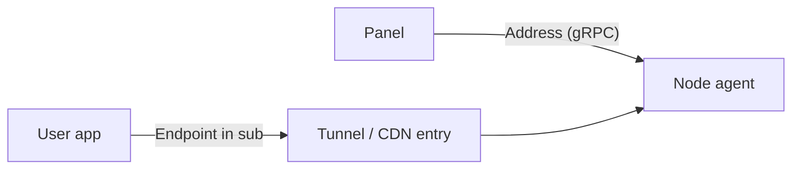

# مدیریت نودها

!!! abstract "ناوگان نود"
    VortexUI یک ناوگان از نودهای پروکسی را از طریق gRPC + mTLS مدیریت می‌کند. هر نود
    Xray-core یا sing-box اجرا کرده و اطلاعات سلامت، ترافیک و اتصال را به پنل گزارش می‌دهد.

---

## نمای کلی ناوگان نود

صفحه **نودها** تمام نودها را نشان می‌دهد:

| ستون | توضیحات |
|------|---------|
| نام | نام نمایشی نود |
| آدرس | IP یا دامنه |
| هسته | Xray-core یا sing-box |
| وضعیت | آنلاین / آفلاین / ناسالم |
| کاربران | تعداد کاربران فعال روی این نود |
| CPU / RAM / Disk | مصرف بلادرنگ منابع |
| آپتایم | زمان از آخرین ریستارت |

---

## ویزارد ثبت‌نام

روش پیشنهادی برای افزودن نودهای ریموت. یک فرآیند UI چهار مرحله‌ای:

### مرحله ۱: جزئیات نود

- نام، آدرس، پورت
- انتخاب هسته (Xray یا sing-box)
- اختیاری: اندپوینت سفارشی برای دسترسی تانل/CDN

### مرحله ۲: تولید دستور

پنل یک دستور نصب تک‌خطی شامل موارد زیر تولید می‌کند:

- توکن ثبت‌نام نود (یکبار مصرف)
- آدرس پنل برای callback
- URL دانلود هسته

### مرحله ۳: اجرا روی سرور ریموت

به سرور ریموت SSH کنید و دستور را paste کنید. ایجنت:

1. باینری نود را دانلود و نصب می‌کند
2. گواهی‌های mTLS را با پنل تبادل می‌کند
3. هسته پروکسی انتخاب‌شده را دانلود و شروع می‌کند
4. به‌عنوان سرویس systemd ثبت می‌شود

### مرحله ۴: تأیید اتصال

پنل تأیید می‌کند نود آنلاین است و داده‌های اولیه سلامت را نمایش می‌دهد.

!!! tip
    توکن ثبت‌نام پس از ۱۰ دقیقه منقضی می‌شود. اگر زمانش گذشت، از ویزارد توکن جدید بسازید.

---

## تشخیص سلامت نود

هر نود به‌صورت مداوم مانیتور می‌شود. پنل سه حالت خرابی را شناسایی می‌کند:

| حالت | معنی | اقدام خودکار |
|------|------|--------------|
| **خطای mTLS** | خطای گواهی یا عدم دسترسی شبکه | هشدار + تلاش مجدد |
| **غیرقابل دسترس** | عدم پاسخ gRPC در بازه زمانی | هشدار → مهاجرت خودکار (در صورت فعال) |
| **هسته خاموش** | ایجنت اجرا می‌شود اما هسته پروکسی کرش کرده | ریستارت خودکار هسته |

مشاهده تشخیص: **نودها → کلیک روی نود → تب سلامت**.

---

## اتصالات mTLS

تمام ارتباطات پنل-نود از TLS متقابل استفاده می‌کند:

- گواهی‌ها هنگام ثبت‌نام به‌صورت خودکار تولید می‌شوند
- بر اساس زمان‌بندی قابل تنظیم تمدید می‌شوند
- نیازی به مدیریت دستی گواهی نیست
- اگر گواهی منقضی شود، پنل هشدار می‌دهد و می‌تواند به‌صورت خودکار صادر مجدد کند

---

## مهاجرت خودکار

انتقال خودکار کاربران از نودهای ناسالم به نودهای سالم.

### تنظیمات سیاست

| تنظیم | توضیحات | پیش‌فرض |
|--------|---------|---------|
| فعال | روشن/خاموش مهاجرت خودکار | خاموش |
| بازه بررسی سلامت | ثانیه بین بررسی‌ها | ۳۰ |
| آستانه ناسالم | خرابی‌های متوالی قبل از فعال‌شدن | ۳ |
| آستانه CPU | مهاجرت اگر CPU از % بیشتر شود | ۹۰ |
| آستانه حافظه | مهاجرت اگر RAM از % بیشتر شود | ۹۰ |
| حداکثر افت بسته | مهاجرت اگر افت از % بیشتر شود | ۱۰ |
| بازگشت | بازگرداندن کاربران وقتی اصلی بازیابی شد | بله |

### نحوه عملکرد



### رویدادهای مهاجرت

تاریخچه را در **نودها → مهاجرت خودکار → رویدادها** مشاهده کنید: زمان، دلیل، نود مبدأ/مقصد، وضعیت (تکمیل‌شده/ناموفق).

---

## مانیتورینگ زنده

**نودها → کلیک روی نود → تب مانیتور**:

- **CPU** — نمودار بلادرنگ استفاده
- **RAM** — مصرف/کل با خط روند
- **دیسک** — مصرف و نرخ رشد
- **پهنای‌باند** — توان عبور فعلی به تفکیک جهت
- **اتصالات** — تعداد تانل فعال در طول زمان

داده‌ها هر ۳ ثانیه از طریق gRPC از ایجنت نود ارسال می‌شوند.

---

## ریستارت/توقف ریموت

از صفحه جزئیات نود:

| عملیات | توضیحات |
|--------|---------|
| **ریستارت هسته** | ریستارت هسته پروکسی (Xray/sing-box) بدون دست‌زدن به ایجنت |
| **ریستارت ایجنت** | ریستارت کامل ایجنت (قطع مختصر اتصال) |
| **توقف هسته** | توقف هسته پروکسی — بدون اتصال جدید |
| **بروزرسانی هسته** | دریافت آخرین باینری هسته و ریستارت |

!!! warning
    توقف هسته تمام کاربران فعال آن نود را قطع می‌کند. ابتدا مهاجرت خودکار را فعال کنید اگر می‌خواهید بدون قطعی باشد.

---

## اندپوینت سفارشی (تانل/CDN/ریلی)

بازنویسی آدرس تبلیغ‌شده در سابسکریپشن‌ها برای این نود:

| فیلد | توضیحات |
|------|---------|
| **Address** | IP/دامنه‌ای که **پنل** برای gRPC به agent نود استفاده می‌کند (معمولاً `:50051`) |
| **Endpoint address** | دامنه/IP که **کاربران** در subscription به آن متصل می‌شوند |
| **Endpoint port** | پورتی که کاربران به آن متصل می‌شوند |
| توضیحات | شرح (مثلاً «ورودی Backhaul ایران») |

### Address در برابر Endpoint



- **نود ریموت:** Address = IP سرور خارج؛ Endpoint = دامنه تونل ایران (اگر کاربر از Backhaul/CDN وارد می‌شود).
- **نود محلی (in-process):** Address معمولاً `127.0.0.1` یا IP هاست پنل؛ Endpoint = ورودی عمومی که کاربر باید استفاده کند.
- **اتصال مستقیم:** Endpoint را خالی بگذارید — subscription از Address نود استفاده می‌کند.

زمانی از Endpoint استفاده کنید که IP واقعی نود با آدرس سمت کاربر متفاوت است (تونل، CDN، ریلی).

---

## اتوماسیون DNS کلادفلر

مدیریت خودکار رکوردهای DNS نودها در کلادفلر:

1. **تنظیمات → کلادفلر** — توکن API و شناسه zone خود را اضافه کنید
2. **نودها → نود → DNS** — اتوماسیون DNS را فعال کنید
3. پنل رکوردهای A/AAAA را هنگام تغییر IP نود ایجاد/بروزرسانی می‌کند
4. اختیاری: پروکسی از طریق کلادفلر (ابر نارنجی)

مفید برای نودهای با IP پویا یا هنگام چرخش آدرس سرور.

---

## استریم لاگ به ازای هر نود

**نودها → نود → تب لاگ‌ها**:

- استریم زنده لاگ از ایجنت نود و هسته پروکسی
- فیلتر بر اساس سطح: debug, info, warn, error
- جستجو درون لاگ‌ها
- دانلود فایل لاگ برای بازه زمانی مشخص

---

## محدودیت سرعت و مسدودسازی جغرافیایی نود

تنظیمات به ازای هر نود:

| تنظیم | توضیحات |
|--------|---------|
| محدودیت سرعت | سقف دانلود هر کاربر بر حسب بایت/ثانیه (`0` = نامحدود) |
| مسدودسازی جغرافیایی | کدهای کشور جداشده با کاما (ISO 3166-1 alpha-2) |

مسدودسازی جغرافیایی محدود می‌کند کدام کشورها بتوانند به این نود خاص متصل شوند. خالی = همه مجاز.

---

## دستور `vortexui doctor` در CLI

اجرای تشخیص از خط فرمان:

```bash
vortexui doctor
```

بررسی‌ها:

- ✅ اتصال PostgreSQL و مهاجرت‌ها
- ✅ اتصال Redis و تأخیر
- ✅ اتصال gRPC هر نود
- ✅ اعتبار و انقضای گواهی
- ✅ در دسترس بودن پورت
- ✅ رزولوشن DNS
- ✅ فضای دیسک
- ✅ نسخه‌های باینری هسته

خروجی شامل وضعیت، تأخیر و پیشنهادات عملی برای هر خرابی است.
