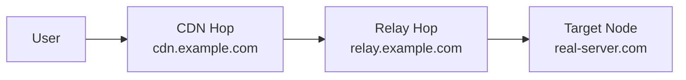

# سیاست شبکه

!!! abstract "مسیریابی و اوتباندها"
    نحوه خروج ترافیک از نودها را کنترل کنید — مستقیم، مسدود، زنجیره‌شده از طریق پروکسی‌های دیگر
    یا ارسال از طریق Cloudflare WARP. بسته‌های مسیریابی قابل استفاده مجدد و زنجیره‌های ریلی چند هاپ بسازید.

---

## اوتباندها

**شبکه → اوتباندها**

یک اوتباند تعریف می‌کند ترافیک پس از ورود به اینباند نود به کجا می‌رود.

| نوع | توضیحات |
|-----|---------|
| **Freedom** | دسترسی مستقیم به اینترنت (پیش‌فرض) |
| **Blackhole** | دور ریختن بی‌صدای ترافیک |
| **DNS** | رزولو از طریق سرور DNS مشخص |
| **زنجیره پروکسی** | ارسال به پروکسی دیگر (SOCKS/HTTP/Trojan/VMess/VLESS) |
| **+WARP** | مسیریابی از طریق Cloudflare WARP برای IP تمیز |

### یکپارچگی +WARP

1. به **شبکه → اوتباندها → افزودن → +WARP** بروید
2. کلید لایسنس WARP خود را وارد کنید (یا از سطح رایگان استفاده کنید)
3. پنل WireGuard به لبه کلادفلر را پیکربندی می‌کند
4. این اوتباند را به قوانین مسیریابی برای دامنه/IP‌های خاص اختصاص دهید

!!! tip
    +WARP زمانی مفید است که IP نود شما توسط سرویس‌هایی مثل Google، ChatGPT یا سایت‌های استریم مسدود شده. آن دامنه‌ها را از طریق WARP مسیریابی کنید تا IP تمیز داشته باشید.

---

## قوانین مسیریابی

**شبکه → مسیریابی**

قوانین تعیین می‌کنند کدام اوتباند هر اتصال را بر اساس تطبیق‌دهنده‌ها مدیریت کند:

| تطبیق‌دهنده | توضیحات |
|-------------|---------|
| دامنه | دامنه کامل، زیردامنه، کلمه کلیدی یا regex |
| IP | محدوده CIDR یا کشور GeoIP |
| پورت | پورت مقصد یا محدوده |
| پروتکل | HTTP, TLS, BitTorrent و غیره |
| تگ اینباند | تطبیق اینباند خاص |
| IP مبدأ | IP/CIDR مبدأ کلاینت |
| کاربر | تطبیق نام کاربری خاص |

قوانین به ترتیب اولویت ارزیابی می‌شوند. اولین تطبیق برنده است.

---

## بسته‌های مسیریابی هوشمند

**شبکه → بسته‌های مسیریابی**

یک **بسته مسیریابی** مجموعه‌ای نام‌گذاری‌شده و قابل استفاده مجدد از قوانین مسیریابی است. یکبار بسازید، همه‌جا اعمال کنید.

### عملیات

| عملیات | توضیحات |
|--------|---------|
| ایجاد/ویرایش | ساخت بسته از قوانین مسیریابی مرتب |
| اعمال به نود | جایگزینی مسیریابی نود با بسته و همگام‌سازی |
| تنظیم پیش‌فرض سراسری | یک بسته در کل ناوگان اعمال شود مگر بازنویسی شود |
| اختصاص به کاربر | جاسازی بسته خاص در سابسکریپشن کاربر |

### بسته‌های پیش‌ساخته

VortexUI با بسته‌های رایج ارائه می‌شود:

- **مسدودسازی تبلیغات** — مسدود کردن دامنه‌های تبلیغاتی
- **ایران مستقیم** — مسیریابی مستقیم دامنه/IP‌های ایرانی
- **استریمینگ مستقیم** — بایپس پروکسی برای سرویس‌های استریم محلی
- **مسدودسازی تورنت** — مسدود کردن پروتکل BitTorrent

### ایجاد بسته سفارشی

1. روی **بسته جدید** کلیک کنید → نام وارد کنید
2. قوانین را به ترتیب اولویت اضافه کنید (همان فیلدهای مسیریابی نود)
3. ذخیره کنید، سپس:
    - **اعمال** به نود برای push فوری
    - به‌عنوان **پیش‌فرض** ناوگان علامت بزنید
    - از صفحه جزئیات کاربر به کاربر **اختصاص** دهید

!!! note
    اختصاص به کاربر بر پیش‌فرض سراسری اولویت دارد. کاربر بدون اختصاص به بسته پیش‌فرض بازمی‌گردد.

---

## سازنده زنجیره CDN/Relay

**شبکه → زنجیره‌های CDN/Relay**

IP واقعی سرور را با مسیریابی ترافیک از هاپ‌های واسط مخفی کنید.

### انواع هاپ

| نوع | توضیحات | بهترین برای |
|-----|---------|------------|
| **CDN** | ترافیک از طریق Cloudflare/CDN | مخفی‌سازی رایگان IP، نیاز به ترنسپورت WS |
| **ریلی** | ترافیک از طریق VPS ریلی | وقتی CDN مسدود است یا TCP لازم است |
| **ورکر** | Cloudflare Workers به‌عنوان ریلی | بدون سرور، مقرون‌به‌صرفه |

### ایجاد زنجیره

1. روی **زنجیره جدید** کلیک کنید
2. نام‌گذاری و انتخاب نود مقصد
3. هاپ‌ها را به ترتیب اضافه کنید (کاربر → هاپ ۱ → هاپ ۲ → نود)
4. هر هاپ را تنظیم کنید:
    - نوع (CDN / ریلی / ورکر)
    - آدرس و پورت
    - پروتکل (WebSocket / gRPC / TCP)
    - SNI و path (برای ترنسپورت‌های TLS)



!!! example "زنجیره CDN کلادفلر"
    ```
    Hop 1: CDN — cdn.example.com:443 — WebSocket — SNI: cdn.example.com — Path: /ws
    Target: Your actual node
    ```
    کاربران به کلادفلر متصل می‌شوند → کلادفلر به نود شما فوروارد می‌کند. IP واقعی مخفی است.

---

## بالانسرها

**شبکه → بالانسرها**

توزیع ترافیک بین چندین اوتباند با بررسی سلامت.

### استراتژی‌ها

| استراتژی | رفتار |
|----------|-------|
| **Round-robin** | توزیع برابر بین اهداف سالم |
| **تصادفی** | انتخاب تصادفی به ازای هر اتصال |
| **کمترین اتصال** | مسیریابی به هدف با کمترین اتصالات فعال |
| **کمترین تأخیر** | مسیریابی به هدف با کمترین تأخیر اندازه‌گیری‌شده |

### بررسی سلامت

| تنظیم | توضیحات |
|--------|---------|
| بازه | ثانیه بین بررسی‌های سلامت |
| زمان‌محدودیت | حداکثر انتظار برای پاسخ |
| ناسالم پس از | خرابی‌های متوالی برای علامت‌گذاری خاموش |
| سالم پس از | موفقیت‌های متوالی برای علامت‌گذاری فعال |

اهداف ناسالم به‌صورت خودکار از چرخش حذف و هنگام بازیابی بازگردانده می‌شوند.

---

## مسیریابی SNI چند دامنه + SSL خودکار

**شبکه → مسیریابی SNI**

میزبانی چند دامنه روی یک پورت با مسیریابی خودکار و SSL:

1. **افزودن دامنه** — دامنه و اینباند مقصد را وارد کنید
2. **SSL خودکار** را فعال کنید تا گواهی‌های Let's Encrypt به‌صورت خودکار صادر شوند
3. ترافیک بر اساس فیلد TLS SNI مسیریابی می‌شود

ویژگی‌ها:

- گواهی‌های Wildcard (`*.domain.com`)
- تمدید خودکار قبل از انقضا
- چند دامنه به ازای هر نود
- ترکیب REALITY + TLS روی همان پورت از طریق تشخیص SNI

---

## بروزرسان GeoIP/Geosite

**شبکه → GeoIP/Geosite**

مدیریت دیتابیس‌های جغرافیایی مورد استفاده قوانین مسیریابی:

- **بروزرسانی خودکار** — بررسی نسخه‌های جدید بر اساس زمان‌بندی
- **بروزرسانی دستی** — دانلود فوری آخرین نسخه
- **منابع سفارشی** — اشاره به فایل‌های dat/db اختصاصی
- پشتیبانی از هر دو `geoip.dat`/`geosite.dat` (V2Ray) و `geoip.db`/`geosite.db` (sing-box)

---

## فدراسیون پنل

**شبکه → فدراسیون**

اتصال چندین پنل VortexUI برای مدیریت توزیع‌شده.

### موارد استفاده

- استقرارهای بزرگ با پنل در مناطق مختلف
- ستاپ‌های نمایندگی که هر ریسلر پنل اختصاصی دارد
- دسترسی‌پذیری بالا — اگر یک پنل از کار بیفتد، بقیه ادامه می‌دهند

### پیکربندی

| تنظیم | توضیحات |
|--------|---------|
| فعال | فعال‌سازی فدراسیون |
| نام کلاستر | شناسه این کلاستر |
| بازه همگام‌سازی | چند ثانیه بین همگام‌سازی‌ها |
| SSO | فعال‌سازی ورود یکپارچه بین پنل‌ها |

### افزودن همتا

1. روی **افزودن همتا** کلیک کنید
2. URL پنل همتا را وارد کنید
3. کلید API را وارد کنید (در پنل همتا تولید شده)
4. محدوده همگام‌سازی را انتخاب کنید: کاربران، نودها یا هر دو
5. تست اتصال → ذخیره

### رویدادهای همگام‌سازی

تاریخچه همگام‌سازی بین همتاها را مشاهده کنید — زمان، جهت، آیتم‌های همگام‌شده و تعارضات.
