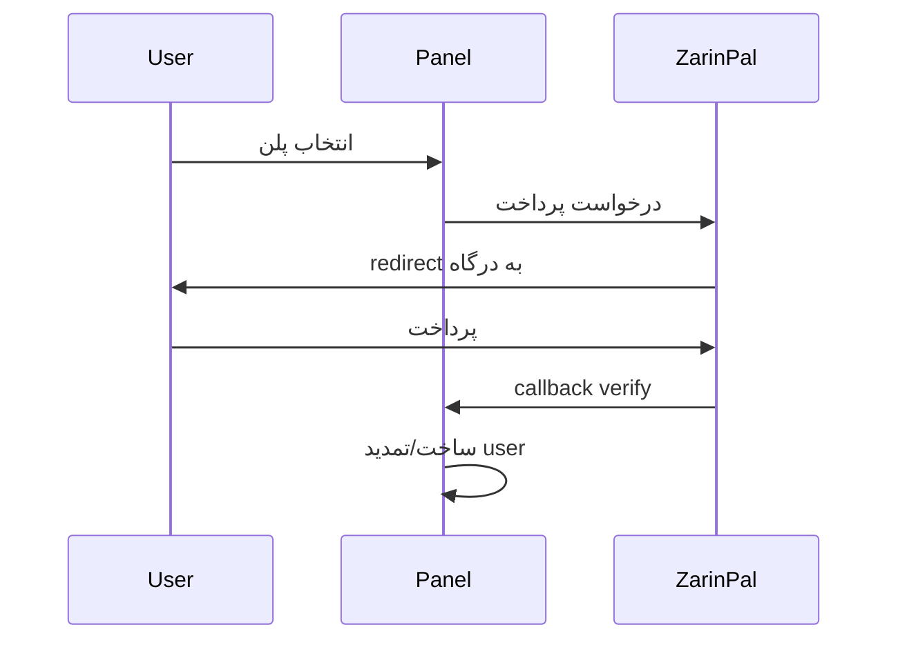

# ۹. پلن‌ها و پرداخت

!!! note
    پس از پرداخت موفق، user به‌صورت خودکار با پارامترهای plan ساخته/تمدید می‌شود.

---

## سیستم Plan

**Plans → New Plan**

| فیلد | توضیح |
|------|-------|
| Name | نام پلن (مثلاً «ماهانه ۵۰GB») |
| Data limit | سقف ترافیک |
| Duration days | مدت اشتراک |
| Device limit | تعداد دستگاه |
| Reset strategy | monthly / … |
| Price (Toman) | قیمت ریالی |
| Price (USD) | قیمت دلاری/کریپتو |
| Max users | سقف فروش (0=نامحدود) |
| Enabled | فعال/غیرفعال |

---

## Orders (سفارش‌ها)

**Orders** — لیست سفارش‌ها:

| Status | معنی |
|--------|------|
| `pending` | در انتظار پرداخت |
| `paid` | پرداخت شده — user ساخته/تمدید شد |
| `failed` | ناموفق |
| `expired` | timeout |

---

## درگاه ZarinPal (ریالی)

### پیکربندی

متغیرهای env مربوط به ZarinPal را در `deploy/.env` تنظیم کنید (Merchant ID و callback URL).

### جریان پرداخت



---

## درگاه NowPayments (کریپتو)

### IPN Webhook

```
POST /api/payment/ipn/nowpayments
```

- امضای HMAC-SHA512 با `NowPaymentsIPNSecret`
- پس از تأیید → فعال‌سازی خودکار

---

## فروش خودکار

1. Plan فعال بسازید
2. لینک عمومی فروش (در UI/API)
3. پس از پرداخت موفق → user با پارامترهای plan

---

## Reseller + Plan

reseller می‌تواند با quota محدود plan بفروشد — user زیرمجموعه admin_id او ثبت می‌شود.
