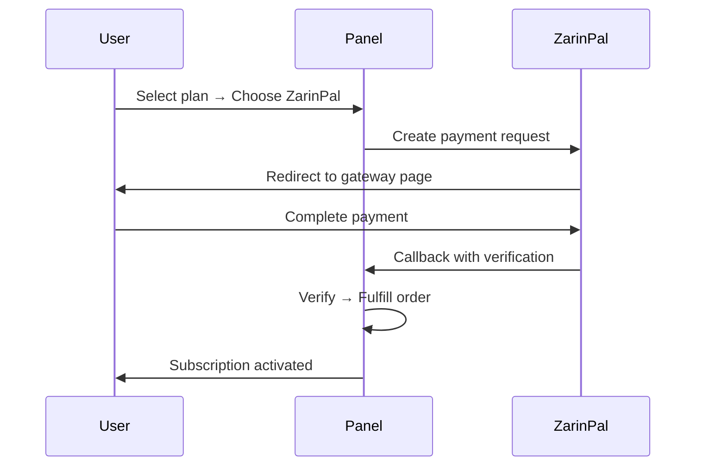
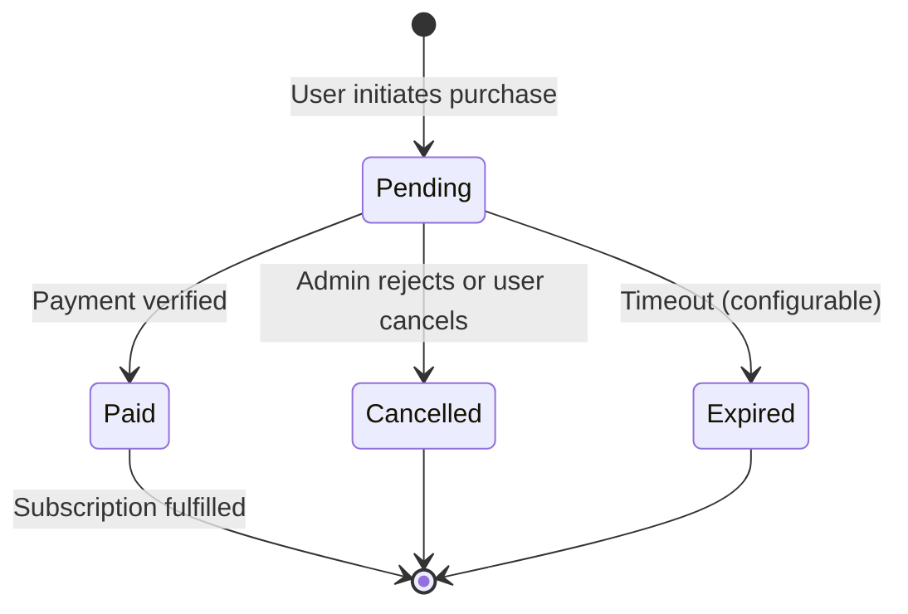

# پلن‌ها و پرداخت

!!! abstract "تجارت اختصاصی ریسلر"
    هر ادمین/ریسلر پلن‌های خود را ایجاد، روش‌های پرداخت خود را تنظیم
    و سفارشات خود را مدیریت می‌کند. کاربران نهایی از طریق فروشگاه سلف‌سرویس
    اختصاصی ریسلر خود خرید می‌کنند.

---

## سیستم پلن

پلن‌ها **متعلق به ادمینی هستند که آن‌ها را ایجاد کرده**. هر ریسلر کاتالوگ خود را به‌صورت مستقل مدیریت می‌کند.

### ایجاد پلن

**پلن‌ها → پلن جدید**

| فیلد | توضیحات |
|------|---------|
| نام | نام نمایشی (مثلاً "ماهانه ۵۰ گیگ") |
| حد ترافیک | سقف ترافیک بر حسب بایت |
| مدت (روز) | دوره اشتراک |
| حد دستگاه | حداکثر دستگاه‌های همزمان |
| استراتژی ریست | `none` / `daily` / `weekly` / `monthly` |
| قیمت (تومان) | قیمت ریالی برای پرداخت زرین‌پال/کارت |
| قیمت (USD) | قیمت دلاری برای پرداخت رمزارز |
| حداکثر کاربر | سقف فروش (`0` = نامحدود) |
| فعال | کلید فعال/غیرفعال |

### قابلیت مشاهده پلن

| نوع ادمین | می‌بیند |
|-----------|---------|
| ادمین Sudo | تمام پلن‌ها از همه ادمین‌ها |
| ریسلر | فقط پلن‌های خود |
| کاربر نهایی (در فروشگاه) | فقط پلن‌های فعال ریسلر خود |

### مالکیت پلن

- **ادمین Sudo** پلن‌های سراسری ایجاد می‌کند (قابل مشاهده برای کاربران بدون ریسلر)
- **ریسلر** پلن‌ها را فقط برای کاربران خود ایجاد می‌کند
- کاربر هنگام بازدید فروشگاه، پلن‌های ادمینی که اکانتش را مدیریت می‌کند می‌بیند

---

## تنظیم پرداخت

هر ادمین/ریسلر روش‌های پرداخت خود را به‌صورت مستقل تنظیم می‌کند.

**تنظیمات → تنظیم پرداخت** (یا **اکانت ریسلر → پرداخت**)

### روش‌های موجود

| روش | نوع | تنظیمات |
|-----|-----|---------|
| **زرین‌پال** | درگاه آنلاین | شناسه مرچنت |
| **کارت‌به‌کارت** | فیش دستی | شماره کارت + نام صاحب‌حساب |
| **رمزارز** | فیش دستی | آدرس کیف پول (BTC, USDT, ETH و غیره) |

### تنظیم پرداخت اختصاصی ریسلر

هر ریسلر جزئیات پرداخت خود را تنظیم می‌کند:

```
ریسلر A → مرچنت زرین‌پال: xxxx + کارت: 6219-xxxx-xxxx-1234
ریسلر B → فقط رمزارز: آدرس USDT TRC20
ریسلر C → کارت‌به‌کارت: 6037-xxxx-xxxx-5678
```

کاربران هر ریسلر فقط گزینه‌های پرداخت تنظیم‌شده ریسلر خود را در فروشگاه می‌بینند.

---

## روش‌های پرداخت

### زرین‌پال (درگاه آنلاین)

جریان خودکار — نیازی به مداخله ادمین نیست:



تنظیم: `VORTEX_ZARINPAL_MERCHANT` را تنظیم کنید (یا شناسه مرچنت اختصاصی ریسلر در تنظیم پرداخت).

### کارت‌به‌کارت (آپلود فیش)

جریان تأیید دستی:

1. کاربر پلن را انتخاب → "کارت‌به‌کارت" را می‌زند
2. پنل شماره کارت و نام صاحب‌حساب ریسلر را نمایش می‌دهد
3. کاربر پول را از طریق اپ بانکی انتقال می‌دهد
4. کاربر **تصویر فیش** + **شماره مرجع** اختیاری آپلود می‌کند
5. وضعیت سفارش: `pending`
6. ادمین/ریسلر تصویر فیش را بررسی → **تأیید** یا **رد**
7. پس از تأیید → اشتراک فعال می‌شود

!!! info
    تصاویر فیش به‌صورت امن ذخیره شده و فقط برای ادمین مدیر قابل دسترسی هستند.

### رمزارز (هش TX + اسکرین‌شات)

جریان تأیید دستی:

1. کاربر پلن را انتخاب → "رمزارز" را می‌زند
2. پنل آدرس کیف پول ریسلر را نمایش می‌دهد
3. کاربر رمزارز ارسال کرده و ارائه می‌دهد:
    - **هش تراکنش** (ضروری)
    - **اسکرین‌شات** تراکنش (اختیاری)
4. وضعیت سفارش: `pending`
5. ادمین/ریسلر هش TX را در بلاکچین تأیید → **تأیید** یا **رد**
6. پس از تأیید → اشتراک فعال می‌شود

---

## فروشگاه سلف‌سرویس

**URL:** `/sub/{token}/shop`

فروشگاه بخشی از پورتال کاربر است و از طریق توکن سابسکریپشن قابل دسترسی است.

### تجربه کاربر

1. کاربر با توکن اشتراک خود وارد پورتال می‌شود
2. به تب **پلن‌ها** می‌رود
3. پلن‌های ایجادشده توسط ادمین/ریسلر مدیرش را می‌بیند
4. پلن → روش پرداخت را انتخاب می‌کند
5. پرداخت را تکمیل (یا فیش آپلود) می‌کند
6. منتظر تکمیل سفارش می‌ماند

### جریان خرید پورتال React (PortalPlans)

پورتال رندر می‌کند:

- کارت‌های پلن با نام، حد ترافیک، مدت، قیمت
- انتخاب‌گر روش پرداخت (فقط روش‌هایی که ریسلر تنظیم کرده)
- فرم آپلود (برای فیش کارت‌به‌کارت / رمزارز)
- ردیاب وضعیت سفارش

---

## چرخه حیات سفارش



| وضعیت | معنی |
|--------|------|
| `pending` | در انتظار پرداخت یا بررسی فیش |
| `paid` | پرداخت تأیید شد — اشتراک فعال شد |
| `cancelled` | رد توسط ادمین یا لغو توسط کاربر |
| `expired` | زمان‌محدودیت پرداخت منقضی شد |

---

## بررسی سفارشات معلق

**سفارشات → معلق** (نمای ادمین/ریسلر)

برای سفارشات کارت‌به‌کارت و رمزارز:

1. جزئیات سفارش را ببینید: کاربر، پلن، مبلغ، زمان
2. **تصویر فیش** آپلود‌شده را مشاهده کنید (رسید/اسکرین‌شات)
3. **شماره مرجع** یا **هش TX** را ببینید
4. اقدامات:
    - **تأیید** → تکمیل سفارش، فعال‌سازی اشتراک
    - **رد** → لغو سفارش، اطلاع به کاربر با دلیل

!!! tip
    اعلان تلگرام را برای سفارشات معلق جدید فعال کنید تا آپلود فیش را از دست ندهید.

---

## صورتحساب کیف پول ریسلر

برای ریسلرهایی که مستقیماً به کاربران نمی‌فروشند بلکه برای ظرفیت به ادمین پرداخت می‌کنند.

### نحوه عملکرد

| نوع اعتبار | کِی کسر می‌شود |
|------------|----------------|
| اعتبار ترافیک (GB) | کاربران ترافیک مصرف می‌کنند (حالت مصرف‌شده) یا ریسلر حد تعیین می‌کند (حالت اختصاص‌یافته) |
| اعتبار کاربر (تعداد) | ریسلر کاربر جدید ایجاد می‌کند |

### عملیات کیف پول

| عملیات | چه کسی | توضیحات |
|--------|--------|---------|
| مشاهده موجودی | ریسلر | اعتبار ترافیک + کاربر باقیمانده |
| مشاهده دفترکل | ریسلر | تاریخچه کامل تمام تغییرات |
| درخواست شارژ | ریسلر | ارسال درخواست اعتبار به ادمین sudo |
| تأیید شارژ | Sudo | بررسی و تأیید واریز |
| تنظیم سریع | Sudo | دکمه‌های +۵۰ اکانت / +۱۰ GB / +۵۰ GB |

### صف تأیید واریز کیف پول

**ادمین‌ها → واریزهای کیف پول** (نمای sudo)

1. ریسلر درخواست شارژ ارسال می‌کند (مبلغ + فیش پرداخت)
2. درخواست در صف تأیید نمایش داده می‌شود
3. ادمین Sudo بررسی → **تأیید** (اعتبار اضافه) یا **رد**

---

## منطق تکمیل سفارش

وقتی سفارش به‌عنوان `paid` علامت‌گذاری می‌شود:

1. **اگر کاربر موجود باشد** — تمدید اشتراک:
    - ترافیک: باقیمانده فعلی + حد ترافیک پلن (تجمیعی)
    - مدت: انقضای فعلی + روزهای مدت پلن (تجمیعی)
    - حد دستگاه: به مقدار پلن بروزرسانی
    - بدون ریست ترافیک — داده باقیمانده موجود حفظ می‌شود

2. **اگر کاربر جدید باشد** — ایجاد اکانت با پارامترهای پلن

!!! info "انباشت تجمیعی"
    خریدهای متعدد به‌صورت تجمیعی انباشته می‌شوند. خرید دو بار پلن ۵۰ گیگ = ۱۰۰ گیگ کل.
    مدت هم انباشته می‌شود — خرید دو پلن ۳۰ روزه = ۶۰ روز تمدید از انقضای فعلی.

---

## خلاصه حالت سهمیه

| حالت | استخر کِی کاهش می‌یابد | بهترین برای |
|------|------------------------|------------|
| **اختصاص‌یافته** | ریسلر حد ترافیک به کاربران تعیین می‌کند | بسته‌های از‌پیش‌فروخته‌شده ثابت |
| **مصرف‌شده** | کاربران واقعاً ترافیک مصرف می‌کنند | صورتحساب مصرفی |

در **ادمین‌ها → ویرایش ادمین → حالت سهمیه ترافیک** به ازای هر ریسلر تنظیم کنید.
