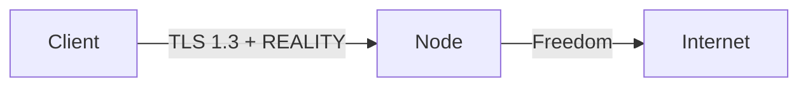

# پروتکل‌ها و پیکربندی

!!! info "ماتریس قابلیت"
    پنل یک ماتریس قابلیت زنده به ازای هر پروتکل (`GET /api/capabilities`) ارائه می‌دهد
    که منبع حقیقت واحد است. ویرایشگر اینباند فقط ترکیب‌هایی را نمایش می‌دهد که
    هسته نود انتخاب‌شده واقعاً پشتیبانی می‌کند.

---

## نمای کلی پروتکل‌ها

| پروتکل | هسته | اینباند | اوتباند | ترنسپورت | امنیت |
|---------|------|:-------:|:-------:|-----------|-------|
| VLESS | هر دو | ✅ | ✅ | TCP, WS, gRPC, HTTPUpgrade, xHTTP, mKCP | None, TLS, REALITY |
| VMess | هر دو | ✅ | ✅ | TCP, WS, gRPC, HTTPUpgrade, mKCP | None, TLS |
| Trojan | هر دو | ✅ | ✅ | TCP, WS, gRPC, mKCP | TLS, REALITY |
| Shadowsocks | هر دو | ✅ | ✅ | TCP (+ SS-2022 چند کاربره) | None |
| Hysteria2 | sing-box | ✅ | ✅ | UDP (QUIC) | TLS |
| TUIC | sing-box | ✅ | ✅ | UDP (QUIC) | TLS |
| WireGuard | sing-box | ✅ | ✅ | UDP | Native |
| Hysteria (v1) | sing-box | ✅ | — | UDP | TLS |
| ShadowTLS | sing-box | ✅ | ✅ | TCP | TLS |
| AnyTLS | sing-box | ✅ | — | TCP | TLS |
| Naive | sing-box | ✅ | — | — | TLS (اجباری) |
| SOCKS | هر دو | ✅ | ✅ | — (TCP خام) | plaintext |
| HTTP | هر دو | ✅ | ✅ | — (TCP خام) | plaintext |
| Dokodemo | Xray | ✅ | — | — (TCP/UDP خام) | plaintext |

---

## پیکربندی هر پروتکل

### VLESS + REALITY (پیشنهادی)

استاندارد طلایی برای مقاومت در برابر سانسور. REALITY نیاز به گواهی TLS را حذف می‌کند.

**تنظیمات اینباند:**

| فیلد | مثال |
|------|------|
| پروتکل | `vless` |
| پورت | `443` |
| ترنسپورت | `tcp` |
| امنیت | `reality` |
| مقصد (هدف) | `www.google.com:443` |
| نام‌های سرور | `www.google.com` |
| کلید خصوصی | تولید خودکار |
| شناسه‌های کوتاه | تولید خودکار (تا ۸ عدد) |
| Flow | `xtls-rprx-vision` (برای TCP) |

!!! tip
    از **اسکنر Reality** برای یافتن بهترین دامنه‌های SNI برای موقعیت سرورتان استفاده کنید.

### VMess + WebSocket + TLS

ستاپ کلاسیک سازگار با CDN fronting (کلادفلر):

| فیلد | مثال |
|------|------|
| پروتکل | `vmess` |
| پورت | `443` |
| ترنسپورت | `ws` |
| مسیر | `/vmws` |
| امنیت | `tls` |
| SNI | `cdn.example.com` |

پشت کلادفلر با WebSocket فعال روی دامنه کار می‌کند.

### Trojan + gRPC + TLS

گزینه با عملکرد بالا همراه مالتی‌پلکس:

| فیلد | مثال |
|------|------|
| پروتکل | `trojan` |
| پورت | `443` |
| ترنسپورت | `grpc` |
| نام سرویس | `trojangrpc` |
| امنیت | `tls` |
| SNI | `your-domain.com` |

### Shadowsocks 2022 (چند کاربره)

شدوساکس مدرن با کلیدهای اختصاصی هر کاربر:

| فیلد | مثال |
|------|------|
| پروتکل | `shadowsocks` |
| پورت | `8388` |
| روش | `2022-blake3-aes-128-gcm` |
| کلید سرور | تولید خودکار |
| امنیت | `none` (SS رمزنگاری خود را دارد) |

هر کاربر یک کلید مشتق‌شده دریافت می‌کند — بدون رمز عبور مشترک.

### Hysteria2

پروتکل مبتنی بر QUIC با کنترل ازدحام داخلی. عالی برای شبکه‌های با افت:

| فیلد | مثال |
|------|------|
| پروتکل | `hysteria2` |
| پورت | `4443` |
| امنیت | `tls` (اجباری) |
| پهنای‌باند آپ/دانلود | گزارش‌شده توسط کلاینت برای کنترل ازدحام |
| نوع Obfs | `salamander` (اختیاری) |
| رمز Obfs | رمز مشترک |

!!! note
    Hysteria2 نیاز به هسته sing-box دارد. روی نودهای Xray موجود نیست.

### TUIC

ریلی UDP مبتنی بر QUIC با zero-RTT:

| فیلد | مثال |
|------|------|
| پروتکل | `tuic` |
| پورت | `4444` |
| امنیت | `tls` (اجباری) |
| ازدحام | `bbr` یا `cubic` |
| UUID | احراز هویت به ازای هر کاربر |

### WireGuard

تانل WireGuard بومی از طریق sing-box:

| فیلد | مثال |
|------|------|
| پروتکل | `wireguard` |
| پورت | `51820` |
| کلید خصوصی | کلید خصوصی سرور |
| کلیدهای عمومی peer | کلیدهای عمومی هر کاربر |
| IP‌های مجاز | `0.0.0.0/0, ::/0` |
| MTU | `1280` |

### Naive (NaiveProxy)

پروکسی HTTP/2 یا HTTP/3 پنهان‌شده به‌عنوان ترافیک HTTPS عادی:

| فیلد | مثال |
|------|------|
| پروتکل | `naive` |
| پورت | `443` |
| امنیت | `tls` (اجباری) |
| نام‌کاربری/رمز | اعتبارنامه هر کاربر |

!!! warning
    Naive نیاز به هسته sing-box دارد و **TLS اجباری** است. بدون گواهی معتبر اجرا نمی‌شود.

### ShadowTLS

استتار TLS — ترافیک را شبیه اتصال TLS عادی به یک وب‌سایت محبوب نشان می‌دهد:

| فیلد | مثال |
|------|------|
| پروتکل | `shadowtls` |
| پورت | `443` |
| نسخه | `3` (پیشنهادی) |
| سرور هندشیک | `www.microsoft.com:443` |
| رمز | رمز مشترک |

---

## ماتریس قابلیت (Xray در مقابل sing-box)

### Xray-core

| دسته | پشتیبانی‌شده |
|------|-------------|
| پروتکل‌ها | vless, vmess, trojan, shadowsocks, socks, http, dokodemo |
| ترنسپورت‌ها | tcp, ws, grpc, httpupgrade, http/h2, xhttp, mkcp |
| امنیت | none, tls, reality |
| ویژه | xtls-rprx-vision flow، انتخاب‌گر حالت xhttp، هدرهای mKCP |

### sing-box

| دسته | پشتیبانی‌شده |
|------|-------------|
| پروتکل‌ها | vless, vmess, trojan, shadowsocks, hysteria2, tuic, wireguard, hysteria, shadowtls, anytls, naive, socks, http |
| ترنسپورت‌ها | tcp, ws, grpc, httpupgrade, http/h2, quic |
| امنیت | none, tls, reality (محدود) |
| ویژه | پروتکل‌های مبتنی بر QUIC، مالتی‌پلکس، ازدحام brutal |

### پروتکل‌های بدون ترنسپورت استریم

| پروتکل | هسته | ترنسپورت | امنیت |
|---------|------|-----------|-------|
| SOCKS | هر دو | TCP خام | plaintext |
| HTTP | هر دو | TCP خام | plaintext |
| Naive | sing-box | — | TLS (اجباری) |
| Dokodemo | Xray | TCP/UDP خام | plaintext |
| WireGuard | sing-box | UDP | native |
| Hysteria2 | sing-box | UDP (QUIC) | TLS |
| TUIC | sing-box | UDP (QUIC) | TLS |

!!! warning
    اینباندهای SOCKS و HTTP **بدون رمزنگاری** هستند — فقط روی شبکه‌های مورد اعتماد یا پشت ریلی محلی اکسپوز کنید.

---

## جزئیات ترنسپورت

### TCP

ترنسپورت پیش‌فرض. از هدر استتار HTTP اختیاری پشتیبانی می‌کند (Xray).

### WebSocket (WS)

ارتقا HTTP به WebSocket. سازگار با CDN (کلادفلر و غیره).

| تنظیم | توضیحات |
|--------|---------|
| مسیر | مسیر URL (مثلاً `/ws`) |
| Host | هدر HTTP Host |
| حداکثر داده اولیه | بایت در اولین فریم WS (0-RTT) |

### gRPC

مبتنی بر HTTP/2. عملکرد بالا با مالتی‌پلکس.

| تنظیم | توضیحات |
|--------|---------|
| نام سرویس | مسیر سرویس gRPC |
| حالت Multi | فعال‌سازی حالت چند استریم |

### HTTPUpgrade

ارتقای HTTP/1.1 (مشابه WS اما ساده‌تر). هر دو هسته پشتیبانی می‌کنند.

| تنظیم | توضیحات |
|--------|---------|
| مسیر | مسیر URL |
| Host | هدر HTTP Host |

### xHTTP (فقط Xray)

ترنسپورت پیشرفته HTTP با حالت‌های متعدد:

| حالت | توضیحات |
|------|---------|
| `auto` | تشخیص خودکار بهترین حالت |
| `packet-up` | قاب‌بندی بسته برای آپلود |
| `stream-up` | آپلود استریمینگ |

### mKCP (فقط Xray)

ترنسپورت مبتنی بر UDP با FEC (تصحیح خطای رو به جلو). مناسب شبکه‌های با افت.

| تنظیم | توضیحات |
|--------|---------|
| نوع هدر | `none`, `srtp`, `utp`, `wechat-video`, `dtls`, `wireguard` |
| Seed | سید مبهم‌سازی |
| MTU | حداکثر واحد انتقال |

### QUIC (فقط sing-box)

ترنسپورت بومی QUIC برای پروتکل‌های Hysteria/TUIC.

---

## لایه‌های امنیتی

### None

بدون رمزنگاری در لایه ترنسپورت. پروتکل رمزنگاری خود را مدیریت می‌کند (مثلاً VMess، Shadowsocks).

### TLS

TLS استاندارد 1.2/1.3. نیاز به گواهی معتبر (صدور خودکار از طریق Caddy یا تنظیم دستی).

| تنظیم | توضیحات |
|--------|---------|
| SNI | نشان نام سرور |
| ALPN | پروتکل لایه اپلیکیشن (`h2`, `http/1.1`) |
| گواهی | خودکار (ACME) یا دستی (مسیر فایل) |
| حداقل نسخه | `1.2` یا `1.3` |
| فینگرپرینت | جعل هویت uTLS |

### REALITY

تقلید TLS 1.3 بدون نیاز به گواهی واقعی. سرور جعل هویت یک وب‌سایت قانونی می‌کند.

| تنظیم | توضیحات |
|--------|---------|
| مقصد | سرور هدف برای جعل هویت |
| نام‌های سرور | مقادیر SNI مجاز |
| کلید خصوصی | کلید سرور X25519 |
| شناسه‌های کوتاه | شناسه‌های احراز هویت کلاینت |
| Spider X | مسیر برای دورزنی پروب فعال |

---

## فرمت‌های خروجی سابسکریپشن

| فرمت | Content-Type | توضیحات |
|------|-------------|---------|
| `base64` | `text/plain` | لینک‌های اشتراک base64 سازگار V2Ray |
| `clash` | `text/yaml` | کانفیگ YAML کلش متا |
| `singbox` | `application/json` | JSON کلاینت سینگ‌باکس |
| `xray` | `application/json` | JSON خام Xray/V2Ray |
| `outline` | `text/plain` | لینک‌های `ss://` برای Outline |
| `links` | `text/plain` | یک لینک اشتراک در هر خط |

تشخیص خودکار از User-Agent:

| کلاینت | فرمت تشخیص‌داده‌شده |
|--------|---------------------|
| Clash / ClashX / Clash Meta | `clash` |
| sing-box | `singbox` |
| Outline | `outline` |
| v2rayNG / V2RayN | `base64` |
| سایر | `base64` |
