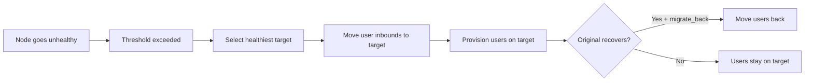

# 16. VortexUI نسخه 1.2.0 — راهنمای ویژگی‌های جدید

!!! info "نسخه 1.2.0"
    این صفحه تمام ویژگی‌های معرفی‌شده در VortexUI نسخه 1.2.0 را مستند می‌کند. هر بخش توضیح می‌دهد که ویژگی چه کاری انجام می‌دهد، چگونه پیکربندی می‌شود و موارد استفاده رایج آن چیست.

---

## مانیتور زنده

**مکان:** داشبورد → مانیتور زنده

نمای بلادرنگ از تمام اتصالات فعال در مجموعه نودهای شما.

### آنچه مشاهده می‌کنید

| Metric | توضیحات |
|--------|----------|
| Users Online | کاربران متمایز با حداقل یک اتصال فعال |
| Connections | مجموع تونل‌های فعال در تمام نودها |
| Unique IPs | آدرس‌های IP منحصر به فرد کلاینت‌ها |
| Nodes Active | نودهایی که حداقل یک اتصال دارند |

### جدول اتصالات

هر ردیف نشان می‌دهد:

- **User** — نام کاربری
- **Node** — سروری که کاربر به آن متصل است
- **IP** — آدرس IP مبدا کلاینت
- **Protocol** — VLESS، VMess، Trojan و غیره
- **Duration** — مدت زمان فعال بودن اتصال

!!! tip
    مانیتور هر 3 ثانیه داده‌ها را به‌روزرسانی می‌کند. اگر پیام "No active connections" را مشاهده می‌کنید، به این معنی است که هیچ کاربری در حال حاضر ترافیک تونل نمی‌کند — این برای نصب تازه عادی است.

---

## آنالیتیکس

**مکان:** داشبورد → آنالیتیکس

بینش‌های ترافیکی تجمیع‌شده بر اساس کشور، کاربر و ساعت روز.

### بازه‌های زمانی

از منوی کشویی **24 ساعت اخیر**، **7 روز اخیر** یا **30 روز اخیر** را انتخاب کنید.

### بخش‌ها

| Section | نمایش |
|---------|-------|
| Summary cards | مجموع آپلود، مجموع دانلود، تعداد کشورها |
| Traffic by Country | تفکیک جغرافیایی — کشور، اتصالات، بایت آپلود/دانلود |
| Top Users | رتبه‌بندی بر اساس مجموع ترافیک مصرف‌شده |
| Peak Hours | نمودار میله‌ای حجم ترافیک ساعتی |

### خروجی

روی **Export CSV** کلیک کنید تا فایل صفحه‌گسترده داده‌های جغرافیایی + کاربری برای بازه انتخاب‌شده دانلود شود.

!!! note
    داده‌های آنالیتیکس از جدول `traffic_geo` می‌آیند که توسط ایجنت‌های نود پر می‌شود. اگر جدول خالی است، مطمئن شوید که نودهای شما داده‌های جغرافیایی را گزارش می‌کنند.

---

## زنجیره‌های CDN/Relay

**مکان:** شبکه و نودها → زنجیره‌های CDN/Relay

آدرس IP واقعی سرور خود را با مسیردهی ترافیک کاربران از طریق سرورهای واسط قبل از رسیدن به نود، پنهان کنید.

### انواع هاپ

| Type | توضیحات | مناسب برای |
|------|----------|------------|
| **CDN** | ترافیک از طریق CDN مانند Cloudflare عبور می‌کند | پنهان‌سازی رایگان IP، نیاز به ترنسپورت WebSocket دارد |
| **Relay** | ترافیک از طریق یک سرور VPS واسط مسیردهی می‌شود | وقتی CDN مسدود است یا نیاز به TCP دارید |
| **Worker** | از Cloudflare Workers به عنوان واسط استفاده می‌کند | بدون سرور اختصاصی، مقرون‌به‌صرفه |

### ایجاد یک زنجیره

1. روی **New Chain** کلیک کنید
2. یک نام وارد کنید و نود مقصد را انتخاب کنید
3. هاپ‌ها را به ترتیب اضافه کنید (جریان ترافیک: کاربر → هاپ 1 → هاپ 2 → … → نود)
4. برای هر هاپ پیکربندی کنید:
   - **Type** (CDN / Relay / Worker)
   - **Address** و **Port**
   - **Protocol** (WebSocket / gRPC / TCP)
   - **SNI** و **Path** (برای ترنسپورت‌های مبتنی بر TLS)

!!! example "مثال: ریلی CDN از طریق Cloudflare"
    ```
    Hop 1: CDN — cdn.example.com:443 — WebSocket — SNI: cdn.example.com — Path: /ws
    Target: Your actual node
    ```
    کاربران به Cloudflare متصل می‌شوند و Cloudflare ترافیک را به نود شما هدایت می‌کند. IP واقعی شما پنهان می‌ماند.

---

## مهاجرت خودکار

**مکان:** شبکه و نودها → مهاجرت خودکار

به صورت خودکار کاربران را از نودهای ناسالم به نودهای سالم منتقل می‌کند.

### تنظیمات سیاست

| Setting | توضیحات | Default |
|---------|----------|---------|
| Enabled | فعال/غیرفعال کردن مهاجرت خودکار | Off |
| Health check interval | ثانیه‌های بین بررسی‌های سلامت | 30 |
| Unhealthy threshold | تعداد خرابی‌های متوالی قبل از اقدام | 3 |
| CPU threshold | مهاجرت اگر CPU از این درصد بیشتر شود | 90 |
| Memory threshold | مهاجرت اگر RAM از این درصد بیشتر شود | 90 |
| Packet loss max | مهاجرت اگر از دست رفتن بسته بیشتر شود | 10 |
| Migrate back | بازگرداندن کاربران وقتی نود اصلی بازیابی شود | Yes |

### نحوه عملکرد



### رویدادهای مهاجرت

جدول **Events** هر مهاجرت را نشان می‌دهد: زمان، دلیل، وضعیت (تکمیل‌شده/ناموفق) و نام نودهای مبدا/مقصد.

---

## پروفایل‌های فرار (دور زدن DPI)

**مکان:** امنیت → پروفایل‌های فرار

تکنیک‌های از پیش پیکربندی‌شده ضد DPI. یک پروفایل را به inboundها اختصاص دهید تا با یک کلیک سانسور را دور بزنید.

### تکنیک‌ها

| Technique | نحوه عملکرد | مؤثر علیه |
|-----------|-------------|-----------|
| **Fragment** | TLS ClientHello را به بسته‌های کوچک تقسیم می‌کند | DPI ایران، TSPU روسیه |
| **Mux** | اتصالات را در یک جریان واحد مالتی‌پلکس می‌کند | تحلیل ترافیک |
| **Fingerprint** | TLS مرورگر واقعی را تقلید می‌کند (Chrome/Firefox/Safari) | مسدودسازی مبتنی بر اثر انگشت |

### ایجاد یک پروفایل

1. روی **New Profile** کلیک کنید
2. یک نام وارد کنید (مثلاً "Iran — Fragment + Chrome")
3. پیکربندی کنید:
   - **Fingerprint**: Chrome، Firefox، Safari، Random، Randomized
   - **Fragment**: فعال‌سازی + تنظیم محدوده طول (مثلاً `10-30`)
   - **Mux**: فعال‌سازی + انتخاب پروتکل (smux، yamux، h2mux)
4. ذخیره → اختصاص به inboundها از طریق تنظیمات Inbound

!!! tip "پیش‌تنظیمات کشوری"
    - **ایران**: Fragment `10-30` + اثر انگشت Chrome
    - **چین**: Mux h2mux + اثر انگشت Randomized
    - **روسیه**: Fragment `1-3` + اثر انگشت Firefox


---

## محافظت در برابر کاوش

**مکان:** امنیت → محافظت در برابر کاوش

شناسایی و مسدودسازی تلاش‌های کاوش فعال از سوی سانسورچی‌ها (مانند GFW چین).

### کاوش فعال چیست؟

سانسورچی‌ها پروکسی‌ها را با ارسال بسته‌های "کاوش" کشف می‌کنند. اگر سرور شما مانند یک پروکسی پاسخ دهد، مسدود می‌شود. این ویژگی آن کاوش‌ها را شناسایی می‌کند.

### اقدامات

| Action | رفتار |
|--------|-------|
| **Block** | قطع اتصال و مسدود کردن IP برای مدت زمان پیکربندی‌شده |
| **Honeypot** | بازگرداندن یک وب‌سایت جعلی (مثلاً صفحه پیش‌فرض nginx) برای فریب کاوشگر |
| **Log only** | ثبت کاوش بدون اقدام (حالت نظارت) |

### پیکربندی

1. محافظت را فعال کنید
2. **Action** را تنظیم کنید (Block توصیه می‌شود)
3. **Block duration** را تنظیم کنید (پیش‌فرض: 3600 ثانیه = 1 ساعت)
4. **Max probes/min** را تنظیم کنید (آستانه اقدام — پیش‌فرض: 5)
5. IPهای مورد اعتماد را به **Whitelist** اضافه کنید (نظارت، CI و غیره)
6. **Telegram notification** را برای دریافت هشدارها فعال کنید

### IPهای مسدودشده

IPهای مسدودشده فعلی را مشاهده کنید و در صورت نیاز به صورت دستی رفع انسداد کنید.

---

## اعتبارسنجی اثر انگشت کلاینت

**مکان:** امنیت → اثر انگشت

مسدود کردن اتصالات بر اساس اثر انگشت TLS ClientHello آن‌ها.

### نحوه عملکرد

هر کلاینت TLS (مرورگر، اپلیکیشن، ابزار اسکنر) یک اثر انگشت منحصر به فرد در بسته ClientHello خود تولید می‌کند. ابزارهای اسکنر شناخته‌شده (curl، Go HTTP، Python requests) اثر انگشت‌های متمایزی دارند که با مرورگرهای واقعی متفاوت است.

### سیاست

| Setting | توضیحات |
|---------|----------|
| Enabled | فعال‌سازی بررسی اثر انگشت |
| Default action | اقدام برای اثر انگشت‌های ناشناخته: Allow / Block / Log |
| Log unknown | ثبت اتصالات از اثر انگشت‌های ناشناخته |

### قوانین

قوانینی ایجاد کنید تا اثر انگشت‌های خاص را صراحتاً مجاز/مسدود کنید:

| Field | توضیحات |
|-------|----------|
| Name | برچسب خوانا (مثلاً "Allow Chrome") |
| Fingerprint | نام مرورگر/ابزار (chrome، firefox، safari، curl، go، python) |
| Action | Allow / Block / Log |
| JA3 Hash | اختیاری — هش دقیق JA3 برای تطابق دقیق |

!!! example
    مسدود کردن تمام اثر انگشت‌های `curl` و `python` (ابزارهای رایج اسکنر):
    
    - Rule 1: fingerprint=curl, action=block
    - Rule 2: fingerprint=python, action=block

---

## DNS-over-HTTPS (DoH)

**مکان:** امنیت → DNS-over-HTTPS

سرور DoH داخلی که از نشت DNS برای کاربران شما جلوگیری می‌کند.

### عملکرد

- ارائه یک نقطه پایانی DNS رمزنگاری‌شده (`/dns-query`)
- مسدود کردن تبلیغات و بدافزار در سطح DNS
- کش کردن پاسخ‌ها برای حل سریع‌تر
- ثبت کوئری‌ها برای عیب‌یابی (اختیاری)

### پیکربندی

| Setting | توضیحات | Default |
|---------|----------|---------|
| Enabled | فعال/غیرفعال کردن سرور DoH | Off |
| Listen address | IP:port برای بایند | `:8053` |
| Upstream DNS | ریزالورهای بالادست | `1.1.1.1`, `8.8.8.8` |
| Block ads | فیلتر کردن دامنه‌های تبلیغاتی | Off |
| Block malware | فیلتر کردن دامنه‌های بدافزار | On |
| Custom blocklist | دامنه‌های مسدود شخصی شما | Empty |
| Log queries | ثبت تمام کوئری‌های DNS | Off |
| Cache TTL | ثانیه‌های نگهداری کش پاسخ‌ها | 300 |

### آمار

داشبورد نشان می‌دهد:
- مجموع کوئری‌های پردازش‌شده
- تعداد کوئری‌های مسدودشده
- نرخ برخورد کش
- میانگین تأخیر حل DNS

---

## مسیردهی SNI و SSL

**مکان:** امنیت → SNI و SSL

مدیریت چندین دامنه روی سرور شما با صدور خودکار گواهی SSL.

### دامنه‌ها

دامنه‌هایی که به سرور شما اشاره می‌کنند را ثبت کنید:

1. روی **Add Domain** کلیک کنید
2. شناسه inbound و نام دامنه را وارد کنید
3. **Auto-provision SSL** را برای صدور خودکار گواهی Let's Encrypt فعال کنید

### گواهی‌ها

مدیریت دستی گواهی‌های SSL:

- **Issue Certificate** — درخواست گواهی جدید (Let's Encrypt / ZeroSSL)
- **Wildcard** — صدور `*.domain.com`
- **Auto-renew** — تمدید خودکار قبل از انقضا
- **Renew** — تمدید دستی

---

## فدراسیون پنل

**مکان:** شبکه و نودها → فدراسیون

اتصال چندین پنل VortexUI به یکدیگر برای مدیریت توزیع‌شده.

### موارد استفاده

- استقرارهای بزرگ با پنل‌ها در مناطق مختلف
- تنظیمات نمایندگی که هر نماینده پنل خود را دارد
- دسترس‌پذیری بالا — اگر یک پنل از کار بیفتد، بقیه ادامه می‌دهند

### پیکربندی

| Setting | توضیحات |
|---------|----------|
| Enabled | فعال‌سازی فدراسیون |
| Cluster name | شناسه این خوشه |
| Sync interval | فاصله زمانی همگام‌سازی (ثانیه) |
| SSO | فعال‌سازی ورود یکپارچه بین پنل‌ها |

### افزودن یک همتا

1. روی **Add Peer** کلیک کنید
2. آدرس URL پنل همتا را وارد کنید (مثلاً `https://panel2.example.com`)
3. کلید API را وارد کنید (در پنل همتا تولید شده)
4. انتخاب کنید چه چیزی همگام‌سازی شود: کاربران، نودها، یا هر دو

### رویدادهای همگام‌سازی

تاریخچه عملیات همگام‌سازی بین همتاها را مشاهده کنید.

---

## گروه‌های خانوادگی

**مکان:** کاربران و صورتحساب → گروه‌های خانوادگی

به کاربران اجازه دهید یک مخزن داده مشترک را بین اعضای خانواده به اشتراک بگذارند.

### نحوه عملکرد

1. ادمین یک **گروه خانوادگی** با محدودیت داده مشترک ایجاد می‌کند
2. اعضا اضافه می‌شوند (کاربران موجود)
3. ترافیک هر عضو از مخزن مشترک برداشت می‌شود
4. سهمیه‌های فردی اعضا قابل تنظیم هستند (اختیاری)

### فیلدها

| Field | توضیحات |
|-------|----------|
| Name | نام گروه |
| Owner | حساب کاربری اصلی |
| Data limit | مجموع مخزن داده مشترک |
| Max members | تعداد افرادی که می‌توانند عضو شوند (پیش‌فرض: 5) |
| Member quota | سقف هر عضو در مخزن مشترک |

---

## سیستم ارجاع

**مکان:** کاربران و صورتحساب → ارجاعات

به کاربران برای جذب مشتریان جدید پاداش دهید.

### پیکربندی ادمین

| Setting | توضیحات | Default |
|---------|----------|---------|
| Enabled | فعال/غیرفعال کردن ارجاعات | Off |
| Reward type | `data` (ترافیک اضافی) یا `days` (زمان اضافی) | data |
| Reward amount | مقدار پاداش به ازای هر ارجاع | 1 GB |
| Max referrals | محدودیت به ازای هر کاربر (0 = نامحدود) | 0 |
| Require paid | فقط برای ارجاعات پولی پاداش بده | Off |

### نحوه استفاده کاربران

1. کاربر یک کد ارجاع منحصر به فرد دریافت می‌کند (از طریق پورتال)
2. کد را با دوستان به اشتراک می‌گذارد
3. دوست با استفاده از کد ثبت‌نام می‌کند
4. هر دو پاداش می‌گیرند (قابل پیکربندی)

---

## سهمیه هوشمند

**مکان:** کاربران و صورتحساب → سهمیه هوشمند

سیاست‌های مصرف منصفانه ترافیک با سرعت/رفتار سطح‌بندی‌شده.

### مثال سطوح

```json
[
  { "threshold_pct": 80, "action": "warn", "speed_limit": 0 },
  { "threshold_pct": 95, "action": "throttle", "speed_limit": 524288 },
  { "threshold_pct": 100, "action": "disable" }
]
```

در 80% مصرف → هشدار. در 95% → محدودسازی سرعت به 512KB/s. در 100% → غیرفعال‌سازی.

---

## محدودیت سرعت نود و مسدودسازی جغرافیایی

**مکان:** نودها → ویرایش نود

### محدودیت سرعت

تنظیم سقف سرعت دانلود هر کاربر (بایت/ثانیه):

- `0` = نامحدود
- `1048576` = 1 MB/s
- `5242880` = 5 MB/s

### مسدودسازی جغرافیایی

محدود کردن کشورهایی که می‌توانند به این نود متصل شوند:

- خالی = تمام کشورها مجاز
- `IR,TR,AE` = فقط ایران، ترکیه، امارات مجاز
- از کدهای کشوری ISO 3166-1 alpha-2 استفاده می‌کند

---

## دیپ لینک‌ها و کدهای QR

**مکان:** سیستم → دیپ لینک‌ها

تولید دیپ لینک‌های اشتراک و کدهای QR برای راه‌اندازی آسان اپلیکیشن‌های کلاینت.

### پیکربندی

| Setting | توضیحات |
|---------|----------|
| Base URL | آدرس URL عمومی پنل |
| App scheme | طرح URL برای اپلیکیشن‌های نیتیو (مثلاً `vortex://`) |
| Include name | افزودن نام سرور به لینک |
| QR logo | لوگوی سفارشی در مرکز QR |

---

## پورتال سلف‌سرویس

**مکان:** `/portal/login` (رابط کاربر نهایی)

یک رابط جداگانه برای کاربران نهایی جهت مدیریت اشتراک خود.

### ویژگی‌های پورتال

| Feature | توضیحات |
|---------|----------|
| Dashboard | آمار مصرف، داده/زمان باقی‌مانده |
| Plans | مرور و خرید پلن‌های اشتراک |
| Tickets | باز کردن تیکت‌های پشتیبانی، پاسخ به ادمین |
| Referral | مشاهده/اشتراک‌گذاری کد ارجاع |

### مدیریت تیکت‌ها توسط ادمین

ادمین‌ها می‌توانند تمام تیکت‌ها را در **کاربران و صورتحساب → تیکت‌ها** مشاهده کنند، پاسخ دهند و آن‌ها را ببندند.

---

## اعلان‌های سهمیه

**مکان:** کاربران و صورتحساب → هشدارهای سهمیه

هشدار به کاربران هنگام نزدیک شدن به محدودیت داده.

### پیکربندی

| Setting | توضیحات |
|---------|----------|
| Enabled | فعال‌سازی اعلان‌ها |
| Threshold % | زمان اقدام (مثلاً 80%) |
| Telegram | ارسال از طریق ربات Telegram |
| Email | ارسال از طریق ایمیل (در صورت پیکربندی) |
| Message template | متن سفارشی اعلان |

---

## وب‌سایت فریبنده

**مکان:** امنیت → وب‌سایت فریبنده

نمایش یک وب‌سایت جعلی وقتی کسی مستقیماً از طریق IP سرور شما بازدید می‌کند (بدون اتصال پروکسی معتبر).

### حالت‌ها

| Mode | رفتار |
|------|-------|
| **Proxy** | پروکسی معکوس یک وب‌سایت موجود (آینه آن) |
| **Static** | ارائه HTML سفارشی |

این باعث می‌شود سرور شما برای سانسورچی‌ها و بازدیدکنندگان عادی مانند یک وب‌سایت معمولی به نظر برسد.

---

## اسکنر Reality

**مکان:** امنیت → اسکنر Reality

یافتن بهترین دامنه‌های SNI برای پروتکل REALITY با اسکن و امتیازدهی به کاندیداها.

### نحوه استفاده

1. یک نود انتخاب کنید
2. روی **Scan** کلیک کنید — دامنه‌های رایج را برای سازگاری با TLS 1.3 و تأخیر بررسی می‌کند
3. نتایج نمایش می‌دهد: SNI، تأخیر (ms)، امتیاز، اعتبار
4. دامنه با بالاترین امتیاز را برای inbound REALITY خود انتخاب کنید

!!! tip
    SNIهای خوب REALITY معمولاً دارای ویژگی‌های زیر هستند: تأخیر کم (<200ms)، پشتیبانی از TLS 1.3 و اتصالات پایدار.