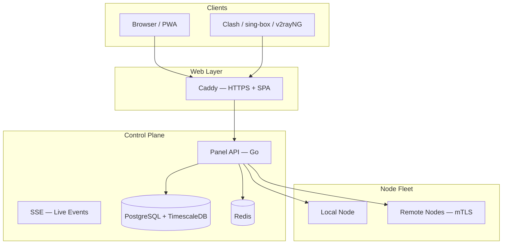

# مستندات VortexUI

به راهنمای رسمی VortexUI خوش آمدید.

نصب، پیکربندی و مدیریت پنل پروکسی نسل جدید (Xray + sing-box). از **انتخابگر زبان** در بالای صفحه برای جابه‌جایی بین ۴ زبان استفاده کنید.

!!! tip "نصب سریع"
    ```bash
    bash <(curl -Ls https://raw.githubusercontent.com/iPmartNetwork/VortexUI/master/install.sh)
    ```

## نقشه مستندات

| بخش | فصل‌ها |
|---------|----------|
| شروع کار | [معرفی](01-introduction.md) · [نصب](02-installation.md) · [اولین قدم‌ها](03-first-steps.md) |
| راهنمای پنل | [داشبورد](04-dashboard.md) · [کاربران](05-user-management.md) · [نودها](06-node-management.md) · [شبکه](07-network-policy.md) |
| مدیریت | [امنیت](08-security-administration.md) · [پلن‌ها](09-plans-payments.md) · [اعلان‌ها](10-notifications.md) · [تنظیمات](11-settings-backup.md) |
| مرجع فنی | [API](12-api-reference.md) · [پروتکل‌ها](13-protocols-config.md) · [عملیات](14-operations-maintenance.md) · [FAQ](15-troubleshooting-faq.md) |
| تازه‌های نسخه | [ویژگی‌های نسخه 1.2.0](16-v120-features.md) · [ویژگی‌های نسخه 1.2.3](17-v123-features.md) |

## معماری



## لینک‌های مفید

| منبع | لینک |
|----------|------|
| OpenAPI | [openapi.yaml on GitHub](https://github.com/iPmartNetwork/VortexUI/blob/master/docs/openapi.yaml) |
| Protocol examples | [protocols.md](https://github.com/iPmartNetwork/VortexUI/blob/master/docs/protocols.md) |
| Repository | [github.com/iPmartNetwork/VortexUI](https://github.com/iPmartNetwork/VortexUI) |
| تلگرام | [@vortex_ui](https://t.me/vortex_ui) |
