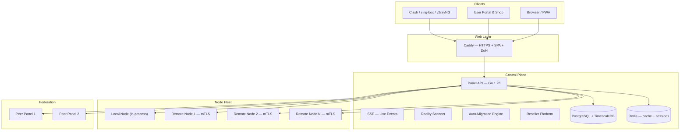

# مستندات VortexUI

<div style="text-align: center; margin: 2rem 0;">
  <strong style="font-size: 1.4rem;">VortexUI نسخه ۱.۲.۷</strong><br/>
  <em style="font-size: 1.1rem;">پنل مدیریت پروکسی نسل جدید — مستقل از هسته، کاربرمحور، بلادرنگ، ضد سانسور</em>
</div>

---

<div class="grid cards" markdown>

- :material-account-group: **پورتال سلف‌سرویس و فروشگاه**

    کاربران نهایی با توکن اشتراک خود وارد می‌شوند، مصرف را مشاهده کرده، پلن خریداری می‌کنند و تیکت پشتیبانی ارسال می‌کنند.

- :material-cash-register: **پلن‌ها و پرداخت اختصاصی هر ریسلر**

    هر ریسلر پلن‌ها، قیمت‌گذاری و روش‌های پرداخت خود را تعریف می‌کند — کارت‌به‌کارت، رمزارز یا درگاه زرین‌پال.

- :material-shield-lock: **مجموعه ضد سانسور**

    ترفندهای TLS، حفاظت در برابر پروب، اعتبارسنجی فینگرپرینت، وب‌سایت فریبنده، DoH، +WARP، پروفایل‌های دورزنی.

- :material-server-network: **ناوگان هوشمند نودها**

    ویزارد ثبت‌نام، مهاجرت خودکار، تشخیص سلامت، mTLS، مانیتورینگ زنده، اتوماسیون DNS کلادفلر.

- :material-chart-areaspline: **تحلیل‌های پیشرفته**

    تفکیک جغرافیایی، کاربران برتر، ساعات اوج، نقشه حرارتی جهان، خروجی CSV، نمودارهای بلادرنگ.

- :material-sitemap: **پلتفرم نمایندگی**

    کیف پول، زیرنمایندگی، برندسازی اختصاصی، وب‌هوک، محدودیت‌های سیاستی، تعلیق خودکار، لیست‌سفید محدوده‌ای.

</div>

---

!!! tip "نصب سریع"
    ```bash
    bash <(curl -Ls https://raw.githubusercontent.com/iPmartNetwork/VortexUI/master/install.sh)
    ```
    یک دستور. نصب تعاملی. HTTPS شامل می‌شود.

---

## نقشه مستندات

| بخش | آنچه خواهید آموخت |
|-----|-------------------|
| [معرفی](01-introduction.md) | معماری، نمای کلی ویژگی‌ها، مقایسه، پروتکل‌های پشتیبانی‌شده |
| [نصب](02-installation.md) | نصب تک‌خطی، داکر، بیلد بومی، راه‌اندازی ایجنت نود |
| [شروع سریع](03-first-steps.md) | ورود، افزودن نود، ایجاد اینباند، افزودن کاربر، تأیید |
| [داشبورد](04-dashboard.md) | ویجت‌ها، تحلیل‌ها، مانیتور، پالت دستور |
| [کاربران](05-user-management.md) | عملیات CRUD، سهمیه‌ها، اشتراک‌ها، پورتال، فروشگاه، خانواده، رفرال |
| [نودها](06-node-management.md) | ثبت‌نام، سلامت، مهاجرت خودکار، مانیتورینگ، اتوماسیون DNS |
| [شبکه](07-network-policy.md) | اوتباندها، بسته‌های مسیریابی، زنجیره‌های CDN، بالانسرها، فدراسیون |
| [امنیت](08-security-administration.md) | RBAC، پلتفرم نمایندگی، ترفندهای TLS، حفاظت پروب، محدودیت IP |
| [پلن‌ها و پرداخت](09-plans-payments.md) | پلن‌های اختصاصی ریسلر، تنظیم پرداخت، فروشگاه، کیف پول، سفارشات |
| [اعلان‌ها](10-notifications.md) | وب‌هوک، تلگرام، هشدار سهمیه، رویدادهای SSE |
| [تنظیمات](11-settings-backup.md) | برندسازی، وایت‌لیبل، بکاپ، دیپ‌لینک، بروزرسانی |
| [مرجع API](12-api-reference.md) | احراز هویت، اندپوینت‌ها، مشخصات OpenAPI |
| [پروتکل‌ها](13-protocols-config.md) | ۱۴ پروتکل، ترنسپورت‌ها، لایه‌های امنیتی، ماتریس قابلیت |
| [عملیات](14-operations-maintenance.md) | HTTPS، پرومتئوس، مقیاس‌پذیری، دیتابیس، عملکرد |
| [عیب‌یابی](15-troubleshooting-faq.md) | مشکلات رایج، نکات دیباگ، سؤالات متداول |

---

## معماری



---

## پشته فنی

| لایه | فناوری |
|------|--------|
| بکند | Go 1.26, Echo, gRPC, sqlc, pgx |
| فرانتند | React 18, TypeScript 5.6, Tailwind CSS, TanStack Query |
| دیتابیس | PostgreSQL 16 + TimescaleDB |
| کش | Redis 7 |
| هسته‌های پروکسی | Xray-core, sing-box |
| وب‌سرور | Caddy (HTTPS خودکار) |
| ارتباط | gRPC + mTLS (پنل ↔ نودها) |
| اعلان‌ها | Webhook (HMAC-SHA256)، Telegram Bot API |
| مانیتورینگ | Prometheus metrics + Grafana |

---

## لینک‌های سریع

| منبع | لینک |
|------|------|
| مخزن گیت‌هاب | [github.com/iPmartNetwork/VortexUI](https://github.com/iPmartNetwork/VortexUI) |
| کانال تلگرام | [@vortex_ui](https://t.me/vortex_ui) |
| مشخصات OpenAPI | [openapi.yaml](https://github.com/iPmartNetwork/VortexUI/blob/master/docs/openapi.yaml) |
| تاریخچه تغییرات | [CHANGELOG.md](https://github.com/iPmartNetwork/VortexUI/blob/master/CHANGELOG.md) |
| گزارش باگ | [GitHub Issues](https://github.com/iPmartNetwork/VortexUI/issues) |
| بحث و گفتگو | [GitHub Discussions](https://github.com/iPmartNetwork/VortexUI/discussions) |

---

!!! info "زبان‌ها"
    این مستندات به **English**، **فارسی**، **العربية** و **Türkçe** موجود است.
    از انتخاب‌گر زبان در هدر برای تغییر استفاده کنید.
