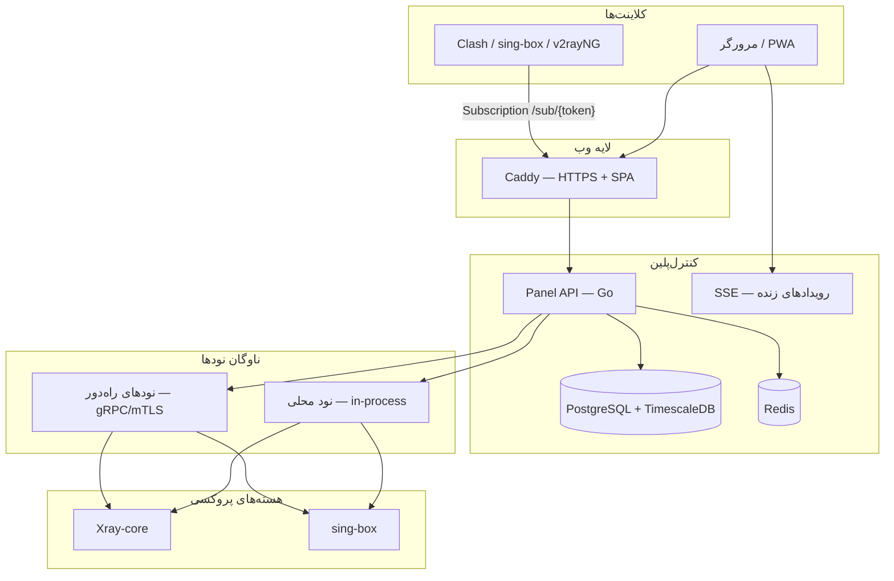

<div align="center" dir="rtl" class="wiki-hero">


# 📚 ویکی VortexUI

**راهنمای جامع نصب، پیکربندی و استفاده از پنل مدیریت پروکسی نسل جدید**

[](https://github.com/iPmartNetwork/VortexUI/releases)
[](../../../LICENSE)

[← ویکی (۴ زبان)](../README.md) · [English](../en/README.md) · [العربية](../ar/README.md) · [Türkçe](../tr/README.md) · [English README](../../../README.md) · [README فارسی](../../../README.fa.md)

</div>

---

<div dir="rtl">

## درباره این ویکی

این ویکی مرجع کامل **VortexUI** است — پنل مدیریت پروکسی متن‌باز با بک‌اند Go، فرانت‌اند React/TypeScript، و پشتیبانی از هسته‌های **Xray-core** و **sing-box**. به **۴ زبان** (English، فارسی، العربية، Türkçe) در دسترس است. محتوا برای مدیران سرور، فروشندگان سرویس VPN، و توسعه‌دهندگانی که می‌خواهند از API استفاده کنند نوشته شده است.

### معماری کلی



---

## 📖 فهرست مطالب

### شروع کار

| # | موضوع | توضیح |
|:-:|-------|-------|
| 1 | [معرفی و مفاهیم پایه](./01-introduction.md) | VortexUI چیست، معماری، مقایسه با پنل‌های دیگر |
| 2 | [نصب و راه‌اندازی](./02-installation.md) | نصب یک‌خطی، Docker، Native، پیش‌نیازها |
| 3 | [اولین قدم‌ها](./03-first-steps.md) | ورود، ساخت ادمین، اولین inbound و کاربر |

### راهنمای پنل

| # | موضوع | توضیح |
|:-:|-------|-------|
| 4 | [داشبورد](./04-dashboard.md) | آمار زنده، نمودارها، SSE |
| 5 | [مدیریت کاربران](./05-user-management.md) | ساخت، سهمیه، اشتراک، import |
| 6 | [مدیریت نودها](./06-node-management.md) | نود محلی/راه‌دور، inbound، Geo، failover |
| 7 | [سیاست شبکه](./07-network-policy.md) | Outbound، Routing، Balancer |
| 8 | [امنیت و ادمین‌ها](./08-security-administration.md) | RBAC، 2FA، API Token، Audit |
| 9 | [پلن‌ها و پرداخت](./09-plans-payments.md) | فروش اشتراک، ZarinPal، NowPayments |
| 10 | [اعلان‌ها](./10-notifications.md) | Webhook، Telegram، رویدادها |
| 11 | [تنظیمات و پشتیبان‌گیری](./11-settings-backup.md) | Backup، Branding، IP Guard |

### مرجع فنی

| # | موضوع | توضیح |
|:-:|-------|-------|
| 12 | [مرجع API](./12-api-reference.md) | احراز هویت، endpointها، OpenAPI |
| 13 | [پروتکل‌ها و پیکربندی](./13-protocols-config.md) | VLESS، REALITY، Hysteria2، مثال‌ها |
| 14 | [عملیات و نگهداری](./14-operations-maintenance.md) | `vortexui`، SSL، به‌روزرسانی، متریک |
| 15 | [عیب‌یابی و FAQ](./15-troubleshooting-faq.md) | مشکلات رایج و پاسخ‌ها |

---

## ⚡ دسترسی سریع

### نصب یک‌خطی (پیشنهادی)

```bash
bash <(curl -Ls https://raw.githubusercontent.com/iPmartNetwork/VortexUI/master/install.sh)
```

### کنسول مدیریت

```bash
vortexui          # منوی تعاملی
vortexui status   # وضعیت سرویس‌ها
vortexui logs     # مشاهده لاگ
vortexui update   # به‌روزرسانی
```

### لینک‌های مفید

| منبع | مسیر |
|------|------|
| OpenAPI 3.0 | [`docs/openapi.yaml`](../../openapi.yaml) |
| مثال پروتکل‌ها (EN) | [`docs/protocols.md`](../../protocols.md) |
| متغیرهای محیطی | [`.env.example`](../../../.env.example) |
| Docker Compose | [`deploy/compose.yml`](../../../deploy/compose.yml) |
| Changelog | [`CHANGELOG.md`](../../../CHANGELOG.md) |

---

## 🌐 زبان رابط کاربری

پنل از **۸ زبان** پشتیبانی می‌کند: English، فارسی، Türkçe، العربية، Русский، 中文، 日本語، Español — با پشتیبانی کامل **RTL** برای فارسی و عربی.

تغییر زبان: **تنظیمات → Language** یا از منوی کناری.

---

## 📄 مجوز

VortexUI تحت مجوز **GPL-3.0** منتشر شده است. جزئیات در فایل [LICENSE](../../../LICENSE).

</div>
