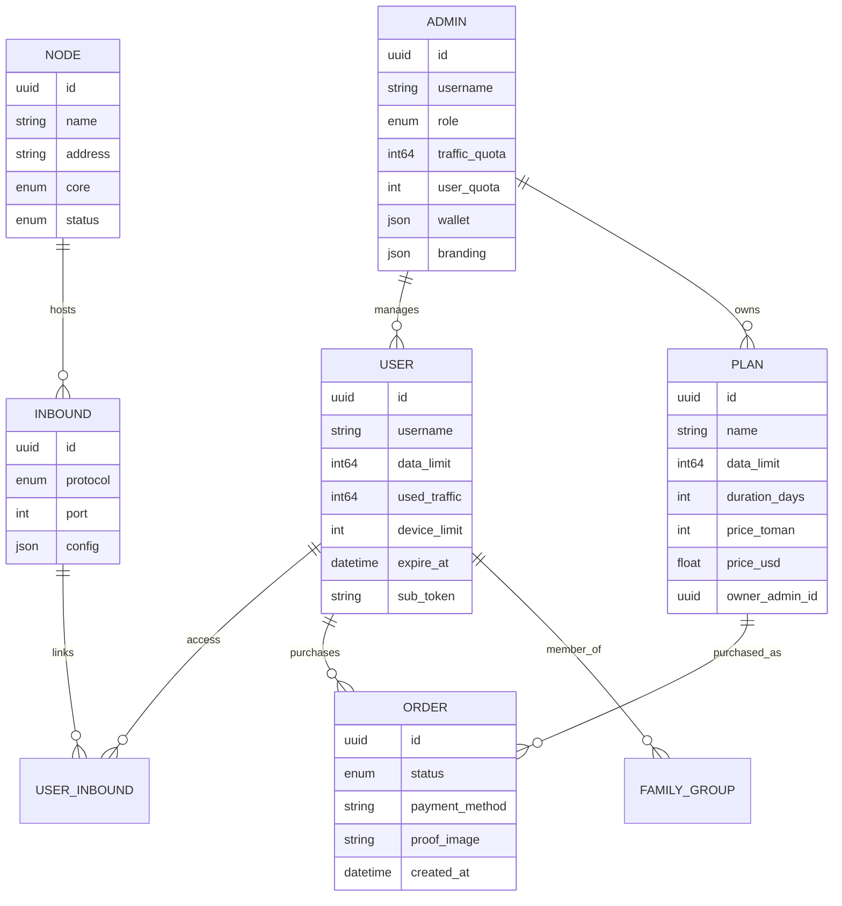

# Giriş

!!! abstract "Özet"
    VortexUI, Xray-core ve sing-box destekleyen **kullanıcı-merkezli**, **çekirdek-bağımsız** bir proxy yönetim panelidir. Kullanıcıları, düğümleri, trafiği, abonelikleri, ödemeleri, bayileri ve sansür karşıtı araçları tek bir modern arayüzden yönetir.

---

## VortexUI Nedir?

**VortexUI**, aşağıdakilere ihtiyaç duyan operatörler için geliştirilmiş yeni nesil bir proxy yönetim panelidir:

- **Ölçek** — düzinelerce düğüm üzerinde binlerce kullanıcıyı yönetin
- **Dayanıklılık** — otomatik yük devretme, sağlık izleme, kendini onaran düğüm filosu
- **Sansür karşıtı** — ISP'ye özel TLS hileleri, problama koruması, sahte siteler, WARP+
- **Self-servis** — son kullanıcılar kendi hesaplarını yönetir, plan satın alır, talep açar
- **Gelir** — bayi bazlı planlar, çoklu ödeme geçitleri, cüzdan faturalandırma, referans programı
- **Yetki devri** — alt bayiler, beyaz etiket, politika limitleri ile tam bayi platformu

Gelen bağlantı merkezli panellerin (3x-ui) aksine, VortexUI **kullanıcı-merkezli model** kullanır: tek bir kullanıcı kimliği, tüm düğümlerdeki atanmış tüm protokollere eş zamanlı erişim sağlar.

---

## Özellik Genel Bakışı

### Motor ve Altyapı

| Yetenek | Detaylar |
|---------|----------|
| Çift çekirdek desteği | Xray-core ve sing-box — düğüm başına seçim |
| Push delta trafik | Yeniden başlatmaya dayanıklı, çift sayım yok, veri kaybı yok |
| mTLS düğüm filosu | Şifreli bağlantılar, otomatik yük devretme, geri göç |
| Düğüm kayıt sihirbazı | Uzak düğümleri eklemek için dört adımlı arayüz |
| Otomatik göç | Sağlıksız düğümlerden kullanıcıları otomatik taşıma |
| Federasyon | Birden fazla panel arasında kullanıcı/düğüm senkronizasyonu |
| Yerel düğüm | Süreç içi çekirdek — ayrı ajan gerekmez |
| CDN/Aktarma zincirleri | CDN, aktarma ve worker atlamalarıyla çoklu-atlama yolları |
| Yük dengeleyiciler | Sağlık problaması ile 4 strateji |
| Cloudflare DNS otomasyonu | Düğümler için DNS kayıtlarını otomatik yönetme |

### Güvenlik ve Sansür Karşıtı

| Yetenek | Detaylar |
|---------|----------|
| Reality Tarayıcı | Gecikme puanlaması ile en uygun SNI'ları keşfetme |
| TLS Hileleri Yöneticisi | ISP'ye özel profiller (fragment, mux, padding) |
| Problama koruması | Aktif GFW problarını tespit etme ve engelleme |
| Parmak izi doğrulama | JA3 tabanlı istemci filtreleme |
| Sahte web sitesi | Problayıcılara sahte site sunma (proxy veya statik mod) |
| DNS-over-HTTPS | Reklam/kötü amaçlı yazılım engelleme ile dahili DoH |
| Gizlenme profilleri | Ülke bazında yeniden kullanılabilir anti-DPI önayarları |
| WARP+ entegrasyonu | Temiz IP için Cloudflare giden bağlantısı |
| Temiz-IP tarayıcı | Gecikme/kayıp puanlamasıyla en iyi CDN kenar IP'lerini bulma |
| IP-limit uygulaması | Yapılandırılabilir eylemlerle kullanıcı başına eş zamanlı IP sınırları |
| Coğrafi engelleme | Gelen bağlantı başına ülke kısıtlamaları |
| Hesap paylaşım koruması | Kimlik bilgisi paylaşımını tespit etme ve önlem alma |

### Kullanıcı Yönetimi ve Ticaret

| Yetenek | Detaylar |
|---------|----------|
| Self-servis portal | Abonelik tokeni ile giriş, kullanım görüntüleme, talepler |
| Self-servis mağaza | Kart/kripto/ZarinPal ödemeli bayi bazlı planlar |
| Akıllı Kota | Kademeli hız azaltma (adil kullanım katmanları) |
| Aile grupları | Birden fazla kullanıcı için paylaşılan veri havuzları |
| Referans sistemi | Veri/gün ödülleri ile davet kodları |
| Bayi bazlı planlar | Her bayi kendi planlarını ve fiyatlandırmasını oluşturur |
| Ödeme geçitleri | ZarinPal (çevrimiçi), karttan karta (dekont yükleme), kripto (TX hash) |
| Cüzdan faturalandırma | Yükleme kuyruğu ile bayi kredi sistemi |
| Abonelik sunucuları | Şablon değişkenleri ile gelen bağlantı başına CDN/adres geçersiz kılmaları |
| Derin bağlantılar + QR | Tek dokunuşla abonelik içe aktarma |
| Yapılandırma şablonları | Kullanıcı başına özel Clash/sing-box yönlendirme |
| İçe aktarma araçları | 3x-ui veya Marzban'dan göç |

### Yönetim ve Bayi Platformu

| Yetenek | Detaylar |
|---------|----------|
| RBAC + roller | Yönetici başına ayrıntılı izinler |
| Tam bayi platformu | Cüzdan, alt bayiler, beyaz etiket, webhooklar, politika limitleri |
| Kapsamlı izin listeleri | Bayi başına plan/düğüm/gelen bağlantı kısıtlamaları |
| Otomatik askıya alma | İhlallerde otomatik bayi askıya alma |
| Denetim günlüğü | Her yönetici eylemi fark ile izlenir |
| Kota bildirimleri | Bayi uyarıları için yapılandırılabilir eşikler |
| Otomatik yedekleme | Telegram veya S3'e zamanlanmış dışa aktarmalar |
| Grafana metrikleri | Prometheus uç noktası + hazır gösterge paneli |

### Ön Yüz ve Kullanıcı Deneyimi

| Yetenek | Detaylar |
|---------|----------|
| Komut paleti | Ctrl+K her yerde bulanık arama |
| Gösterge paneli widget'ları | Sürükle-bırak, yeniden boyutlandır, düzeni özelleştir |
| Dünya haritası | Coğrafi trafik görselleştirmesi |
| Gerçek zamanlı göstergeler | Animasyonlu CPU/RAM/bant genişliği göstergeleri |
| Monitör sayfası | Canlı bağlantı tablosu (kullanıcı, düğüm, IP, protokol, süre) |
| Analitik | Coğrafi dağılım, en aktif kullanıcılar, yoğun saatler, CSV dışa aktarma |
| Başlangıç turu | İlk kez yönetici rehberi |
| 8 dil | EN/FA/TR/AR/RU/ZH/JA/ES tam RTL desteği ile |
| Koyu + Açık | Pürüzsüz animasyonlu tema geçişi |
| Mobil portal | Alt gezinme, çekerek yenile, alt sayfalar |

---

## Mimari

```
┌──────────────────────────────────────────────────────────────┐
│  Caddy (Web Katmanı)   — HTTPS, SPA, ters proxy, DoH        │
├──────────────────────────────────────────────────────────────┤
│  Panel (Go 1.26)       — REST API, SSE, gRPC hub, zamanlayıcı│
│  ├─ Auth               — JWT + TOTP + portal tokenleri        │
│  ├─ Servisler          — kullanıcı, düğüm, plan, sipariş, analitik│
│  ├─ Hub                — düğüm filosu yönetimi + yük devretme│
│  ├─ Tarayıcı           — Reality SNI problaması + Temiz-IP    │
│  ├─ Göç                — sağlık tabanlı kullanıcı yeniden dağıtımı│
│  ├─ Bayi               — cüzdan, planlar, markalama, webhooklar│
│  └─ Federasyon         — paneller arası senkronizasyon        │
├──────────────────────────────────────────────────────────────┤
│  PostgreSQL + TimescaleDB — veri + zaman serisi trafik        │
│  Redis                    — önbellek, oturumlar, cihaz izleyici│
├──────────────────────────────────────────────────────────────┤
│  Düğüm Ajanı (gRPC)   — uzak çekirdek yürütme + sağlık      │
│  Yerel Düğüm           — panel sunucusu üzerinde süreç içi   │
└──────────────────────────────────────────────────────────────┘
```



---

## Diğer Panellerle Karşılaştırma

| Özellik | VortexUI 1.2.8 | 3x-ui | Marzban | Hiddify |
|---------|:--:|:--:|:--:|:--:|
| Çift çekirdek (Xray + sing-box) | ✅ | ❌ | ❌ | ✅ |
| Kullanıcı-merkezli model | ✅ | ❌ | ✅ | ✅ |
| Push delta trafik | ✅ | polling | polling | polling |
| Düğüm otomatik göçü | ✅ | ❌ | ❌ | ❌ |
| Yük dengeleyici (4 strateji) | ✅ | ❌ | ❌ | ❌ |
| Reality Tarayıcı | ✅ | ❌ | ❌ | ❌ |
| TLS Hileleri (ISP profilleri) | ✅ | ❌ | ❌ | kısmi |
| Problama koruması | ✅ | ❌ | ❌ | ❌ |
| İstemci parmak izi (JA3) | ✅ | ❌ | ❌ | ❌ |
| Sahte web sitesi | ✅ | ❌ | ❌ | ❌ |
| DNS-over-HTTPS | ✅ | ❌ | ❌ | ❌ |
| Self-servis portal | ✅ | ❌ | ❌ | ✅ |
| Bayi bazlı mağaza | ✅ | ❌ | ❌ | ❌ |
| Ödeme geçitleri (çoklu yöntem) | ✅ | ❌ | ❌ | kısmi |
| Bayi bazlı planlar ve fiyatlandırma | ✅ | ❌ | ❌ | ❌ |
| Abonelik sunucuları (geçersiz kılmalar) | ✅ | ❌ | ✅ | ❌ |
| Aile grupları | ✅ | ❌ | ❌ | ❌ |
| Referans sistemi | ✅ | ❌ | ❌ | ❌ |
| Federasyon | ✅ | ❌ | ❌ | ❌ |
| Akıllı Kota | ✅ | ❌ | ❌ | ❌ |
| CDN/Aktarma zincirleri | ✅ | ❌ | ❌ | ❌ |
| Bayi cüzdan faturalandırma | ✅ | ❌ | ❌ | ❌ |
| Derin bağlantılar | ✅ | ❌ | ❌ | ✅ |
| Analitik (coğrafi + dışa aktarma) | ✅ | ❌ | ❌ | ❌ |
| Gösterge paneli widget'ları (sürükle-bırak) | ✅ | ❌ | ❌ | ❌ |
| Komut paleti (Ctrl+K) | ✅ | ❌ | ❌ | ❌ |
| Backend | Go | Go | Python | Python |
| Veritabanı | PG + TimescaleDB | SQLite | SQLite | SQLite |

---

## Desteklenen Protokoller

| Protokol | Çekirdek | Gelen | Giden | Taşıma | Güvenlik |
|----------|----------|:-----:|:-----:|--------|----------|
| VLESS | Her ikisi | ✅ | ✅ | TCP, WS, gRPC, HTTPUpgrade, xHTTP, mKCP | None, TLS, REALITY |
| VMess | Her ikisi | ✅ | ✅ | TCP, WS, gRPC, HTTPUpgrade, mKCP | None, TLS |
| Trojan | Her ikisi | ✅ | ✅ | TCP, WS, gRPC, mKCP | TLS, REALITY |
| Shadowsocks | Her ikisi | ✅ | ✅ | TCP (+ SS-2022 çoklu kullanıcı) | None |
| Hysteria2 | sing-box | ✅ | ✅ | UDP (QUIC) | TLS |
| TUIC | sing-box | ✅ | ✅ | UDP (QUIC) | TLS |
| WireGuard | sing-box | ✅ | ✅ | UDP | Yerel |
| Hysteria (v1) | sing-box | ✅ | — | UDP | TLS |
| ShadowTLS | sing-box | ✅ | ✅ | TCP | TLS |
| AnyTLS | sing-box | ✅ | — | TCP | TLS |
| Naive | sing-box | ✅ | — | — | TLS (zorunlu) |
| SOCKS | Her ikisi | ✅ | ✅ | TCP (taşıma yok) | düz metin |
| HTTP | Her ikisi | ✅ | ✅ | TCP (taşıma yok) | düz metin |
| Dokodemo | Xray | ✅ | — | — | düz metin |

**Abonelik çıktı biçimleri:** `base64`, `clash`, `singbox`, `xray`, `outline`, `links`
(istemci User-Agent'ından otomatik algılanır veya `?format=` ile zorlanır).

---

## Temel Terminoloji

| Terim | Anlamı |
|-------|--------|
| **Panel** | Kontrol sunucusu — API, arayüz, veritabanı, zamanlayıcılar |
| **Düğüm (Node)** | Proxy çekirdeği (Xray veya sing-box) çalıştıran sunucu |
| **Yerel Düğüm** | Panel ile aynı makinede süreç içi çekirdek |
| **Gelen Bağlantı (Inbound)** | İstemciye yönelik giriş noktası (protokol + port + yapılandırma) |
| **Giden Bağlantı (Outbound)** | Çıkış yolu (freedom, proxy zinciri, WARP, blackhole) |
| **Abonelik** | `/sub/{token}` — herhangi bir istemci uygulaması için otomatik algılanan yapılandırma |
| **Abonelik Sunucusu** | CDN fronting için gelen bağlantı başına adres/SNI geçersiz kılmaları |
| **Portal** | Son kullanıcı self-servis web arayüzü |
| **Mağaza** | Bayi bazlı plan satın alma sayfası (`/sub/{token}/shop`) |
| **Hub** | Tüm düğüm bağlantılarını yöneten dahili bileşen |
| **Federasyon** | Kullanıcı/düğüm senkronizasyonu için bağlı birden fazla panel |
| **Aktarma Zinciri** | Çoklu atlama yolu: İstemci → CDN → Aktarma → Düğüm |
| **Akıllı Kota** | Kademeli hız katmanları ile adil kullanım politikası |
| **Yönlendirme Paketi** | Yeniden kullanılabilir isimlendirilmiş yönlendirme kuralları koleksiyonu |
| **Gizlenme Profili** | Anti-DPI önayarı (fragment + parmak izi + mux) |
| **SSE** | Server-Sent Events — push tabanlı canlı arayüz güncellemeleri |
| **Bayi** | Kapsamlı erişim, cüzdan, kendi planları/kullanıcıları olan yönetici |
| **Beyaz Etiket** | Bayi bazlı markalama (logo, renkler, başlık) |

---

## Sonraki Adımlar

1. **[Kurulum](02-installation.md)** — VortexUI'yı 5 dakikada çalıştırın
2. **[İlk Adımlar](03-first-steps.md)** — giriş yapın, düğüm ekleyin, ilk kullanıcıyı oluşturun
3. **[Gösterge Paneli](04-dashboard.md)** — gerçek zamanlı genel bakışı keşfedin
