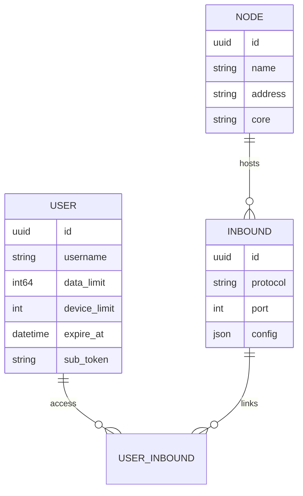

<div align="center">


**VortexUI Wiki**

[Wiki](../README.md) · [FA](../fa/01-introduction.md) · [EN](../en/01-introduction.md) · [AR](../ar/01-introduction.md)

</div>

<div>

# 1. Giriş ve Temel Kavramlar

[← Dizine dön](./README.md) · [Sonraki: Kurulum →](./02-installation.md)

> [!NOTE]
> VortexUI **kullanıcı merkezlidir** — tek abonelik tüm atanmış inbound'ları kapsar.

---

## VortexUI Nedir?

**VortexUI**, kullanıcıları, node'ları, inbound/outbound'ları, yönlendirmeyi ve abonelik satışını yönetmek için tasarlanmış yeni nesil bir proxy yönetim panelidir. Inbound odaklı panellerden (3x-ui gibi) farklı olarak VortexUI **kullanıcı merkezli bir model** kullanır: her kullanıcının tek bir kimliği vardır ve birden fazla protokole/inbound'a erişim kazanır.

### Temel Özellikler

| Alan | Yetenek |
|------|------------|
| **Çekirdek** | Xray-core ve sing-box — node başına seçilebilir |
| **Trafik** | **Push delta** muhasebesi (yeniden başlatmaya dayanıklı) |
| **Çoklu node** | mTLS bağlantıları, otomatik failover, migrate-back |
| **Ağ** | Outbound, yönlendirme, dengeleyici, observatory |
| **Güvenlik** | JWT + TOTP 2FA, RBAC, denetim günlüğü, hesap paylaşımına karşı koruma |
| **Satış** | Planlar, ZarinPal, NowPayments (kripto) |
| **UI** | React 18, 8 dil, koyu/açık tema, canlı SSE, PWA |

---

## Mimari

### Ana Bileşenler

```
┌─────────────────────────────────────────────────────────┐
│  Caddy (web)          — HTTPS, SPA, reverse proxy       │
├─────────────────────────────────────────────────────────┤
│  Panel (cmd/panel)    — API, SSE, management, DB        │
├─────────────────────────────────────────────────────────┤
│  PostgreSQL/TimescaleDB — persistent data + traffic TS  │
│  Redis                  — cache and sessions            │
├─────────────────────────────────────────────────────────┤
│  Node Agent (cmd/node) — gRPC server, core execution    │
│  Local Node            — in-process core on same server │
└─────────────────────────────────────────────────────────┘
```

### Veri Modeli: Kullanıcı Merkezli



Bir **User**, birden fazla **Node** üzerindeki birden fazla **Inbound**'a bağlanabilir. Abonelik bağlantısı (`/sub/{token}`) tüm yapılandırmaları tek bir Clash/sing-box/base64 dosyasında döndürür.

---

## Diğer Panellerle Karşılaştırma

| Özellik | VortexUI | 3x-ui | Marzban | Hiddify |
|--------|:--------:|:-----:|:-------:|:-------:|
| Xray + sing-box çekirdekleri | ✅ | Xray | Xray | ✅ |
| Kullanıcı merkezli model | ✅ | ❌ | ✅ | ✅ |
| Push/delta trafik | ✅ | polling | polling | polling |
| Balancer + routing | ✅ | ❌ | ❌ | ❌ |
| Outbound CRUD | ✅ | partial | ❌ | ❌ |
| API token + audit | ✅ | ❌ | ❌ | ❌ |
| Hesap paylaşımına karşı koruma | ✅ | partial | ❌ | ❌ |
| Otomatik HTTPS | ✅ Caddy | ❌ | ❌ | ✅ |
| Iran Geo | ✅ | ❌ | ❌ | partial |
| Veritabanı | PG+Timescale | SQLite/PG | SQLite | SQLite |

---

## Desteklenen Protokoller

| Protokol | Inbound | Outbound | Taşıma |
|--------|:-------:|:--------:|-----------|
| VLESS | ✅ | ✅ | TCP, WS, gRPC, HTTPUpgrade |
| VMess | ✅ | ✅ | TCP, WS, gRPC |
| Trojan | ✅ | ✅ | TCP, WS, gRPC |
| Shadowsocks | ✅ | ✅ | TCP |
| SOCKS / HTTP | — | ✅ | TCP |
| Hysteria2 | ✅ (sing-box) | — | UDP |
| TUIC | ✅ (sing-box) | — | UDP |
| WireGuard | ✅ | — | UDP |

**Güvenlik katmanı:** None, TLS, REALITY

---

## Önemli Kavramlar

| Terim | Anlam |
|------|---------|
| **Panel** | Kontrol sunucusu — API, UI, DB |
| **Node** | Proxy çekirdeğini çalıştıran sunucu |
| **Local Node** | Panel ile aynı makinede in-process node |
| **Inbound** | İstemci giriş noktası (443 portunda VLESS vb.) |
| **Outbound** | Çıkış yolu (freedom, proxy zinciri, WARP) |
| **Subscription** | İstemci içe aktarma için `/sub/{token}` bağlantısı |
| **Failover** | Kullanıcıların sağlıklı node'a otomatik taşınması |
| **SSE** | Polling olmadan canlı UI güncellemeleri |

---

## Yol Haritası (Özet)

Yol haritası özelliklerinin çoğu uygulanmıştır: cluster modu, Grafana/Prometheus, otomatik yedekleme, Telegram kullanıcı botu, WireGuard, coğrafi engelleme, markalama, PWA ve daha fazlası.

Aktif geliştirmedeki öğeler:
- React Native mobil uygulama
- Çok dilli dokümantasyon (bu wiki ilk adımdır)
- Proxy üzerinde kullanıcı başına hız sınırlama

</div>
