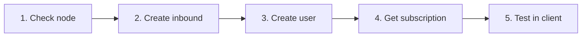

# 3. İlk Adımlar

!!! tip
    Bu akışı **5 dakikada** tamamlayın: node → inbound → kullanıcı → abonelik → test.

---

## Giriş Yapma

1. Kurulum URL'sini tarayıcıda açın (ör. `https://panel.example.com`)
2. Kurulum sırasında oluşturulan admin kullanıcı adı ve şifre ile oturum açın
3. 2FA etkinse, 6 haneli authenticator kodunu girin

### Yeni admin oluşturma (CLI)

```bash
# Docker
docker compose -f deploy/compose.yml exec panel \
  /usr/local/bin/panel admin create --username admin2 --password 'pass' --sudo

# Native
./bin/panel admin create --username admin2 --password 'pass' --sudo

# Or via vortexui
vortexui admin
```

---

## İlk İş Akışı (5 Dakika)



### Adım 1: Node'u kontrol edin

- Menü → **Nodes**
- `local` node'u (veya eklenen node) **yeşil** olmalı ve Core Running görünmeli
- CPU/RAM/Disk ve bağlantı sayısını inceleyin

### Adım 2: Inbound oluşturun

1. Node üzerinde → **Inbounds**
2. **Add Inbound**
3. Hızlı VLESS + REALITY örneği:

| Alan | Değer |
|-------|-------|
| Protocol | `vless` |
| Port | `443` |
| Network | `tcp` |
| Security | `reality` |
| Flow | `xtls-rprx-vision` |
| SNI | `www.microsoft.com` |

4. REALITY bölümünde **Generate**'e tıklayın (özel/genel anahtar çifti)
5. Kaydedin — çekirdek yapılandırmayı hot-reload eder

> Protokol ayrıntıları: [Bölüm 13 — Protokoller](./13-protocols-config.md)

### Adım 3: Kullanıcı oluşturun

1. Menü → **Users** → **New User**
2. Önerilen alanlar:

| Alan | Örnek |
|-------|---------|
| Username | `testuser` |
| Data limit | `50 GB` |
| Expire | 30 days |
| Device limit | `3` |
| Inbounds | Oluşturduğunuz inbound'u seçin |

3. **Save**

### Adım 4: Abonelik alın

1. Kullanıcı listesinde → **Subscription** simgesi (veya QR)
2. Aşağıdaki bağlantıları kopyalayın:

| Format | Kullanım |
|--------|----------|
| Base64 | v2rayNG, Nekoray |
| Clash | Clash Meta / Mihomo |
| sing-box | sing-box client |
| QR Code | Mobil tarama |

3. Genel kullanıcı sayfası: `https://panel.example.com/sub/info/{token}` — trafik grafiği ve QR

### Adım 5: Test

1. Bağlantıyı istemcinize aktarın
2. Bağlanın
3. Panelde → **Users** → Usage — trafik artmalı (canlı SSE)

---

## Önerilen İlk Ayarlar

| Ayar | Yol | Neden |
|---------|------|-----|
| Şifre değiştir | Settings → Password | Güvenlik |
| 2FA etkinleştir | Settings → 2FA | Hesap koruması |
| Iran Geo | Nodes → Update Geo | IR yönlendirme |
| Webhook/TG | env + restart | Olay bildirimleri |
| Backup | Settings → Backup | Felaket kurtarma |

---

## Başka Panelden Kullanıcı İçe Aktarma

**Users → Import** — desteklenen kaynaklar:
- **3x-ui** (JSON export)
- **Marzban** (JSON export)

Kullanıcılar UUID ve kota ile taşınır; inbound'lar ayrı eşleştirilmelidir.

---

## UI Kısayolları

| Eylem | Yol |
|--------|------|
| Koyu/açık tema | Kenar çubuğu → ay/güneş simgesi |
| Dil | Settings → Language |
| Kullanıcı ara | Users → arama kutusu |
| Node logları | Nodes → Logs |
| Canlı olaylar | Otomatik — köşede toast |
