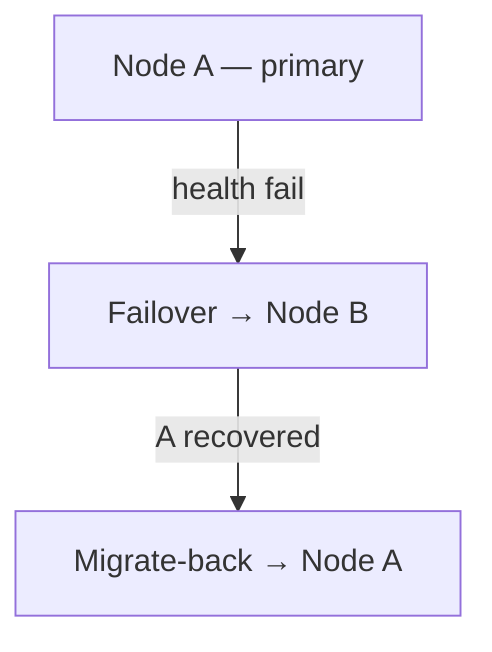

# 6. Node Yönetimi

!!! tip "İpucu"
    İran yönlendirme kuralları için **Nodes → Update Geo** kullanın.

---

## Node Türleri

| Tür | Açıklama | Kullanım |
|------|-------------|----------|
| **Local Node** | Panel sunucusunda in-process çekirdek | Tek sunuculu kurulum |
| **Remote Node** | gRPC/mTLS ile ayrı agent | Çok sunuculu filo |

---

## Uzak Node Ekleme

1. **Nodes → Add Node**
2. Alanlar:

| Alan | Örnek |
|-------|---------|
| Name | `de-fra-01` |
| Address | `203.0.113.10:50051` |
| Core | `xray` or `singbox` |
| Endpoint | Abonelik için genel adres (CDN/tunnel) |

3. mTLS sertifikalarını `deploy/certs/`'ten agent'a kopyalayın
4. Agent'ı başlatın — durum yeşile döner

---

## Sağlık İzleme

Her node kartı şunları gösterir:

| Metrik | UI uyarı eşiği |
|--------|----------------------|
| CPU % | >60% sarı, >85% kırmızı |
| RAM % | aynı |
| Disk % | aynı |
| Connections | Aktif sayı |
| Last seen | Son heartbeat |

---

## Node Eylemleri

| Düğme | Eylem |
|--------|--------|
| **Inbounds** | Bu node'da inbound CRUD |
| **Logs** | Canlı çekirdek log akışı |
| **Restart Core** | Uzun kesinti olmadan yeniden yükleme |
| **Stop Core** | Geçici durdurma |
| **Update Geo** | Iran geoip/geosite indir |
| **Edit / Delete** | Meta veri düzenle / kaldır |

---

## Inbounds

**Nodes → Inbounds → Add**

- Protokol, port, ağ, güvenlik
- REALITY: Generate keypair
- Gelişmiş JSON editörü
- Share link içe aktarma
- Inbound başına **Bandwidth limit**
- Inbound başına **Geo-blocking**
- **Evasion profile** bağlantısı

---

## Failover ve Migrate-Back



- Kullanıcılar sağlıklı node'a taşınır
- Kurtarma sonrası otomatik dönüş (yapılandırılabilir)

---

## Custom Endpoint

Sunucunun gerçek IP'si istemcilerin gördüğünden farklı olduğunda (CDN, ters tünel):

```
Endpoint: cdn.example.com
```

Abonelik, dahili `address` yerine bu host'u duyurur.

---

## Cloudflare DNS Otomasyonu

Yapılandırma ile:

```env
VORTEX_CF_API_TOKEN=...
VORTEX_CF_ZONE_ID=...
```

Node'lar için A kayıtları otomatik oluşturulabilir.

---

## GeoIP / Geosite (Iran)

**Update Geo** [Iran-v2ray-rules](https://github.com/chocolate4u/Iran-v2ray-rules)'dan indirir:

- `geoip:ir`, `geosite:ir`, `category-ir`
- Reklam/kötü amaçlı yazılım kategorileri

Ardından çekirdek yeniden yüklenir. Özel URL: `POST /api/nodes/:id/geo-update`

---

## Hot-Switch Core

Her node **xray** ve **sing-box** arasında geçiş yapabilir (Hysteria2/TUIC yalnızca sing-box'ta).

---

## gRPC Keepalive

Boşta panel↔node bağlantıları keepalive ile canlı tutulur — düşmez.
