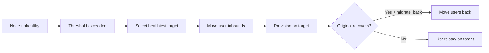

# Düğüm Yönetimi

!!! abstract "Düğüm Filosu"
    VortexUI, gRPC + mTLS aracılığıyla bir proxy düğüm filosunu yönetir. Her düğüm Xray-core veya sing-box çalıştırır ve panele sağlık, trafik ve bağlantı verilerini raporlar.

---

## Düğüm Filosu Genel Bakışı

**Düğümler** sayfası tüm düğümleri gösterir:

| Sütun | Açıklama |
|-------|----------|
| Ad | Düğüm görüntü adı |
| Adres | IP veya alan adı |
| Çekirdek | Xray-core veya sing-box |
| Durum | Çevrimiçi / Çevrimdışı / Sağlıksız |
| Kullanıcılar | Bu düğümdeki aktif kullanıcı sayısı |
| CPU / RAM / Disk | Canlı kaynak kullanımı |
| Çalışma süresi | Son yeniden başlatmadan bu yana geçen süre |

---

## Kayıt Sihirbazı

Uzak düğümler eklemek için önerilen yol. Dört adımlı bir arayüz akışı:

### Adım 1: Düğüm Detayları

- Ad, adres, port
- Çekirdek seçin (Xray veya sing-box)
- İsteğe bağlı: tünel/CDN erişimi için özel uç nokta

### Adım 2: Komut Oluşturma

Panel, şunları içeren tek satırlık bir kurulum komutu oluşturur:

- Düğüm kayıt tokeni (tek kullanımlık)
- Geri arama için panel adresi
- Çekirdek indirme URL'si

### Adım 3: Uzak Sunucuda Çalıştırma

Uzak sunucuya SSH ile bağlanıp komutu yapıştırın. Ajan:

1. Düğüm ikili dosyasını indirir ve kurar
2. Panel ile mTLS sertifikalarını değiştirir
3. Seçilen proxy çekirdeğini indirir ve başlatır
4. Systemd servisi olarak kaydolur

### Adım 4: Bağlantıyı Doğrulama

Panel düğümün çevrimiçi olduğunu onaylar ve ilk sağlık verilerini gösterir.

!!! tip
    Kayıt tokeni 10 dakika sonra sona erer. Süre dolarsa sihirbazdan yeni bir tane oluşturun.

---

## Düğüm Sağlık Tanılaması

Her düğüm sürekli izlenir. Panel üç arıza durumunu tespit eder:

| Durum | Anlamı | Otomatik eylem |
|-------|--------|----------------|
| **mTLS hatası** | Sertifika hatası veya ağ ulaşılamaz | Uyarı + yeniden deneme |
| **Ulaşılamaz** | Zaman aşımı içinde gRPC yanıtı yok | Uyarı → etkinse otomatik göç |
| **Çekirdek çöktü** | Ajan çalışıyor ama proxy çekirdeği çöktü | Çekirdeği otomatik yeniden başlat |

Tanılamayı görüntüleyin: **Düğümler → düğüme tıklayın → Sağlık** sekmesi.

---

## mTLS Bağlantıları

Tüm panel-düğüm iletişimi karşılıklı TLS kullanır:

- Sertifikalar kayıt sırasında otomatik oluşturulur
- Yapılandırılabilir programda yenilenir
- Manuel sertifika yönetimi gerekmez
- Sertifika süresi dolarsa panel uyarır ve otomatik yeniden düzenleyebilir

---

## Otomatik Göç

Sağlıksız düğümlerden sağlıklı olanlara kullanıcıları otomatik taşıma.

### Politika Ayarları

| Ayar | Açıklama | Varsayılan |
|------|----------|------------|
| Etkin | Otomatik göçü aç/kapat | Kapalı |
| Sağlık kontrolü aralığı | Kontroller arası saniye | 30 |
| Sağlıksız eşik | Tetiklemeden önceki ardışık başarısızlıklar | 3 |
| CPU eşiği | CPU % aşarsa göç et | 90 |
| Bellek eşiği | RAM % aşarsa göç et | 90 |
| Paket kaybı maks. | Kayıp % aşarsa göç et | 10 |
| Geri göç et | Orijinal düzeldiğinde kullanıcıları geri getir | Evet |

### Nasıl Çalışır



### Göç Olayları

**Düğümler → Otomatik Göç → Olaylar** bölümünde geçmişi görüntüleyin: zaman damgası, neden, kaynak/hedef düğümler, durum (tamamlandı/başarısız).

---

## Canlı İzleme

**Düğümler → düğüme tıklayın → Monitör** sekmesi:

- **CPU** — gerçek zamanlı kullanım grafiği
- **RAM** — trend çizgisi ile kullanılan/toplam
- **Disk** — kullanım ve büyüme hızı
- **Bant Genişliği** — yön başına mevcut aktarım hızı
- **Bağlantılar** — zamana göre aktif tünel sayısı

Veriler düğüm ajanından gRPC ile her 3 saniyede gönderilir.

---

## Uzaktan Yeniden Başlatma/Durdurma

Düğüm detay sayfasından:

| Eylem | Açıklama |
|-------|----------|
| **Çekirdeği Yeniden Başlat** | Ajana dokunmadan proxy çekirdeğini (Xray/sing-box) yeniden başlat |
| **Ajanı Yeniden Başlat** | Tam ajan yeniden başlatma (kısa bağlantı kaybı) |
| **Çekirdeği Durdur** | Proxy çekirdeğini durdur — yeni bağlantı yok |
| **Çekirdeği Güncelle** | En son çekirdek ikili dosyasını çek ve yeniden başlat |

!!! warning
    Çekirdeği durdurmak o düğümdeki tüm aktif kullanıcıların bağlantısını keser. Sıfır kesinti istiyorsanız önce otomatik göçü kullanın.

---

## Özel Uç Nokta (Tünel/CDN/Aktarma)

Bu düğüm için aboneliklerde tanıtılan adresi geçersiz kılın:

| Alan | Açıklama |
|------|----------|
| Uç nokta adresi | Kullanıcıların bağlandığı alan adı/IP |
| Uç nokta portu | Kullanıcıların bağlandığı port |
| Notlar | Açıklama (örn. "Cloudflare CDN arkasında") |

Düğüm tünel, CDN veya aktarma arkasında olduğunda kullanın — gerçek düğüm IP'si kullanıcıya yönelik adresten farklıdır.

---

## Cloudflare DNS Otomasyonu

Düğümleriniz için Cloudflare'da DNS kayıtlarını otomatik yönetin:

1. **Ayarlar → Cloudflare** — API tokeninizi ve zone ID'nizi ekleyin
2. **Düğümler → düğüm → DNS** — DNS otomasyonunu etkinleştirin
3. Düğüm IP'leri değiştiğinde panel A/AAAA kayıtlarını oluşturur/günceller
4. İsteğe bağlı olarak Cloudflare üzerinden proxy yapın (turuncu bulut)

Dinamik IP düğümleri veya sunucu adreslerini döndürdüğünüzde faydalıdır.

---

## Düğüm Başına Günlük Akışı

**Düğümler → düğüm → Günlükler** sekmesi:

- Düğüm ajanından ve proxy çekirdeğinden canlı günlük akışı
- Seviyeye göre filtreleme: debug, info, warn, error
- Günlükler içinde arama
- Zaman aralığı için günlük dosyası indirme

---

## Düğüm Hız Limiti ve Coğrafi Engelleme

Düğüm bazında ayarlar:

| Ayar | Açıklama |
|------|----------|
| Hız limiti | Kullanıcı başına indirme sınırı (bayt/sn) (`0` = sınırsız) |
| Coğrafi engelleme | Virgülle ayrılmış ülke kodları (ISO 3166-1 alpha-2) |

Coğrafi engelleme, hangi ülkelerin bu belirli düğüme bağlanabileceğini kısıtlar. Boş = tümüne izin verilir.

---

## `vortexui doctor` CLI

Komut satırından tanılama çalıştırın:

```bash
vortexui doctor
```

Kontroller:

- ✅ PostgreSQL bağlantısı ve göçler
- ✅ Redis bağlantısı ve gecikme
- ✅ Her düğümün gRPC bağlantısı
- ✅ Sertifika geçerliliği ve sona erme
- ✅ Port erişilebilirliği
- ✅ DNS çözümleme
- ✅ Disk alanı
- ✅ Çekirdek ikili dosyası sürümleri

Çıktı, herhangi bir arıza için durum, gecikme ve uygulanabilir öneriler içerir.
